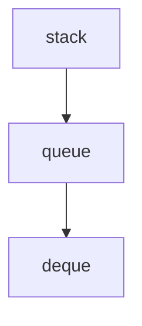
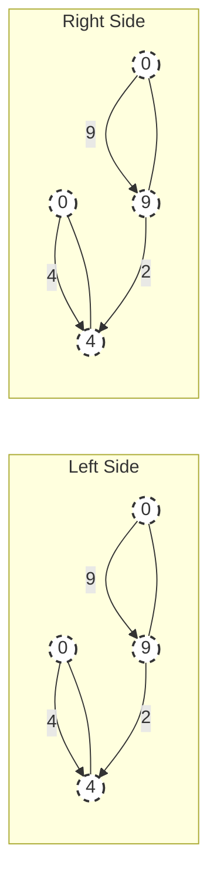

## Page 1

# COMPETITIVE PROGRAMMING
## in PYTHON

128 Algorithms to Develop Your Coding Skills

&lt;img&gt;A stylized blue and purple abstract design resembling a circuit board or a network.&lt;/img&gt;

CHRISTOPH DÜRR
JILL-JENN VIE

---


## Page 2

# Competitive Programming in Python

Want to kill it at your job interview in the tech industry? Want to win that coding competition? Learn all the algorithmic techniques and programming skills you need from two experienced coaches, problem-setters, and judges for coding competitions. The authors highlight the versatility of each algorithm by considering a variety of problems and show how to implement algorithms in simple and efficient code. What to expect:

*   Master 128 algorithms in Python.
*   Discover the right way to tackle a problem and quickly implement a solution of low complexity.
*   Understand classic problems like Dijkstra’s shortest path algorithm and Knuth–Morris–Pratt’s string matching algorithm, plus lesser-known data structures like Fenwick trees and Knuth’s dancing links.
*   Develop a framework to tackle algorithmic problem solving, including: Definition, Complexity, Applications, Algorithm, Key Information, Implementation, Variants, In Practice, and Problems.
*   Python code included in the book and on the companion website.

**Christoph Dürr** is a senior researcher at the French National Center for Scientific Research (CNRS), affiliated with the Sorbonne University in Paris. After a PhD in 1996 at Paris-Sud University, he worked for one year as a postdoctoral researcher at the International Computer Science Institute in Berkeley and one year in the School of Computer Science and Engineering in the Hebrew University of Jerusalem in Israel. He has worked in the fields of quantum computation, discrete tomography and algorithmic game theory, and his current research activity focuses on algorithms and optimisation. From 2007 to 2014, he taught a preparation course for programming contests at the engineering school École Polytechnique, and acts regularly as a problem setter, trainer, or competitor for various coding competitions. In addition, he loves carrot cake.

**Jill-Jênn Vie** is a research scientist at Inria in machine learning. He is an alumnus from École normale supérieure Paris-Saclay, where he founded the algorithmic club of Paris-Saclay (CAPS) and coached several teams for the International Collegiate Programming Contest (ICPC). He published a book in theoretical computer science to help students prepare for prestigious French competitive exams such as *Grandes Écoles* or *agrégation*, and directed a television show “Blame the Algorithm” about the algorithms that govern our lives. He is part of the advisory board of the French Computer Science Society (SIF), itself a member of the International Federation for Information Processing (IFIP).

---


## Page 3

&lt;img&gt;A close-up photograph of a person's hand holding a small, dark, shiny object between their thumb and index finger. The background is out of focus.&lt;/img&gt;

---


## Page 4

# Competitive Programming
## in Python

### 128 Algorithms to Develop Your Coding Skills

CHRISTOPH DÜRR
CNRS, Sorbonne University

JILL-JÊNN VIE
Inria

Translated by Greg Gibbons and Danièle Gibbons

&lt;img&gt;CAMBRIDGE UNIVERSITY PRESS logo&lt;/img&gt;

---


## Page 5

# CAMBRIDGE
## UNIVERSITY PRESS

University Printing House, Cambridge CB2 8BS, United Kingdom
One Liberty Plaza, 20th Floor, New York, NY 10006, USA
477 Williamstown Road, Port Melbourne, VIC 3207, Australia
314–321, 3rd Floor, Plot 3, Splendor Forum, Jasola District Centre, New Delhi – 110025, India
79 Anson Road, #06–04/06, Singapore 079906

Cambridge University Press is part of the University of Cambridge.

It furthers the University’s mission by disseminating knowledge in the pursuit of education, learning, and research at the highest international levels of excellence.

www.cambridge.org
Information on this title: www.cambridge.org/9781108716826
DOI: 10.1017/9781108591928

© Cambridge University Press 2021

Translation from the French language edition:
*Programmation efficace - 128 algorithmes qu’il faut avoir compris et codés en Python au cour de sa vie*
By Christoph Dürr & Jill-Jênn Vie
Copyright © 2016 Edition Marketing S.A.
www.editions-ellipses.fr
All Rights Reserved

This publication is in copyright. Subject to statutory exception and to the provisions of relevant collective licensing agreements, no reproduction of any part may take place without the written permission of Cambridge University Press.

First published 2021

Printed in the United Kingdom by TJ Books Limited, Padstow Cornwall

*A catalogue record for this publication is available from the British Library.*

*Library of Congress Cataloging-in-Publication Data*
Names: Dürr, Christoph, 1969– author. | Vie, Jill-Jênn, 1990– author. |
Gibbons, Greg, translator. | Gibbons, Danièle, translator.
Title: Competitive programming in Python : 128 algorithms to develop your coding skills / Christoph Dürr, Jill-Jênn Vie ; translated by Greg Gibbons, Danièle Gibbons.
Other titles: Programmation efficace. English
Description: First edition. | New York : Cambridge University Press, 2020. | Includes bibliographical references and index.
Identifiers: LCCN 2020022774 (print) | LCCN 2020022775 (ebook) |
ISBN 9781108716826 (paperback) | ISBN 9781108591928 (epub)
Subjects: LCSH: Python (Computer program language) | Algorithms.
Classification: LCC QA76.73.P98 D8713 2020 (print) | LCC QA76.73.P98 (ebook) | DDC 005.13/3–dc23
LC record available at https://lccn.loc.gov/2020022774
LC ebook record available at https://lccn.loc.gov/2020022775

ISBN 978-1-108-71682-6 Paperback

Cambridge University Press has no responsibility for the persistence or accuracy of URLs for external or third-party internet websites referred to in this publication and does not guarantee that any content on such websites is, or will remain, accurate or appropriate.

---


## Page 6

# Contents

Preface page ix

<table>
  <tr>
    <td>1</td>
    <td><strong>Introduction</strong></td>
    <td>1</td>
  </tr>
  <tr>
    <td></td>
    <td>1.1 Programming Competitions</td>
    <td>1</td>
  </tr>
  <tr>
    <td></td>
    <td>1.2 Python in a Few Words</td>
    <td>5</td>
  </tr>
  <tr>
    <td></td>
    <td>1.3 Input-Output</td>
    <td>13</td>
  </tr>
  <tr>
    <td></td>
    <td>1.4 Complexity</td>
    <td>17</td>
  </tr>
  <tr>
    <td></td>
    <td>1.5 Abstract Types and Essential Data Structures</td>
    <td>20</td>
  </tr>
  <tr>
    <td></td>
    <td>1.6 Techniques</td>
    <td>28</td>
  </tr>
  <tr>
    <td></td>
    <td>1.7 Advice</td>
    <td>37</td>
  </tr>
  <tr>
    <td></td>
    <td>1.8 A Problem: ‘Frosting on the Cake’</td>
    <td>39</td>
  </tr>
  <tr>
    <td>2</td>
    <td><strong>Character Strings</strong></td>
    <td>42</td>
  </tr>
  <tr>
    <td></td>
    <td>2.1 Anagrams</td>
    <td>42</td>
  </tr>
  <tr>
    <td></td>
    <td>2.2 T9—Text on 9 Keys</td>
    <td>43</td>
  </tr>
  <tr>
    <td></td>
    <td>2.3 Spell Checking with a Lexicographic Tree</td>
    <td>46</td>
  </tr>
  <tr>
    <td></td>
    <td>2.4 Searching for Patterns</td>
    <td>48</td>
  </tr>
  <tr>
    <td></td>
    <td>2.5 Maximal Boundaries—Knuth–Morris–Pratt</td>
    <td>49</td>
  </tr>
  <tr>
    <td></td>
    <td>2.6 Pattern Matching—Rabin–Karp</td>
    <td>56</td>
  </tr>
  <tr>
    <td></td>
    <td>2.7 Longest Palindrome of a String—Manacher</td>
    <td>59</td>
  </tr>
  <tr>
    <td>3</td>
    <td><strong>Sequences</strong></td>
    <td>62</td>
  </tr>
  <tr>
    <td></td>
    <td>3.1 Shortest Path in a Grid</td>
    <td>62</td>
  </tr>
  <tr>
    <td></td>
    <td>3.2 The Levenshtein Edit Distance</td>
    <td>63</td>
  </tr>
  <tr>
    <td></td>
    <td>3.3 Longest Common Subsequence</td>
    <td>65</td>
  </tr>
  <tr>
    <td></td>
    <td>3.4 Longest Increasing Subsequence</td>
    <td>68</td>
  </tr>
  <tr>
    <td></td>
    <td>3.5 Winning Strategy in a Two-Player Game</td>
    <td>70</td>
  </tr>
  <tr>
    <td>4</td>
    <td><strong>Arrays</strong></td>
    <td>72</td>
  </tr>
  <tr>
    <td></td>
    <td>4.1 Merge of Sorted Lists</td>
    <td>73</td>
  </tr>
  <tr>
    <td></td>
    <td>4.2 Sum Over a Range</td>
    <td>74</td>
  </tr>
  <tr>
    <td></td>
    <td>4.3 Duplicates in a Range</td>
    <td>74</td>
  </tr>
  <tr>
    <td></td>
    <td>4.4 Maximum Subarray Sum</td>
    <td>75</td>
  </tr>
</table>

---


## Page 7

vi Contents

<table>
  <tr>
    <td>4.5</td>
    <td>Query for the Minimum of a Range—Segment Tree</td>
    <td>75</td>
  </tr>
  <tr>
    <td>4.6</td>
    <td>Query the Sum over a Range—Fenwick Tree</td>
    <td>77</td>
  </tr>
  <tr>
    <td>4.7</td>
    <td>Windows with k Distinct Elements</td>
    <td>80</td>
  </tr>
  <tr>
    <td>5</td>
    <td>Intervals</td>
    <td>82</td>
  </tr>
  <tr>
    <td>5.1</td>
    <td>Interval Trees</td>
    <td>82</td>
  </tr>
  <tr>
    <td>5.2</td>
    <td>Union of Intervals</td>
    <td>85</td>
  </tr>
  <tr>
    <td>5.3</td>
    <td>The Interval Point Cover Problem</td>
    <td>85</td>
  </tr>
  <tr>
    <td>6</td>
    <td>Graphs</td>
    <td>88</td>
  </tr>
  <tr>
    <td>6.1</td>
    <td>Encoding in Python</td>
    <td>88</td>
  </tr>
  <tr>
    <td>6.2</td>
    <td>Implicit Graphs</td>
    <td>90</td>
  </tr>
  <tr>
    <td>6.3</td>
    <td>Depth-First Search—DFS</td>
    <td>91</td>
  </tr>
  <tr>
    <td>6.4</td>
    <td>Breadth-First Search—BFS</td>
    <td>93</td>
  </tr>
  <tr>
    <td>6.5</td>
    <td>Connected Components</td>
    <td>94</td>
  </tr>
  <tr>
    <td>6.6</td>
    <td>Biconnected Components</td>
    <td>97</td>
  </tr>
  <tr>
    <td>6.7</td>
    <td>Topological Sort</td>
    <td>102</td>
  </tr>
  <tr>
    <td>6.8</td>
    <td>Strongly Connected Components</td>
    <td>105</td>
  </tr>
  <tr>
    <td>6.9</td>
    <td>2-Satisfiability</td>
    <td>110</td>
  </tr>
  <tr>
    <td>7</td>
    <td>Cycles in Graphs</td>
    <td>113</td>
  </tr>
  <tr>
    <td>7.1</td>
    <td>Eulerian Tour</td>
    <td>113</td>
  </tr>
  <tr>
    <td>7.2</td>
    <td>The Chinese Postman Problem</td>
    <td>116</td>
  </tr>
  <tr>
    <td>7.3</td>
    <td>Cycles with Minimal Ratio of Weight to Length—Karp</td>
    <td>117</td>
  </tr>
  <tr>
    <td>7.4</td>
    <td>Cycles with Minimal Cost-to-Time Ratio</td>
    <td>120</td>
  </tr>
  <tr>
    <td>7.5</td>
    <td>Travelling Salesman</td>
    <td>120</td>
  </tr>
  <tr>
    <td>7.6</td>
    <td>Full Example: Menu Tour</td>
    <td>121</td>
  </tr>
  <tr>
    <td>8</td>
    <td>Shortest Paths</td>
    <td>124</td>
  </tr>
  <tr>
    <td>8.1</td>
    <td>Composition Property</td>
    <td>124</td>
  </tr>
  <tr>
    <td>8.2</td>
    <td>Graphs with Weights 0 or 1</td>
    <td>126</td>
  </tr>
  <tr>
    <td>8.3</td>
    <td>Graphs with Non-negative Weights—Dijkstra</td>
    <td>127</td>
  </tr>
  <tr>
    <td>8.4</td>
    <td>Graphs with Arbitrary Weights—Bellman–Ford</td>
    <td>130</td>
  </tr>
  <tr>
    <td>8.5</td>
    <td>All Source–Destination paths—Floyd–Warshall</td>
    <td>132</td>
  </tr>
  <tr>
    <td>8.6</td>
    <td>Grid</td>
    <td>133</td>
  </tr>
  <tr>
    <td>8.7</td>
    <td>Variants</td>
    <td>135</td>
  </tr>
  <tr>
    <td>9</td>
    <td>Matchings and Flows</td>
    <td>138</td>
  </tr>
  <tr>
    <td>9.1</td>
    <td>Maximum Bipartite Matching</td>
    <td>139</td>
  </tr>
  <tr>
    <td>9.2</td>
    <td>Maximal-Weight Perfect Matching—Kuhn–Munkres</td>
    <td>145</td>
  </tr>
  <tr>
    <td>9.3</td>
    <td>Planar Matching without Crossings</td>
    <td>151</td>
  </tr>
  <tr>
    <td>9.4</td>
    <td>Stable Marriages—Gale–Shapley</td>
    <td>153</td>
  </tr>
</table>

---


## Page 8

<table>
  <tr>
    <td></td>
    <td></td>
    <td>Contents</td>
    <td>vii</td>
  </tr>
  <tr>
    <td></td>
    <td>9.5 Maximum Flow by Ford–Fulkerson</td>
    <td></td>
    <td>155</td>
  </tr>
  <tr>
    <td></td>
    <td>9.6 Maximum Flow by Edmonds–Karp</td>
    <td></td>
    <td>158</td>
  </tr>
  <tr>
    <td></td>
    <td>9.7 Maximum Flow by Dinic</td>
    <td></td>
    <td>159</td>
  </tr>
  <tr>
    <td></td>
    <td>9.8 Minimum $s - t$ Cut</td>
    <td></td>
    <td>162</td>
  </tr>
  <tr>
    <td></td>
    <td>9.9 $s - t$ Minimum Cut for Planar Graphs</td>
    <td></td>
    <td>163</td>
  </tr>
  <tr>
    <td></td>
    <td>9.10 A Transport Problem</td>
    <td></td>
    <td>165</td>
  </tr>
  <tr>
    <td></td>
    <td>9.11 Reductions between Matchings and Flows</td>
    <td></td>
    <td>165</td>
  </tr>
  <tr>
    <td></td>
    <td>9.12 Width of a Partial Order—Dilworth</td>
    <td></td>
    <td>167</td>
  </tr>
  <tr>
    <td>10</td>
    <td>Trees</td>
    <td></td>
    <td>171</td>
  </tr>
  <tr>
    <td></td>
    <td>10.1 Huffman Coding</td>
    <td></td>
    <td>172</td>
  </tr>
  <tr>
    <td></td>
    <td>10.2 Lowest Common Ancestor</td>
    <td></td>
    <td>174</td>
  </tr>
  <tr>
    <td></td>
    <td>10.3 Longest Path in a Tree</td>
    <td></td>
    <td>178</td>
  </tr>
  <tr>
    <td></td>
    <td>10.4 Minimum Weight Spanning Tree—Kruskal</td>
    <td></td>
    <td>179</td>
  </tr>
  <tr>
    <td>11</td>
    <td>Sets</td>
    <td></td>
    <td>182</td>
  </tr>
  <tr>
    <td></td>
    <td>11.1 The Knapsack Problem</td>
    <td></td>
    <td>182</td>
  </tr>
  <tr>
    <td></td>
    <td>11.2 Making Change</td>
    <td></td>
    <td>184</td>
  </tr>
  <tr>
    <td></td>
    <td>11.3 Subset Sum</td>
    <td></td>
    <td>185</td>
  </tr>
  <tr>
    <td></td>
    <td>11.4 The $k$-sum Problem</td>
    <td></td>
    <td>187</td>
  </tr>
  <tr>
    <td>12</td>
    <td>Points and Polygons</td>
    <td></td>
    <td>189</td>
  </tr>
  <tr>
    <td></td>
    <td>12.1 Convex Hull</td>
    <td></td>
    <td>190</td>
  </tr>
  <tr>
    <td></td>
    <td>12.2 Measures of a Polygon</td>
    <td></td>
    <td>193</td>
  </tr>
  <tr>
    <td></td>
    <td>12.3 Closest Pair of Points</td>
    <td></td>
    <td>195</td>
  </tr>
  <tr>
    <td></td>
    <td>12.4 Simple Rectilinear Polygon</td>
    <td></td>
    <td>198</td>
  </tr>
  <tr>
    <td>13</td>
    <td>Rectangles</td>
    <td></td>
    <td>200</td>
  </tr>
  <tr>
    <td></td>
    <td>13.1 Forming Rectangles</td>
    <td></td>
    <td>200</td>
  </tr>
  <tr>
    <td></td>
    <td>13.2 Largest Square in a Grid</td>
    <td></td>
    <td>201</td>
  </tr>
  <tr>
    <td></td>
    <td>13.3 Largest Rectangle in a Histogram</td>
    <td></td>
    <td>202</td>
  </tr>
  <tr>
    <td></td>
    <td>13.4 Largest Rectangle in a Grid</td>
    <td></td>
    <td>204</td>
  </tr>
  <tr>
    <td></td>
    <td>13.5 Union of Rectangles</td>
    <td></td>
    <td>205</td>
  </tr>
  <tr>
    <td></td>
    <td>13.6 Union of Disjoint Rectangles</td>
    <td></td>
    <td>212</td>
  </tr>
  <tr>
    <td>14</td>
    <td>Numbers and Matrices</td>
    <td></td>
    <td>214</td>
  </tr>
  <tr>
    <td></td>
    <td>14.1 GCD</td>
    <td></td>
    <td>214</td>
  </tr>
  <tr>
    <td></td>
    <td>14.2 Bézout Coefficients</td>
    <td></td>
    <td>214</td>
  </tr>
  <tr>
    <td></td>
    <td>14.3 Binomial Coefficients</td>
    <td></td>
    <td>215</td>
  </tr>
  <tr>
    <td></td>
    <td>14.4 Fast Exponentiation</td>
    <td></td>
    <td>216</td>
  </tr>
  <tr>
    <td></td>
    <td>14.5 Prime Numbers</td>
    <td></td>
    <td>217</td>
  </tr>
  <tr>
    <td></td>
    <td>14.6 Evaluate an Arithmetical Expression</td>
    <td></td>
    <td>218</td>
  </tr>
</table>

---


## Page 9

&lt;page_number&gt;viii&lt;/page_number&gt;
# Contents

<table>
  <tr>
    <td>14.7 System of Linear Equations</td>
    <td>221</td>
  </tr>
  <tr>
    <td>14.8 Multiplication of a Matrix Sequence</td>
    <td>225</td>
  </tr>
  <tr>
    <td><b>15</b></td>
    <td><b>Exhaustive Search</b></td>
    <td>227</td>
  </tr>
  <tr>
    <td>15.1 All Paths for a Laser</td>
    <td>227</td>
  </tr>
  <tr>
    <td>15.2 The Exact Cover Problem</td>
    <td>231</td>
  </tr>
  <tr>
    <td>15.3 Problems</td>
    <td>237</td>
  </tr>
  <tr>
    <td>15.4 Sudoku</td>
    <td>238</td>
  </tr>
  <tr>
    <td>15.5 Enumeration of Permutations</td>
    <td>240</td>
  </tr>
  <tr>
    <td>15.6 Le Compte est Bon</td>
    <td>243</td>
  </tr>
  <tr>
    <td><b>16</b></td>
    <td><b>Conclusion</b></td>
    <td>245</td>
  </tr>
  <tr>
    <td>16.1 Combine Algorithms to Solve a Problem</td>
    <td>245</td>
  </tr>
  <tr>
    <td>16.2 For Further Reading</td>
    <td>245</td>
  </tr>
  <tr>
    <td>16.3 Rendez-vous on tryalgo.org</td>
    <td>246</td>
  </tr>
  <tr>
    <td><i>Debugging tool</i></td>
    <td>247</td>
  </tr>
  <tr>
    <td><i>References</i></td>
    <td>248</td>
  </tr>
  <tr>
    <td><i>Index</i></td>
    <td>251</td>
  </tr>
</table>

---


## Page 10

# Preface

Algorithms play an important role in our society, solving numerous mathematical problems which appear in a broad spectrum of situations. To give a few examples, think of planning taxi routes given a set of reservations (see Section 9.12); assigning students to schools in a large urban school district, such as New York (see Section 9.4); or identifying a bottleneck in a transportation network (see Section 9.8). This is why job interviews in the IT (Information Technology) industry test candidates for their problem-solving skills. Many programming contests are organised by companies such as Google, Facebook and Microsoft to spot gifted candidates and then send them job offers. This book will help students to develop a culture of algorithms and data structures, so that they know how to apply them properly when faced with new mathematical problems.

Designing the right algorithm to solve a given problem is only half of the work; to complete the job, the algorithm needs to be implemented efficiently. This is why this book also emphasises implementation issues, and provides full source code for most of the algorithms presented. We have chosen Python for these implementations. What makes this language so enticing is that it allows a particularly clear and refined expression, illustrating the essential steps of the algorithm, without obscuring things behind burdensome notations describing data structures. Surprisingly, it is actually possible to re-read code written several months ago and even understand it!

We have collected here 128 algorithmic problems, indexed by theme rather than by technique. Many are classic, whereas certain are atypical. This work should prove itself useful when preparing to solve the wide variety of problems posed in programming contests such as ICPC, Google Code Jam, Facebook Hacker Cup, Prologin, France-ioi, etc. We hope that it could serve as a basis for an advanced course in programming and algorithms, where even certain candidates for the ‘agrégation de mathématiques option informatique’ (French competitive exam for the highest teacher’s certification) will find a few original developments. The website tryalgo.org, maintained by the authors, contains links to the code of this book, as well as to selected problems at various online contests. This allows readers to verify their freshly acquired skills.

This book would never have seen the light of day without the support of the authors’ life partners. Danke, Hương. Merci, 智子. The authors would also like to thank the students of the École polytechnique and the École normale supérieure of Paris-Saclay, whose practice, often nocturnal, generated a major portion of the

---


## Page 11

&lt;page_number&gt;X&lt;/page_number&gt;
# Preface

material of this text. Thanks to all those who proofread the manuscript, especially René Adad, Evripidis Bampis, Binh-Minh Bui-Xuan, Stéphane Henriot, Lê Thành Dũng Nguyễn, Alexandre Nolin and Antoine Pietri. Thanks to all those who improved the programs on GitHub: Louis Abraham, Lilian Besson, Ryan Lahfa, Olivier Marty, Samuel Tardieu and Xavier Carcelle. One of the authors would especially like to thank his past teacher at the Lycée Thiers, Monsieur Yves Lemaire, for having introduced him to the admirable gem of Section 2.5 on page 52.

We hope that the reader will pass many long hours tackling algorithmic problems that at first glance appear insurmountable, and in the end feel the profound joy when a solution, especially an elegant solution, suddenly becomes apparent.

Finally, we would like to thank Danièle and Greg Gibbons for their translation of this work, even of this very phrase.

Attention, it’s all systems go!

---


## Page 12

# 1 Introduction

You, my young friend, are going to learn to program the algorithms of this book, and then go on to win programming contests, sparkle during your job interviews, and finally roll up your sleeves, get to work, and greatly improve the gross national product!

Mistakenly, computer scientists are still often considered the magicians of modern times. Computers have slowly crept into our businesses, our homes and our machines, and have become important enablers in the functioning of our world. However, there are many that use these devices without really mastering them, and hence, they do not fully enjoy their benefits. Knowing how to program provides the ability to fully exploit their potential to solve problems in an efficient manner. Algorithms and programming techniques have become a necessary background for many professions. Their mastery allows the development of creative and efficient computer-based solutions to problems encountered every day.

This text presents a variety of algorithmic techniques to solve a number of classic problems. It describes practical situations where these problems arise, and presents simple implementations written in the programming language Python. Correctly implementing an algorithm is not always easy: there are numerous traps to avoid and techniques to apply to guarantee the announced running times. The examples in the text are embellished with explanations of important implementation details which must be respected.

For the last several decades, programming competitions have sprung up at every level all over the world, in order to promote a broad culture of algorithms. The problems proposed in these contests are often variants of classic algorithmic problems, presented as frustrating enigmas that will never let you give up until you solve them!

## 1.1 Programming Competitions

In a programming competition, the candidates must solve several problems in a fixed time. The problems are often variants of classic problems, such as those addressed in this book, dressed up with a short story. The inputs to the problems are called *instances*. An instance can be, for example, the adjacency matrix of a graph for a shortest path problem. In general, a small example of an instance is provided, along with its solution. The source code of a solution can be uploaded to a server via

---


## Page 13

&lt;page_number&gt;2&lt;/page_number&gt;
# Introduction

a web interface, where it is compiled and tested against instances hidden from the public. For some problems the code is called for each instance, whereas for others the input begins with an integer indicating the number of instances occurring in the input. In the latter case, the program must then loop over each instance, solve it and display the results. A submission is accepted if it gives correct results in a limited time, on the order of a few seconds.

&lt;img&gt;ICPC logo with cloud, lightbulb, and balloon&lt;/img&gt;

**Figure 1.1** The logo of the ICPC nicely shows the steps in the resolution of a problem. A helium balloon is presented to the team for each problem solved.

To give here a list of all the programming competitions and training sites is quite impossible, and such a list would quickly become obsolete. Nevertheless, we will review some of the most important ones.

**ICPC** The oldest of these competitions was founded by the *Association for Computing Machinery* in 1977 and supported by them up until 2017. This contest, known as the ICPC, for *International Collegiate Programming Contest*, is organised in the form of a tournament. The starting point is one of the regional competitions, such as the *South-West European Regional Contest* (SWERC), where the two best teams qualify for the worldwide final. The particularity of this contest is that each three-person team has only a single computer at their disposal. They have only 5 hours to solve a maximum number of problems among the 10 proposed. The first ranking criterion is the number of submitted solutions accepted (i.e. tested successfully against a set of unknown instances). The next criterion is the sum over the submitted problems of the time between the start of the contest and the moment of the accepted submission. For each erroneous submission, a penalty of 20 minutes is added.

There are several competing theories on what the ideal composition of a team is. In general, a good programmer and someone familiar with algorithms is required, along with a specialist in different domains such as graph theory, dynamic programming, etc. And, of course, the team members need to get along together, even in stressful situations!

For the contest, each team can bring 25 pages of reference code printed in an 8-point font. They can also access the online documentation of the Java API and the C++ standard library.

**Google Code Jam** In contrast with the ICPC contest, which is limited to students up to a Master’s level, the Google Code Jam is open to everyone. This more recent annual competition is for individual contestants. Each problem comes in

---


## Page 14

# 1.1 Programming Competitions &lt;page_number&gt;3&lt;/page_number&gt;

general with a deck of small instances whose resolution wins a few points, and a set of enormous instances for which it is truly important to find a solution with the appropriate algorithmic complexity. The contestants are informed of the acceptance of their solution for the large instances only at the end of the contest. However, its true strong point is the possibility to access the solutions submitted by all of the participants, which is extremely instructive.

The competition *Facebook Hacker Cup* is of a similar nature.

**Prologin** The French association Prologin organises each year a competition targeted at students up to twenty years old. Their capability to solve algorithmic problems is put to test in three stages: an online selection, then regional competitions and concluding with a national final. The final is atypically an endurance test of 36 hours, during which the participants are confronted with a problem in Artificial Intelligence. Each candidate must program a “champion” to play a game whose rules are defined by the organisers. At the end of the day, the champions are thrown in the ring against each other in a tournament to determine the final winner.

The website [https://prologin.org](https://prologin.org) includes complete archives of past problems, with the ability to submit algorithms online to test the solutions.

**France-IOI** Each year, the organisation France-IOI prepares junior and senior high school students for the International Olympiad in Informatics. Since 2011, they have organised the ‘Castor Informatique’ competition, addressed at students from Grade 4 to Grade 12 (675,000 participants in 2018). Their website [http://france-ioi.org](http://france-ioi.org) hosts a large number of algorithmic problems (more than 1,000).

Numerous programming contests organised with the goal of selecting candidates for job offers also exist. The web site [www.topcoder.com](http://www.topcoder.com), for example, also includes tutorials on algorithms, often very well written.

For training, we particularly recommend [https://codeforces.com](https://codeforces.com), a well-respected web site in the community of programming competitions, as it proposes clear and well-prepared problems.

## 1.1.1 Training Sites

A number of websites propose problems taken from the annals of competitions, with the possibility to test solutions as a training exercise. This is notably the case for Google Code Jam and Prologin (in French). The collections of the annals of the ICPC contests can be found in various locations.

**Traditional online judges** The following sites contain, among others, many problems derived from the ICPC contests.

uva [http://uva.onlinejudge.org](http://uva.onlinejudge.org)
icpcarchive [http://icpcarchive.ecs.baylor.edu](http://icpcarchive.ecs.baylor.edu), [http://livearchive.onlinejudge.org](http://livearchive.onlinejudge.org)

---


## Page 15

&lt;page_number&gt;4&lt;/page_number&gt;
# Introduction

## Chinese online judges
Several training sites now exist in China. They tend to have a purer and more refined interface than the traditional judges. Nevertheless, sporadic failures have been observed.

poj http://poj.org
tju http://acm.tju.edu.cn (Shut down since 2017)
zju http://acm.zju.edu.cn

## Modern online judges
Sphere Online Judge http://spoj.com and Kattis http://open.kattis.com have the advantage of accepting the submission of solutions in a variety of languages, including Python.

spoj http://spoj.com
kattis http://open.kattis.com
zju http://acm.zju.edu.cn

## Other sites

codechef http://codechef.com
codility http://codility.com
gcj http://code.google.com/codejam
prologin http://prologin.org
slpc http://cs.stanford.edu/group/acm

Throughout this text, problems are proposed at the end of each section in relation to the topic presented. They are accompanied with their identifiers to a judge site; for example [spoj:CMPLS] refers to the problem ‘Complete the Sequence!’ at the URL www.spoj.com/problems/CMPLS/. The site http://tryalgo.org contains links to all of these problems. The reader thus has the possibility to put into practice the algorithms described in this book, testing an implementation against an online judge.

The languages used for programming competitions are principally C++ and Java. The SPOJ judge also accepts Python, while the Google Code Jam contest accepts many of the most common languages. To compensate for the differences in execution speed due to the choice of language, the online judges generally adapt the time limit to the language used. However, this adaptation is not always done carefully, and it is sometimes difficult to have a solution in Python accepted, even if it is correctly written. We hope that this situation will be improved in the years to come. Also, certain judges work with an ancient version of Java, in which such useful classes as Scanner are not available.

## 1.1.2 Responses of the Judges

When some code for a problem is submitted to an online judge, it is evaluated via a set of private tests and a particularly succinct response is returned. The principal response codes are the following:

---


## Page 16

# 1.2 Python in a Few Words &lt;page_number&gt;5&lt;/page_number&gt;

**Accepted** Your program provides the correct output in the allotted time. Congratulations!

**Presentation Error** Your program is almost accepted, but the output contains extraneous or missing blanks or end-of-lines. This message occurs rarely.

**Compilation Error** The compilation of your program generates errors. Often, clicking on this message will provide the nature of the error. Be sure to compare the version of the compiler used by the judge with your own.

**Wrong Answer** Re-read the problem statement, a detail must have been overlooked. Are you sure to have tested all the limit cases? Might you have left debugging statements in your code?

**Time Limit Exceeded** You have probably not implemented the most efficient algorithm for this problem, or perhaps have an infinite loop somewhere. Test your loop invariants to ensure loop termination. Generate a large input instance and test locally the performance of your code.

**Runtime Error** In general, this could be a division by zero, an access beyond the limits of an array, or a pop() on an empty stack. However, other situations can also generate this message, such as the use of assert in Java, which is often not accepted.

The taciturn behaviour of the judges nevertheless allows certain information to be gleaned from the instances. Here is a trick that was used during an ICPC / SWERC contest. In a problem concerning graphs, the statement indicated that the input consisted of connected graphs. One of the teams doubted this, and wrote a connectivity test. In the positive case, the program entered into an infinite loop, while in the negative case, it caused a division by zero. The error code generated by the judge (Time Limit Exceeded ou Runtime Error) allowed the team to detect that certain graphs in the input were not connected.

## 1.2 Python in a Few Words

The programming language Python was chosen for this book, for its readability and ease of use. In September 2017, Python was identified by the website https://stackoverflow.com as the programming language with the greatest growth in high-income countries, in terms of the number of questions seen on the website, notably thanks to the popularity of machine learning.<sup>1</sup> Python is also the language retained for such important projects as the formal calculation system SageMath, whose critical portions are nonetheless implemented in more efficient languages such as C++ or C.

Here are a few details on this language. This chapter is a short introduction to Python and does not claim to be exhaustive or very formal. For the neophyte reader we recommend the site python.org, which contains a high-quality introduction as well as exceptional documentation. A reader already familiar with Python can profit

<sup>1</sup> https://stackoverflow.blog/2017/09/06/incredible-growth-python/

---


## Page 17

&lt;page_number&gt;6&lt;/page_number&gt;
# Introduction

enormously by studying the programs of David Eppstein, which are very elegant and highly readable. Search for the keywords Eppstein PADS.

Python is an interpreted language. Variable types do not have to be declared, they are simply inferred at the time of assignment. There are neither keywords begin/end nor brackets to group instructions, for example in the blocks of a function or a loop. The organisation in blocks is simply based on indentation! A typical error, difficult to identify, is an erroneous indentation due to spaces used in some lines and tabs in others.

## Basic Data Types

In Python, essentially four basic data types exist: Booleans, integers, floating-point numbers and character strings. In contrast with most other programming languages, the integers are not limited to a fixed number of bits (typically 64), but use an arbitrary precision representation. The functions—more precisely the constructors: `bool`, `int`, `float`, `str`—allow the conversion of an object to one of these basic types. For example, to access the digits of a specific integer given its decimal representation, it can be first transformed into a string, and then the characters of the string can be accessed. However, in contrast with languages such as C, it is not possible to directly modify a character of a string: strings are *immutable*. It is first necessary to convert to a list representation of the characters; see below.

## Data Structures

The principal complex data structures are dictionaries, sets, lists and $n$-tuples. These structures are called *containers*, as they contain several objects in a structured manner. Once again, there are functions `dict`, `set`, `list` and `tuple` that allow the conversion of an object into one of these structures. For example, for a string s, the function `list(s)` returns a list L composed of the characters of the string. We could then, for example, replace certain elements of the list L and then recreate a string by concatenating the elements of L with the expression `''.join(L)`. Here, the empty string could be replaced by a separator: for example, `'-' . join(['A', 'B', 'C'])` returns the string “A-B-C”.

## 1.2.1 Manipulation of Lists, $n$-tuples, Dictionaries

Note that lists in Python are not linked lists of cells, each with a pointer to its successor in the list, as is the case in many other languages. Instead, lists are arrays of elements that can be accessed and modified using their index into the array. A list is written by enumerating its elements between square brackets [ and ], with the elements separated by commas.

### Lists

The indices of a list start with 0. The last element can also be accessed with the index -1, the second last with -2 and so on. Here are some examples of operations to extract elements or sublists of a list. This mechanism is known as *slicing*, and is also available for strings.

---


## Page 18

# 1.2 Python in a Few Words &lt;page_number&gt;7&lt;/page_number&gt;

The following expressions have a complexity linear in the length of $L$, with the exception of the first, which is in constant time.

<table>
<tr><td>$L[i]$</td><td>the $i$th element of $L$</td></tr>
<tr><td>$L[i:j]$</td><td>the list of elements with indices starting at $i$ and up to (but not including) $j$</td></tr>
<tr><td>$L[:j]$</td><td>the first $j$ elements</td></tr>
<tr><td>$L[i:]$</td><td>all the elements from the $i$th onwards</td></tr>
<tr><td>$L[-3:]$</td><td>the last three elements of $L$</td></tr>
<tr><td>$L[i:j:k]$</td><td>elements from the $i$th up to (but not including) the $j$th, taking only every $k$th element</td></tr>
<tr><td>$L[::2]$</td><td>the elements of $L$ with even indices</td></tr>
<tr><td>$L[::-1]$</td><td>a reverse copy of $L$</td></tr>
</table>

The most important methods of a list for our usage are listed below. Their complexity is expressed in terms of $n$, the length of the list $L$. A function has *constant amortised complexity* if, for several successive calls to it, the average complexity is constant, even if some of these calls take a time linear in $n$.

<table>
<tr><td>$\text{len}(L)$</td><td>returns the number of elements of the list $L$</td><td>$O(1)$</td></tr>
<tr><td>$\text{sorted}(L)$</td><td>returns a sorted copy of the list $L$</td><td>$O(n \log n)$</td></tr>
<tr><td>$L.\text{sort}()$</td><td>sorts $L$ in place</td><td>$O(n \log n)$</td></tr>
<tr><td>$L.\text{count}(c)$</td><td>the number of occurrences of $c$ in $L$</td><td>$O(n)$</td></tr>
<tr><td>$c$ in $L$</td><td>is the element $c$ found in $L$?</td><td>$O(n)$</td></tr>
<tr><td>$L.\text{append}(c)$</td><td>append $c$ to the end of $L$</td><td>amortised $O(1)$</td></tr>
<tr><td>$L.\text{pop}()$</td><td>extracts and returns the last element of $L$</td><td>amortised $O(1)$</td></tr>
</table>

Thus a list has all the functionality of a stack, defined in Section 1.5.1 on page 20.

**$n$-tuple** An $n$-tuple behaves much like a list, with a difference in the usage of parentheses to describe it, as in $(1, 2)$ or $(\text{left}, \text{'X'}, \text{right})$. A 1-tuple, composed of only one element, requires the usage of a comma, as in $(2,)$. A 0-tuple, empty, can be written as (), or as $\text{tuple}()$, no doubt more readable. The main difference with lists is that $n$-tuples are immutable, just like strings. This is why an $n$-tuple can serve as a key in a dictionary.

**Dictionaries** Dictionaries are used to associate objects with values, for example the words of a text with their frequency. A dictionary is constructed as comma-separated key:value pairs between curly brackets, such as $\{\text{'the'}: 4, \text{'bread'}: 1, \text{'is'}: 6\}$, where the keys and values are separated by a colon. An empty dictionary is obtained with $\{\}$. A membership test of a key $x$ in a dictionary $dic$ is written $x$ in $dic$. Behind a dictionary there is a hash table, hence the complexity of the expressions $x$ in $dic$, $dic[x]$, $dic[x] = 42$ is in practice constant time, even if the worst-case complexity is linear, a case obtained in the improbable event of all keys having the same hash value.

If the keys of a dictionary are all the integers between 0 and $n - 1$, the use of a list is much more efficient.

---


## Page 19

&lt;page_number&gt;8&lt;/page_number&gt;
# Introduction

A loop in Python is written either with the keyword `for` or with `while`. The notation for the loop `for` is `for x in S`, where the variable `x` successively takes on the values of the container `S`, or of the keys of `S` in the case of a dictionary. In contrast, `while L:` will loop as long as the list `L` is non-empty. Here, an implicit conversion of a list to a Boolean is made, with the convention that only the empty list converts to `False`.

At times, it is necessary to handle at the same time the values of a list along with their positions (indices) within the list. This can be implemented as follows:

```python
for index in range(len(L)):
    value = L[index]
    # ... handling of index and value
```

The function `enumerate` allows a more compact expression of this loop:

```python
for index, value in enumerate(L):
    # ... handling of index and value
```

For a dictionary, the following loop iterates simultaneously over the keys and values:

```python
for key, value in dic.items():
    # ... handling of key and value
```

## 1.2.2 Specificities: List and Dictionary Comprehension, Iterators

### *List and Dictionary Comprehension*

The language Python provides a syntax close to the notation used in mathematics for certain objects. To describe the list of squares from 0 to $n^2$, it is possible to use a *list comprehension*:

```python
>>> n = 5
>>> squared_numbers = [x ** 2 for x in range(n + 1)]
>>> squared_numbers
[0, 1, 4, 9, 16, 25]
```

which corresponds to the set $\{x^2 | x = 0, \ldots, n\}$ in mathematics.

This is particularly useful to initialise a list of length $n$:

```python
>>> t = [0 for _ in range(n)]
>>> t
[0, 0, 0, 0, 0]

---


## Page 20

# 1.2 Python in a Few Words &lt;page_number&gt;9&lt;/page_number&gt;

or to initialise counters for the letters in a string:

```python
>>> my_string = "cowboy bebop"
>>> nb_occurrences = {letter: 0 for letter in my_string}
>>> nb_occurrences
{'c': 0, 'o': 0, 'w': 0, 'b': 0, 'y': 0, ' ': 0, 'e': 0, 'p': 0}
```

The second line, a *dictionary comprehension*, is equivalent to the following:

```python
nb_occurrences = {}
for letter in my_string:
    nb_occurrences[letter] = 0
```

## Ranges and Other Iterators

To loop over ranges of integers, the code `for i in range(n):` can be used to run over the integers from 0 to $n - 1$. Several variants exist:

<table>
<tr><td>range(k, n)</td><td>from k to n − 1</td></tr>
<tr><td>range(k, n, 2)</td><td>from k to n − 1 two by two</td></tr>
<tr><td>range(n - 1, -1, -1)</td><td>from n − 1 to 0 (−1 excluded) in decreasing order.</td></tr>
</table>

In early versions of Python, `range` returned a list. Nowadays, for efficiency, it returns an object known as an *iterator*, which produces integers one by one, if and when the `for` loop claims a value. Any function can serve as an iterator, as long as it can produce elements at different moments of its execution using the keyword `yield`. For example, the following function iterates over all pairs of elements of a given list:

```python
def all_pairs(L):
    n = len(L)
    for i in range(n):
        for j in range(i + 1, n):
            yield (L[i], L[j])
```

## 1.2.3 Useful Modules and Packages

### Modules

Certain Python objects must be imported from a module or a package with the command `import`. A package is a collection of modules. Two methods can be used; the second avoids potential naming collisions between the methods in different modules:

---


## Page 21

&lt;page_number&gt;10&lt;/page_number&gt;
# Introduction

>>> from math import sqrt
>>> sqrt(4)
2
>>> import math
>>> math.sqrt(4)
2

**math** This module contains mathematical functions and constants such as $\log$, $\sqrt{x}$, $\pi$, etc. Python operates on integers with arbitrary precision, thus there is no limit on their size. As a consequence, there is no integer equivalent to represent $-\infty$ or $+\infty$. For floating point numbers on the other hand, `float('-inf')` and `float('inf')` can be used. Beginning with Python 3.5, `math.inf` (or `from math import inf`) is equivalent to `float('inf')`.

**fractions** This module exports the class Fraction, which allows computations with fractions without the loss of precision of floating point calculations. For example, if $f$ is an instance of the class Fraction, then `str(f)` returns a string similar to the form “$3/2$”, expressing $f$ as an irreducible fraction.

**bisect** Provides binary (dichotomous) search functions on a sorted list.

**heapq** Provides functions to manipulate a list as a heap, thus allowing an element to be added or the smallest element removed in time logarithmic in the size of the heap; see Section 1.5.4 on page 22.

**string** This module provides, for example, the function `ascii_lowercase`, which returns its argument converted to lowercase characters. Note that the strings themselves already provide numerous useful methods, such as `strip`, which removes whitespace from the beginning and end of a string and returns the result, `lower`, which converts all the characters to lowercase, and especially `split`, which detects the substrings separated by spaces (or by another separator passed as an argument). For example, “12/OCT/2018”.split(“/”) returns [“12”, “OCT”, “2018”].

## Packages

One of the strengths of Python is the existence of a large variety of code packages. Some are part of the standard installation of the language, while others must be imported with the shell command `pip`. They are indexed and documented at the web site pypi.org. Here is a non-exhaustive list of very useful packages.

**tryalgo** All the code of the present book is available in a package called tryalgo and can be imported in the following manner: `pip install tryalgo`.

>>> import tryalgo
>>> help(tryalgo) # for the list of modules
>>> help(tryalgo.arithm) # for a particular module

**collections** To simplify life, the class `from collections import Counter` can be used. For an object $c$ of this class, the expression $c[x]$ will return 0 if $x$ is not

---


## Page 22

a key in c. Only modification of the value associated with x will create an entry in c, such as, for example, when executing the instruction c[x] += 1. This is thus slightly more practical than a dictionary, as is illustrated below.

```python
>>> c = {}                  # dictionary
>>> c['a'] += 1            # the key does not exist
Traceback (most recent call last):
  File "<stdin>", line 1, in <module>
KeyError: 'a'
>>> c['a'] = 1
>>> c['a'] += 1            # now it does
>>> c
{'a': 2}
>>> from collections import Counter
>>> c = Counter()
>>> c['a'] += 1            # the key does not exist, so it is created
Counter({'a': 1})
>>> c = Counter('cowboy bebop')
Counter({'o': 3, 'b': 3, 'c': 1, 'w': 1, 'y': 1, ' ': 1, 'e': 1, 'p': 1})
```

The collections package also provides the class deque, for *double-ended queue*, see Section 1.5.3 on page 21. With this structure, elements can be added or removed either from the left (head) or from the right (tail) of the queue. This helps implement Dijkstra’s algorithm in the case where the edges have only weights 0 or 1, see Section 8.2 on page 126.

This package also provides the class defaultdict, which is a dictionary that assigns default values to keys that are yet in the dictionary, hence a generalisation of the class Counter.

```python
>>> from collections import defaultdict
>>> g = defaultdict(list)
>>> g['paris'].append('marseille')  # 'paris' key is created on the fly
>>> g['paris'].append('lyon')
>>> g
defaultdict(<class 'list'>, {'paris': ['marseille', 'lyon']})
>>> g['paris']  # behaves like a dict
['marseille', 'lyon']
```

See also Section 1.3 on page 13 for an example of reading a graph given as input.

**numpy** This package provides general tools for numerical calculations involving manipulations of large matrices. For example, numpy.linalg.solve solves a linear system, while numpy.fft.fft calculates a (fast) discrete Fourier transform.

While writing the code of this book, we have followed the norm PEP8, which provides precise recommendations on the usage of blanks, the choice of names for variables, etc. We advise the readers to also follow these indications, using, for example, the tool pycodestyle to validate the structure of their code.

---


## Page 23

&lt;page_number&gt;12&lt;/page_number&gt;
# Introduction

## 1.2.4 Interpreters Python, PyPy, and PyPy3

We have chosen to implement our algorithms in Python 3, which is already over 12 years old,² while ensuring backwards compatibility with Python 2. The principal changes affecting the code appearing in this text concern print and division between integers. In Python 3, `5 / 2` is equal to `2.5`, whereas it gives `2` in Python 2. The integer division operator `//` gives the same result for both versions. As for print, in Python 2 it is a keyword, whereas in Python 3 it is a function, and hence requires the parameters to be enclosed by parentheses.

The interpreter of reference is CPython, and its executable is just called `python`. According to your installation, the interpreter of Python 3 could be called `python` or `python3`. Another much more efficient interpreter is PyPy, whose executable is called `pypy` in version 2 and `pypy3` in version 3. It implements a subset of the Python language, called RPython, with quite minimal restrictions, which essentially allow the inference of the type of a variable by an analysis of the source code. The inconvenience is that `pypy` is still under development and certain modules are not yet available. But it can save your life during a contest with time limits!

## 1.2.5 Frequent Errors

### Copy

An error often made by beginners in Python concerns the copying of lists. In the following example, the list `B` is in fact just a reference to `A`. Thus a modification of `B[0]` results also in a modification of `A[0]`.

```python
A = [1, 2, 3]
B = A  # Beware! Both variables refer to the same object
```

For `B` to be a distinct copy of `A`, the following syntax should be used:

```python
A = [1, 2, 3]
B = A[:]  # B becomes a distinct copy of A
```

The notation `[:]` can be used to make a copy of a list. It is also possible to make a copy of all but the first element, `A[1 :]`, or all but the last element, `A[: -1]`, or even in reverse order `A[::-1]`. For example, the following code creates a matrix `M`, all of whose rows are the same, and the modification of `M[0][0]` modifies the whole of the first column of `M`.

```python
M = [[0] * 10] * 10  # Do not write this!
```

² Python 3.0 final was released on 3 December, 2008.

---


## Page 24

A square matrix can be correctly initialised using one of the following expressions:

```python
M1 = [[0] * 10 for _ in range(10)]
M2 = [[0 for j in range(10)] for i in range(10)]
```

The module numpy permits easy manipulations of matrices; however, we have chosen not to profit from it in this text, in order to have generic code that is easy to translate to Java or C++.

**Ranges**

Another typical error concerns the use of the function `range`. For example, the following code processes the elements of a list $A$ between the indices 0 and 9 inclusive, in order.

```python
for i in range(0, 10):  # 0 included, 10 excluded
    process(A[i])
```

To process the elements in descending order, it is not sufficient to just swap the arguments. In fact, `range(10, 0, -1)`—the third argument indicates the step—is the list of elements with indices 10 (included) to 0 (excluded). Thus the loop must be written as:

```python
for i in range(9, -1, -1):  # 9 included, -1 excluded
    process(A[i])
```

## 1.3 Input-Output

### 1.3.1 Read the Standard Input

For most problems posed by programming contests, the input data are read from standard input, and the responses displayed on standard output. For example, if the input file is called `test.in`, and your program is `prog.py`, the contents of the input file can be directed to your program with the following command, launched from a command window:

```bash
python prog.py < test.in
```

In general, under Mac OS X, a command window can be obtained by typing Command-Space Terminal, and under Windows, via Start → Run → cmd.
If you are running Linux, the keyboard shortcut is generally Alt-F2, but that you probably already knew...

---


## Page 25

&lt;page_number&gt;14&lt;/page_number&gt;
# Introduction

If you wish to save the output of your program to a file called test.out, type:

```python
python prog.py < test.in > test.out
```

A little hint: if you want to display the output at the same time as it is being written to a file test.out, use the following (the command tee is not present by default in Windows):

```python
python prog.py < test.in | tee test.out
```

The inputs can be read line by line via the command input(), which returns the next input line in the form of a string, excluding the end-of-line characters.<sup>3</sup> The module sys contains a similar function stdin.readline(), which does not suppress the end-of-line characters, but according to our experience has the advantage of being four times as fast!

If the input line is meant to contain an integer, we can convert the string with the function int (if it is a floating point number, then we must use float instead). In the case of a line containing several integers separated by spaces, the string can first be cut into different substrings using split(); these can then be converted into integers with the method map. For example, in the case of two integers height and width to be read on the same line, separated by a space, the following command suffices:

```python
import sys

height, width = map(int, sys.stdin.readline().split())
```

If your program exhibits performance problems while reading the inputs, our experience shows that a factor of two can be gained by reading the whole of the inputs with a single system call. The following code fragment assumes that the inputs are made up of only integers, eventually on multiple lines. The parameter 0 in the function os.read means that the read is from standard input, and the constant M must be an upper bound on the size of the file. For example, if the file contains $10^7$ integers, each between 0 and $10^9$, then as each integer is written with at most 10 characters and there are at most 2 characters separating the integers (\n and \r), we can choose $M = 12 \cdot 10^7$.

---

<sup>3</sup> According to the operating system, the end-of-line is indicated by the characters \r, \n, or both, but this is not important when reading with input(). Note that in Python 2 the behaviour of input() is different, so it is necessary to use the equivalent function raw_input().

---


## Page 26

&lt;page_number&gt;15&lt;/page_number&gt;
# 1.3 Input-Output

```python
import os

instance = list(map(int, os.read(0, M).split()))
```

## Example – Read a Graph on Input
If the inputs are given in the form:

```python
3
paris tokyo 9471
paris new-york 5545
new-york singapore 15344
```

where 3 is the number of edges of a graph and each edge is represented by `<departure> <arrival> <distance>`, then the following code, using defaultdict to initialise the new keys in an empty dictionary, allows the construction of the graph:

```python
from collections import defaultdict

nb_edges = int(input())

g = defaultdict(dict)
for _ in range(nb_edges):
    u, v, weight = input().split()
    g[u][v] = int(weight)
    # g[v][u] = int(weight)  # For an undirected graph
```

## Example—read three matrices A, B, C and test if AB = C
In this example, the inputs are in the following form: the first line contains a single integer $n$. It is followed by $3n$ lines each containing $n$ integers separated by spaces, coding the values contained in three $n \times n$ matrices $A$, $B$, $C$, given row by row. The goal is to test if the product $A$ times $B$ is equal to the matrix $C$. A direct approach by matrix multiplication would have a complexity $O(n^3)$. However, a probabilistic solution exists in $O(n^2)$, which consists in randomly choosing a vector $x$ and testing whether $A(Bx) = Cx$. This is the *Freivalds test* (1979). What is the probability that the algorithm outputs equality even if $AB \neq C$? Whenever the computations are made modulo $d$, the probability of error is at most $1/d$. This error probability can be made arbitrarily small by repeating the test several times. The following code has an error probability bounded above by $10^{-6}$.

---


## Page 27

&lt;page_number&gt;16&lt;/page_number&gt;
# Introduction

```python
from random import randint
from sys import stdin

def readint():
    return int(stdin.readline())

def readarray(typ):
    return list(map(typ, stdin.readline().split()))

def readmatrix(n):
    M = []
    for _ in range(n):
        row = readarray(int)
        assert len(row) == n
        M.append(row)
    return M

def mult(M, v):
    n = len(M)
    return [sum(M[i][j] * v[j] for j in range(n)) for i in range(n)]

def freivalds(A, B, C):
    n = len(A)
    x = [randint(0, 1000000) for j in range(n)]
    return mult(A, mult(B, x)) == mult(C, x)

if __name__ == "__main__":
    n = readint()
    A = readmatrix(n)
    B = readmatrix(n)
    C = readmatrix(n)
    print(freivalds(A, B, C))
```

Note the test on the variable `__name__`. This test is evaluated as True if the file containing this code is called directly, and as False if the file is included with the import keyword.

## Problem
Enormous Input Test [spoj:INTEST]

### 1.3.2 Output Format

The outputs of your program are displayed with the command `print`, which produces a new line with the values of its arguments. The generation of end-of-line characters can be suppressed by passing `end=' '` as an argument.

---


## Page 28

&lt;page_number&gt;17&lt;/page_number&gt;
# 1.4 Complexity

To display numbers with fixed precision and length, there are at least two possibilities in Python. First of all, there is the operator % that works like the function printf in the language C. The syntax is s % a, where s is a format string, a character string including typed display indicators beginning with %, and where a consists of one or more arguments that will replace the display indicators in the format string.

```python
>>> i_test = 1
>>> answer = 1.2142
>>> print("Case #%d: %.2f gigawatts!!!" % (i_test, answer))
Case #1: 1.21 gigawatts!!!
```

The letter d after the % indicates that the first argument should be interpreted as an integer and inserted in place of the %d in the format string. Similarly, the letter f is used for floats and s for strings. A percentage can be displayed by indicating %% in the format string. Between the character % and the letter indicating the type, further numerical indications can be given. For example, %.2f indicates that up to two digits should be displayed after the decimal point.

Another possibility is to use the method format of a string, which follows the syntax of the language C#. This method provides more formatting possibilities and is in general easier to manipulate.

```python
>>> print("Case #{0}: {1:.2f} gigawatts!!!".format(i_test, answer))
Case #1: 1.21 gigawatts!!!
```

Finally, beginning with Python 3.6, *f-strings*, or formatted string literals, exist.

```python
>>> print(f"Case #{testCase}: {answer:.2f} gigawatts!!!")
Case #1: 1.21 gigawatts!!!
```

In this case, the floating point precision itself can be a variable, and the formatting is embedded with each argument.

```python
>>> precision = 2
>>> print(f"Case #{testCase}: {answer:.{precision}f} gigawatts!!!")
Case #1: 1.21 gigawatts!!!
```

# 1.4 Complexity

To write an efficient program, it is first necessary to find an algorithm of appropriate complexity. This complexity is expressed as a function of the size of the inputs. In order to easily compare complexities, the notation of Landau symbols is used.

---


## Page 29

&lt;page_number&gt;18&lt;/page_number&gt;
# Introduction

## Landau Symbols

The complexity of an algorithm is, for example, said to be $O(n^2)$ if the execution time can be bounded above by a quadratic function in $n$, where $n$ represents the size or some parameter of the input. More precisely, for two functions $f,g$ we denote $f \in O(g)$ if positive constants $n_0,c$ exist, such that for every $n \geq n_0$, $f(n) \leq c \cdot g(n)$. By an abuse of notation, we also write $f = O(g)$. This notation allows us to ignore the multiplicative and additive constants in a function $f$ and brings out the magnitude and form of the dependence on a parameter.

Similarly, if for constants $n_0,c > 0$ we have $f(n) \geq c \cdot g(n)$ for every $n \geq n_0$, then we write $f \in \Omega(g)$. If $f \in O(g)$ and $f \in \Omega(g)$, then we write $f \in \Theta(g)$, indicating that $f$ and $g$ have the same order of magnitude of complexity. Finally, if $f \in O(g)$ but not $g \in O(f)$, then we write $f \in o(g)$

## Complexity Classes

If the complexity of an algorithm is $O(n^c)$ for some constant $c$, it is said to be *polynomial* in $n$. A problem for which a polynomial algorithm exists is said to be *polynomial*, and the class of such problems bears the name **P**. Unhappily, not all problems are polynomial, and numerous problems exist for which no polynomial algorithm has been found to this day.

One such problem is $k$-SAT: Given $n$ Boolean variables and $m$ clauses each containing $k$ literals (a variable or its negation), is it possible to assign to each variable a Boolean value in such a manner that each clause contains at least one literal with the value True ($\text{SAT}$ is the version of this problem without a restriction on the number of variables in a clause)? The particularity of each of these problems is that a potential solution (assignment to each of the variables) satisfying all the constraints can be verified in polynomial time by evaluating all the clauses: they are in the class $\text{NP}$ (for Non-deterministic Polynomial). We can easily solve 1-SAT in polynomial time, hence 1-SAT is in P. 2-SAT is also in P; this is the subject of Section 6.9 on page 110. However, from 3-SAT onwards, the answer is not known. We only know that solving 3-SAT is at least as difficult as solving SAT.

It turns out that **P ⊆ NP**—intuitively, if we can construct a solution in polynomial time, then we can also verify a solution in polynomial time. It is believed that **P ≠ NP**, but this conjecture remains unproven to this day. In the meantime, researchers have linked NP problems among themselves using *reductions*, which transform in polynomial time an algorithm for a problem $A$ into an algorithm for a problem $B$. Hence, if $A$ is in P, then $B$ is also in P: $A$ is ‘at least as difficult’ as $B$.

The problems that are at least as difficult as SAT constitute the class of problems **NP-hard**, and among these we distinguish the **NP-complete** problems, which are defined as those being at the same time NP-hard and in NP. Solve any one of these in polynomial time and you will have solved them all, and will be gratified by eternal recognition, accompanied by a million dollars.<sup>4</sup> At present, to solve these problems in an acceptable time, it is necessary to restrict them to instances with properties

---

<sup>4</sup> www.claymath.org/millennium-problems/p-vs-np-problem

---


## Page 30

&lt;page_number&gt;19&lt;/page_number&gt;
# 1.4 Complexity

that can aid the resolution (planarity of a graph, for example), permit the program to answer correctly with only a constant probability or produce a solution only close to an optimal solution.

Happily, most of the problems encountered in programming contests are polynomial.

If these questions of complexity classes interest you, we recommend Christos H. Papadimitriou’s book on computational complexity (2003).

For programming contests in particular, the programs must give a response within a few seconds, which gives current processors the time to execute on the order of tens or hundreds of millions of operations. The following table gives a rough idea of the acceptable complexities for a response time of a second. These numbers are to be taken with caution and, of course, depend on the language used,⁵ the machine that will execute the code and the type of operation (integer or floating point calculations, calls to mathematical functions, etc.).

<table>
<thead>
<tr>
<th>size of input</th>
<th>acceptable complexity</th>
</tr>
</thead>
<tbody>
<tr>
<td>1000000</td>
<td>$O(n)$</td>
</tr>
<tr>
<td>100000</td>
<td>$O(n \log n)$</td>
</tr>
<tr>
<td>1000</td>
<td>$O(n^2)$</td>
</tr>
</tbody>
</table>

The reader is invited to conduct experiments with simple programs to test the time necessary to execute $n$ integer multiplications for different values of $n$. We insist here on the fact that the constants lurking behind the Landau symbols can be very large, and at times, in practice, an algorithm with greater asymptotic complexity may be preferred. An example is the multiplication of two $n \times n$ matrices. The naive method costs $O(n^3)$ operations, whereas a recursive procedure discovered by Strassen (1969) costs only $O(n^{2.81})$. However, the hidden multiplicative constant is so large that for the size of matrices that you might need to manipulate, the naive method without doubt will be more efficient.

In Python, adding an element to a list takes constant time, as does access to an element with a given index. The creation of a sublist with $L[i:j]$ requires time $O(\max\{1, j - i\})$. Dictionaries are represented by hash tables, and the insertion of a key-value pair can be done in constant time, see Section 1.5.2 on page 21. However, this time constant is non-negligible, hence if the keys of the dictionary are the integers from 0 to $n-1$, it is preferable to use a list.

## Amortised Complexity

For certain data structures, the notion of amortised time complexity is used. For example, a list in Python is represented internally by an array, equipped with a variable length storing the size. When a new element is added to the array with the method append, it is stored in the array at the index indicated by the variable length, and then

⁵ Roughly consider Java twice as slow and Python four times as slow as C++.

---


## Page 31

&lt;page_number&gt;20&lt;/page_number&gt;
# Introduction

the variable length is incremented. If the capacity of the array is no longer sufficient, a new array twice as large is allocated, and the contents of the original array are copied over. Hence, for $n$ successive calls to append on a list initially empty, the time of each call is usually constant, and it is occasionally linear in the current size of the list. However, the sum of the time of these calls is $O(n)$, which, once spread out over each of the calls, gives an amortised time $O(1)$.

## 1.5 Abstract Types and Essential Data Structures

We will now tackle a theme that is at the heart of the notion of efficient programming: the data structures underlying our programs to solve problems.

An *abstract type* is a description of the possible values that a set of objects can take on, the operations that can be performed on these objects and the behaviour of these operations. An abstract type can thus be seen as a *specification*.

A *data structure* is a concrete way to organise the data in order to treat them efficiently, respecting the clauses in the specification. Thus, we can implement an abstract type by one or more different data structures and determine the complexity in time and memory of each operation. Thereby, based on the frequency of the operations that need to be executed, we will prefer one or another of the implementations of an abstract type to solve a given problem.

To program well, a mastery of the data structures offered by a language and its associated standard library is essential. In this section, we review the most useful data structures for programming competitions.

### 1.5.1 Stacks

A stack (see Figure 1.2) is an object that keeps track of a set of elements and provides the following operations: test if the stack is empty, add an element to the top of the stack (*push*), access the element at the top of the stack and remove an element (*pop*). Python lists can serve as stacks. An element is pushed with the method `append(element)` and popped with the method `pop()`.



Figure 1.2 The three principal sequential access data structures provided by Python.

If a list is used as a Boolean, for example as the condition of an if or while instruction, it takes on the value True if and only if it is non-empty. In fact, this is

---


## Page 32

# 1.5 Abstract Types and Essential Data Structures &lt;page_number&gt;21&lt;/page_number&gt;

the case for all objects implementing the method `__len__`; for these, `if x:` behaves exactly like `if len(x) > 0:`. All of these operations execute in constant time.

## 1.5.2 Dictionaries

A **dictionary** allows the association of keys to values, in the same manner that an array associates indices to values. The internal workings are based on a hash table, which uses a hash function to associate the elements with indices in an array, and implements a mechanism of collision management in the case where different elements are sent to the same index. In the best case, the read and write operations on a dictionary execute in constant time, but in the worst case they execute in linear time if it is necessary to run through a linear number of keys to handle the collisions. In practice, this degenerate case arrives only rarely, and in this book, we generally assume that accesses to dictionary entries take constant time. If the keys are of the form $0, 1, \ldots, n - 1$, it is, of course, always preferable for performance reasons to use a simple array.

### Problems

Encryption [spoj:CENCRY]
Phone List [spoj:PHONELST]
A concrete simulation [spoj:ACS]

## 1.5.3 Queues

A **queue** is similar to a stack, with the difference that elements are added to the end of the queue (enqueued) and are removed from the front of the queue (dequeued). A queue is also known as a FIFO queue (*first in, first out*, like a waiting line), whereas a stack is called LIFO (*last in, first out*, like a pile of plates).

In the Python standard library, there are two classes implementing a queue. The first, Queue, is a synchronised implementation, meaning that several processes can access it simultaneously. As the programs of this book do not exploit parallelism, the use of this class is not recommended, as it entails a slowdown because of the use of semaphores for the synchronisation. The second class is deque (for *double-ended queue*). In addition to the methods `append(element)` and `popleft()`, which, respectively, add to the end of the queue and remove from the head of the queue, deque offers the methods `appendleft(element)` and `pop()`, which add to the head of the queue and remove from the end of the queue. We can thus speak of a **queue with two ends**. This more sophisticated structure will be found useful in Section 8.2 on page 126, where it is used to find the shortest path in a graph the edges of which have weights 0 or 1.

We recommend the use of deque—and in general, the use of the data structures provided by the standard library of the language—but as an example we illustrate here how to implement a queue using two stacks. One stack corresponds to the head of the queue for extraction and the other corresponds to the tail for insertion. Once the head

---


## Page 33

&lt;page_number&gt;22&lt;/page_number&gt;
# Introduction

stack is empty, it is swapped with the tail stack (reversed). The operator __len__ uses len(q) to recover the number of elements in the queue q, and then if q can be used to test if q is non-empty, happily in constant time.

```python
class OurQueue:
    def __init__(self):
        self.in_stack = []  # tail
        self.out_stack = []  # head

    def __len__(self):
        return len(self.in_stack) + len(self.out_stack)

    def push(self, obj):
        self.in_stack.append(obj)

    def pop(self):
        if not self.out_stack:  # head is empty
            # Note that the in_stack is assigned to the out_stack
            # in reverse order. This is because the in_stack stores
            # elements from oldest to newest whereas the out_stack
            # needs to pop elements from newest to oldest
            self.out_stack = self.in_stack[::-1]
            self.in_stack = []
        return self.out_stack.pop()
```

## 1.5.4 Priority Queues and Heaps

A **priority queue** is an abstract type allowing elements to be added and an element with minimal key to be removed. It turns out to be very useful, for example, in sorting an array (heapsort), in the construction of a Huffman code (see Section 10.1 on page 172) and in the search for the shortest path between two nodes in a graph (see Dijkstra’s algorithm, Section 8.3 on page 127). It is typically implemented with a heap, which is a data structure in the form of a tree.

### Perfect and Quasi-Perfect Binary Trees

We begin by examining a very specific type of data structure: the quasi-perfect binary tree. For more information on these trees, see Chapter 10 on page 171, dedicated to them.

A binary tree is either empty or is made up of a node with two children or subtrees, left and right. The node at the top of the tree is the root, while the nodes with two empty children, at the bottom of the tree, are the leaves. A binary tree is *perfect* if all its leaves are at the same distance from the root. It is *quasi-perfect* if all its leaves are on, at most, two levels, the second level from the bottom is completely full and all the leaves on the bottom level are grouped to the left. Such a tree can conveniently be represented by an array, see Figure 1.3. The element at index 0 of this array is ignored. The root is found at index 1, and the two children of a node $i$ are at $2i$ and $2i+1$. Simple index manipulations allow us to ascend or descend in the tree.

---


## Page 34

1.5 Abstract Types and Essential Data Structures &lt;page_number&gt;23&lt;/page_number&gt;

&lt;img&gt;
A quasi-perfect binary tree with nodes labeled 1 through 12.
The tree has a root node (1) at the top, with two children (2 and 3). Node 2 has children (4 and 5), and node 3 has children (6 and 7). Node 4 has children (8 and 9), and node 5 has children (10 and 11). Node 6 has a child (12).

Below the tree, there is a representation of the tree as an array:
```
[1, 2, 3, 4, 5, 6, 7, 8, 9, 10, 11, 12]
```
&lt;/img&gt;

**Figure 1.3** A quasi-perfect binary tree and its representation by an array.

## Priority Queues and Heaps

A *heap*, also known as a tournament tree, is a tree verifying the heap property: each node has a key smaller than each of its children, for a certain order relation. The root of a heap is thus the element with the smallest key. A variant known as a *max-heap* exists, wherein each node has a key greater that each of its children.

In general, we are interested in binary heaps, which are quasi-perfect binary tournament trees. This data structure allows the extraction of the smallest element and the insertion of a new element with a logarithmic cost, which is advantageous. The objects in question can be from an arbitrary set of elements equipped with a total order relation. A heap also allows an update of the priority of an element, which is a useful operation for Dijkstra’s algorithm (see Section 8.1 on page 125) when a shorter path has been discovered towards a summit.

In Python, heaps are implemented by the module `heapq`. This module provides a function to transform an array $A$ into a heap (`heapify(A)`), which results in an array representing a quasi-perfect tree as described in the preceding section, except that the element with index 0 does not remain empty and instead contains the root. The module also allows the insertion of a new element (`heappush(heap, element)`) and the extraction of the minimal element (`heappop(heap)`).

However, this module does not permit the value of an element in the heap to be changed, an operation useful for Dijkstra’s algorithm to improve the time complexity. We thus propose the following implementation, which is more complete.

---


## Page 35

&lt;page_number&gt;24&lt;/page_number&gt;
# Introduction

## Implementation details

The structure contains an array heap, storing the heap itself, as well as a dictionary rank, allowing the determination of the index of an element stored in the heap. The principal operations are push and pop. A new element is inserted with push: it is added as the last leaf in the heap, and then the heap is reorganised to respect the heap order. The minimal element is extracted with pop: the root is replaced by the last leaf in the heap, and then the heap is reorganised to respect the heap order, see Figure 1.4.

The operator __len__ returns the number of elements in the heap. The existence of this operator permits the inner workings of Python to implicitly convert a heap to a Boolean and to perform such conditional tests as, for example, while h, which loops while the heap h is non-empty.

The average complexity of the operations on our heap is $O(\log n)$; however, the worst-case complexity is $O(n)$, due to the use of the dictionary (rank).

&lt;img&gt;Two diagrams showing the operation of the heap. The top diagram shows a heap with values 20, 17, 13, 11, 12, 9, 5, 8, 7, 30. The bottom diagram shows the same heap after the value 2 has been removed and replaced by the value 15.&lt;/img&gt;

**Figure 1.4** The operation pop removes and returns the value 2 of the heap and replaces it by the last leaf 15. Then the operation down performs a series of exchanges to place 15 in a position respecting the heap order.

---


## Page 36

# 1.5 Abstract Types and Essential Data Structures &lt;page_number&gt;25&lt;/page_number&gt;

```python
class OurHeap:
    def __init__(self, items):
        self.heap = [None]  # index 0 will be ignored
        self.rank = {}
        for x in items:
            self.push(x)

    def __len__(self):
        return len(self.heap) - 1

    def push(self, x):
        assert x not in self.rank
        i = len(self.heap)
        self.heap.append(x)  # add a new leaf
        self.rank[x] = i
        self.up(i)  # maintain heap order

    def pop(self):
        root = self.heap[1]
        del self.rank[root]
        x = self.heap.pop()  # remove last leaf
        if self:
            self.heap[1] = x  # move the last leaf
            self.rank[x] = 1  # to the root
            self.down(1)  # maintain heap order
        return root
```

The reorganisation is done with the operations `up(i)` and `down(i)`, which are called whenever an element with index $i$ is too small with respect to its parent (for up) or too large for its children (for down). Hence, `up` effects a series of exchanges of a node with its parents, climbing up the tree until the heap order is respected. The action of `down` is similar, for an exchange between a node and its child with the smallest value.

Finally, the method `update` permits the value of a heap element to be changed. It then calls `up` or `down` to preserve the heap order. It is this method that requires the introduction of the dictionary `rank`.

---


## Page 37

&lt;page_number&gt;26&lt;/page_number&gt;
# Introduction

```python
def up(self, i):
    x = self.heap[i]
    while i > 1 and x < self.heap[i // 2]:
        self.heap[i] = self.heap[i // 2]
        self.rank[self.heap[i // 2]] = i
        i //= 2
    self.heap[i] = x          # insertion index found
    self.rank[x] = i

def down(self, i):
    x = self.heap[i]
    n = len(self.heap)
    while True:
        left = 2 * i         # climb down the tree
        right = left + 1
        if (right < n and self.heap[right] < x and
            self.heap[right] < self.heap[left]):
            self.heap[i] = self.heap[right]
            self.rank[self.heap[right]] = i   # move right child up
            i = right
        elif left < n and self.heap[left] < x:
            self.heap[i] = self.heap[left]
            self.rank[self.heap[left]] = i     # move left child up
            i = left
        else:
            self.heap[i] = x      # insertion index found
            self.rank[x] = i
            return

def update(self, old, new):
    i = self.rank[old]           # change value at index i
    del self.rank[old]
    self.heap[i] = new
    self.rank[new] = i
    if old < new:                # maintain heap order
        self.down(i)
    else:
        self.up(i)
```

## 1.5.5 Union-Find

### Definition

Union-find is a data structure used to store a partition of a universe $V$ and that allows the following operations, also known as requests in the context of dynamic data structures:

---


## Page 38

# 1.5 Abstract Types and Essential Data Structures &lt;page_number&gt;27&lt;/page_number&gt;

*   `find(v)` returns a canonical element of the set containing v. To test if u and v are in the same set, it suffices to compare `find(u)` with `find(v)`.
*   `union(u,v)` combines the set containing u with that containing v.

## Application

Our principal application of this structure is to determine the connected components of a graph, see Section 6.5 on page 94. Every addition of an edge will correspond to a call to union, while find is used to test if two vertices are in the same component. Union-find is also used in Kruskal’s algorithm to determine a minimal spanning tree of a weighted graph, see Section 10.4 on page 179.

## Data Structures with Quasi-Constant Time per Request

We organise the elements of a set in an oriented tree towards a canonical element, see Figure 1.5. Each element v has a reference `parent[v]` towards an element higher in the tree. The root v—the canonical element of the set—is indicated by a special value in `parent[v]`: we can choose 0, -1, or v itself, as long as we are consistent. We also store the size of the set in an array `size[v]`, where v is the canonical element. There are two ideas in this data structure:

1.  When traversing an element on the way to the root, we take advantage of the opportunity to compress the path, i.e. we link directly to the root that the elements encountered.
2.  During a union, we hang the tree of smaller rank beneath the root of the tree of larger rank. The *rank* of a tree corresponds to the depth it would have if none of the paths were compressed.

&lt;img&gt;A diagram showing two trees. The left tree shows nodes 8, 12, 7, 2, 4, 3, 6, 11, 9, 10, and 5. The right tree shows nodes 8, 12, 7, 2, 4, 3, 6, 11, 9, 10, and 5, all pointing to node 5.&lt;/img&gt;

Figure 1.5 On the left: The structure union-find for a graph with two components {7, 8, 12} and {2, 3, 4, 5, 6, 9, 10, 11}. On the right: after a call to `find(10)`, all the vertices on the path to~the root now point directly to the root 5. This accelerates future calls to `find` for these vertices.

---


## Page 39

&lt;page_number&gt;28&lt;/page_number&gt;
# Introduction

This gives us:

```python
class UnionFind:
    def __init__(self, n):
        self.up_bound = list(range(n))
        self.rank = [0] * n

    def find(self, x_index):
        if self.up_bound[x_index] == x_index:
            return x_index
        self.up_bound[x_index] = self.find(self.up_bound[x_index])
        return self.up_bound[x_index]

    def union(self, x_index, y_index):
        repr_x = self.find(x_index)
        repr_y = self.find(y_index)
        if repr_x == repr_y:  # already in the same component
            return False
        if self.rank[repr_x] == self.rank[repr_y]:
            self.rank[repr_x] += 1
            self.up_bound[repr_y] = repr_x
        elif self.rank[repr_x] > self.rank[repr_y]:
            self.up_bound[repr_y] = repr_x
        else:
            self.up_bound[repr_x] = repr_y
        return True
```

It can be proved that any arbitrary sequence of $m$ operations union or find on a universe of size $n$ costs a time $O((m+n)\alpha(n))$, where $\alpha$ is the inverse of Ackermann’s function, which in practice can be considered as the constant 4.

## Problem
Havannah [gcj:2013round3B]

## 1.6 Techniques

### 1.6.1 Comparison

In Python, a comparison between $n$-tuples is based on lexicographical order. This allows us, for example, to find, at the same time, the largest value in an array along with the corresponding index, taking the largest index in the case of equality.

```python
max((tab[i], i) for i, tab_i in enumerate(tab))
```

The most common element of an array can be found by using a dictionary to count the number of occurrences of each element, and then using the above technique to select the element with the largest count, or the first element in lexicographical order if there are several candidates with the maximal count. Our implementation has a complexity of $O(nk)$ on average, but $O(n^2k)$ in the worst case because of the

---


## Page 40

&lt;page_number&gt;29&lt;/page_number&gt;
# 1.6 Techniques

use of a dictionary, where $n$ is the number of words given and $k$ is the maximal length of a word.

```python
def majority(L):
    count = {}
    for word in L:
        if word in count:
            count[word] += 1
        else:
            count[word] = 1
    # Using min() like this gives the first word with maximal count "for free"
    val_1st_max, arg_1st_max = min((-count[word], word) for word in count)
    return arg_1st_max
```

## 1.6.2 Sorting

An array of $n$ elements in Python can be sorted in time $O(n \log n)$. We distinguish two kinds of sorts:

*   a sort with the method `sort()` modifies the list in question (it is said to sort ‘in place’);
*   a sort with the function `sorted()` returns a sorted copy of the list in question.

Given a list $L$ of $n$ distinct integers, we would like to determine two integers in $L$ with minimal difference. This problem can be solved by sorting $L$, and then running through $L$ to select the pair with the smallest difference. Note the use of minimum over a collection of pairs of integers, compared in lexicographical order. Hence, `valmin` will contain the smallest distance between two successive elements of $L$ and `argmin` will contain the corresponding index.

```python
def closest_values(L):
    assert len(L) >= 2
    L.sort()
    valmin, argmin = min((L[i] - L[i - 1], i) for i in range(1, len(L)))
    return L[argmin - 1], L[argmin]
```

Sorting $n$ elements requires $\Omega(n \log n)$ comparisons between the elements in the worst case. To be convinced, consider an input of $n$ distinct integers. An algorithm must select one among $n!$ possible orders. Each comparison returns one of two values (greater or smaller) and thus divides the search space in two. Finally, it requires at most $\lceil \log_2(n!) \rceil$ comparisons to identify a particular order, giving the lower bound $\Omega(\log(n!)) = \Omega(n \log n)$.

### Variants

In certain cases, an array of $n$ integers can be sorted in time $O(n)$, for example when they are all found between 0 and $cn$ for some constant $c$. In this case, we can simply

---


## Page 41

&lt;page_number&gt;30&lt;/page_number&gt;
# Introduction

scan the input and store the number of occurrences of each element in an array count of size $cn$. We then scan count by increasing index, and write the values from 0 to $cn$ to the output array, repeating them as often as necessary. This technique is known as *counting sort*; a similar variant is *pigeonhole sort*.

## Problems
Spelling Lists [spoj:MIB]
Yodaness Level [spoj:YODANESS]

## 1.6.3 Sweep Line

Numerous problems in geometry can be solved with the *sweep line* technique, including many problems concerning intervals, i.e. one-dimensional geometric objects. The idea is to sweep over the different input elements from left to right and perform a specific processing for each element encountered.

### Example—Intersection of Intervals
Given $n$ intervals $[\ell_i, r_i)$ for $i = 0, \ldots, n - 1$, we wish to find a value $x$ included in a maximum number of intervals. Here is a solution in time $O(n \log n)$. We sort the endpoints, and then sweep them from left to right with an imaginary pointer x. A counter c keeps track of the number of intervals whose beginning has been seen, but not yet the end, hence it counts the number of intervals containing $x$.

Note that the order of processing of the elements of B guarantees that the right endpoints of the intervals are handled before the left endpoints of the intervals, which is necessary when dealing with intervals that are half-open to the right.

```python
def max_interval_intersect(S):
    B = [(left, +1) for left, right in S] + \
        [(right, -1) for left, right in S]
    B.sort()
    c = 0
    best = (c, None)
    for x, d in B:
        c += d
        if best[0] < c:
            best = (c, x)
    return best
```

## Problem
Back to the future [prologin:demi2012]

## 1.6.4 Greedy Algorithms

We illustrate here an important algorithmic technique: informally, a greedy algorithm produces a solution step by step, at each step making a choice to maximise a

---


## Page 42

local criterion. A formal notion exists that is related to combinatorial structures known as *matroids*, and it can be used to prove the optimality or the non-optimality of greedy algorithms. We do not tackle this here, but refer to Kozen (1992) for a very good introduction.

For some problems, an optimal solution can be produced step by step, making a decision that is in a certain sense *locally optimal*. Such a proof is, in general, based on an *exchange argument*, showing that any optimal solution can be transformed into the solution produced by the algorithm without modifying the cost. The reader is invited to systematically at least sketch such a proof, as intuition can often be misleading and the problems that can be solved by a greedy algorithm are in fact quite rare.

An example is making change with coins, see Section 11.2 on page 184. Suppose you work in a store, and dispose of an infinity of coins with a finite number of distinct values. You must make change for a client for a specific sum and you wish to do it with as few coins as possible. In most countries, the values of the coins are of the form $x \cdot 10^i$ with $x \in \{1, 2, 5\}$ and $i \in \mathbb{N}$, and in this case we can in a greedy manner make change by repeatedly selecting the most valuable coin that is not larger than the remaining sum to return. However, in general, this approach does not work, for example with coins with values 1, 4 and 5, and with a total of 8 to return. The greedy approach generates a solution with 4 coins, i.e. $5 + 1 + 1 + 1$, whereas the optimal is composed of only 2 coins: $4 + 4$.

**Example – Minimal Scalar Product**

We introduce the technique with the aid of a simple example. Given two vectors $x$ and $y$ of $n$ non-negative integers, find a permutation $\pi$ of $\{1, \ldots, n\}$ such that the sum $\sum_i x_i y_{\pi(i)}$ is minimal.

**Application**

Suppose there are $n$ tasks to be assigned to $n$ workers in a *bijective* manner, i.e. where each task must be assigned to a different worker. Each task has a duration in hours and each worker has a price per hour. The goal is to find the assignment that minimises the total amount to be paid.

**Algorithm in $O(n \log n)$**

Since applying the same permutation to both $x$ and $y$ preserves the optimal solution, without loss of generality we can suppose that $x$ is sorted in increasing order. We claim that a solution exists that multiplies $x_0$ by a maximal element $y_j$. Fix a permutation $\pi$ with $\pi(0) = i$ and $\pi(k) = j$ for an index $k$ and $y_i < y_j$. We observe that $x_0 y_i + x_k y_j$ is greater or equal to $x_0 y_j + x_k y_i$, which implies that without increasing the cost, $\pi$ can be transformed such that $x_0$ is multiplied by $y_j$. The observation is justified by the following computation, which requires $x_0, x_k$ to be non-negative:

$$x_0 \leq x_k$$

$$x_0(y_j - y_i) \leq x_k(y_j - y_i)$$

---


## Page 43

&lt;page_number&gt;32&lt;/page_number&gt;
# Introduction

$x_0 y_j - x_0 y_i \leq x_k y_j - x_k y_i$

$x_0 y_j + x_k y_i \leq x_0 y_i + x_k y_j.$

By repeating the argument on the vector $x$ with $x_0$ removed and on $y$ with $y_j$ removed, we find that the product is minimal when $i \mapsto y_{\pi(i)}$ is decreasing.

```python
def min_scalar_prod(x, y):
    x1 = sorted(x)  # make copies to preserve the input arguments
    y1 = sorted(y)
    return sum(x1[i] * y1[-i - 1] for i in range(len(x1)))
```

## Problems
Minimum Scalar Product [gcj:2008round1A]
Minimal Coverage [timus:1303]

## 1.6.5 Dynamic Programming

Dynamic programming is one of the methods that must be part of your ‘Swiss army knife’ as a programmer. The idea is to store a few precious bits of information so as to not have to recompute them while solving a problem (a sort of a cache), and then to reflect on how to astutely combine these bits. More formally, we decompose a problem into subproblems, and we construct the optimal solution of the principal problem out of the solutions to the subproblems.

Typically, these problems are defined over recursive structures. For example, in a rooted tree, the descendants of the root are themselves roots of subtrees. Similarly, an interval of indices in an array is the union of two shorter intervals. The reader is invited to master the dynamic programming techniques presented in this text, as numerous problems in programming competitions are variants of these classic problems.

A classic example is the computation of the $n$th Fibonacci number, defined by the following recurrence:

$$F(0) = 0$$
$$F(1) = 1$$
$$F(i) = F(i - 1) + F(i - 2).$$

This number gives, for example, the number of possibilities to climb an $n$-step stairway by taking one or two steps at a time. A naive implementation of $F$ by a recursive function is extremely inefficient, since for the same parameter $i$, $F(i)$ is computed several times, see Figure 1.6.

```python
def fibo_naive(n):
    if n <= 1:
        return n
    return fibo_naive(n - 1) + fibo_naive(n - 2)

---


## Page 44

&lt;img&gt;Fibonacci tree and graph&lt;/img&gt;

**Figure 1.6** On the left, the exhaustive exploration tree of the recursive computation of the Fibonacci number $F_4$. On the right, the acyclic oriented graph of the value dependencies of dynamic programming, with many fewer nodes.

Try this function on a not-very-large value, $n = 32$, and you will see that the code can already take more than a second, even on a powerful machine; the computation time increases exponentially with $n$.

A solution by dynamic programming simply consists of storing in an array of size $n + 1$ the values of $F(0)$ to $F(n)$, and filling it in increasing order of the indices. Hence, at the moment we compute $F(i)$, the values $F(i - 1)$ and $F(i - 2)$ will already have been computed; they are the last two values entered into the array.

```python
def fibo_dp(n):
    mem = [0, 1]
    for i in range(2, n + 1):
        mem.append(mem[-2] + mem[-1])
    return mem[-1]
```

However, the above code uses $n + 1$ memory locations, whereas 2 are sufficient, those corresponding to the last two Fibonacci numbers computed.

```python
def fibo_dp_mem(n):
    mem = [0, 1]
    for i in range(2, n + 1):
        mem[i % 2] = mem[0] + mem[1]
    return mem[n % 2]
```

In this way, the memory complexity is reduced from linear in $n$ (hence, it is exponential in the input size $\log n$) to $O(\log n)$; hence, it is linear in the size of the data. Indeed, the Fibonacci number $n$ can be expressed using $O(n)$ bits.

Now that you have a complete example of the principle of dynamic programming in mind, we can reveal to you a trick using the decorator `@lru_cache(maxsize=None)` present in the standard library `functools`. This decorator performs a *memoisation*,<sup>6</sup> i.e. it stores the successive calls of a function with their arguments in a

<sup>6</sup> To be more precise, LRU stands for ‘Least Recently Used cache’, but indicating ‘maxsize=None’ deactivates the cache mechanism, since the cache is then non-bounded, unless for physical considerations.

---


## Page 45

&lt;page_number&gt;34&lt;/page_number&gt;
# Introduction

dictionary, to avoid the combinatorial explosion of the calls. In other words, adding `@lru_cache(maxsize=None)` transforms any old naive recursive implementation into a clever example of dynamic programming. Isn’t life beautiful?

```python
from functools import lru_cache

@lru_cache(maxsize=None)
def fibo_naive(n):
    if n <= 1:
        return n
    return fibo_naive(n - 1) + fibo_naive(n - 2)
```

This code is as fast as the implementation using dynamic programming, thanks to the memoisation provided by the decorator `@lru_cache`.

## Problem
Fibonacci Sum [spoj:FIBOSUM]

## 1.6.6 Encoding of Sets by Integers

A technique to efficiently handle sets of integers between 0 and $k$ for an integer $k$ on the order of 63 consists of encoding them as integers.<sup>7</sup> More precisely, we use the binary decomposition of an integer as the characteristic vector of the subset to be represented. The encodings and operations are summarised in the following table:

<table>
<thead>
<tr>
<th>value</th>
<th>encoding</th>
<th>explanation</th>
</tr>
</thead>
<tbody>
<tr>
<td>{}</td>
<td>0</td>
<td>empty set</td>
</tr>
<tr>
<td>{i}</td>
<td>1 << i</td>
<td>this notation represents $2^i$</td>
</tr>
<tr>
<td>{0, 1, ..., n - 1}</td>
<td>(1 << n) - 1</td>
<td>$2^n - 1 = 2^0 + 2^1 + \cdots + 2^{n-1}$</td>
</tr>
<tr>
<td>$A \cup B$</td>
<td>A | B</td>
<td>the operator | is the binary <em>or</em></td>
</tr>
<tr>
<td>$A \cap B$</td>
<td>A &amp; B</td>
<td>the operator &amp; is the binary <em>and</em></td>
</tr>
<tr>
<td>$(A \setminus B) \cup (B \setminus A)$</td>
<td>A ^ B</td>
<td>the operator ^ is the <em>exclusive or</em></td>
</tr>
<tr>
<td>$A \subseteq B$</td>
<td>A &amp; B == A</td>
<td>test of inclusion</td>
</tr>
<tr>
<td>i ∈ A</td>
<td>(1 << i)&amp; A</td>
<td>test of membership</td>
</tr>
<tr>
<td>{min A}</td>
<td>-A &amp; A</td>
<td>this expression equals 0 if A is empty</td>
</tr>
</tbody>
</table>

The justification of this last expression is shown in Figure 1.7. It is useful, for example, to count in a loop the cardinality of a set. There is no equivalent expression to obtain the maximum of a set.

To illustrate this encoding technique, we apply it to a classic problem.

---
<sup>7</sup> The limit comes from the fact that integers in Python are, in general, coded in a machine word, which today is usually 63 bits plus a sign bit, for a total of 64 bits.

---


## Page 46

&lt;page_number&gt;35&lt;/page_number&gt;
# 1.6 Techniques

We wish to obtain the minimum of the set {3, 5, 6} encoded by an integer. This integer is $2^3 + 2^5 + 2^6 = 104$.

<table>
<tr><td>64+32+8=104</td><td>01101000</td></tr>
<tr><td>complement of 104</td><td>10010111</td></tr>
<tr><td>-104</td><td>10011000</td></tr>
<tr><td>-104&104 = 8</td><td>00001000</td></tr>
</table>

The result is $2^3$ encoding the singleton {3}.

**Figure 1.7** Example of the extraction of the minimum of a set.

## Example – Fair Partition into Three Portions

### Definition

Given n integers $x_0, \ldots, x_{n-1}$, we wish to partition them into three sets with the same sum.

### Naive Algorithm in Time O(2^(2n))

This algorithm uses exhaustive search. This consists of enumerating all the disjoint subsets $A, B \subseteq \{0, \ldots, n - 1\}$ and comparing the three values $f(A), f(B), f(C)$ with $C = \{0, \ldots, n - 1\} \setminus A \setminus B$ and $f(S) = \sum_{i \in S} x_i$. The implementation skips explicit computation of the set C by verifying that $f(A) = f(B)$ and $3f(A) = f(\{0, \ldots, n - 1\})$.

```python
def three_partition(x):
    f = [0] * (1 << len(x))
    for i, _ in enumerate(x):
        for S in range(1 << i):
            f[S | (1 << i)] = f[S] + x[i]
    for A in range(1 << len(x)):
        for B in range(1 << len(x)):
            if A & B == 0 and f[A] == f[B] and 3 * f[A] == f[-1]:
                return (A, B, ((1 << len(x)) - 1) ^ A ^ B)
    return None
```

For another utilisation of this technique, see the resolution for numbers in the TV contest ‘Des Chiffres et des Lettres’ (1965), presented as ‘Countdown’ (1982) in the UK, Section 15.6 on page 243.

## 1.6.7 Binary (Dichotomic) Search

### Definition

Let $f$ be a Boolean function—in $\{0, 1\}$—with

$f(0) \leq \ldots \leq f(n - 1) = 1.$

We wish to find the smallest integer $k$ such that $f(k) = 1$.

### Algorithm in Time O(log n)

The solution is sought in an interval $[\ell, h]$, initially $\ell = 0, h = n - 1$. Then $f$ is tested in the middle of the interval at $m = \lfloor (\ell + h)/2 \rfloor$. As a function of the result, the search

---


## Page 47

&lt;page_number&gt;36&lt;/page_number&gt;
# Introduction

space is reduced either to $[\ell,m]$ or to $[m+1,h]$. Note that because of the rounding below in the computation of $m$, the second interval is never empty, nor the first for that matter. The search terminates after $\lfloor \log_2(n) \rfloor$ iterations, when the search interval is reduced to a singleton.

```python
def discrete_binary_search(tab, lo, hi):
    while lo < hi:
        mid = lo + (hi - lo) // 2
        if tab[mid]:
            hi = mid
        else:
            lo = mid + 1
    return lo
```

## Libraries
Binary search is provided in the standard module bisect, so that in many cases you will not have to write it yourself. Consider the case of a sorted array `tab` of $n$ elements, where we want to find the insertion point of a new element $x$. The function `bisect_left(tab, x, 0, n)` returns the first index $i$ such that `tab[i] >= x`.

## Continuous Domain
This technique can equally be applied when the domain of $f$ is continuous and we seek the smallest value $x_0$ with $f(x) = 1$ for every $x \geq x_0$. The complexity will then depend on the precision required for $x_0$.

```python
def continuous_binary_search(f, lo, hi, gap=1e-4):
    while hi - lo > gap:
        mid = (lo + hi) / 2.0
        if f(mid):
            hi = mid
        else:
            lo = mid
    return lo
```

## Search without a Known Upper Bound
Let $f$ be a monotonic Boolean function with $f(0) = 0$ and the guarantee that an integer $n$ exists such that $f(n) = 1$. The smallest integer $n_0$ with $f(n_0) = 1$ can be found in time $O(\log n_0)$, even in the absence of an upper bound for $n_0$. Initially, we set $n = 1$, and then repeatedly double it while $f(n) = 0$. Once a value $n$ is found with $f(n) = 1$, we proceed with the standard binary search.

## Ternary (Trichotomic) Search
Let $f$ be a function on $\{0,\ldots,n-1\}$, increasing and then decreasing, for which we seek to find the maximal value. In this case, it makes sense to divide the search interval $[l,h]$ not in two but in three portions $[l,a],[a+1,b],[b+1,h]$. By comparing the values of $f(a)$ with $f(b)$, we can decide which of the intervals $[l,b],[a+1,h]$ contains a

---


## Page 48

maximal value. The number of iterations necessary is again logarithmic, on the order of $\log_{3/2} n$.

**Search in an Interval $[0, 2^k)$**

In the case of a search space where the size $n$ is a power of 2, it is possible to slightly improve the usual binary search, by using only bit manipulation operators, such as binary shifts or *exclusive or*. We begin with the index of the last element of the array, which in binary is written as a sequence of ones of length $k$. For each of the bits, we test whether its replacement by 0 results in an index $i$ such that tab[i] remains true. In this case, we update the upper endpoint of the search interval.

```python
def optimized_binary_search(tab, logsize):
    hi = (1 << logsize) - 1
    intervalsize = (1 << logsize) >> 1
    while intervalsize > 0:
        if tab[hi ^ intervalsize]:
            hi ^= intervalsize
        intervalsize >>= 1
    return hi
```

**Invert a Function**

Let $f$ be a continuous and strictly monotonic function. Thus there exists an inverse function $f^{-1}$, again monotonic. Imagine that $f^{-1}$ is much easier to compute than $f$, in this case we can use it to compute $f(x)$ for a given value of $x$. Indeed, it suffices to find the smallest value $y$ such that $f^{-1}(y) \geq x$.

**Example—Filling Tasks**

Suppose there are $n$ tanks in the form of rectangular blocks at different heights, interconnected by a network of pipes. We pour into this system a volume $V$ of liquid, and wish to know the resulting height of the liquid in the tanks.

```python
level = continuous_binary_search(lambda level: volume(level) >= V, 0, hi)
```

**Problems**

Fill the cisterns [spoj:CISTFILL]
Egg Drop [gcj:eggdrop]

**1.7 Advice**

Here is a bit of common sense advice to help you rapidly solve algorithmic problems and produce a working program. Be organised and systematic. For this, it is important to not be carried away with the desire to start hacking before all the details are clear. It is easy to leap into the implementation of a method that can never work for a reason

---


## Page 49

&lt;page_number&gt;38&lt;/page_number&gt;
# Introduction

that would not have escaped you if you had taken a bit more time to ponder before starting to pound on the keyboard.

When possible, in your program, separate the input of the instance from the computation of the solution. Be nice to yourself and systematically add to the comments the name of the problem, if possible with its URL, and specify the complexity of your algorithm. You will appreciate this effort when you revisit your code at a later date. Above all, stay coherent in your code and reuse the terms given in the problem statement to highlight the correspondence. There is little worse than having to debug a program whose variable names are not meaningful.

## Carefully Read the Problem Statement

**What complexity is acceptable?** Pay attention to the limits stated for the instances. Analyse your algorithm before implementing it.

**Understand the example given.** Carefully read the typical example furnished with the problem statement. If the input describes a graph, draw its picture. Once you have an idea of a solution, of course verify it on the example or examples provided.

**What guarantees on the inputs?** Do not deduce guarantees from the examples. Do not suppose anything. If it is not stated that the graph is not empty, there will probably be an instance with an empty graph. If it is not said that a character string does not contain a space, there will probably be an instance with such a string. Etc, etc.

**What type of number should you choose?** Integer or floating point? Can the numbers be negative? If you are coding in C++ or Java, determine a bound on the largest intermediate value in your calculations, to decide between the use of 16-, 32- or 64-bit integers.

**Which problem is easy?** For a competition involving several problems, start with a rapid overview to determine the type of each problem (greedy algorithm, implicit graph, dynamic programming, etc.) and estimate its level of difficulty. Concentrate then on the easiest problems in priority. During a team competition, distribute the problems according to the domains of expertise of each participant. Monitor the progress of the other teams to identify the problems that are easy to solve.

## Plan Your Work

**Understand the example.** Draw pictures. Discover the links with known problems. How can you exploit the particularities of the instances?

**When possible, use existing modules.** Master the classics: binary search, sorting, dictionaries.

**Use the same variable names as in the problem statement.** Preferably, use names that are short but meaningful. Avoid variables such as 0 or 1, which are too easily confused with numbers.

**Initialise your variables.** Make sure that the variables are reinitialised before the processing of each new instance. Treading on the remnants of the preceding

---


## Page 50

&lt;page_number&gt;39&lt;/page_number&gt;
# 1.8 A Problem: ‘Frosting on the Cake’

iteration is a classic error. Take, for example, a program solving a graph problem whose input consists of the number of instances, followed by each instance, beginning with two integers: the number of vertices $n$ and the number of edges $m$. These are followed by two arrays of integers $A, B$ of size $m$, encoding the endpoints of the edges for each instance. Imagine that the program encodes the graph in the form of an adjacency list $G$ and for every $i = 0, \ldots, m - 1$, adds $B[i]$ to $G[A[i]]$ and $A[i]$ to $G[B[i]]$. If the lists are not emptied before the beginning of each input of an instance, the edges accumulate to form a superposition of all the graphs.

**Debug**
* **Make all your mistakes now** to have the proper reflexes later.
* **Generate test sets** for the limit cases (Wrong Answer) and for large instances (Time Limit Exceeded or Runtime Error).
* **Explain the algorithm** to a team-mate and add appropriate comments to the program. You must be capable of explaining each and every line.
* **Simplify your implementation.** Regroup all similar bits of code. Never go wild with copy-and-paste (note from the translators—one of the most observed sources of buggy programs from novice programmers!).
* **Take a step back** by passing to another problem, and come back later for a fresh look.
* **Compare** the environment of your local machine with that of the server where your code will be tested.

## 1.8 A Problem: ‘Frosting on the Cake’

See [icpcarchive:8154].

Iskander the Baker is decorating a huge cake by covering the rectangular surface of the cake with frosting. For this purpose, he mixes frosting sugar with lemon juice and beetle juice, in order to produce three kinds of frosting: yellow, pink and white. These colours are identified by the numbers 0 for yellow, 1 for pink and 2 for white.

To obtain a nice pattern, he partitions the cake surface into vertical stripes of width $A_1, A_2, \ldots, A_n$ centimeters, and horizontal stripes of height $B_1, B_2, \ldots, B_n$ centimeters, for some positive integer $n$. These stripes split the cake surface into $n \times n$ rectangles. The intersection of vertical stripe $i$ and horizontal stripe $j$ has colour number $(i + j) \bmod 3$ for all $1 \leq i, j \leq n$, see Figure 1.8. To prepare the frosting, Iskander wants to know the total surface in square centimeters to be coloured for each of the three colours, and asks for your help.

### Input

The input consists of the following integers:

---


## Page 51

&lt;page_number&gt;40&lt;/page_number&gt;
# Introduction

*   on the first line: the integer $n$,
*   on the second line: the values of $A_1, \ldots, A_n$, $n$ integers separated by single spaces,
*   on the third line: the values of $B_1, \ldots, B_n$, $n$ integers separated by single spaces.

## Limits

The input satisfies $3 \leq n \leq 100\,000$ and $1 \leq A_1, \ldots, A_n, B_1, \ldots, B_n \leq 10\,000$.

&lt;img&gt;A grid with rows labeled $B_1, B_2, B_3, B_4, B_5, B_6, B_n$. The columns are labeled $A_1, A_2, A_3, A_4, A_5, A_6, A_n$. Some cells are shaded grey to indicate areas.&lt;/img&gt;

**Figure 1.8** An instance of the problem ‘Frosting on the Cake’

## Output

The output should consist of three integers separated by single spaces, representing the total area for each colour 0, 1 and 2.

## Solution

When you see the upper bound on $n$, you want to find a solution that runs in time $O(n)$ or possibly $O(n \log n)$. This rules out the naive solution which loops over all $n^2$ grid cells and accumulates their areas in variables corresponding to each colour. But with a little thought about the problem, we can make the following observation. Permuting columns or rows preserves the total area of each colour. Hence, we can reduce to the $n = 3$ case, by simply summing the values of each colour class $A_{3k}$, $A_{3k+1}$ and $A_{3k+2}$. Then the answer per colour class is just the sum of the areas of three rectangles.

Hence, a solution could be as short as the following one. The tricky part relies in not mixing up the colours.

---


## Page 52

1.8 A Problem: ‘Frosting on the Cake’ &lt;page_number&gt;41&lt;/page_number&gt;

```python
def read_ints(): return [int(x) for x in input().split()]

def cat(l): return tuple(sum(l[n::3]) for n in [1, 2, 0])

input() # n
A = cat(read_ints())
B = cat(read_ints())
print("{} {} {}".format(B[2] * A[0] + B[0] * A[2] + B[1] * A[1],
                        B[2] * A[1] + B[0] * A[0] + B[1] * A[2],
                        B[2] * A[2] + B[0] * A[1] + B[1] * A[0])))

---


## Page 53

# 2 Character Strings

The resolution of problems involving *character strings* (or simply *strings*) rapidly became an important domain in the study of algorithms. These problems occur, of course, in text processing, such as spell checking and the search for *factors* (*substrings*) or for more general *patterns*. With the development of bioinformatics, new problems arose in the alignment of DNA chains. This chapter presents a selection of string-processing algorithms that we consider important.

A character string could be represented internally by a list of symbols, but, in general, we use the Python native type `str`, which behaves essentially like a list. The characters can be encoded with two bytes for a *Unicode* encoding, but are usually encoded with only one byte, using the *ASCII* encoding: each integer between 0 and 127 corresponds to a distinct character, and the codes are organised in such a way that the successive symbols ‘0’ to ‘9’, ‘a’ to ‘z’ and ‘A’ to ‘Z’ are consecutive. Thereby, if a string `s` contains only capitals, we can recover the rank of the `i`th letter by computing `ord(s[i]) - ord('A')`. Conversely, the `j`th capital letter of the alphabet numbered from~0—is obtained with `chr(j+ord('A'))`.

When we speak of a *factor* (or *substring*) of a string, we require the characters to be consecutive, in contrast with the more general notion of a *subsequence*.

## 2.1 Anagrams

### Definition

A word `w` is an *anagram* of a word `v` if a permutation of the letters transforming `w` into `v` exists. Given a set of `n` words of length at most `k`, we would like to detect all possible anagrams.

**input:** below the car is a rat drinking cider and bending its elbow while this thing is an arc that can act like a cat which cried during the night caused by pain in its bowel¹
**output:** {bowel below elbow}, {arc car}, {night thing}, {cried cider}, {act cat}

¹ Believe it or not: the authors did not consume cider in order to produce this sample input.

---


## Page 54

&lt;page_number&gt;43&lt;/page_number&gt;
# 2.2 T9—Text on 9 Keys

## Complexity
The proposed algorithm solves this problem in time $O(nk \log k)$ on average, and in $O(n^2k \log k)$ in the worst case, due to the use of a dictionary.

## Algorithm
The idea is to compute a signature for each word, so that two words are anagrams of each other if and only if they have the same signature. This signature is simply a new string made up of the same letters sorted in lexicographical order.
The data structure used is a dictionary associating with each signature the list of words with this signature.

```python
def anagrams(S):
    # S is a set of strings
    d = {}
    for word in S:
        s = ''.join(sorted(word))
        if s in d:
            d[s].append(word)
        else:
            d[s] = [word]
    # -- extract anagrams, ingoring anagram groups of size 1
    return [d[s] for s in d if len(d[s]) > 1]
```

## Problem
Anagram verifier [spoj:ANGRAM]

## 2.2 T9—Text on 9 Keys

input: 2665687
output: bonjour

## Application
Mobile telephones with keys offer an interesting input mode, sometimes called T9. The 26 letters of the alphabet are distributed over the keys 2 to 9, as in Figure 2.1. To input a word, it suffices to input the corresponding sequence of digits. However, as several words could begin with the same digits, a dictionary must be used to propose the most probable word. At any moment, the telephone displays the prefix of the most probable word corresponding to the sequence of digits entered.

---


## Page 55

&lt;page_number&gt;44&lt;/page_number&gt;
Character Strings

*Definition*

The first part of the problem instance is a dictionary, composed of pairs $(m,w)$ where $m$ is a word over the alphabet of 26 lower-case letters, and $w$ is a weight of the importance of the word. The second part is a series of sequences of digits from 2 to 9. For each sequence $s$, the word in the dictionary of maximal weight is to be displayed. A word $m$ corresponds to $s$ if $s$ is a prefix of the sequence $t$ obtained from $m$ by replacing each letter by the corresponding digit, according to the correspondence table given in Figure 2.1. For example, ‘bonjour’ corresponds to 26, but also to 266 or 2665687.

<table>
<tr>
<td>1</td>
<td>ABC<br/>2</td>
<td>DEF<br/>3</td>
</tr>
<tr>
<td>GHI<br/>4</td>
<td>JKL<br/>5</td>
<td>MNO<br/>6</td>
</tr>
<tr>
<td>PQRS<br/>7</td>
<td>TUV<br/>8</td>
<td>WXYZ<br/>9</td>
</tr>
<tr>
<td>*</td>
<td>0</td>
<td>#</td>
</tr>
</table>

Figure 2.1 The keys of a mobile phone.

*Algorithm*

The complexity is $O(nk)$ for the initialisation of the dictionary, and $O(k)$ for each request, where $n$ is the number of words in the dictionary and $k$ an upper bound on the length of the words.

In a first phase, we compute for each prefix $p$ of a word in the dictionary the total weight of all the words with prefix $p$. This weight is stored in a dictionary `total_weight`. In a second phase, we store in a dictionary `prop[seq]` the prefix to be proposed for a given sequence seq. A scan over the keys in `total_weight` allows the determination of the prefix with greatest weight.

A principal ingredient is the function `code_word`, which for a given word returns the corresponding sequence of digits.

To improve readability, the implementation below is in $O(nk^2)$.

---


## Page 56

t9 = "22233344455566677778889999"
# abcdefghijklmnopqrstuvwxyz mapping on the phone

def letter_to_digit(x):
    assert 'a' <= x <= 'z'
    return t9[ord(x) - ord('a')]

def code_word(word):
    return ''.join(map(letter_to_digit, word))

def predictive_text(dic):
    # total_weight[p] = total weight of words having prefix p
    total_weight = {}
    for word, weight in dic:
        prefix = ""
        for x in word:
            prefix += x
            if prefix in total_weight:
                total_weight[prefix] += weight
            else:
                total_weight[prefix] = weight
    # prop[s] = prefix to display for s
    prop = {}
    for prefix in total_weight:
        code = code_word(prefix)
        if (code not in prop
            or total_weight[prop[code]] < total_weight[prefix]):
            prop[code] = prefix
    return prop

def propose(prop, seq):
    if seq in prop:
        return prop[seq]
    return None

Problem
T9 [poj:1451]

---


## Page 57

&lt;page_number&gt;46&lt;/page_number&gt;
Character Strings

# 2.3 Spell Checking with a Lexicographic Tree

## Application
How should the words of a dictionary be stored in order to implement a spell checker? For a given word, we would like to quickly find a dictionary word close to it in the sense of the *Levenshtein edit distance*, see Section 3.2 on page 63. If we store the dictionary words in a hash table, then we lose all proximity information between words. It is better to store them in a *lexicographic tree*, also known as a *prefix tree* or a *trie* (pronounced like ‘try’).

## Definition
A *trie* is a tree that stores a set of words. The edges of a node towards its children are labelled by distinct letters. Each word in the dictionary then corresponds to a path from the root to a node in the tree. The nodes are marked to distinguish those corresponding to words in the dictionary from those that are only strict prefixes of such words, see Figure 2.2.

## Spell Checking
With such a structure, it is easy to find a dictionary word that is at a distance dist from a given word, for the *Levenshtein edit distance* defined in Section 3.2 on page 63. It suffices to simulate the edit operations at each node, and invoke recursive calls to the search with the parameter dist - 1.

&lt;img&gt;A lexicographic tree for the words as, port, pore, pré, près, prêt (but without the accents). In this figure, the label of each edge is indicated in the node of the child. The circles with solid boundaries mark the nodes that correspond to words in the dictionary. On the right, we show a Patricia trie for the same dictionary.&lt;/img&gt;

Figure 2.2 A lexicographic tree for the words as, port, pore, pré, près, prêt (but without the accents). In this figure, the label of each edge is indicated in the node of the child. The circles with solid boundaries mark the nodes that correspond to words in the dictionary. On the right, we show a *Patricia trie* for the same dictionary.

---


## Page 58

# 2.3 Spell Checking with a Lexicographic Tree &lt;page_number&gt;47&lt;/page_number&gt;

```python
from string import ascii_letters  # in Python 2 one would import letters

class TrieNode:
    def __init__(self):
        self.is_word = False
        self.s = {c: None for c in ascii_letters}  # each node will have # 52 children - # most will remain empty

def add(T, w, i=0):  # Add a word to the trie
    if T is None:
        T = TrieNode()
    if i == len(w):
        T.is_word = True
    else:
        T.s[w[i]] = add(T.s[w[i]], w, i + 1)
    return T

def Trie(S):  # Build the trie for the words in the dictionary S
    T = None
    for w in S:
        T = add(T, w)
    return T

def spell_check(T, w):  # Spell check a word against the trie
    assert T is not None
    dist = 0
    while True:
        u = search(T, dist, w)
        if u is not None:  # Match at distance dist
            return u
        dist += 1  # No match - try increasing the distance

def search(T, dist, w, i=0):
    if i == len(w):
        if T is not None and T.is_word and dist == 0:
            return ""
        return None
    if T is None:
        return None
    f = search(T.s[w[i]], dist, w, i + 1)  # matching
    if f is not None:
        return w[i] + f
    if dist == 0:
        return None
    for c in ascii_letters:
        f = search(T.s[c], dist - 1, w, i)  # insertion
        if f is not None:
            return c + f
        f = search(T.s[c], dist - 1, w, i + 1)  # substitution
        if f is not None:
            return c + f
    return search(T, dist - 1, w, i + 1)  # deletion

---


## Page 59

&lt;page_number&gt;48&lt;/page_number&gt;
Character Strings

**Variant**
A more complex structure exists that merges nodes as long as they have a single child. A node is thus labelled with a word, rather than by a simple letter, see Figure 2.2. This structure, optimal in memory and in traversal time, is known as a *Patricia trie* (see Morrison, 1968).

**Problem**
Spell checker [icpcarchive:3872]

## 2.4 Searching for Patterns

input: lalopalalali lala
output ^

**Definition**
Given a string $s$ of length $n$ and a pattern $t$ of length $m$, we want to find the first index $i$ such that $t$ is a factor of $s$ at the position $i$. The response should be $-1$ if $t$ is not a factor of $s$.

**Complexity**
$O(n + m)$ (see Knuth et al., 1977).

**Naive Algorithm**
This consists of testing all possible alignments of $t$ under $s$ and for each alignment $i$ verifying character by character if $t$ corresponds to $s[i..i + m - 1]$. The complexity is $O(nm)$ in the worst case. The following example illustrates the comparisons performed by the algorithm for an example. Each line corresponds to a choice of $i$, and indicates the characters of the ‘pattern motif’ that match, or an × for a difference.

l a l o p a l a l a l i
---
0 l a l ×
1 ×
2 l ×
3 ×
4 ×
5 ×
6 l a l a

Observe that after handling a few $i$, we already know about a good portion of the string $s$. We could use this information to skip the comparison of $t[0]$ with $s[i]$ in the above example. This observation is extended to a study of the boundaries of the

---


## Page 60

&lt;page_number&gt;49&lt;/page_number&gt;

# 2.5 Maximal Boundaries—Knuth–Morris–Pratt

strings, leading to the optimal Knuth–Morris–Pratt algorithm, described in the next section.

## 2.5 Maximal Boundaries—Knuth–Morris–Pratt

entrée: abracadabra
sortie: abra abra

An important classic problem on character strings is the detection of occurrences of a pattern $t$ in a string $s$. The Knuth–Morris–Pratt algorithm solves this problem in optimal linear time $O(|t| + |s|)$ (see Knuth et al., 1977). The essential ingredient of this algorithm is the search for the boundaries of a string, which is the subject of this section. At first sight this problem seems to be totally artificial and without any applications. However, do not be fooled—this problem is at the heart of several classic problems concerning character strings, and we will present a few of these. We begin by introducing a few formal notions. Note that in what follows, the terms ‘word’ and ‘character string’ are used interchangeably.

### Definition

The *boundary* of a word $w$ is a word that is at the same time a strict prefix and a strict suffix of $w$, where by *strict* we mean that the length of the boundary must be strictly less than the length of $w$. The *maximal boundary* of $w$ is its longest boundary, and is denoted $\beta(w)$. For example, $abaababaa$ has for boundaries $abaa$, $a$ and the empty word $\varepsilon$, hence $\beta(abaababaa) = abaa$. See Figure 2.3 for an illustration.

&lt;img&gt;
A diagram showing two words "w:" with characters a, b, a, a, b, a, b, a, a.
The first word is shown twice, one below the other, with an arrow pointing right from the second copy to the first, labeled "maximal boundary".
&lt;/img&gt;

**Figure 2.3** Intuitively, the maximal boundary represents the longest *overlap* of a word with itself: take two copies of the word $w$ one over the other, and slide the second to the right until the letters of the two words coincide. The portion of $w$ corresponding to this overlap is then its maximal boundary.

Given a string $w = w_0 \cdots w_{n-1}$, we would like to compute its maximal boundary. As we will see further on, this problem is recursive in nature, and hence the solution is based on the computation of the maximal boundaries of each of its prefixes. As a boundary is completely described by its length, we will in fact compute the lengths of the maximal boundaries. We thus seek to efficiently construct the sequence of lengths $f_i = |\beta(w_0 \cdots w_i)|$ for $i = 0, \ldots, n - 1$, see Figure 2.4.

---


## Page 61

&lt;page_number&gt;50&lt;/page_number&gt;
# Character Strings

indices: 0 1 2 3 4 5 6 7 8

w: a b a a b a b a a

f₀=0

f₁=0

f₂=1

f₃=1

f₄=2

f₅=3

f₆=2

f₇=3

f₈=4

**Figure 2.4** The array $f$ of boundary lengths illustrated with an example. For a given string $w$, $f_i$ is the largest value $k$ such that the suffix $w_{i-k+1} \ldots w_i$ is equal to the prefix $w_0 \ldots w_{k-1}$.

**Key Observation**

The relation of being a boundary is transitive: if $v$ is a boundary of a boundary $b$ of $u$, then $v$ is also a boundary of $u$. Moreover, if $v$ is a boundary of $u$ shorter than $\beta(u)$, then $v$ is a boundary of $\beta(u)$, see Figure 2.5. Hence, the iterated application of $\beta$ to a word $w$ generates all the boundaries of $w$. For example, with $w = abaababa$, we have $\beta(w) = aba$, then $\beta(\beta(w)) = a$ and finally $\beta(\beta(\beta(w))) = \varepsilon$. This will prove very useful for our algorithm.

&lt;img&gt;Diagram showing the relationship between $ux$, $u$, $x$, $\beta(u)$, and $\beta(ux)$.&lt;/img&gt;

**Figure 2.5** Visual explanation of the proof: every boundary of $uw_i$ can be written $vw_i$ where $v$ is a boundary of $u$, hence knowing the lengths of the boundaries of $u$ allows the identification of the longest boundary of $uw_i$.

**Algorithm and Proof**

Suppose that we know the maximal boundaries for the first $i$ prefixes of $w$, i.e. up to the prefix $u = w_0 \ldots w_{i-1}$, for $1 \leq i < n$. Consider the next prefix $uw_i$: if its maximal boundary is not the empty word, then it is of the form $vw_i$ where $v$ is a boundary

---


## Page 62

# 2.5 Maximal Boundaries—Knuth–Morris–Pratt &lt;page_number&gt;51&lt;/page_number&gt;

of $u$. Thus, to find the longest boundary of $uw_i$ it suffices to verify whether for each boundary $v$ of $u$ in order of decreasing length, the word $vw_i$ is a boundary of $uw_i$, see Figure 2.5. We already know that $vw_i$ is a suffix of $uw_i$ and that $v$ is a prefix of $u$, hence it suffices to compare the two letters $w_k=?w_i$ where $k=|v|$; indeed, $w_k$ is the letter following the prefix $v$ in $uw_i$. How can we iterate over the boundaries $v$ of $u$ in order of decreasing size? We simply successively apply the function $\beta$ to the word $u$, until we hit the empty word. Note that to perform this test, we only need to know the lengths of the boundaries $v$ of $u$, which have been stored in the array $f$.

## Illustration

We use a window that exposes a letter $w_i$ of the first copy of $w$ and a letter $w_k$ of the second copy. Three cases must be considered:

1.  If the two characters are equal, then we know that $w_0\cdots w_k$ is the longest boundary of $w_0\cdots w_i$, and set $f_i=k+1$, since $|w_0\cdots w_k|=k+1$. The window is then shifted one step to the right in order to process the next prefix, see Figure 2.6; this corresponds to an increment of both $i$ and $k$.
2.  If not, in the case $w_k\neq w_i$ and $k>0$, we move on to the next smaller boundary $\beta(w_0\ldots w_{k-1})$, of size $f_{k-1}$. This boils down to shifting to the right the second copy of $w$, until its contents coincide with the first along the whole of the left part of the window, see Figure 2.6.
3.  The final case corresponds to $k=0$ and $w_0\neq w_i$. At this point, we know that the maximal boundary of $w_0\ldots w_i$ is the empty word. We thus set $f_i=0$.

&lt;img&gt;
A diagram showing three stages of the Knuth-Morris-Pratt algorithm execution. The top row shows a string "ababa" with a window of size k=3 (highlighted) and i=4. The middle row shows the same string after shifting the window right by one position, with k=2 and i=5. The bottom row shows the string after another shift, with k=1 and i=6.
&lt;/img&gt;

**Figure 2.6** An example of the execution of the Knuth–Morris–Pratt algorithm. When the window reveals two identical characters, we set $f_i=k+1$ and shift to the right, which comes down to incrementing $i$ and $k$. However, when the window exposes two different characters, the bottom word must be shifted to the right, so that its prefix determined by the window is of length $f_{k-1}$.

---


## Page 63

&lt;page_number&gt;52&lt;/page_number&gt;
Character Strings

**Code**
All these cases can be captured in just a few lines of code. An outer while loop looks for the boundary of a suitable prefix (case 2 above). We exit this loop for one of two reasons. First, if k = 0 (no non-empty boundary was found), then only a single character remains to test: w_k = ? w_i. If yes, then f_i = 1 (case 1); if not, f_k = 0 (case 3). Second, we exit because a non-empty boundary is found where w_k = w_i and f_i = k + 1: we increment k and then assign k to f_i. We thus ensure that at each start of the loop for, the value of k corresponds to the length of the longest boundary of the preceding prefix.

```python
def maximum_border_length(w):
    n = len(w)
    f = [0] * n                  # init f[0] = 0
    k = 0                        # current longest border length
    for i in range(1, n):       # compute f[i]
        while w[k] != w[i] and k > 0:
            k = f[k - 1]          # mismatch: try the next border
        if w[k] == w[i]:         # last characters match
            k += 1               # we can increment the border length
        f[i] = k                # we found the maximal border of w[:i + 1]
    return f
```

**Complexity**
This algorithm consists of a while loop nested in a for loop, which suggests a quadratic complexity. However, the behaviour of the algorithm should be considered using the example illustrated above. For each comparison w_k = ? w_i in the algorithm, either the word on the bottom is shifted to the right or the window is shifted to the right. Each of these movements can only be executed at most |w| times, which shows the linear complexity in |w|: we speak of amortised complexity, as the long iterations are on average compensated by other shorter iterations.

**Application: Find the Longest Boundary Palindrome**
input: lilipolilil
output: lil lil

A word x = x_0x_1 ... x_{n-1} is a palindrome if x = ⌄x, where ⌄x = x_{n-1} ... x_1x_0.
Given a word x, we look for the longest palindrome u such that x can be written in the form x = uvu for a word v. This problem comes down to seeking the longest boundary of x ⌄x.

**Application: Find a Pattern t in the String s**
input: fragile supercalifragilisticexpialidocious
output:

The most important application of the maximal boundary algorithm is the search for the first occurrence of a pattern t within a string s whose length is greater than |t|. The

---


## Page 64

naive approach consists of testing all the possible positions of $t$ with respect to $s$. More precisely, for each position $i = 0 \ldots n - m$ in $s$ we test if the substring $s[i : i + m]$ is equal to $t$. This equality test involves comparing for every $j = 0 \ldots m - 1$ the character $s[i + j]$ with $t[j]$. These two nested loops have complexity $O(nm)$.

The Knuth–Morris–Pratt algorithm selects a letter $\#$ occurring neither in $t$ nor in $s$ and we consider the lengths $f_i$ of the maximal boundaries of the prefixes of $w = t\#s$. Note that these boundaries can never be longer than $t$, due to the character $\#$, hence $f_i \leq |t|$. However, if ever $f_i = |t|$, then we have found an occurrence of $t$ in $s$. In the positive case, the answer to the problem is the index $i - 2|t|$: the length of $t$ is subtracted twice from $i$, once to arrive at the start of the boundary and another time to obtain the index in $s$ rather than in $w$, see Figure 2.7. Note that this algorithm is a bit different from the classic presentation of the Knuth–Morris–Pratt algorithm, composed of a pre-computation of the array $f$ of boundaries of $t$ followed by a very similar portion seeking the maximal alignments of $t$ with the prefixes of $s$.

<table>
<tr>
<td>t#s:</td>
<td>a</td>
<td>b</td>
<td>a</td>
<td>a</td>
<td>#</td>
<td>a</td>
<td>b</td>
<td>a</td>
<td>b</td>
<td>a</td>
<td>a</td>
<td>b</td>
<td>a</td>
<td>a</td>
</tr>
</table>

<table>
<tr>
<td>f:</td>
<td>0</td>
<td>0</td>
<td>1</td>
<td>1</td>
<td>0</td>
<td>1</td>
<td>2</td>
<td>3</td>
<td>2</td>
<td>3</td>
<td>4</td>
<td>2</td>
<td>3</td>
<td>4</td>
</tr>
</table>

&lt;img&gt;Figure 2.7 An execution of the maximal boundary search algorithm. Each occurrence of $t$ in $s$ corresponds to a boundary of length $|t|$ in the array $f$ of lengths of maximal boundaries.&lt;/img&gt;

```python
def knuth_morris_pratt(s, t):
    sep = '\x00'  # special unused character
    assert sep not in t and sep not in s
    f = maximum_border_length(t + sep + s)
    n = len(t)
    for i, fi in enumerate(f):
        if fi == n:
            return i - 2 * n  # found a border of the length of t
    return -1  # beginning of the border in s
```

**Method Provided by the Language Python**

Note that the language Python provides an integrated method find, allowing the search of a pattern $t$ in a string $s$, simply with the expression `s.find(t)`. A second optional parameter permits the search to be started at a certain index in $s$. This functionality will be useful in the problem of the determination of the period of a word, presented below.

---


## Page 65

&lt;page_number&gt;54&lt;/page_number&gt;
Character Strings

*Note*

All standard libraries of common programming languages propose a function that looks for a pattern needle in a string haystack. However, the function provided by Java 10 has worst-case complexity Θ(nm), which is astonishingly expensive. We invite the reader to measure, for their favourite language, the execution time as a function of n of the search for the pattern $a^n b$ in the string $a^{2n}$, and protest if it is not linear.

*Application: Determine the Largest Integer Power of a Word*

input: blablabla
output: (bla)^{3}

Given a word x, we would like to identify the largest integer k such that x can be written as $z^k$ for a word z. If k > 1, then we say that x is not *primitive*.
We can use our Swiss army knife of the computation of boundaries to solve this problem: if x can be written as $y^\ell$, then all the $y^p$ for p = 0, ..., $\ell - 1$ are boundaries of x. It remains to prove that $y^{\ell-1}$ is the maximal boundary of x. So, if n is the length of u and if n – f_n divides n, the word is not primitive and the largest value of k we seek is n/(n – f_n), see Figure 2.8.

&lt;img&gt;
u [a b a a b a a b a]
β(u) [a b a a b a] ← n - ℓ_n
[a b a a b a]
&lt;/img&gt;

**Figure 2.8** Knowing the maximal boundary of a periodic word allows the determination of its smallest period, here aba.

*Proof*

Suppose that w = $z^k$ for k maximal and β(w) can be written as $z^{k-1} q$ where qb = z for a certain non-empty b. First, note that z = qb = bq (see Figure 2.9), hence |b| ≤ |q|, otherwise $z^{k-1} b$ would be a larger boundary of w. Hence, b is a boundary of z and bz = zb = bq. Thus, bw = wb, meaning that at the same time b is a boundary of w and w is a boundary of bw. We now prove the key observation: as long as $b^\ell$ is smaller that w, then $b^\ell$ is a boundary of w. We already know this is true for $\ell = 1$, and if it is true for $b^\ell$, then $bb^\ell$ is a boundary of bw = wb; hence $b^{\ell+1}$ and w are boundaries of bw. This means that either $b^{\ell+1}$ is a boundary of w, or w is a boundary of $b^{\ell+1}$. Let L be the largest integer for which $b^L$ is a boundary of w: then w = $b^L r = r b^L$ for a word r strictly smaller than b. If r is non-empty, then we have found a boundary larger than the maximal boundary $z^{k-1} q$, a contradiction. Hence, r is empty and since |b| < |z|, the factorisation $b^L$ is suitable for L > k, again a contradiction. See Figure 2.9

---


## Page 66

# 2.5 Maximal Boundaries—Knuth–Morris–Pratt &lt;page_number&gt;55&lt;/page_number&gt;

```python
def powerstring_by_border(u):
    f = maximum_border_length(u)
    n = len(u)
    if n % (n - f[-1]) == 0:
        return n // (n - f[-1])
    return 1
```

<table>
<tr><td colspan="6">w</td></tr>
<tr><td>z</td><td>z</td><td>z</td><td>q</td><td>b</td><td></td></tr>
<tr><td></td><td>q</td><td>z</td><td>z</td><td>z</td><td></td></tr>
<tr><td></td><td></td><td>z</td><td>z</td><td>z</td><td>q</td></tr>
</table>

**Figure 2.9** If $w = z^4 = z^3qb$ and we suppose that the maximal boundary of $w$ is $z^3q$, then the boundary property allows us to see that $z = bq = qb$.

Note that a shorter implementation exists using the substring search function integrated with Python, see Figure 2.10.

```python
def powerstring_by_find(u):
    return len(x) // (x + x).find(x, 1)
```

<table>
<tr><td>a b a a b a a b a | a b a a b a a b a</td></tr>
<tr><td>a b a a b a a b a</td></tr>
</table>

**Figure 2.10** Detection of the first non-trivial position of $x$ in $xx$ allows the identification of its smallest period, here 3.

*Application: Conjugate of a Word*
input: sweetsour soursweet
output: sweet|sour sour|sweet

Another classic problem consists in detecting whether two words $x$ and $y$ are conjugate, i.e. if they can be written as $x = uv$ and $y = vu$ for words $u$ and $v$. In the affirmative case, we would like to find the decomposition of $x$ and $y$ minimising the length of $u$. This boils down to simply looking for the first occurrence of $y$ in the word $xx$.

*Problems*
Find the maximal product of string prefixes [codility:carbo2013]
A Needle in the Haystack [spoj:NHAY]
Power strings [kattis:powerstrings]
Period [spoj:PERIOD]

---


## Page 67

&lt;page_number&gt;56&lt;/page_number&gt;
Character Strings

# 2.6 Pattern Matching—Rabin–Karp

## Complexity
The expected time is $O(n + m)$, but the worst case complexity is $O(nm)$.

## Algorithm
The Rabin–Karp algorithm 1987 is based on a completely different idea from Knuth–Morris–Pratt. To find a pattern $t$ in a large string $s$, we slide a window of length $\text{len}(t)$ over $s$ and verify if the content of this window is equal to $t$. Since a character-by-character test is very costly, we instead maintain a hash value for the contents of the current window and compare it to the hash value of the search string $t$. If ever the hash values coincide, we proceed to the expensive character-by-character test, see Figure 2.11. To obtain an interesting complexity, it is necessary to efficiently update the hash value as the window shifts. We thus use what is known as a *rolling* hash function.

If the hash function, with values in $\{0, 1, \ldots, p - 1\}$, is well-chosen, we would expect a collision—i.e. when two distinct strings $u, v$ with the same size, selected uniformly, give the same hash value—to occur with probability on the order of $1/p$. In this case, the mean complexity of the algorithm is $O(n + m + m/p)$. Our implementation uses $p$ on the order of $2^{56}$, hence in practice the complexity is $O(n + m)$, but in the worst case, it is $O(nm)$.

&lt;img&gt;
A diagram showing the Rabin–Karp algorithm.
The pattern $t$ is shown as "a b c d".
An arrow points from $t$ to a window in the string $s$ that reads "a f c e f a b c c a b c d e f a c e e".
The window is highlighted, and a question mark is placed between the first three characters of the window and the pattern, indicating a comparison.
An arrow then points from the highlighted window back to the string $s$, showing how the window slides along the string.
&lt;/img&gt;

Figure 2.11 The idea of the Rabin–Karp algorithm is to first compare the hash values between $t$ and a window on $s$ before performing a costly character-by-character comparison.

## Rolling Hash Function
Our hash function first transforms an $m$-character string into $m$ integers $x_0, \ldots, x_{m-1}$, corresponding to their ASCII codes, lying between 0 and 127. The value of the hash function is then the multilinear expression

$$h(x_0, \ldots, x_{m-1}) = (x_0 \cdot 128^{m-1} + x_1 \cdot 128^{m-2} + \cdots + x_{m-2} \cdot 128 + x_{m-1}) \bmod p$$

where all of the operations are performed modulo a large prime number $p$. In practice, care should be taken so that all of the values calculated can be manipulated on a 64-bit machine, where a machine word (CPU register) contains signed integer values between $-2^{63}$ and $2^{63} - 1$. The largest intermediate value calculated by the algorithm is $128 \cdot (p - 1) = 2^7 \cdot (p - 1)$, hence for our implementation we have chosen $p < 2^{56}$.

The polynomial form of this hash function allows us to calculate in constant time the value of $h(x_1, \ldots, x_m)$ in terms of $x_0, x_m$ and $h(x_0, \ldots, x_{m-1})$: removing the first

---


## Page 68

# 2.6 Pattern Matching—Rabin–Karp &lt;page_number&gt;57&lt;/page_number&gt;

character amounts to subtracting the first term, shifting the characters to the left corresponds to a multiplication by 128 and modifying the last character is done by adding a term. Consequently, shifting the window on $s$, updating the hash value and comparing it with that of $t$ takes constant time.

Note in the code below the addition of the value `DOMAIN * PRIME` (which is of course $0 \bmod p$) to ensure that the calculations remain in the non-negative integers. This is not strictly necessary in Python but is required in languages such as C++, where the calculation of modulo can return a negative number.

```python
PRIME = 72057594037927931 # < 2^{56}
DOMAIN = 128

def roll_hash(old_val, out_digit, in_digit, last_pos):
    val = (old_val - out_digit * last_pos + DOMAIN * PRIME) % PRIME
    val = (val * DOMAIN) % PRIME
    return (val + in_digit) % PRIME
```

The implementation of the algorithm begins with a function to compare character-by-character factors of length $k$ in $s$ at the position $i$ and in $t$ at the position $j$.

```python
def matches(s, t, i, j, k):
    # tests if s[i:i + k] equals t[j:j + k]
    for d in range(k):
        if s[i + d] != t[j + d]:
            return False
    return True
```

Next, the implementation of the Rabin–Karp algorithm itself begins with the computation of the hash values of $t$ and of the first window on $s$, followed by a loop over all the factors of $s$, until a match is found.

```python
def rabin_karp_matching(s, t):
    hash_s = 0
    hash_t = 0
    len_s = len(s)
    len_t = len(t)
    last_pos = pow(DOMAIN, len_t - 1) % PRIME
    if len_s < len_t:
        # substring too long
        return -1
    for i in range(len_t):  # preprocessing
        hash_s = (DOMAIN * hash_s + ord(s[i])) % PRIME
        hash_t = (DOMAIN * hash_t + ord(t[i])) % PRIME
    for i in range(len_s - len_t + 1):
        if hash_s == hash_t:  # hashes match
            # check character by character
            if matches(s, t, i, 0, len_t):
                return i
        if i < len_s - len_t:
            # shift window and calculate new hash on s
            hash_s = roll_hash(hash_s, ord(s[i]), ord(s[i + len_t]), last_pos)
    return -1  # no match

---


## Page 69

&lt;page_number&gt;58&lt;/page_number&gt;
Character Strings

This algorithm is less efficient than that of Knuth–Morris–Pratt: our experiments measured roughly a factor of 3 increase in the computation time. Nevertheless, its interest lies in the fact that its technique can be applied to solve several interesting variants of this problem.

**Variant: The Search for Multiple Patterns**
The Rabin–Karp algorithm which verifies if a string $t$ is a factor of a given string $s$ can naturally be generalised to a set $\mathcal{T}$ of strings to be found in $s$, in the case where all of the strings of $\mathcal{T}$ have the same length. It suffices to store the hash values of the strings in $\mathcal{T}$ in a dictionary `to_search` and for each window on $s$ to verify whether the associated hash value is contained in `to_search`.

**Variant: Common Factor**
Given two strings $s,t$ and a length $k$, we look for a string $f$ of length $k$ that is at the same time a factor of $s$ and of $t$. To solve this problem, we first consider all of the factors of length $k$ of the string $t$. These substrings are obtained in an analogous method to the Rabin–Karp algorithm, by sliding a window of size $k$ across $t$ and storing the resulting hash values in a dictionary `pos`. With each hash value, we associate the start positions of the corresponding windows.
Next, for each factor $x$ of $s$ of length $k$, we verify whether the hash value $v$ is in `pos`, in which case we compare character-by-character $x$ with the factors in $t$ at the positions of `pos[v]`.
For this algorithm, we must pay attention to the choice of the hash function. If $s$ and $t$ are of length $n$, it is necessary to choose $p \in \Omega(n^2)$, so that the number of collisions between the hash values of one of the $O(n)$ windows of $t$ with one of the $O(n)$ windows of $s$ is roughly constant. For a precise analysis, see Karp and Rabin (1987).

**Variant: Common Factor with Maximal Length**
Given two strings $s,t$, finding the longest common factor can be done with a binary search on the length $k$ by using the previous algorithm. The complexity is $O(n \log m)$ where $n$ is the total length of $s$ and $t$, and $m$ is the length of the optimal factor.

---


## Page 70

# 2.7 Longest Palindrome of a String—Manacher &lt;page_number&gt;59&lt;/page_number&gt;

```python
def rabin_karp_factor(s, t, k):
    last_pos = pow(DOMAIN, k - 1) % PRIME
    pos = {}
    assert k > 0
    if len(s) < k or len(t) < k:
        return None
    hash_t = 0

    # First calculate hash values of factors of t
    for j in range(k):
        hash_t = (DOMAIN * hash_t + ord(t[j])) % PRIME
    for j in range(len(t) - k + 1):
        # store the start position with the hash value
        if hash_t in pos:
            pos[hash_t].append(j)
        else:
            pos[hash_t] = [j]
    if j < len(t) - k:
        hash_t = roll_hash(hash_t, ord(t[j]), ord(t[j + k]), last_pos)

    hash_s = 0
    # Now check for matching factors in s
    for i in range(k):  # preprocessing
        hash_s = (DOMAIN * hash_s + ord(s[i])) % PRIME
    for i in range(len(s) - k + 1):
        if hash_s in pos:  # is this signature in s?
            for j in pos[hash_s]:
                if matches(s, t, i, j, k):
                    return (i, j)
        if i < len(s) - k:
            hash_s = roll_hash(hash_s, ord(s[i]), ord(s[i + k]), last_pos)
    return None
```

## Problem
Longest Common Substring [spoj:LCS]

## 2.7 Longest Palindrome of a String—Manacher

input: babcbabcaccba
output: abcbabcba

### Definition
A word $s$ is a palindrome if the first character of $s$ is equal to the last, the second is equal to the next-to-last and so on.

The problem of the longest palindrome consists in determining the longest factor that is a palindrome.

---


## Page 71

&lt;page_number&gt;60&lt;/page_number&gt;
Character Strings

**Complexity**
This problem can be solved in quadratic time with the naive algorithm, in time $O(n \log n)$ with suffix arrays, but in time $O(n)$ with Manacher’s algorithm (1975), described here.

**Algorithm**
First, we transform the input $s$ by inserting a separator $\#$ around each character and by adding sentinels $\hat{^}$ and $\$$ around the string. For example, abc is transformed into $\hat{^}\#a\#\#b\#\#c\#\$\$. Let $t$ be the resulting string. This allows us to process in an equivalent manner palindromes of both even and odd length. Note that with this transformation, every palindrome begins and ends with the separator $\#$. Thus, the two ends of a palindrome have indices with the same parity, which simplifies the transformation of a solution on the string $t$ into one on the string $s$. The sentinels avoid special care for the border cases.

The word nonne contains a palindrome of length 2 (nn) and one of length 3 (non). Their equivalents in
```
| ----- |
^#n#o#n#n#e#$$
| --- |
```
all begin and end with the separator $\#$.

The output of the algorithm is an array $p$ indicating for each position $i$, the largest radius $r$ such that the factor from $i - r$ to $i + r$ is a palindrome. The naive algorithm is the following: for each $i$, we initialise $p[i] = 0$ and increment $p[i]$ until we find the longest palindrome $t[i - p[i], \ldots, i + p[i]]$ centred on $i$.

&lt;img&gt;A diagram showing two horizontal lines connected by vertical lines at their midpoints. A dashed line extends from the right side of the lower line to the left side of the upper line, passing through points c and d. Arrows point from j to c and from i to d.&lt;/img&gt;

**Figure 2.12** Manacher’s algorithm. Having already computed $p$ for the indices $< i$, we wish to compute $p[i]$. Suppose there is a palindrome centred on $c$ of radius $d - c$ with $d$ maximal, and let $j$ be the mirror image of $i$ with respect to $c$. By symmetry, the palindrome centred on $j$ of radius $p[j]$ must be equal to the word centred on $i$, at least up to the radius $d - i$. Consequently, $p[j]$ is a lower bound for the value $p[i]$.

Manacher’s improvement concerns the initialisation of $p[i]$. Suppose we already know a palindrome centred on $c$ with radius $r$, hence terminating on the right at

---


## Page 72

# 2.7 Longest Palindrome of a String—Manacher &lt;page_number&gt;61&lt;/page_number&gt;

$d = c + r$. Let $j$ be the mirror image of $i$ with respect to $c$, see Figure 2.12. There is a strong relation between $p[i]$ and $p[j]$. In the case where $i + p[j]$ is not greater than $d$, we can initialise $p[i]$ by $p[j]$. This is a valid operation, as the palindrome centred on $j$ of radius $p[j]$ is included in the first half of the palindrome centred on $c$ and of radius $d - c$; hence it is also found in the second half.

After having computed $p[i]$, we must update $c$ and $d$, to preserve the invariant that they code a palindrome with $d - c$ maximal. The complexity is linear, since each comparison of a character is responsible for an incrementation of $d$.

```python
def manacher(s):
    assert set.isdisjoint({'$', '^', '#'}, s) # Forbidden letters
    if s == "":
        return (0, 1)
    t = "^#" + "#".join(s) + "#$"
    c = 1
    d = 1
    p = [0] * len(t)
    for i in range(2, len(t) - 1):
        # -- reflect index i with respect to c
        mirror = 2 * c - i # = c - (i-c)
        p[i] = max(0, min(d - i, p[mirror]))
        # -- grow palindrome centered in i
        while t[i + 1 + p[i]] == t[i - 1 - p[i]]:
            p[i] += 1
        # -- adjust center if necessary
        if i + p[i] > d:
            c = i
            d = i + p[i]
    (k, i) = max((p[i], i) for i in range(1, len(t) - 1))
    return ((i - k) // 2, (i + k) // 2) # extract solution
```

## Application

A man is walking around town, and his smartphone registers all of his movements. We recover this trace and seek to identify a certain type of trajectory during the day, notably round trips between two locations that use the same route. For this, we extract from the trace a list of street intersections and check it for palindromes.

## Problems

Longest Palindromic Substring [spoj:LPS]
Casting Spells [kattis:castingspells]

---


## Page 73

# 3 Sequences

What is dynamic programming? It is a method to break down the resolution of a problem into a combination of solutions of some of its sub-problems. We first compute the solution of the subproblems and store them to be used later on (principle of *memoisation*), in an order fixed according to a *sweep*. This technique is particularly well-adapted to problems on sequences, where the sub-problems are, for example, defined on the prefixes of a sequence.

## 3.1 Shortest Path in a Grid

### Definition

Consider a grid of $(n + 1) \times (m + 1)$ cells, labelled $(i,j)$ with $0 \leq i \leq n$ and $0 \leq j \leq m$. The cells are linked by weighted arcs: the predecessors of a cell $(i,j)$ are $(i - 1, j)$, $(i - 1, j - 1)$ and $(i, j - 1)$, with the exception of the cells in the first column and first row (see Figure 3.1). The goal is to find the shortest path from $(0,0)$ to $(n,m)$.

&lt;img&gt;A directed graph showing a 3x3 grid of nodes labeled (0,0), (0,1), (0,2), (0,3), (1,0), (1,1), (1,2), (1,3), (2,0), (2,1), (2,2), (2,3). Arrows indicate possible paths between nodes. The heavy arrows represent the shortest path: (0,0) -> (1,0) -> (2,0) -> (2,1) -> (2,2) -> (2,3). Distances along these arrows are 1, 2, 2, 0, 1 respectively.&lt;/img&gt;

Figure 3.1 Shortest path in a directed grid, illustrated by the heavy arcs.

### Algorithm in $O(nm)$

As this graph is directed and acyclic (abbreviated DAG, for *directed acyclic graph*), we can solve this problem by dynamic programming, by computing the distances from

---


## Page 74

(0, 0) to all of the cells (i, j) in a certain order. First of all, the distances to the cells of the first row and first column are easy to compute, since a unique path towards these cells exists. Next, we compute the distances to the cells (i, j) with 1 ≤ i ≤ n, 1 ≤ j ≤ m in lexicographical order. Each distance from (0, 0) to an (i, j) is the minimum of three alternatives, which can be determined in constant time, as the distances to the predecessors of (i, j) have already been computed.

**Variants**

Several classic problems can be reduced to this simple problem, as described in the following sections.

**Problem**

Philosophers Stone [spoj:BYTESM2]

## 3.2 The Levenshtein Edit Distance

**input:** AUDI, LADA  
**output:** LA-DA  
-AUDI  
3 operations: deletion L, insertion U, substitution A by I

**Definition**

Given two strings x, y, we wish to know how many operations (insertion, deletion, or substitution) are required to transform x into y. This distance is used, for example, in the Unix command diff, which displays line-by-line a minimal number of operations to transform one file into another.

**Algorithm in O(nm)**

For n = |x|, m = |y|, we present an algorithm in O(nm) using dynamic programming, see Figure 3.2. We construct an array A[i, j] giving the distance between the prefix of x of length i and the prefix of y of length j. To begin, we initialise A[0, j] = j and A[i, 0] = i (the distances from the empty string to the various prefixes of x and y). Then, in general, when i, j ≥ 1, there are three possibilities for the last letters of the prefixes. Either xi is deleted, or yj is inserted (at the end), or xi is replaced by yj (if they are not already equal). This gives the following recurrence formula, where match is a Boolean function which returns 1 if its arguments are identical:

$$A[i,j] = \min\left\{\begin{array}{l}A[i-1,j-1]+\text{match}(x_i,y_j)\\ A[i,j-1]+1\\ A[i-1,j]+1.\end{array}\right.$$ 

This function encodes the cost of a letter substitution, which can be adjusted if desired. For example, the cost could depend on the distance between letters on the keyboard.

---


## Page 75

&lt;page_number&gt;64&lt;/page_number&gt;
# Sequences

&lt;img&gt;A directed graph showing the shortest path between two words, "LAD" and "AUA". The nodes are labeled 0 through 4, with arrows indicating the direction of the path. Each arrow has a label (e.g., L, A, D, A) and a value (e.g., 1). The path is: 0 -> 1 -> 2 -> 3 -> 4.&lt;/img&gt;

**Figure 3.2** Shortest path in a directed graph, determining the edit distance between two words.

## Sequence of Operations
As well as computing the edit distance between the strings, it would be nice to know the operations necessary to transform x into y. This can be done as in the search for the shortest path in a graph. By examining the distances of its predecessors, we can determine a choice that realises a minimal distance to a node. Thus we can trace the path from the node (n,m) back to (0,0), and along this path produce the list of operations corresponding to the optimal edits. At the end, it suffices to reverse this list.

## Implementation Details
Note that in the description of the dynamic program, the dimension of the array $A$ is $(n+1) \times (m+1)$, whereas the strings are of length $n$ and $m$. This is because $A$ takes into account *all* prefixes of $x$ and $y$, *including the empty string* $\epsilon$. So $x$ has $n+1$ prefixes, and $y$ has $m+1$.

---


## Page 76

3.3 Longest Common Subsequence &lt;page_number&gt;65&lt;/page_number&gt;

```python
def levenshtein(x, y):
    n = len(x)
    m = len(y)
    # Create the table A
    # Row 0 and column 0 are initialized as required
    # The remaining entries will be overwritten during the computation
    A = [[i + j for j in range(m + 1)] for i in range(n + 1)]
    for i in range(n):
        for j in range(m):
            A[i + 1][j + 1] = minmin(A[i][j + 1] + 1,
                                    A[i + 1][j] + 1,
                                    A[i][j] + int(x[i] != y[j])) # subst.
    return A[n][m]
```

To Go Further

Algorithms with better performance in practice have been proposed. For example, if an upper bound $s$ is known for the edit distance, then the above dynamic program can be restricted to entries in $A$ at a distance of at most $s$ from the diagonal, to obtain a complexity of $O(s \min\{n,m\})$ (Ukkonen, 1985).

Problems

Edit distance [spoj:EDIST]

Advanced Edit Distance [spoj:ADVEDIST]

## 3.3 Longest Common Subsequence

input: GAC, AGCAT
output:
<table>
  <tr>
    <td>A</td>
    <td>G</td>
    <td>C</td>
    <td>A</td>
    <td>T</td>
  </tr>
  <tr>
    <td>|</td>
    <td>|</td>
    <td></td>
    <td></td>
    <td></td>
  </tr>
  <tr>
    <td>G</td>
    <td>A</td>
    <td>C</td>
    <td></td>
    <td></td>
  </tr>
</table>

Definition

Let $\Sigma$ be a set of symbols. For two sequences $s,x \in \Sigma^*$, $s$ is said to be a subsequence of $x$ if indices $i_1 < \ldots < i_{|s|}$ exist such that $x_{i_k} = s_k$ for every $k = 1,\ldots, |s|$. Given two sequences $x,y \in \Sigma^*$, we wish to find a maximal length sequence $s \in \Sigma^*$, which is a subsequence of both $x$ and $y$.

---


## Page 77

&lt;page_number&gt;66&lt;/page_number&gt;
# Sequences

Another way to see the problem involves *matchings*, see Section 9.1 on page 139. We seek a maximum matching between equal letters of $x$ and $y$ such that the links between the matches do not cross each other, see Figure 3.3.

## Application
The program ‘diff’ reports differences between two files, expressed as a minimal list of line changes to bring either file into agreement with the other (Hunt and McIlroy, 1976). To do this, it is necessary to identify the largest common subsequence of lines between both files

This problem also arises in bioinformatics, for example when aligning two chains of nitrogenous bases.

&lt;img&gt;A diagram showing two sequences "A B C D A E" and "A E D B E A". Arrows indicate possible alignments without crossings.&lt;/img&gt;

**Figure 3.3** The problem of the longest common subsequence can be seen as a maximal alignment without crossings between equal elements of the two given sequences. For example, an additional alignment of the letters $B$ would cross the alignment of the letters $D$.

## Algorithm in $O(nm)$
We present an algorithm in $O(nm)$, where $n = |x|, m = |y|$. The idea is to compute for every $0 \leq i \leq n$ and $0 \leq j \leq m$ the longest common subsequence of the prefixes $x_1 \ldots x_i$ and $y_1 \ldots y_j$. This gives $n \cdot m$ subproblems. The optimal solution for $(i,j)$ can be computed from the solutions for $(i-1,j), (i,j-1),$ and $(i-1,j-1)$, in constant time. We can thus solve the problem for $(n,m)$ in time $O(nm)$. The algorithm is based on the following observation.

## Key Observation
Let $A[i,j]$ be a longest common subsequence of $x_1 \ldots x_i$ and $y_1 \ldots y_j$. If $i = 0$ or $j = 0$, then $A[i,j]$ is empty. If $x_i \neq y_j$, then necessarily one of the letters $x_i, y_j$ is not matched in an optimal solution and $A[i,j]$ is the longest sequence between $A[i-1,j]$ and $A[i,j-1]$. If $x_i = y_j$, then an optimal solution exists that makes a match between these letters and $A[i,j]$ is $A[i-1,j-1] \cdot x_i$. Here, the symbol ‘.’ represents concatenation, and by *maximum* we mean the sequence of maximal length.

## Implementation
In the simplified implementation given below, the variable $A[i][j]$ does not represent the sequence $A[i,j]$, but instead represents its length.

---


## Page 78

3.3 Longest Common Subsequence &lt;page_number&gt;67&lt;/page_number&gt;

```python
def longest_common_subsequence(x, y):
    n = len(x)
    m = len(y)

    # -- compute optimal length
    A = [[0 for j in range(m + 1)] for i in range(n + 1)]
    for i in range(n):
        for j in range(m):
            if x[i] == y[j]:
                A[i + 1][j + 1] = A[i][j] + 1
            else:
                A[i + 1][j + 1] = max(A[i][j + 1], A[i + 1][j])

    # -- extract solution in reverse order
    sol = []
    i, j = n, m
    while A[i][j] > 0:
        if A[i][j] == A[i - 1][j]:
            i -= 1
        elif A[i][j] == A[i][j -]:
            j -= 1
        else:
            i -= 1
            j -= 1
        sol.append(x[i])
    return ''.join(sol[::-1])  # reverse the list to obtain the solution
```

**Variant for Several Given Sequences**
Suppose that we seek a longest common subsequence, not for 2, but for $k$ given sequences, of length $n_1, \ldots, n_k$, respectively. Then the above approach can be generalised. We generate a matrix $A$ of dimension $k$, computing the longest common sequence for every combination of prefixes of the given sequences. The complexity of this algorithm is $O(2^k \prod_{i=1}^k n_i)$.

**Variant with Two Sorted Sequences**
The problem can be solved in time $O(n + m)$ if both sequences are sorted; in this case, we can proceed as in the merge of two sorted lists (see Section 4.1 on page 73).

**In Practice**
The algorithm BLAST (for *Basic Local Alignment Search Tool*) is widely used, but it does not always guarantee to produce an optimal solution.

**Problems**
Longest Common Substring [spoj:LCS]
Longest Common Subsequence [spoj:LCS0]

---


## Page 79

&lt;page_number&gt;68&lt;/page_number&gt;
Sequences

# 3.4 Longest Increasing Subsequence

## Definition
Given a sequence of $n$ integers $x$, find a strictly increasing subsequence of $s$ of maximal length.

## Application
Consider a straight road leading to the sea, with houses built along the road. Each house has several floors and enjoys a sea view if all the houses between it and the sea have fewer floors. We wish to give each house a sea view. What is the minimal number of houses that must be demolished to reach this goal (see Figure 3.4)?

&lt;img&gt;A line drawing showing a straight road with houses of varying heights. Some houses are dashed, indicating they need to be demolished to ensure all remaining houses have a sea view.&lt;/img&gt;

Figure 3.4 Demolish the least number of houses so that the rest have a sea view.

## Algorithm in $O(n \log n)$
More precisely, the complexity is $O(n \log m)$ where $m$ is the size of the solution produced by the algorithm. Using a greedy approach, for each index $i$, we want to append $x_i$ to an increasing subsequence¹ of the prefix $x_1, \ldots, x_{i-1}$. But which of these subsequences will lead to an optimal solution? Consider the set of subsequences of the prefix. In a subsequence $y$ two attributes are important: its length and the last element. Intuitively: we like the subsequences to be long—as this is the attribute to optimise—and we like them to end with a small element, since this allows more opportunities to easily complete it.

To formalise this intuition, denote by $|y|$ the length of a subsequence $y$ and by $y_{-1}$ the last element of $y$. The sequence $y$ is said to dominate $z$ if $|y| \geq |z|$ and $y_{-1} \leq z_{-1}$ and at least one of these inequalities is strict. It suffices to consider the non-dominated subsequences that can possibly be extended to an optimal subsequence.

The non-dominated subsequences of the prefix $x_1, \ldots, x_{i-1}$ differ by their length. Thus, for each length $k$ we keep a subsequence of length $k$ ending with a minimal integer. More specifically, we maintain an array $b$ such that $b[k]$ is the last element of the longest subsequence of length $k$. By convention, $b[0] = -\infty$.

The key observation is that the array $b$ is strictly increasing. Hence, when $x_i$ is considered, at most one of the subsequences needs to be updated. In particular, if $k$ is

¹ We omit the adjective *increasing* from now on for readability.

---


## Page 80

3.4 Longest Increasing Subsequence &lt;page_number&gt;69&lt;/page_number&gt;

such that $b[k - 1] < x_i < b[k]$, then we can improve the sequence of length $k - 1$ by appending $x_i$, and obtain a better subsequence of length $k$, since it ends with a smaller element. If $x_i$ is greater than all the elements of $b$, we can extend $b$ with the element $x_i$. This is the only possible improvement, and the search for the index $k$ can be done by dichotomy in time $O(\log |b|)$, where $|b|$ is the size of $b$.

**Implementation Details**

The subsequences are represented by linked lists with the aid of arrays $h$ and $p$. The heads of the lists are held in $h$, such that $b[k] = x[h[k]]$, while the predecessor of an element $j$ is $p[j]$. The lists are terminated by the constant None, see Figure 3.5.

&lt;img&gt;
A diagram showing the computation of the longest increasing subsequence.
The top row shows indices 0 to 4.
The middle row shows an array 'b' with values -∞, 1, 2, 4, 5.
The bottom row shows an array 'x' with values 3, 1, 4, 1, 5, 9, 2, 6, 5, 4, 5, 3, 9, 7, 9.
There are arrows indicating the structure of the linked lists formed by these arrays.
&lt;/img&gt;

**Figure 3.5** Computation of the longest increasing subsequence. In grey the input $x$ being processed. For the prefix considered, the sequences so far are (), (1), (1, 2), (1, 2, 4), (1, 2, 4, 5). After processing the element 3, the sequence (1, 2, 4) is dethroned by (1, 2, 3).

```python
from bisect import bisect_left

def longest_increasing_subsequence(x):
    n = len(x)
    p = [None] * n
    h = [None]
    b = [float('-inf')]  # - infinity
    for i in range(n):
        if x[i] > b[-1]:
            p[i] = h[-1]
            h.append(i)
            b.append(x[i])
        else:
            # -- binary search: b[k - 1] < x[i] <= b[k]
            k = bisect_left(b, x[i])
            h[k] = i
            b[k] = x[i]
            p[i] = h[k - 1]
    # extract solution in reverse order
    q = h[-1]
    s = []
    while q is not None:
        s.append(x[q])
        q = p[q]
    return s[::-1]  # reverse the list to obtain the solution

---


## Page 81

&lt;page_number&gt;70&lt;/page_number&gt;
Sequences

**Variant: Non-Decreasing Subsequence**

If the subsequence does not need to be strictly increasing, but merely non-decreasing, then instead of searching for $k$ such that $b[k-1] < x[i] \leq b[k]$, we look for $k$ such that $b[k-1] \leq x[i] < b[k]$. This can be done using the Python function `bisect_right`.

**Variant: Longest Common Increasing Subsequence**

Given two sequences $x$ and $y$, we wish to find the longest common increasing subsequence. This problem can easily be solved in cubic time, by first sorting $y$ to produce a sequence $z$, and then looking for a common subsequence to $x,y,z$. A better algorithm in time $O(|x| \cdot |y|)$ was published in 2005 by Yang et al.; however, this complexity was already required to solve a problem posed during the ACM/ICPC/NEERC competition a couple years earlier, in 2003.

**Problem**

Easy Longest Increasing Subsequence [spoj:ELIS]

### 3.5 Winning Strategy in a Two-Player Game

**Definition**

Consider a game over a stack of positive integers played by two players (in this instance, both players are female, in order to avoid convoluted grammar), see Figure 3.6. Player 0 starts. If the stack is empty, she loses. If not, then if the top of the stack contains an integer $x$, she has the choice between popping one element or popping $x$ times. The latter option is authorised only if the stack contains at least $x$ elements. Then it is the turn of Player 1 to play, and so on. Suppose you are given a stack $P$ with $n$ integers; the question is whether Player 0 has a winning strategy, i.e. if she can play in a way that wins no matter what Player 1 chooses to do.

&lt;img&gt;4 ← 3 ← 2 ← 1 ← 3 ← 2 ← 4 ← 1&lt;/img&gt;

**Figure 3.6** A configuration of the game.

**Complexity**

The complexity is linear using dynamic programming.

**Algorithm by Dynamic Programming**

Simulating the game would be too expensive, as the binary choices would lead to a combinatorial explosion. This is where dynamic programming can come in handy. Let $G$ be a Boolean array of size $n$, where $G[i]$ indicates whether it is possible for a player to win if she begins the match with a stack reduced to the first $i$ elements. The idea is

---


## Page 82

that Player 0 has a winning strategy if she manages in one shot to place Player 1 in a position where she can never win.

The base case is $G[0] = \text{False}$, and the inductive case for $i > 0$ is

$$G[i] = \begin{cases} \overline{G[i-1]} \vee \overline{G[i-P[i]]} & \text{if } P[i] \leq i \\ \overline{G[i-1]} & \text{otherwise}. \end{cases}$$

By a simple scan in a linear number of steps, the array $G$ can be populated, and the problem is solved by returning $G[n-1]$.

3.5 Winning Strategy in a Two-Player Game &lt;page_number&gt;71&lt;/page_number&gt;

---


## Page 83

# 4 Arrays

Arrays figure as one of the most important of the elementary data types. For many simple problems, no other data structure is required. In Python, arrays are stored in the data type called *list*. The choice of this name might be confusing, because Python lists have nothing to do with *linked lists*, which are standard objects in C++ (*std::list*) and Java (*LinkedList*). Typically, a linked list allows the deletion or insertion of a given element at a given position in constant time. However, inserting into a Python list requires building in linear time a new list consisting of a prefix, the new element and a suffix. The elements of a Python list are indexed from 0. This must be taken into consideration when reading or displaying data, if ever the numbering of the elements begins at 1 in the format of the inputs or outputs.

In what follows, we use ‘array’ as the generic language-independent term, and ‘list’ when referring to the specific Python data structure.

An array can be used to represent a binary tree in a very simple manner. The parent of a node at index $i$ is found at $\lfloor i / 2 \rfloor$, its left child at index $2i$ and its right child at index $2i + 1$. The root is at index 1 and the element at index 0 is simply ignored.

This section deals with classic problems on arrays, and presents data structures to perform operations on intervals of indices known as *ranges*, for example, the computation of a minimal value within a range. Two of the sections describe dynamic data structures used to provide efficient operations of element modification and queries over such ranges.

Recall: In Python, the last element of a list `t` can be accessed with the index `-1`. A reversed copy of `t` is obtained with `t[::-1]`. A new element is added with the method `append`. In this sense, Python lists are similar to the class `ArrayList` of Java or the class `vector` of C++.

Section 1.2.1 on page 6 contains a more complete introduction to Python lists.

---


## Page 84

&lt;page_number&gt;73&lt;/page_number&gt;
# 4.1 Merge of Sorted Lists

## 4.1 Merge of Sorted Lists

### Definition
Given two sorted lists $x$ and $y$, produce a sorted list $z$, containing the elements of $x$ and $y$.

### Application
This operation is useful for the merge sort algorithm. To sort a list, we divide it into two portions of equal size (up to a difference of one element if the length is odd). The two portions are then sorted recursively, and the sorted results are merged using the procedure described below. This algorithm has an optimal complexity of $O(n \log n)$ comparisons.

### Algorithm in Linear Time
The solution consists of conjointly running over the two lists and constructing $z$ as we go. The key is to advance at each step within the list having the smallest current element. This ensures that the result itself will be sorted.

&lt;img&gt;A diagram showing two lists being merged. The left list contains elements 1, 3, 4, 6, 8. The right list contains elements 7, 10, 11, 12, 15, 17, 18. An arrow points from the first element of the left list to the first element of the right list, indicating the start of the merge process.&lt;/img&gt;

**Figure 4.1** Merging two lists works a bit like a zipper with minimum selection instead of alternation.

```python
def merge(x, y):
    z = []
    i = 0
    j = 0
    while i < len(x) or j < len(y):
        if j == len(y) or i < len(x) and x[i] <= y[j]:  # priority on x
            z.append(x[i])
            i += 1
        else:
            z.append(y[j])  # now switch to y
            j += 1
    return z
```

### Variant with k Lists
To rapidly identify the list in which we need to advance, we can store the $k$ current elements of each list in a priority queue. The complexity is then $O(n \log k)$ where $n$ is the length of the resulting list.

---


## Page 85

&lt;page_number&gt;74&lt;/page_number&gt;
# Arrays

**Problem**
Mergesort [spoj:MERGSORT]

## 4.2 Sum Over a Range

**Definition**
Each request is of the form of an interval of indices $[i,j)$ and must return the sum of the elements of $t$ between the indices $i$ (included) and $j$ (excluded).

**Data Structure in $O(1)$ per Request and Initialisation in $O(n)$**
It suffices to compute an array $s$ of size $n+1$, containing all the sums of prefixes of $t$. More specifically, $s[j] = \sum_{i<j} t[i]$. In particular, $s[0] = 0, s[1] = t[0], s[n] = \sum_{i=0}^{n-1} t[i]$. Then the response to the request $[i,j)$ is $s[j] - s[i]$.

## 4.3 Duplicates in a Range

**Definition**
Each request is in the form of an interval of indices $[i,j)$ and we must either find an element $x$ of $t$ appearing at least twice within this interval or announce that all the elements are distinct.

**Data Structure in $O(1)$ per Request and Initialisation in $O(n)$**
With a sweep from left to right, we construct an array $p$ indicating for each $j$ the largest index $i < j$ such that $t[i] = t[j]$. When $t[j]$ is seen for the first time, we set $p[j] = -1$.

The computation of $p$ requires storing, for each element $x$, the index of the last occurrence of $x$ observed in $t$ during the sweep. This can be done with an array if there is a guarantee on the domain of the elements of $t$, or otherwise with a dictionary based on a hash table.

In parallel, we store in an array $q$, for each $j$, the largest value of $p[i]$ for all $i \leq j$. In response to a request $[i,j)$, if ever $q[j-1] < i$ then all the elements in $[i,j)$ are distinct, otherwise $t[q[j-1]]$ is a duplicate.

To determine the indices of two occurrences, it suffices to compute in parallel with $q[j]$ the index $i$ that realises the maximum.

<table>
<thead>
<tr>
<th>index</th>
<th>0</th>
<th>1</th>
<th>2</th>
<th>3</th>
<th>4</th>
<th>5</th>
<th>6</th>
<th>7</th>
<th>8</th>
<th>9</th>
</tr>
</thead>
<tbody>
<tr>
<td>$t$</td>
<td>a</td>
<td>b</td>
<td>a</td>
<td>a</td>
<td>c</td>
<td>d</td>
<td>b</td>
<td>a</td>
<td>b</td>
<td>c</td>
</tr>
<tr>
<td>$p$</td>
<td>-1</td>
<td>-1</td>
<td>0</td>
<td>2</td>
<td>-1</td>
<td>-1</td>
<td>1</td>
<td>3</td>
<td>6</td>
<td>4</td>
</tr>
<tr>
<td>$q$</td>
<td>-1</td>
<td>-1</td>
<td>0</td>
<td>2</td>
<td>2</td>
<td>2</td>
<td>2</td>
<td>3</td>
<td>6</td>
<td>6</td>
</tr>
</tbody>
</table>

**Figure 4.2** The algorithm for finding duplicates on an example. In the interval $[3,6)$ all elements of $t$ are distinct because $q[5] < 3$. However, the interval $[4,10)$ contains duplicates, for example, $b$ at the positions $q[9]$ and $p[q[9]]$.

---


## Page 86

&lt;page_number&gt;75&lt;/page_number&gt;
# 4.5 Query for the Minimum of a Range—Segment Tree

## Problem
Unique Encryption Keys [icpcarchive:5881]

## 4.4 Maximum Subarray Sum

### Definition
This statistical problem seeks to find, for an array of values $t$, the maximum of $t[i] + t[i+1] + \cdots + t[j]$ over every pair of indices $i,j$ with $i \leq j$.

### Algorithm in $O(n)$
This solution by dynamic programming was found by Jay Kadane in 1984. For each index $j$ we look for the maximal sum $t[i] + \cdots + t[j]$ over all indices $0 \leq i \leq j$. Denote $A[j]$ as this value. This value must be either $t[j]$ itself, or made up of $t[j]$ plus a sum of the form $t[i] + \cdots + t[j-1]$, which is itself maximal. Hence, $A[0] = t[0]$, as this is the only option, and for $j \geq 1$, we have the recurrence relation $A[j] = t[j] + \max\{A[j-1], 0\}$.

### Variants
This problem can be generalised to matrices. Given a matrix $M$ of dimension $n \times m$, a range of row indices $[a,b]$ and a range of column indices $[i,j]$ define a rectangle $[a,b] \otimes [i,j]$ within the matrix. We wish to find the rectangle with the largest sum. For this, it suffices to loop over all pairs of row indices $[a,b], a \leq b$, and for each pair generate an array $t$ of length $m$, such that $t[i] = M[a,i] + \cdots + M[b,i]$. This array can be obtained in time $O(m)$ from the array of the previous iteration corresponding to the pair $[a,b-1]$, by simply adding the $b$th row of $M$. With the aid of the above algorithm, we can find in time $O(m)$ a range of columns $[i,j]$ which describes a rectangle $[a,b] \otimes [i,j]$ of maximal sum bounded by the rows $a$ and $b$. The largest sum seen when looping over $a$ and $b$ gives the maximal sum for $M$. This approach produces a solution with complexity $O(n^2m)$.

### Problems
Maximum Sum Sequences [spoj:MAXSUMSQ]
Largest Rectangle [codechef:LARGEST]

## 4.5 Query for the Minimum of a Range—Segment Tree

### Definition
We wish to maintain a data structure storing an array $t$ of $n$ values and allowing the following operations:

*   change $t[i]$ for a given index $i$.
*   calculate $\min_{i \leq j < k} t[j]$ for a given range of indices $i,k$.

---


## Page 87

&lt;page_number&gt;76&lt;/page_number&gt;
# Arrays

## Variant
With only minor changes we can also determine the index of the minimum element along with its value.

## Data Structure with $O(\log n)$ per Request
The idea is to complement the array $t$ with a binary tree, known as a *segment tree*. This data structure is also known as a BIT-tree (*Binary Index Tree*). Each node is responsible for a range of indices in $t$, see Figure 4.3. The size of a range is a power of 2, and the two children of a node are responsible for the two halves of the range. The leaf nodes at the bottom level of the tree contain the values of $t$. For each node, we simply store the minimum of the values of the array in the associated range.

An update of an array entry requires a logarithmic number of updates in the structure, on each node on the path down from the element in question. The search for the minimum over a given range $[i,k]$ is done with a recursive exploration of the tree. The function `_range_min(j, start, span, i, k)` returns the minimum of the array $t$ among the indices of $[start, start+span) \cap [i,k)$, where $j$ is the index of the node corresponding to this range. The search terminates when either the range of the current node is contained in $[i,k)$—in which case, we return the value of the node—or when the range of the current node is disjoint from $[i,k)$—in which case, we return $+\infty$.

<table>
<tr><td colspan="8">1</td></tr>
<tr><td colspan="4">1</td><td colspan="4">5</td></tr>
<tr><td colspan="2">1</td><td colspan="2">2</td><td colspan="2">5</td><td colspan="2">$\infty$</td></tr>
<tr><td>1</td><td>8</td><td>3</td><td>2</td><td>5</td><td>$\infty$</td><td>$\infty$</td><td>$\infty$</td></tr>
<tr><td>3</td><td>1</td><td>9</td><td>8</td><td>3</td><td>4</td><td>2</td><td>7</td><td>5</td><td>$\infty$</td><td>$\infty$</td><td>$\infty$</td><td>$\infty$</td></tr>
</table>

Figure 4.3 The tree used in the structure to determine the minimum in a range.

## Analysis of the Complexity
To convince ourselves that the time taken per request is $O(\log n)$, we distinguish four types of nodes encountered in the traversal. Let $[s,t)$ be the range corresponding to a node.
- The node is said to be *empty* if $[s,t)$ is disjoint from $[i,k)$.
- The node is said to be *full* if $[s,t) \subseteq [i,k)$.
- The node is said to be *strict* if $[s,t) \supset [i,k)$.
- Otherwise, the node is said to be *overlapping*.

Note that for an overlapping node, the ranges $[s,t)$ and $[i,k)$ intersect, but without one being included in the other. The analysis follows from a bound on the number of nodes of each type.

The search `range_min` traverses a logarithmic number of full nodes, which correspond to the decomposition of $[i,k)$ into disjoint ranges. This is the same for the empty nodes, which correspond to a decomposition of the complement of $[i,k)$ into ranges.

---


## Page 88

&lt;page_number&gt;77&lt;/page_number&gt;

4.6 Query the Sum over a Range—Fenwick Tree

The analysis terminates with the observation that the children of an overlapping node are always either full or empty, and that only the root can be a strict node.

```python
class RangeMinQuery:
    def __init__(self, t, INF=float('inf')):
        self.INF = INF
        self.N = 1
        while self.N < len(t):
            self.N *= 2
        self.s = [self.INF] * (2 * self.N)
        for i in range(len(t)):
            self.s[self.N + i] = t[i]
        for p in range(self.N - 1, 0, -1):
            self.s[p] = min(self.s[2 * p], self.s[2 * p + 1])

    def __getitem__(self, i):
        return self.s[self.N + i]

    def __setitem__(self, i, v):
        p = self.N + i
        self.s[p] = v
        p //= 2
        while p > 0:
            self.s[p] = min(self.s[2 * p], self.s[2 * p + 1])
            p //= 2

    def range_min(self, i, k):
        return self._range_min(1, 0, self.N, i, k)

    def _range_min(self, p, start, span, i, k):
        if start + span <= i or k <= start:
            return self.INF
        if i <= start and start + span <= k:
            return self.s[p]
        left = self._range_min(2 * p, start, span // 2, i, k)
        right = self._range_min(2 * p + 1, start + span // 2, span // 2, i, k)
        return min(left, right)
```

A weighted variant of this structure is put to use in order to efficiently calculate the area of a union of rectangles, see Section 13.5 on page 205.

**Problem**
Negative Score [spoj:RPLN]

## 4.6 Query the Sum over a Range—Fenwick Tree

### Definition
We wish to maintain a data structure $t$ storing $n$ values and allowing the following operations for a given index $a \in \{0, \ldots, n-1\}$:

---


## Page 89

&lt;page_number&gt;78&lt;/page_number&gt;
# Arrays

*   update $t[a]$.
*   calculate $t[0] + \cdots + t[a]$.

For technical reasons, internally we work with an array $T$ whose indices vary from 1 to $n$, with $t[a] = T[a+1]$. Hence, in Python, $T[0]$ is ignored, and the length of $T$ will actually be $n + 1$!. The first statement in the access methods to our structure is a shift of the index, in order to hide this technical detail from the users.

This problem can be solved using a segment tree, as described in the previous section. By replacing the constant $\infty$ by 0 and the operation min by an addition, we obtain a structure that solves the problem with a complexity $O(\log n)$ per request. The structure described in this section has a similar performance, but is quicker to implement.

## Variant

With a slight modification, this structure can also be used to perform the following operations in time $O(\log n)$.

*   add a value across the whole of an interval $t[a], t[a+1], \ldots, t[b]$ for given indices $a,b$.
*   request the value of $t[a]$ for a given index $a$.

For this, it suffices to use a Fenwick tree storing an array $t'$, with $t[a] = t'[0] + \cdots + t'[a]$. Hence, reading $t[a]$ reduces to calculating the sum of a prefix in $t'$, and adding a value to a suffix in $t$ involves modifying a value in $t'$. Hence, adding a value to an interval of indices in $t$ comes down to modifying two values in $t'$ at the endpoints of the interval.

## Data Structure with $O(\log n)$ per Request

(see Fenwick, 1994). The idea of the structure is to store, not the array $T$ itself, but instead the sums over intervals of $T$. To this end, we create a new array $s$ such that for $i \in \{1, \ldots, n\}$, $s[i]$ is the sum of $T[j]$ over $j \in I(i)$, where $I(i)$ is an interval defined below. The element $s[0]$ is ignored. These intervals are organised in the form of a tree by inclusion in the following manner, with two relations: parent and left neighbour (see Figure 4.4).

*   The element $s[i]$ where the binary representation¹ of $i$ is of the form $x10^k$ for $x \in \{0, 1\}^*$ contains the sum of elements of $T$ over the interval $I(i) = \{x0^k1, \ldots, i\}$.
*   The parent of the index $i = x10^k$ is $i + 10^k$.

¹ We usually use subscript 2 to denote the binary representation, but it is omitted if no confusion is possible.

---


## Page 90

# 4.6 Query the Sum over a Range—Fenwick Tree &lt;page_number&gt;79&lt;/page_number&gt;

* The left neighbour of the index $i = x10^k$ is $j = x00^k$. The interval $I(j)$ is the one touching $I(i)$ on the left.

Hence, the sum of the prefix $T[1] + \cdots + T[i]$ with $i = x10^k$ is $s[i]$ plus the sum of the prefix $T[1] + \cdots + T[x00^k]$, in a recursive manner.
For example, in Figure 4.4, updating $T[11]$ must change $s[11] = 01011_2$, $s[12] = 01100_2$ and $s[16] = 10000_2$, and the sum of the prefix $T[1]...T[11]$ is the sum of $s[11] = 01011_2$, $s[10] = 01010_2$ and $s[8] = 01000_2$.

An important operation to implement this structure consists of isolating the least significant non-zero digit in the binary representation $i$, i.e. to transform a number in binary notation $x10^k$ into $10^k$. This operation is simply $i\&-i$. As follows:

$i = x10^k$
$\overline{i} = \overline{x}01^k$
$-i = \overline{i} + 1 = \overline{x}10^k$
$i\& -i = 10^k$

&lt;img&gt;
A diagram showing a Fenwick tree (also known as a Binary Indexed Tree). The tree has a root node labeled "S" at the top, which branches down to two nodes labeled "16" and "8". From these, further branches lead to nodes labeled "4", "12", "10", "14", "2", "6", "3", "5", "7", "9", "11", "13", "15", "1", "2", "3", "4", "5", "6", "7", "8", "9", "10", "11", "12", "13", "14", "15", "16".
&lt;/img&gt;

<table>
<thead>
<tr>
<th>i</th>
<th>binary</th>
<th>parent</th>
<th>neighbour</th>
</tr>
</thead>
<tbody>
<tr>
<td>1</td>
<td>001</td>
<td>2</td>
<td>-</td>
</tr>
<tr>
<td>2</td>
<td>010</td>
<td>4</td>
<td>-</td>
</tr>
<tr>
<td>3</td>
<td>011</td>
<td>4</td>
<td>2</td>
</tr>
<tr>
<td>4</td>
<td>100</td>
<td>8</td>
<td>-</td>
</tr>
<tr>
<td>5</td>
<td>101</td>
<td>6</td>
<td>4</td>
</tr>
<tr>
<td>6</td>
<td>110</td>
<td>8</td>
<td>4</td>
</tr>
<tr>
<td>7</td>
<td>111</td>
<td>8</td>
<td>6</td>
</tr>
</tbody>
</table>

**Figure 4.4** Example of a Fenwick tree. The relation ‘is parent of’ can be read vertically from top to bottom. For example, 8 is the parent of 4, 6 and 7. An index $i$ is left neighbour of $j$ if the interval $I(i)$ touches $I(j)$ on the left. For example, 4 is the left neighbour of 5 and 6.

---


## Page 91

&lt;page_number&gt;80&lt;/page_number&gt;
# Arrays

```python
class Fenwick:
    def __init__(self, t):
        self.s = [0] * (len(t) + 1)  # create internal storage
        for a, v in enumerate(t):
            self.add(a, v)  # initialize

    def prefixSum(self, a):
        i = a + 1  # internal index starts at 1
        total = 0
        while i > 0:  # loops over neighbors
            total += self.s[i]
            i -= (i & -i)
        return total

    def intervalSum(self, a, b):
        return self.prefixSum(b) - self.prefixSum(a-1)

    def add(self, a, val):
        i = a + 1  # internal index starts at 1
        while i < len(self.s):  # loops over parents
            self.s[i] += val  # update node
            i += (i & -i)  # parent

    # variante:
    def intervalAdd(self, a, b, val):
        self.add(a, +val)
        self.add(b + 1, -val)

    def get(self, a):
        return self.prefixSum(a)
```

## 4.7 Windows with k Distinct Elements

### Definition

Given a sequence $x$ of $n$ elements and an integer $k$, we wish to determine all the intervals $[i, j)$, maximal by inclusion, such that $x_i, \ldots, x_{j-1}$ include exactly $k$ distinct elements, see Figure 4.5.

&lt;img&gt;A sequence of numbers 1, 2, 1, 3, 3, 2, 1, 2, 3 is shown. The segment (3, 3, 2) is highlighted, indicating a window containing exactly 2 distinct elements. An arrow labeled 'i' points to the first element of the window, and another arrow labeled 'j' points to the last element just before the window ends.&lt;/img&gt;

Figure 4.5 A window containing exactly 2 distinct elements.

### Application

A cache is a rapid-access memory which is placed in front of a slower memory. The address space of the slow memory is partitioned into equal-sized blocks, known as

---


## Page 92

pages. The cache has limited capacity and can only hold $k$ pages. The memory access of a processor over time forms a sequence $x$ whose elements are the pages requested. When a requested page is in the cache, access to it is very fast, otherwise we speak of a *cache miss* and the page must be loaded into the cache from slow memory in place of another page (one that is used infrequently or has not been used in a long time). Looking for intervals in $x$ containing exactly $k$ distinct elements reduces to finding the intervals of time during which no cache misses have occurred, under the hypothesis of a favourable initial cache configuration.

**Algorithm in $O(n)$**

The idea is to run over the sequence $x$ with two cursors $i$ and $j$ that define a window. We maintain the number of distinct elements of the set $x_i, \ldots, x_{j-1}$ in a variable dist, with the aid of a counter of occurrences occ for each element. When dist exceeds the parameter $k$, we advance $i$, otherwise we advance $j$. The following implementation returns an iterator, and can be used by another function to individually process each interval. As each of the two cursors $i$ and $j$ only advance, we perform at most $2n$ operations, hence the linear time complexity.

```python
def windows_k_distinct(x, k):
    dist, i, j = 0, 0, 0
    occ = {xi: 0 for xi in x}
    while j < len(x):
        while dist == k:
            occ[x[i]] -= 1
            if occ[x[i]] == 0:
                dist -= 1
            i += 1
        while j < len(x) and (dist < k or occ[x[j]]):
            if occ[x[j]] == 0:
                dist += 1
            occ[x[j]] += 1
            j += 1
        if dist == k:
            yield (i, j)
```

# Variant

Given a ring of symbols (a list of characters looping back on itself), what is the length of the smallest interval containing at least one instance of each symbol? This is indeed a variant, as it suffices to run through the list concatenated with itself and determine the smallest interval containing $k$ distinct elements, where $k$ is the total number of symbols. A solution with two cursors again has linear complexity.

## Problem

Épiphanie [prologin:2011:epiphanie]

---


## Page 93

5 Intervals

Several problems concerning intervals can be solved by dynamic programming. The set of intervals that are before or after a threshold can form two independent sub-instances.

If the problem permits, it is convenient to use half-open intervals of the form $[s,t)$, as the number of integers that they contain is then easy to compute (here simply $t - s$, as long as $s,t$ are integers).

5.1 Interval Trees

**Definition**

The problem consists of storing $n$ given intervals in a structure in order to rapidly answer queries of the following form: *for a given value p, what is the list of all the intervals containing p?* We suppose that all the intervals are of the half-open form $[l,h)$, but the structure can be adapted to other forms.

**Data Structure with $O(\log n + m)$ per Query**

Here, $m$ is the number of intervals returned. The structure is a binary tree constructed as follows. Let $S$ be a set of intervals to store. We choose a value center as described below. This value divides the intervals into three groups: the set $L$ of intervals to the left of center, the set $C$ of intervals containing center and the set $R$ of intervals to the right of center. Then the root of the tree stores center and $C$, and in a recursive manner, the left and right subtrees store $L$ and $R$, see Figure 5.1.

In order to quickly answer queries, the set $C$ is stored in the form of sorted lists. The list by_low stores the intervals of $C$ ordered by their left endpoints, whereas the list by_high stores the intervals of $C$ ordered by their right endpoints.

To reply to a query for a point $p$, it suffices to compare $p$ with center. If $p < center$, then we recursively look for intervals containing $p$ in the left subtree and add the intervals $[l,h)$ of $C$ with $l \leq p$. This is correct, since by construction these intervals satisfy $h > center$ and hence $p \in [l,h)$. If not, and $p \geq center$, then we recursively look for intervals containing $p$ in the right subtree and add the intervals $[l,h)$ of $C$ with $p < h$.

---


## Page 94

5.1 Interval Trees &lt;page_number&gt;83&lt;/page_number&gt;

&lt;img&gt;A tree storing 7 intervals.
The root node has "center" written on top.
It has two children:
- The left child represents an interval [0, 3].
- The right child represents an interval [6, 9] with a child representing an interval [9, 10].

The intervals are visualized as horizontal lines with their endpoints labeled.&lt;/img&gt;

Figure 5.1 A tree storing 7 intervals.

**Choice of center**

For the binary tree to be balanced, we can choose center as the median value of the left endpoints of the intervals to be stored. Then half the intervals will be stored in the right subtree, guaranteeing a logarithmic depth. In a manner similar to the behaviour of the sort algorithm quicksort, if the centre is chosen randomly among the left endpoints, the performance will be similar in expectation.

**Complexity**

The construction of the tree takes time $O(n \log n)$, and the processing of a query costs $O(\log n + m)$, where the logarithmic term is due to the binary search in the sorted lists.

**Implementation Details**

In our implementation, the intervals are represented by $n$-tuples whose first two elements contain the endpoints of an interval. Other elements can be added to transport supplementary information.

The binary search is done via the function `bisect_right(t,x)`, which returns $i$ such that $t[j] > x$ if and only if $j > i$. Note that you should not loop in the array `by_high` with the aid of the sublist selection `by_high[i:]`, as the creation of the sublist is linear in `len(by_high)`, thus increasing the complexity to $O(\log n + n)$ instead of $O(\log n + m)$, where $m$ is the size of the list returned.

The arrays contain pairs (value, interval), thus we search with `bisect_right` the insertion point of an element $x$ of the form $(p, (\infty, \infty))$.

---


## Page 95

&lt;page_number&gt;84&lt;/page_number&gt;
# Intervals

```python
class _Node:
    def __init__(self, center, by_low, by_high, left, right):
        self.center = center
        self.by_low = by_low
        self.by_high = by_high
        self.left = left
        self.right = right

def interval_tree(intervals):
    if intervals == []:
        return None
    center = intervals[len(intervals) // 2][0]
    L = []
    R = []
    C = []
    for I in intervals:
        if I[1] <= center:
            L.append(I)
        elif center < I[0]:
            R.append(I)
        else:
            C.append(I)
    by_low = sorted((I[0], I) for I in C)
    by_high = sorted((I[1], I) for I in C)
    IL = interval_tree(L)
    IR = interval_tree(R)
    return _Node(center, by_low, by_high, IL, IR)

def intervals_containing(t, p):
    INF = float('inf')
    if t is None:
        return []
    if p < t.center:
        retval = intervals_containing(t.left, p)
        j = bisect_right(t.by_low, (p, (INF, INF)))
        for i in range(j):
            retval.append(t.by_low[i][1])
    else:
        retval = intervals_containing(t.right, p)
        i = bisect_right(t.by_high, (p, (INF, INF)))
        for j in range(i, len(t.by_high)):
            retval.append(t.by_high[j][1])
    return retval
```

**Variant**

If the goal is only to determine the *number* of intervals containing a given value, and not the list, then a much simpler solution exists with a sweep line algorithm. We sweep the intervals contained in a node from left to right, advancing from one end to the other. At any given moment, we maintain the number of intervals *open* (i.e. the right endpoint has not yet been seen), and thus produce an array containing pairs of

---


## Page 96

5.3 The Interval Point Cover Problem &lt;page_number&gt;85&lt;/page_number&gt;

the form $(x,k)$, such that for two successive pairs $(x,k),(x',k')$, the number of intervals containing $p$ is $k$ for $x \leq p < x'$.

## 5.2 Union of Intervals

### Definition
Given a set $S$ of $n$ intervals, we wish to determine their union, in the form of an ordered list $L$ of disjoint intervals, with the property $\bigcup_{I \in S} = \bigcup_{I \in L}$.

### Algorithm
The complexity is $O(n \log n)$ using a sweep line algorithm. We sweep the endpoints of the intervals from left to right. At any given moment, we maintain in `nb_open` the number of intervals *open* (i.e. the right endpoint has not yet been seen). When this number becomes zero, we add to the solution a new interval $[last,x]$, where $x$ is the current position of the sweep line and $last$ is the last sweep position where `nb_open` became positive.

### Implementation Details
Note the order in which the endpoints of the intervals are processed. This order is correct when the intervals are closed or half-open. For open intervals, the end of the interval $(x,y)$ must be handled before the beginning of the interval $(y,z)$.

```python
def intervals_union(S):
    E = [(low, -1) for (low, high) in S]
    E += [(high, +1) for (low, high) in S]
    nb_open = 0
    last = None
    retval = []
    for x, _dir in sorted(E):
        if _dir == -1:
            if nb_open == 0:
                last = x
                nb_open += 1
        else:
            nb_open -= 1
            if nb_open == 0:
                retval.append((last, x))
    return retval
```

## 5.3 The Interval Point Cover Problem

### Application
We need to install a minimal number of antennas along a straight beach in order to provide coverage to a number of small offshore islands (as small as individual points!).

---


## Page 97

&lt;page_number&gt;86&lt;/page_number&gt;
# Intervals

An antenna can cover all of the islands within a given radius $r$ (too bad for islands further out than $r$), which is the same for all the antennas.

**Observation**
The intersection of the beach with a circle of radius $r$ drawn around an island defines an interval on the beach that must contain an antenna. The problem thus reduces to the following, see Figure 5.2.

**Definition**
For $n$ given intervals, find a minimal set of points $S$ such that each interval intersects $S$.

**Algorithm**
The complexity is $O(n \log n)$ using the sweep line technique. We process the intervals in increasing order of their right endpoint. At every step, we maintain a solution $S$ for the intervals already seen, which minimises $|S|$ and in case of equality maximises $\max S$.

The algorithm is simple. If for an interval $[l,r]$ we have $l \leq \max S$, then we do nothing, otherwise we add $r$ to $S$. The idea is that in any case we must cover $[l,r]$, and by choosing the largest value that covers it, we increase the chance to additionally cover subsequent intervals.

To be convinced of the optimality, let $S_n$ be the solution constructed for the set of intervals $I_1, \ldots, I_n$ already processed. Obviously, $S_1$ is optimal for $I_1$. Suppose $S_n$ is optimal, and consider $I_{n+1} = [l,r]$. Either $l \leq \max S_n$, in which case $S_n$ is already an optimal solution for $I_{n+1}$, or $l > \max S_n$, and $|S_{n+1}| = |S_n| + 1$. In the latter case,

&lt;img&gt;A diagram showing several circles representing islands intersecting a horizontal line labeled "beach" and "sea". Dotted vertical lines mark the leftmost and rightmost points of the circles.&lt;/img&gt;

Figure 5.2 How many antennas are needed to cover all the islands? This problem reduces to the interval point cover problem.

---


## Page 98

5.3 The Interval Point Cover Problem &lt;page_number&gt;87&lt;/page_number&gt;

suppose $S'_{n+1}$ is an optimal solution for $I_1, \ldots, I_{n+1}$. Then $S'_{n+1} \setminus \{\text{max } S'_{n+1}\}$ must cover $I_1, \ldots, I_n$, and hence, by the optimality of $S_n$, $|S'_{n+1}| = |S_n| + 1 = |S_{n+1}|$.

```python
def interval_cover(I):
    S = []
    # sort by right endpoints
    for start, end in sorted(I, key=lambda v: v[1]):
        if not S or S[-1] < start:
            S.append(end)
    return S
```

Problem
Radar Installation [onlinejudge:1193]

---


## Page 99

# 6 Graphs

A graph is a combinatorial object composed of a set of vertices $V$ (also known as nodes) and a set of edges $E$. The edges correspond to pairs of vertices, which are generally distinct, and without a notion of order in the sense where $(u,v)$ and $(v,u)$ denote the same edge.

At times, we consider a variant, the *directed graph*, where the edges have an orientation. In this case, the edges are usually known as *arcs*. The arc $(u,v)$ has origin $u$ and destination $v$. Most of the algorithms described in this book operate on directed graphs but can be applied to non-directed graphs by replacing each edge $(u,v)$ by two arcs $(u,v)$ and $(v,u)$.

Graphs can contain additional information, such as weights or letters, in the form of labels on the vertices or the edges.

## 6.1 Encoding in Python

A simple manner to encode a graph is to identify the $n$ vertices by the integers from 0 to $n-1$. However, it is common to number the vertices starting from 1 when displaying a graph, or when reading from an input file. Thus, remember to add or subtract 1 from the indices when displaying or reading a graph.

&lt;img&gt;A graph with vertices 0, 1, 2, and 3 connected by edges.&lt;/img&gt;

```python
# adjacency list
G = [[1,2],[0,2,3],[0,1],[1]]

# adjacency matrix
G = [[0,1,1,0],
     [1,0,1,1],
     [1,1,0,0],
     [0,1,0,0]]
```

Figure 6.1 A graph and its possible encodings.

---


## Page 100

6.1 Encoding in Python &lt;page_number&gt;89&lt;/page_number&gt;

The edges can essentially be represented in two manners, by adjacency list or by adjacency matrix. The latter is sometimes simpler to implement but is more demanding in memory: the graph is represented by a binary matrix $E$ such that $E[u,v]$ indicates the existence of an arc $(u,v)$, see Figure 6.1.

The representation by adjacency list consists of symbolising the graph by a list of lists $G$. For a vertex $u$, $G[u]$ is the list of neighbours of $u$. The vertices can also be designated by a textual identifier, in which case $G$ could be a dictionary whose keys are strings and whose values are the lists of neighbours. For example, the triangle composed of three vertices ‘axel’, ‘bill’ and ‘carl’ would be encoded by the following dictionary:

```python
{'axel': ['bill', 'carl'], 'bill': ['axel', 'carl'], 'carl': ['axel', 'bill']}
```

The algorithms presented in this book generally work with adjacency lists.

In a directed graph, at times we require two structures $G\_out$, $G\_in$, containing the arcs originating from and terminating on each vertex. However, rather than storing the arc, we store the endpoints of the arcs. Hence, for each vertex $u$, $G\_out[u]$ contains the list of vertices $v$ for each outgoing arc $(u,v)$ and $G\_in[u]$ the list of vertices $v$ for each incoming arc $(v,u)$.

A simple way to store labels on the vertices and the edges is to use complementary arrays indexed by the vertices or matrices indexed by pairs of vertices. In this way the structure of the encoding of the graph $G$ itself is not affected, and $G$ can be used without modification in the portions of the code that are not concerned with the labels.

Certain implementations of graph algorithms require the vertices to be simply the integers between 0 and $n - 1$, whereas at times the vertices need to be identified by a name or by a more complex but immutable object, such as a string or an $n$-tuple of integers. To provide an interface between these code fragments, a small class can be written, translating between the index of a vertex and the complex object that it represents. Such a class would contain a dictionary `name2node` relating the name of a vertex to its index, and an array `node2name` providing the inverse function. If $G$ is an instance of the class `Graph`, then the expression `len(G)` should return the number of its vertices and $G[u]$ the adjacency list of the vertex with index u. Then the class behaves exactly like an adjacency list, and in addition allows vertices and edges to be added using the names of the vertices.

---


## Page 101

&lt;page_number&gt;90&lt;/page_number&gt;
# Graphs

```python
class Graph:
    def __init__(self):
        self.neighbors = []
        self.name2node = {}
        self.node2name = []
        self.weight = []

    def __len__(self):
        return len(self.node2name)

    def __getitem__(self, v):
        return self.neighbors[v]

    def add_node(self, name):
        assert name not in self.name2node
        self.name2node[name] = len(self.name2node)
        self.node2name.append(name)
        self.neighbors.append([])
        self.weight.append({})
        return self.name2node[name]

    def add_edge(self, name_u, name_v, weight_uv=None):
        self.add_arc(name_u, name_v, weight_uv)
        self.add_arc(name_v, name_u, weight_uv)

    def add_arc(self, name_u, name_v, weight_uv=None):
        u = self.name2node[name_u]
        v = self.name2node[name_v]
        self.neighbors[u].append(v)
        self.weight[u][v] = weight_uv
```

## 6.2 Implicit Graphs

At times, the graph is given implicitly, for example, in the form of a grid, where the vertices are the cells of the grid and the edges correspond to the adjacent cells, as in a labyrinth. Another example of a graph given implicitly is with combinatorial objects, where an arc corresponds to a local modification.

### Example: Rush Hour

Rush Hour is a commercially available puzzle. The playing board is a $6 \times 6$ grid, see Figure 6.2. Cars (of length 2) and trucks (of length 3) are placed on the grid, without overlapping and without going outside the boundary of the grid. A specific car is marked in darker shade, and the goal is for it to exit the grid via the unique opening on the boundary. For this, it is possible to move the vehicles forwards or backwards.

The modelisation with a graph is straightforward. The data for each of the $k$ vehicles includes a fixed part and a variable part. The fixed part includes the size, the orientation and the fixed coordinate (for example, the column for a vehicle oriented vertically). The variable part consists of the free coordinate. The vector of all these coordinates completely encodes a configuration of the grid. The key of an exploration of this graph is a function, which from a given configuration vector enumerates all the configuration

---


## Page 102

&lt;img&gt;A configuration of the game RUSH HOUR.&lt;/img&gt;

**Figure 6.2** A configuration of the game **RUSH HOUR**.

vectors reachable in one move. The encoding of the configuration given in Figure 6.2 is the following.

```plaintext
orient = [1, 0, 1, 0, 0, 1, 1, 0, 0, 1, 0] # 0 = horizontal, 1 = vertical
length = [2, 3, 3, 3, 2, 2, 2, 2, 3, 2, 2] # 2 = car, 3 = truck
coofix = [0, 0, 4, 1, 2, 2, 3, 3, 4, 5, 5]
coovar = [0, 1, 0, 1, 0, 2, 2, 4, 2, 4, 3]
red = 4                                  # index of red car
```

For example, if $orient[i] = 0$, then the vehicle $i$ occupies all the cells $(x,y)$ for $coovar[i] \leq x < coovar[i] + length[i]$ and $y = coofix[i]$. If $orient[i] = 1$, then the vehicle $i$ occupies all the cells $(x,y)$ for $x = coofix[i]$ and $coovar[i] \leq y < coovar[i] + length[i]$.

**Problem**
Ricochet Robots [kattis:ricochetrobots]

## 6.3 Depth-First Search—DFS

**Definition**

*Depth-first search* is an exploration of a graph that begins at a given vertex and recursively explores its neighbours.

**Complexity**

The complexity in time is $O(|V| + |E|)$.

**Application**

The principal application is to discover all the nodes accessible starting from a given vertex of a graph. This technique is the basis for several algorithms that we will tackle further on, such as the detection of biconnected components or topological sort, see Sections 6.6 on page 97 and 6.7 on page 102.

**Implementation Details**

In order to avoid repeatedly exploring the neighbours of a vertex, we mark the vertices already visited, using a Boolean array.

---


## Page 103

&lt;page_number&gt;92&lt;/page_number&gt;
# Graphs

```python
def dfs_recursive(graph, node, seen):
    seen[node] = True
    for neighbor in graph[node]:
        if not seen[neighbor]:
            dfs_recursive(graph, neighbor, seen)
```

## Improved Implementation

The above recursive implementation cannot handle very large graphs, as the call stack is limited. In Python, the function setrecursionlimit allows this limit to be somewhat exceeded, but, in general, to not more than a depth of some thousands of recursive calls. To overcome this problem and for better efficiency, we propose an iterative implementation. The stack `to_visit` contains the vertices discovered but not yet processed.

```python
def dfs_iterative(graph, start, seen):
    seen[start] = True
    to_visit = [start]
    while to_visit:
        node = to_visit.pop()
        for neighbor in graph[node]:
            if not seen[neighbor]:
                seen[neighbor] = True
                to_visit.append(neighbor)
```

## The Case of a Grid

Consider a grid where certain cells can be visited (marked by the character '.') and certain cannot be (marked by '#'), as in a labyrinth. From any given cell, we can attempt to visit the four neighbouring cells, except for those on the boundary, which have fewer neighbours. In the following implementation, we use the grid itself to mark the visited cells with the letter X. To simplify readability, the recursive traversal is presented.

```python
def dfs_grid(grid, i, j, mark='X', free='.'):
    height = len(grid)
    width = len(grid[0])
    to_visit = [(i, j)]
    grid[i][j] = mark
    while to_visit:
        i1, j1 = to_visit.pop()
        for i2, j2 in [(i1 + 1, j1), (i1, j1 + 1),
                       (i1 - 1, j1), (i1, j1 - 1)]:
            if (0 <= i2 < height and 0 <= j2 < width and
                grid[i2][j2] == free):
                grid[i2][j2] = mark  # mark path
                to_visit.append((i2, j2))
```

## Problems

ABC Path [spoj:ABCPATH]
A Bug's Life [spoj:BUGLIFE]

---


## Page 104

6.4 Breadth-First Search—BFS &lt;page_number&gt;93&lt;/page_number&gt;

# 6.4 Breadth-First Search—BFS

## Definition
Rather than exploring as far as possible starting from the current node (depth-first search), we can enumerate the nodes of a graph by their increasing distance from an initial node (breadth-first search, abbreviated BFS).

## Key Observation
We must process the nodes by increasing distance from an initial node, hence we need a data structure to efficiently maintain this order. A queue is a good choice: if for every vertex extracted from the head of the queue we add its neighbours to the end of the queue, it is easy to see that at a given moment, it only contains nodes at a distance $d$ at the head and $d + 1$ at the tail, since as long as vertices at distance $d$ remain at the head, there can only be vertices at distance $d + 1$ added to the queue.

## Algorithm in Linear Time $O(|V| + |E|)$
Breadth-first traversal has the same structure as the iterative depth-first traversal, except that we use a queue instead of a stack. Another difference is that the vertices are marked at the moment when they are added to the queue and not when they are removed, otherwise the time would be quadratic.

## Implementation Details
The principal interest of breadth-first traversal is to determine the distances away from a given starting node in a non-weighted graph. Our implementation computes these distances as well as the predecessors in the shortest path tree. The array of distances is also used to mark the vertices visited.

```python
from collections import deque

def bfs(graph, start=0):
    to_visit = deque()
    dist = [float('inf')] * len(graph)
    prec = [None] * len(graph)
    dist[start] = 0
    to_visit.appendleft(start)
    while to_visit:
        # an empty queue is considered False
        node = to_visit.pop()
        for neighbor in graph[node]:
            if dist[neighbor] == float('inf'):
                dist[neighbor] = dist[node] + 1
                prec[neighbor] = node
                to_visit.appendleft(neighbor)
    return dist, prec
```

## Problem
Hike on a Graph [spoj:HIKE] Prime Path [spoj:PPATH]

---


## Page 105

&lt;page_number&gt;94&lt;/page_number&gt;
# Graphs

**Example: Prime Path**

Consider the set $S$ of prime numbers that can be written with exactly four digits, where the leading digit is different from zero. Two numbers in $S$ are said to be neighbours if they differ by exactly one digit. Given two numbers $x,y$ in $S$, we wish to find the shortest sequence $z_0,z_1,\ldots,z_k$ in $S$ with $z_0 = x, z_k = y$ and for every $1 \leq i \leq k$, $z_{i-1}$ and $z_i$ are neighbours. For this problem, it suffices to generate the set $S$ with the Sieve of Eratosthenes (see Section 14.5 on page 217), and to construct for each number in $S$ the set of its neighbours, by testing the presence in $S$ of its at most $4 \times 9$ potential neighbours. Then, a breadth-first traversal of the graph reveals a shortest path between two given numbers.

## 6.5 Connected Components

**Definition**

A subset $A \subset V$ of a graph is called a *connected component* if for every pair of vertices $u,v$ in $A$, there exists a path from $u$ to $v$. We could, for example, wish to know the number of connected components of a graph. A graph is said to be *connected* if it has exactly one connected component.

**Algorithm by Depth-First Search**

A depth-first traversal starting at a vertex $u$ explores all vertices reachable from $u$, and only these, thus exactly the connected component containing $u$. We use the index of the current component as the visit marker.

```python
def dfs_grid(grid, i, j, mark, free):
    grid[i][j] = mark
    height = len(grid)
    width = len(grid[0])
    for ni, nj in [(i + 1, j), (i, j + 1), # 4-neighborhood
                   (i - 1, j), (i, j - 1)]:
        if 0 <= ni < height and 0 <= nj < width:
            if grid[ni][nj] == free:
                dfs_grid(grid, ni, nj, mark, free)
```

**Application**

Consider a photo taken from above of a die on a table. We would like to easily determine the number of pips on the exposed face. For this, we posterise¹ the image with a greyscale threshold to obtain an image in black and white, so that each pip corresponds to a connected component in the image, see Figure 6.3.

Figure 6.4 shows the logo of the British electronic music group Clean Bandit in ASCII art. It can be seen as a graph on a grid whose vertices are the sharps and two

¹ I.e. we reduce the number of colours.

---


## Page 106

&lt;img&gt;A photo of a die and its posterised image.&lt;/img&gt;

**Figure 6.3** A photo of a die and its posterised image.

vertices are linked by an edge if and only if they touch, horizontally or vertically. This graph is made up of four connected components.

**Figure 6.4** The state of the grid before and after the execution of the algorithm on the graph of Clean Bandit.

We execute as many depth-first searches as there are connected components. We sweep the grid from top to bottom and from left to right. As soon as a cell containing a sharp is found, we know that we are dealing with a new connected component and a depth-first search is launched from this cell to determine it completely.

```python
def nb_connected_components_grid(grid, free='#'):
    nb_components = 0
    height = len(grid)
    width = len(grid[0])
    for i in range(height):
        for j in range(width):
            if grid[i][j] == free:
                nb_components += 1
                dfs_grid(grid, i, j, str(nb_components), free)
    return nb_components
```

Each cell containing a sharp is visited only once, so the algorithm is $O(|V|)$, i.e. it is linear in the number of vertices.

---


## Page 107

&lt;page_number&gt;96&lt;/page_number&gt;
# Graphs

## Algorithm with the Structure Union-Find
As the graph is undirected, the relation ‘there exists a path between u and v’ is an equivalence relation. Thus, the connected components are exactly the equivalence classes for this relation, and union-find is a suitable structure to represent our problem, see Section 1.5.5 on page 26.

## Complexity
The complexity of this method is slightly worse than that of our first approach; nevertheless, it becomes necessary when we have a graph whose number of edges evolves in time and we wish to know at each moment the number of connected components.

```python
def nb_connected_components(graph):
    n = len(graph)
    uf = UnionFind(n)
    nb_components = n
    for node in range(n):
        for neighbor in graph[node]:
            if uf.union(node, neighbor):
                nb_components -= 1
    return nb_components
```

## Application to the Disconnection of a Graph
Given a graph whose edges disappear progressively with time, i.e. there is a sequence e₁, …, e|E| of edges such that eᵢ disappears at time i, we wish to determine the first instant at which the graph becomes disconnected.
We begin with the graph without edges at time t = |E| (which thus contains |V| connected components). Working backwards from e|E|, at each step we add an edge from the sequence and check to see if the number of components has evolved. As soon as the number of components reaches 1, we know the graph is connected, by definition, and t + 1 is the value we seek.

## Problems
The Ant [spoj:ANTTT]
Lego [spoj:LEGO]

---


## Page 108

6.6 Biconnected Components &lt;page_number&gt;97&lt;/page_number&gt;

**Input**

&lt;img&gt;A graph with 8 vertices and 10 edges.&lt;/img&gt;

**Output**

&lt;img&gt;The same graph as input, but with two biconnected components highlighted. The left component has 5 vertices and 6 edges, and the right component has 3 vertices and 3 edges.&lt;/img&gt;

**Application**

Given a graph with costs of sabotage for each vertex and each edge, we wish to determine a unique vertex or a unique edge of minimal cost which disconnects the graph. Note the difference with the problem of finding a minimal set of edges which disconnect the graph, the *minimum cut* problem, described in Section 9.8 on page 162.

**Definition**

Let $G$ be an undirected connected graph.

- A *cut vertex*—also called an *articulation point*—is a vertex whose suppression disconnects the graph.
- A *cut edge*—also called a *bridge*—is an edge whose deletion disconnects the graph, see Figure 6.5.
- A *biconnected component* is a maximal set of edges, such that within the induced graph (restrained to this set of edges and the incident vertices) neither cut vertices nor cut edges exists.
- The edges that are not bridges can be partitioned into biconnected components.

---


## Page 109

&lt;page_number&gt;98&lt;/page_number&gt;
# Graphs

&lt;img&gt;A graph with 5 vertices (labeled 1, 2, 3, 4, 5) and 6 edges. The edge between vertices 1 and 2 is bolded, indicating it is a cut edge. The vertices 1 and 2 are bolded, indicating they are cut vertices.&lt;/img&gt;

**Figure 6.5** An edge between two cut vertices (vertices shown in bold) is not always a cut edge and the endpoints of a cut edge (edges shown in bold) are not always cut vertices.

A biconnected component $S$ also has the property that for every pair of vertices $s,t \in S$ two paths from $s$ to $t$ exist, which pass by distinct vertices. Note that the biconnected components are defined by a partition of the edges and not by a partition of the vertices. Indeed, a vertex can belong to several biconnected components, see vertex 5 in Figure 6.8.

Given an undirected graph, the goal is to decompose it into biconnected components.

## Complexity
Linear by a depth-first traversal (see Hopcroft and Tarjan, 1973).

## Details of the Depth-First Search
In a previous section, we described a depth-first traversal (DFS) of a graph. We will now add supplementary information to the vertices and the edges. First of all, the vertices are numbered in the order of their processing. The array dfs_num contains this information.

A non-directed graph can be represented as a directed graph by the generation of two arcs for each edge. The DFS traversal explores the arcs of the graph, classified as follows (see Figures 6.6 and 6.7). An arc $(u,v)$ is:

*   a *tree arc* if $v$ is seen for the first time during the processing of $u$. These arcs form a spanning tree constructed by the traversal, also known as the DFS tree;
*   an *inverse tree arc* if $(v,u)$ is a tree arc;
*   a *back arc* if $v$ has already been seen and is an ancestor of $u$ in the DFS tree;
*   a *forward arc* if $v$ has already been seen and is a descendant of $u$ in the DFS tree.

For a depth-first traversal of a directed graph, an additional type of arc exists, a *cross arc*, which goes to a vertex already seen, but is neither ancestor nor descendant. As in this section we only consider non-directed graphs, we can ignore this type of arc.

---


## Page 110

&lt;page_number&gt;6.6 Biconnected Components 99&lt;/page_number&gt;

*Determination of the Type of an Arc*

The type of an arc is easy to determine by comparing the values `dfs_num` of its endpoints. More precisely, in addition to `dfs_num[v]` for each vertex `v`, we compute a value `dfs_low[v]`, crucial for the algorithm. It is defined as the minimum of `dfs_num[u]` over all the back arcs `(w,u)` where `w` is a descendant of `v`. The minimum is thus taken over the vertices `u` that can be reached from `v` by a sequence of tree arcs (that can be empty) followed by a back arc. If there is no such vertex, we set `dfs_low[u] = ∞`.

&lt;img&gt;
notation

num /min

tree arc
back arc B
forward arc F
cross arc C
&lt;/img&gt;

&lt;img&gt;
Figure 6.6  The classification of the arcs during a DFS traversal.
&lt;/img&gt;

**Figure 6.6** The classification of the arcs during a DFS traversal.

&lt;img&gt;
Figure 6.7  The vertices are labelled by the number in their order of processing, stored in dfs_num. The line style is solid for tree arcs, in dashes for back arcs and in dots for forward arcs. For every tree arc `(u,v)` an inverse tree arc exists `(v,u)`, not shown for readability.
&lt;/img&gt;

**Figure 6.7** The vertices are labelled by the number in their order of processing, stored in `dfs_num`. The line style is solid for tree arcs, in dashes for back arcs and in dots for forward arcs. For every tree arc `(u,v)` an inverse tree arc exists `(v,u)`, not shown for readability.

---


## Page 111

&lt;page_number&gt;100&lt;/page_number&gt;
# Graphs

## Key Observation
The values of dfs_low allow us to determine the cut vertices and edges.

1. A vertex u at the root of the DFS tree is a cut vertex if and only if it has at least two children in the tree.
   Note that each child v satisfies dfs_low[v] ≥ dfs_num[u].
2. A vertex u which is not the root is a cut vertex if and only if it has at least one child v with dfs_low[v] ≥ dfs_num[u].
3. An edge (u,v)—up to a swap of u and v—is a cut edge if and only if (u,v) is a tree arc and dfs_low[u] ≥ dfs_num[v].

&lt;img&gt;A graph with vertices labeled 1/∞, 2/1, 5/2, 7/5, 10/9, 11/9, 4/1, 3/1, 6/5, 8/5, 9/∞. Edges are shown connecting these vertices.&lt;/img&gt;

**Figure 6.8** The vertices are labelled with dfs_num followed by dfs_low. The cut vertices and edge are highlighted in bold.

To determine the biconnected components, it thus suffices to apply the above definitions in order to detect when a new biconnected component starts.

## Implementation Details
The array parent contains the predecessor in the DFS tree of each vertex and also allows the identification of the roots of the DFS trees. For each vertex u, we count in critical_children[u] the number of children v in the tree such that dfs_low[v] ≥ dfs_num[u]. This information allows us at the end of the traversal to determine the cut vertices and edges. The value dfs_low[v] is updated for every back arc detected emanating from v. At the end of the process, this value is propagated up to the parent vertex in the DFS tree.

---


## Page 112

# to ease readiness, variables do not have dfs_ prefix
def cut_nodes_edges(graph):
    n = len(graph)
    time = 0
    num = [None] * n
    low = [n] * n
    parent = [None] * n # parent[v] = None if root else parent of v
    critical_children = [0] * n # cc[u] = #{children v | low[v] >= num[u]}
    times_seen = [-1] * n
    for start in range(n):
        if times_seen[start] == -1: # init DFS path
            times_seen[start] = 0
            to_visit = [start]
            while to_visit:
                node = to_visit[-1]
                if times_seen[node] == 0: # start processing
                    num[node] = time
                    time += 1
                    low[node] = float('inf')
                    children = graph[node]
                    if times_seen[node] == len(children): # end processing
                        to_visit.pop()
                        up = parent[node] # propagate low to parent
                        if up is not None:
                            low[up] = min(low[up], low[node])
                            if low[node] >= num[up]:
                                critical_children[up] += 1
                        else:
                            child = children[times_seen[node]] # next arrow
                            times_seen[node] += 1
                            if times_seen[child] == -1: # not visited yet
                                parent[child] = node # link arrow
                                times_seen[child] = 0
                                to_visit.append(child) # (below) back arrow
                            elif num[child] < num[node] and parent[node] != child:
                                low[node] = min(low[node], num[child])
        cut_edges = []
        cut_nodes = [] # extract solution
        for node in range(n):
            if parent[node] is None: # characteristics
                if critical_children[node] >= 2:
                    cut_nodes.append(node)
            else: # internal nodes
                if critical_children[node] >= 1:
                    cut_nodes.append(node)
                if low[node] >= num[node]:
                    cut_edges.append((parent[node], node))
        return cut_nodes, cut_edges

**Problem**
Police Query [spoj:POLQUERY]

---


## Page 113

&lt;page_number&gt;102&lt;/page_number&gt;
# Graphs

## 6.7 Topological Sort

&lt;img&gt;A directed graph with vertices 1, 2, 3, 4, 5. Vertex 1 has arrows to vertices 2 and 3. Vertex 3 has an arrow to vertex 1. Vertex 3 also has an arrow to vertex 5. Vertex 5 has an arrow to vertex 4. Vertex 4 has an arrow to vertex 2.&lt;/img&gt;

Input

&lt;img&gt;A directed graph with vertices 1, 2, 3, 4, 5. The sequence 3 → 1 → 5 → 4 → 2 is shown.&lt;/img&gt;

Output

### Definition
Given a directed graph $G(V, A)$, we want to order the vertices according to a rank function $r$ in such a way that for every arc $(u, v)$, we have $r(u) < r(v)$.

### Application
The graph could represent a set of tasks where the arcs encode the dependencies $u \rightarrow v \iff 'u$ must be executed before $v'$. We are interested in an execution order compatible with the dependencies.
First of all, a few remarks:

*   Several topological sorts for a given graph can exist. For example, if the sequence $s$ is a topological sort of $G_1$ and the sequence $t$ a topological sort of $G_2$, then, for example, the sequences $st$ and $ts$ are topological sorts of the graph formed by the union of $G_1$ and $G_2$.
*   A graph containing a cycle never admits a topological sort: each vertex of a cycle would require the prior processing of all the others before it (including itself!).
*   A graph without cycles admits a topological sort. See below.

### Complexity
The execution time is linear in the size of the input.

### Algorithm with a DFS Traversal
If we process each node only after all its neighbouring descendants, then we obtain an inverse topological order. Indeed, if $u \rightarrow v$ is a dependency, then:

*   either $v$ was seen before $u$, in which case $v$ was already handled (if not, this would mean that $u$ is accessible from $v$, hence the graph contains a cycle) and the inverse topological order is respected;
*   or $v$ is reached from $u$, in which case $u$ will be handled after $v$, hence the inverse topological order is again respected.

The DFS traversal described previously must be adapted, as it does not allow determination of when the processing of a vertex is complete.

---


## Page 114

The following implementation uses an array seen, which is set to $-1$ for all vertices that have not yet been seen, and then to the number of direct descendants that have already been seen. When this counter is equal to the number of children of the node, then the processing of the node is finished, and the node is added to the sequence order. This sequence contains an inverse topological order, which must be reversed at the end of the algorithm.

```python
def topological_order_dfs(graph):
    n = len(graph)
    order = []
    times_seen = [-1] * n
    for start in range(n):
        if times_seen[start] == -1:
            times_seen[start] = 0
            to_visit = [start]
            while to_visit:
                node = to_visit[-1]
                children = graph[node]
                if times_seen[node] == len(children):
                    to_visit.pop()
                    order.append(node)
                else:
                    child = children[times_seen[node]]
                    times_seen[node] += 1
                    if times_seen[child] == -1:
                        times_seen[child] = 0
                        to_visit.append(child)
    return order[::-1]
```

**Greedy Algorithm**

An alternative solution is based on the input degree of the vertices. Consider an acyclic graph. Intuitively, we can begin by adding to the solution sequence the nodes without predecessors in an arbitrary order, trimming them from the graph, then adding to the sequence the new nodes without predecessors in an arbitrary order, and so on. This process terminates because an acyclic graph always contains a vertex without predecessors, and the deletion of nodes preserves the absence of cycles.

```python
def topological_order(graph):
    V = range(len(graph))
    indeg = [0 for _ in V]
    for node in V:  # compute indegree
        for neighbor in graph[node]:
            indeg[neighbor] += 1
    Q = [node for node in V if indeg[node] == 0]
    order = []
    while Q:
        node = Q.pop()  # node without incoming arrows
        order.append(node)
        for neighbor in graph[node]:
            indeg[neighbor] -= 1
            if indeg[neighbor] == 0:
                Q.append(neighbor)
    return order

---


## Page 115

&lt;page_number&gt;104&lt;/page_number&gt;
# Graphs

## Applications
Given an acyclic graph and two vertices $s,t$, we might like to count the number of paths from $s$ to $t$, or discover the longest path when there are weights on the arcs. A solution in linear time consists of performing a topological sort and executing a dynamic program on the nodes in that order.

For example, the dynamic program $P[s] = 0, P[v] = 1 + \max_u P[u]$ computes the longest path from $s$ to $t$ where the maximisation is made over all the arcs $(u,v)$ terminating on $v$.

## Problems
Topological Sorting [spoj:TOPOSORT]
Project File Dependencies [spoj:PFDEP]

## Example: All Disks Considered [spoj:ALL]
The packages of a GNU/Linux distribution are stored on two DVDs. There is a dependency order between packages: each given package can be installed only after the installation of a certain set of prerequisite packages. We want to find an order for the installation of the packages that respects the dependencies while minimising the number of reloads of DVDs in the single DVD reader of the machine being installed.

Formally, we are given a directed graph without cycles whose vertices are coloured white or black (white corresponds to packages on one of the DVDs, and black to those on the other). This graph defines a partial order. The graph does not necessarily contain transitive arcs: we can have $(u,v)$ and $(v,w)$ without $(u,w)$. The goal is to produce a total order minimizing the number of colour changes along this ordering. This can be done in linear time. Essentially, we proceed as for a topological sort, but seeking at each step to avoid colour changes. We can show with an exchange argument that the solution thus produced is optimal.

A package $p$ is said to be *accessible* if all the packages on which $p$ depends are already installed. The algorithm maintains two sets, the first containing all the white accessible packages and the second containing all the black accessible packages. To quickly determine when a package becomes accessible, the algorithm keeps a counter for each package $p$. This counter keeps track of the number of packages not yet installed on which $p$ depends. Initially, the sets contain all the packages with no dependencies, whose counters are thus 0. Then, the algorithm selects an initial colour $c$. Two executions are thus necessary to determine the best choice. The solution will be in the form of a sequence of vertices.

The algorithm starts with an empty sequence. As long as at least one of the sets is non-empty, the algorithm performs the following steps. If the current colour set $c$ is empty, the algorithm switches $c$ over to the other colour. It then extracts a package $p$ from the colour $c$ set and appends it to the solution. Then, it decrements the counters of all the packages $q$ depending on $p$. The packages $q$ which become accessible (whose

---


## Page 116

6.8 Strongly Connected Components &lt;page_number&gt;105&lt;/page_number&gt;

counters become 0) are added to the set of their colour. The algorithm is in linear time, as the work carried out on each arc is in constant time.

## 6.8 Strongly Connected Components

### Definition

A subset $A \subset V$ of a directed graph is called a *strongly connected component* if for every pair $(u,v)$ of vertices of $A$ a path in $A$ exists that links $u$ to $v$. Note that in this case, a path in $A$ exists that links $v$ to $u$, see Figure 6.9.

&lt;img&gt;A directed graph with vertices labeled 1 through 7. Edges are shown as arrows indicating direction. The graph has several cycles and paths connecting different vertices.&lt;/img&gt;
Figure 6.9 An example of the partition of a graph into strongly connected components.

### Observation

The component (or reduced) graph is defined as the result of the contraction of the strongly connected components into ‘super vertices’. This graph is acyclic, as each cycle of a directed graph is included in exactly one strongly connected component.

### Complexity

The following algorithms execute in linear time in the size of the graph ($|V| + |E|$).

### Tarjan’s Algorithm

Tarjan’s algorithm (1972) consists of a single depth-first search, numbering the vertices in the order of the beginning of their processing. It also places the vertices encountered into a stack waiting of nodes waiting to be grouped in a strongly connected component. Once a component is detected, it is trimmed from the graph and removed from the stack waiting. This means that all the arcs entering into an already discovered component are ignored.

A depth-first search enters into a component $C$ by a first vertex $v_0$, and then explores all the vertices and eventually also the components reachable from $C$. Vertex $v_0$ is processed after all its descendants in the DFS tree. By construction, at the moment of the final processing of $v_0$, clearly the stack waiting contains above $v_0$ all the vertices

---


## Page 117

of $C$. The vertex $v_0$ is known as the *representative* of $C$. The vertices are numbered by their order of processing, hence the representative of $C$ has the smallest such number. All the difficulty lies in determining the representative of a component.

For this, the algorithm computes two values for each vertex $v$, the order number $\text{dfs\_num}[v]$, attributed at the beginning of the processing of the vertex, and $\text{dfs\_min}[v]$. The latter value is defined as the minimum of $\text{dfs\_num}[u]$ over all the vertices $u$ that are not already in a strongly connected component—and hence still waiting—and reachable from $v$ by a sequence of tree arcs, eventually followed by a single back arc. This value is defined as follows, where the minimum is taken over all outgoing arcs $(v,u)$:

$$\text{dfs\_min}[v] := \min_u \left\{ \begin{array}{ll} \text{dfs\_num}[v] & \text{if } (v,u) \text{ is a tree arc} \\ \text{dfs\_min}[u] & \text{if } (v,u) \text{ is a back arc} \end{array} \right.$$ 

Note that this value differs from the value $\text{dfs\_low}[v]$ described in Section 6.6 on page 97, where there was no notion of *waiting vertices* and where $\text{dfs\_low}[v]$ could take on the value $\infty$.

Consider the case of a component $C$ without any outgoing arcs, and a vertex $v \in C$. Let $A$ be the DFS subtree with root $v$, and suppose that a back arc exists that leaves $A$ towards a vertex $u$, predecessor of $v$. As $C$ does not have any outgoing arcs, $u$ must belong to $C$ and $v$ is not the representative of $C$. In this case, we have $\text{dfs\_min}[v] < \text{dfs\_num}[v]$. If a back arc leaving $A$ does not exist, then it contains a strongly connected component, and since it is included in $C$, this tree covers $C$, and $v$ is its representative. This situation is detected by $\text{dfs\_min}[v] == \text{dfs\_num}[v]$.

**Implementation Details**

In parallel with the stack waiting, the algorithm maintains a Boolean array $\text{waits}$, which allows the presence in the stack to be tested in constant time. This way, it is easy to trim a component by setting the corresponding elements to False.

The algorithm returns a list of lists, each containing the vertices of one of the components. Note that the components are determined in reverse topological order. This will be useful when we come to the resolution of a 2-SAT formula later on.

---


## Page 118

6.8 Strongly Connected Components &lt;page_number&gt;107&lt;/page_number&gt;

```python
def tarjan_recursif(graph):
    global sccp, waiting, dfs_time, dfs_num
    sccp = []
    waiting = []
    waits = [False] * len(graph)
    dfs_time = 0
    dfs_num = [None] * len(graph)

    def dfs(node):
        global sccp, waiting, dfs_time, dfs_num
        waiting.append(node)  # new node is waiting
        waits[node] = True
        dfs_num[node] = dfs_time  # mark visit
        dfs_time += 1
        dfs_min = dfs_num[node]  # compute dfs_min
        for neighbor in graph[node]:
            if dfs_num[neighbor] is None:
                dfs_min = min(dfs_min, dfs(neighbor))
            elif waits[neighbor] and dfs_min > dfs_num[neighbor]:
                dfs_min = dfs_num[neighbor]
        if dfs_min == dfs_num[node]:  # representative of a component
            sccp.append([node])  # make a component
        while True:
            u = waiting.pop()
            waits[u] = False
            sccp[-1].append(u)
            if u == node:
                break
        return dfs_min

    for node in range(len(graph)):
        if dfs_num[node] is None:
            dfs(node)
    return sccp
```

Iterative Version

The iterative version of the algorithm is required for very large graphs, larger than, say, 100,000 vertices. Here, a counter times_seen allows us at the same time to mark the vertices encountered and to memorise the number of neighbours already considered.

---


## Page 119

&lt;page_number&gt;108&lt;/page_number&gt;
# Graphs

```python
def tarjan(graph):
    n = len(graph)
    dfs_num = [None] * n
    dfs_min = [n] * n
    waiting = []
    waits = [False] * n  # invariant: waits[v] iff v in waiting
    sccp = []           # list of detected components
    dfs_time = 0
    times_seen = [-1] * n
    for start in range(n):
        if times_seen[start] == -1:
            # initiate path
            times_seen[start] = 0
            to_visit = [start]
            while to_visit:
                node = to_visit[-1]
                # top of stack
                if times_seen[node] == 0:
                    # start process
                    dfs_num[node] = dfs_time
                    dfs_min[node] = dfs_time
                    dfs_time += 1
                    waiting.append(node)
                    waits[node] = True
                    children = graph[node]
                    if times_seen[node] == len(children):
                        # end of process
                        to_visit.pop()
                        dfs_min[node] = dfs_num[node]
                        for child in children:
                            if waits[child] and dfs_min[child] < dfs_min[node]:
                                dfs_min[node] = dfs_min[child]
                        if dfs_min[node] == dfs_num[node]:  # representative
                            component = []
                            # make component
                            while True:
                                u = waiting.pop()
                                waits[u] = False
                                component.append(u)
                                if u == node:
                                    break
                            sccp.append(component)
                    else:
                        child = children[times_seen[node]]
                        times_seen[node] += 1
                        if times_seen[child] == -1:
                            # not visited yet
                            times_seen[child] = 0
                            to_visit.append(child)
    return sccp
```

## Kosaraju's Algorithm

A different algorithm was proposed by Kosaraju (1979). Its complexity is also linear, and in practice quite comparable to Tarjan’s algorithm; however, it is perhaps easier to understand.

The principle consists in performing a first depth-first search, and then a second on the graph with the orientation of the arcs reversed. Formally, denote $A^T := \{(v,u) | (u,v) \in A\}$ the result of the reversal of the arcs. The algorithm is then composed of the following steps:

---


## Page 120

6.8 Strongly Connected Components &lt;page_number&gt;109&lt;/page_number&gt;

1. Perform a depth-first search of $G(V, A)$ and store as $f[v]$ the time of the completion of processing of the vertex $v$.
2. Perform a depth-first search of $G(V, A^T)$, selecting roots $v$ in order of decreasing $f[v]$.

Each tree encountered in the second traversal is a strongly connected component. The validity of the algorithm is based on the idea that if we associate with each strongly connected component $C$ the integer $F(C) := \max_{u \in C} f_u$, then $F$ gives a topological order on the graph induced by the strongly connected components in $G(V, A^T)$. Hence, each tree generated by the second traversal remains in the interior of a component, since the only outgoing arcs lead to components already traversed.

*Implementation Details*

The list `sccp` (for strongly connected component) contains the list of strongly connected components.

```python
def kosaraju_dfs(graph, nodes, order, sccp):
    times_seen = [-1] * len(graph)
    for start in nodes:
        if times_seen[start] == -1:  # initiate DFS
            to_visit = [start]
            times_seen[start] = 0
            sccp.append([start])
            while to_visit:
                node = to_visit[-1]
                children = graph[node]
                if times_seen[node] == len(children):  # end of process
                    to_visit.pop()
                    order.append(node)
                else:
                    child = children[times_seen[node]]
                    times_seen[node] += 1
                    if times_seen[child] == -1:  # new node
                        times_seen[child] = 0
                        to_visit.append(child)
                        sccp[-1].append(child)

def reverse(graph):
    rev_graph = [[] for node in graph]
    for node, _ in enumerate(graph):
        for neighbor in graph[node]:
            rev_graph[neighbor].append(node)
    return rev_graph

def kosaraju(graph):
    n = len(graph)
    order = []
    sccp = []
    kosaraju_dfs(graph, range(n), order, [])
    kosaraju_dfs(reverse(graph), order[::-1], [], sccp)
    return sccp[::-1]  # follow inverse topological order

---


## Page 121

&lt;page_number&gt;110&lt;/page_number&gt;
# Graphs

## Problem
Capital City [spoj:CAPCITY]

## 6.9 2-Satisfiability

Many decision problems can be modelled as a problem of satisfiability of a Boolean formula. The satisfiability problem is the following.

### Definition
We are given $n$ Boolean variables. A *literal* is a variable or the negation of a variable. A *clause* is a *disjunction (OR)* of several literals, so that a clause is satisfied (i.e., made true) if at least one of its literals is true. A *formula* is a *conjunction (AND)* of several clauses, so that a formula is satisfied if *all* its clauses are satisfied. The goal is to see whether there exists an assignment to the variables that satisfies the formula.

A formula is said to be of class **2-SAT** if each clause contains at most two literals. One of the fundamental results in complexity theory is that we can verify in linear time if a 2-SAT formula is satisfiable, whereas in general (for a 3-SAT formula, for example), in the worst case, a polynomial time algorithm is not known (it is *NP-hard*).

&lt;img&gt;A directed graph with four vertices labeled a, b, c, and d. There are directed edges from a to b, from b to c, from c to a, from a to c, from b to d, and from c to d. The graph also shows implications: ¬a ∨ ¬b, b ∨ c, a ∨ ¬c, and a ∨ c.&lt;/img&gt;

**Figure 6.10** Graph obtained from an instance of 2-SAT. There are two strongly connected components. The bottom one points to the top one, hence assigning ‘False’ to all the literals on the bottom and ‘True’ to all on top will satisfy this formula.

### Complexity
The complexity is linear, i.e. time $O(n + m)$ for $n$ and $m$ the number of variables and clauses (see Aspvall et al., 1979).

### Modelisation by a Directed Graph
The disjunction of two literals $x \lor y$ is equivalent to the implication $\overline{x} \Rightarrow y$ or $\overline{y} \Rightarrow x$. We associate with a 2-SAT formula an implication graph, where the vertices correspond to the literals, and the arcs correspond to the implications, equivalent to the clauses, see Figure 6.10. This graph presents a high degree of symmetry.

---


## Page 122

Key Observation

We can easily show that a 2-SAT formula is not satisfiable if for some $x$ there is a path from $x$ to $\overline{x}$ and a path from $\overline{x}$ to $x$ in the implication graph. What is surprising is that the converse is also true!

As the implications are transitive, clearly if $x \Rightarrow \overline{x} \Rightarrow x$ is implied by the formula, then it cannot be satisfied, since each of the assignments $x = \text{False}$ or $x = \text{True}$ leads to a contradiction $\text{False} \Rightarrow \text{True}$. Conversely, suppose that each variable is in a different strongly connected component from its negation.

As the directed graph is symmetric, we can consider pairs of strongly connected components, where each contains all the negations of literals of the other. Moreover, all the literals of a strongly connected component must have the same Boolean value. From this graph, it is thus possible to determine an assignment satisfying the formula: it suffices to assign True to all the literals of a component without any outgoing arcs. There is forcibly one, as the component graph is acyclic. Then we assign False to the opposing component, trim the two components from the graph and recurse.

To perform this efficiently, note that the algorithm presented previously to determine the strongly connected components finds them in reverse topological order. It thus suffices to traverse the components in this order, assign True to each component that does not yet have a value and assign False to the opposite component.

Implementation Details

We encode the literals by integers, such that $+1, \ldots, +n$ encode the $n$ variables and $-1, \ldots, -n$ encode their negations. A clause is encoded by a pair of integers and a formula as a list of clauses. Each literal corresponds to one of the $2n$ nodes of the associated directed graph. These nodes are numbered from 0 to $2n - 1$, where $2i$ encodes the variable $x_{i+1}$ and $2i + 1$ encodes $\overline{x_{i+1}}$. Here is the corresponding code.

---


## Page 123

&lt;page_number&gt;112&lt;/page_number&gt;
# Graphs

```python
def _vertex(lit):  # integer encoding of a litteral
    if lit > 0:
        return 2 * (lit - 1)
    return 2 * (-lit - 1) + 1

def two_sat(formula):
    # num_variables is the number of variables
    num_variables = max(abs(clause[p]) for p in (0, 1) for clause in formula)
    graph = [[] for node in range(2 * num_variables)]
    for x_idx, y_idx in formula:
        graph[_vertex(-x_idx)].append(_vertex(y_idx))  # x_idx or y_idx
        graph[_vertex(-y_idx)].append(_vertex(x_idx))  # -x_idx => y_idx
        graph[_vertex(-y_idx)].append(_vertex(x_idx))  # -y_idx => x_idx
    sccp = tarjan(graph)
    comp_id = [None] * (2 * num_variables)  # each node's component ID
    assignment = [None] * (2 * num_variables)
    for component in sccp:
        rep = min(component)  # representative of the component
        for vtx in component:
            comp_id[vtx] = rep
        if assignment[vtx] is None:
            assignment[vtx] = True
            assignment[vtx ^ 1] = False  # complementary literal
    for i in range(num_variables):
        if comp_id[2 * i] == comp_id[2 * i + 1]:
            return None  # insatisfiable formula
    return assignment[::2]
```

Problems
Manhattan [kattis:manhattan]
Soldiers on Parade [spoj:SOPARADE]

---


## Page 124

# 7 Cycles in Graphs

Several classic problems concern cycles in graphs, whether they refer to geographical displacements or to anomalies in a dependency graph. The simplest problems consist of detecting the existence of cycles, the existence of cycles with negative weight or the identification of a minimal total weight or minimal mean weight cycle.

Other problems are concerned with exploring the whole of a graph to find paths traversing each edge exactly once (Eulerian path) or, when this is not possible, at least once (Chinese postman problem). These problems are polynomial, whereas determining a cycle that visits each vertex exactly once (Hamiltonian cycle) is NP-hard.

Search Algorithms for Cycles

<table>
<thead>
<tr>
<th></th>
<th></th>
<th></th>
</tr>
</thead>
<tbody>
<tr>
<td>detection of a cycle</td>
<td>O(|V| + |E|)</td>
<td>depth-first search</td>
</tr>
<tr>
<td>cycle of minimal total weight</td>
<td>O(|V| · |E|)</td>
<td>Bellman-Ford</td>
</tr>
<tr>
<td>cycle of minimal mean weight</td>
<td>O(|V| · |E|)</td>
<td>Karp</td>
</tr>
<tr>
<td>cycle of minimal cost-to-time ratio</td>
<td>O(|V| · |E| · log ∑ t)</td>
<td>binary search</td>
</tr>
<tr>
<td>Eulerian path</td>
<td>O(|V| + |E|)</td>
<td>greedy</td>
</tr>
<tr>
<td>Chinese postman cycle</td>
<td>O(√|V| · |E|)</td>
<td>minimal weigh perfect pairing</td>
</tr>
<tr>
<td>travelling salesman</td>
<td>O(|V|2^|V|)</td>
<td>dynamic programming</td>
</tr>
</tbody>
</table>

## 7.1 Eulerian Tour

&lt;img&gt;A graph with four vertices connected by edges, forming a loop. The input shows the graph.&lt;/img&gt; &lt;img&gt;A graph with eight vertices labeled 1 through 8, connected by directed edges. The output shows the graph.&lt;/img&gt;

### Application
You are in Kaliningrad—formerly Königsberg—and want to know if it is possible to take a walk that crosses each bridge exactly once and finishes back at the starting point. It is this situation that led Leonhard Euler to study the problem in 1759.

---


## Page 125

&lt;page_number&gt;114&lt;/page_number&gt;
# Cycles in Graphs

**Definition**

Given a connected graph $G(V,E)$ such that each vertex has even degree, we wish to find a cycle in this graph that traverses each edge exactly once. The same problem can be posed for directed and strongly connected graphs such that the out-degree of each vertex is equal to its in-degree.

**Algorithm in Linear Time**

A graph possesses an Eulerian cycle if and only if it is connected and every vertex is of even degree. This was shown by Euler in 1736. Similarly, a directed graph has an Eulerian cycle if and only if it is strongly connected and each vertex has the same in-degree and out-degree.

How do we find such a cycle? In 1873, Hierholzer and Wiener proposed the following algorithm. Take an arbitrary vertex $v$ and start walking from $v$ while marking the edges traversed as *forbidden*. The choice of edges taken can be arbitrary. This walk forcibly returns to the vertex $v$. This follows from the fact that the endpoints of the excursion are the only vertices incident to an odd number of allowed edges. The result is a cycle $C$ that possibly only covers a portion of the graph. In this case, as the graph is connected, a vertex $v' \in C$ exists that still has allowed edges. We then start a new walk from $v'$ and insert into $C$ the cycle thus obtained. The procedure is repeated until we obtain a single Eulerian cycle.

&lt;img&gt;Diagram showing a cycle with vertices labeled 0, 1, 2, 3, 4.&lt;/img&gt;

**Figure 7.1** Hierholzer’s algorithm running on an example. The first cycle detected is $0 \rightarrow 1 \rightarrow 2 \rightarrow 0$. Then along this cycle the vertices are explored to discover further attached cycles. The vertices 0 and 1 have been processed and are pushed onto the stack $P = [0,1]$. It remains to process the remaining vertices of this cycle, namely $Q = [0,2]$. The algorithm then explores a cycle starting from vertex 2 (*start*), which was popped from the stack $Q$, now reduced to $[0]$. The exploration discovers the path $2 \rightarrow 3 \rightarrow 4$ whose vertices are pushed onto the stack $R = [3,4]$. The extreme point of the path is *node* = 4. The final path is $0 \rightarrow 1 \rightarrow 2 \rightarrow 3 \rightarrow 4 \rightarrow 2 \rightarrow 0$.

For the algorithm to be in linear time, the search for the vertex $v'$ must be efficient. For this, we decompose the cycle $C$ into two portions $P$ and $Q$. The vertices in $P$ are those that have no more allowable edges; they will be part of the final tour. As long as $Q$ is non-empty, we remove the vertex $v$ from the head of $Q$ and add it to the end of $P$, hence advancing the cycle. Next, we attempt to insert here a cycle passing through $v$. For this, if there is an allowable edge incident to $v$, we find by simple exploration a cycle $R$ starting from $v$ and returning to $v$. The cycle $R$ is then added to the head of $Q$. The algorithm is in linear time, as each vertex is considered only once.

**Implementation Details**

We first describe the implementation for directed graphs. To ease the manipulation of the data, $P$, $Q$ and $R$ are represented by stacks, encoded by lists. The current cycle

---


## Page 126

7.1 Eulerian Tour &lt;page_number&gt;115&lt;/page_number&gt;

consists of the stack $P$, the vertex start, followed by the mirror list $Q$. The list $R$ describes a path, which once completed as a cycle will be attached to the current cycle at the vertex start. To rapidly find an allowable outgoing arc of a vertex, we store in `next[node]` the number of outgoing arcs of a vertex node that have already been explored. It suffices to increment this counter when we traverse the arc towards the $i$th neighbour of node, where $i = \text{next}[node]$.

```python
def eulerian_tour_directed(graph):
    P = []  # resulting tour
    Q = [0]  # vertices to be explored, start at 0
    R = []  # path from start node
    next_ = [0] * len(graph)  # initialize next_ to 0 for each node
    while Q:
        start = Q.pop()  # explore a cycle from start node
        node = start  # current node on cycle
        while next_[node] < len(graph[node]):  # visit all allowable arcs
            neighbor = graph[node][next_[node]]  # traverse an arc
            next_[node] += 1  # mark arc traversed
            R.append(neighbor)
            node = neighbor
    while R:
        Q.append(R.pop())
    P.append(start)  # resulting path P is extended
    return P
```

The variant of this algorithm for non-directed graphs is a bit more subtle. Once an arc $(u,v)$ is traversed, we must mark the arc $(v,u)$ as forbidden. We have chosen to store in `seen[v]` the set of neighbours $u$ of $v$ such that $(v,u)$ is no longer allowed. For more efficiency, $v$ does not need to be added to `seen[u]` at the time of traversal of the arc $(u,v)$, since at this same moment the counter `next[u]` is incremented and this arc will no longer be considered.

```python
def eulerian_tour_undirected(graph):
    P = []  # resulting tour
    Q = [0]  # vertices to be explored, start at 0
    R = []  # path from start node
    next_ = [0] * len(graph)  # initialize next_ to 0 for each node
    seen = [set() for _ in graph]  # mark backward arcs
    while Q:
        start = Q.pop()  # explore a cycle from start node
        node = start  # current node on cycle
        while next_[node] < len(graph[node]):  # visit all allowable arcs
            neighbor = graph[node][next_[node]]  # traverse an arc
            next_[node] += 1  # mark arc traversed
            if neighbor not in seen[node]:  # not yet traversed
                seen[neighbor].add(node)  # mark backward arc
                R.append(neighbor)
                node = neighbor
    while R:
        Q.append(R.pop())
    P.append(start)  # resulting path P is extended
    return P

---


## Page 127

&lt;page_number&gt;116&lt;/page_number&gt;
# Cycles in Graphs

## Variant: Eulerian Path
If a graph is connected and all its vertices are of even degree, except for two vertices $u$, $v$ of odd degree, then a path exists that passes through each edge exactly once. This path begins at $u$ and ends on $v$. It can be found with the same algorithm described above; it suffices to begin the path at $u$. To see why this works, just add a dummy edge $(u,v)$ and look for a Eulerian cycle.

## Problem
Goldbach graphs [spoj:GOLDG]

## 7.2 The Chinese Postman Problem

### Application
In 1962, the mathematician Meigu Guan (or Kwan Mei-Ko) worked as a postman during the Chinese Cultural Revolution. He then posed the problem of finding the shortest cycle in a graph that visits each edge at least once. This is exactly the problem that a postman needs to solve to deliver the mail in each neighbourhood of a city.

### Definition
Suppose we are given a connected undirected graph $G(V,E)$. The goal is to find a cycle in the graph that visits each edge at least once. When all the vertices are of even degree, this boils down to determining an Eulerian cycle, the problem treated in the preceding section. Note that in the original formulation of this problem, the graph was weighted.

### Complexity
The algorithm executes in time $O(n^3)$, where $n$ is the number of nodes of the graph (see Edmonds and Johnson, 1973).

### Algorithm
The principle of the algorithm consists of working with a multigraph, i.e. a graph that may have several edges between the same two vertices. The idea is to add edges in order to render the graph Eulerian, and then to produce a Eulerian cycle.
The edges added must help link vertices of odd degree in order to make the graph Eulerian. As we wish to add as few edges as possible, these extra edges will form a collection of paths that will match edges of odd degree.
The central problem thus consists of computing a perfect matching in the complete graph of vertices in $V$ of odd degree, where the weight of an edge $(u,v)$ is equal to the distance between $u$ and $v$ in $G$.
The computation of all the distances costs $O(n^3)$ by the Floyd–Warshall algorithm. Then a perfect minimum weight matching can be computed in time $O(n^3)$ with Gabow’s algorithm (1976). However, this sophisticated algorithm is beyond the scope of the present text.

---


## Page 128

7.3 Cycles with Minimal Ratio of Weight to Length—Karp &lt;page_number&gt;117&lt;/page_number&gt;

*Problem*
Free Tour [spoj:FTOUR]

## 7.3 Cycles with Minimal Ratio of Weight to Length—Karp

A classic problem consists of detecting negative cycles in a graph. One application, known as *arbitrage*, is given as an exercise in Cormen et al. (2010, Ex. 24-3, p. 615): given $n$ currencies with their exchange rates, we would like to determine a cycle that makes us rich by changing currencies along the cycle. However, in this section we will consider a somewhat different problem that admits an elegant solution.

*Definition*
Given a weighted directed graph, the goal is to find a cycle $C$ that minimises the mean weight over the edges, i.e. that minimises the following

$$\frac{\sum_{e \in C} w(e)}{|C|}.$$  

*Application*
Imagine a system modelled by a graph whose vertices represent states and whose arcs are the possible transitions between states. Each transition is labelled with its resource consumption. At each step in time, the system is in a particular state and must evolve to another state by following an outgoing arc. The goal is to minimise the long-term resource consumption, and an optimal solution is a minimal mean weight cycle.

*Algorithm in $O(|V| \cdot |E|)$ by Karp (1978)
The algorithm supposes the existence of a source vertex $s$ from which every vertex can be reached. If this is not the case, such a vertex can always be added to the graph.
As we are interested in the mean weight of the arcs of a cycle, the length of the cycles is also important. This is why, instead of simply computing the shortest paths, we would like to determine for each vertex $v$ and each length $\ell = 0, \ldots, n$ a shortest path from the source $s$ to $v$ made up of exactly $\ell$ arcs. This part is implemented using dynamic programming. Assign $d[\ell][v]$ as the weight of the shortest path to $v$. Initially, $d[0][v]$ is 0 for $v = s$ and $+\infty$ for the other vertices. Then for each $\ell = 1, \ldots, n$,

$$d[\ell][v] = \min_u d[\ell - 1][u] + w_{uv}$$

where the minimum is taken over all incoming arcs $(u,v)$ of weight $w_{uv}$. Let $d[v] = \min_{k \in \mathbb{N}} d[k][v]$ be the distance from the source $s$ to $v$.

*Key Observation*
Let $C$ be a cycle of minimal mean weight. Its weight $\lambda$ satisfies the following

$$\lambda = \min_v \max_{k=0, \ldots, n-1} \frac{d[n][v] - d[k][v]}{n-k}. \quad (7.1)$$

---


## Page 129

&lt;page_number&gt;118&lt;/page_number&gt;
Cycles in Graphs

To see this, it suffices to make a few observations, beginning with the case $\lambda = 0$.
We must show that the right-hand side of (7.1) is zero, or equivalently,
$$\min_v \max_{k=0,\ldots,n-1} d[n][v] - d[k][v] = 0.$$
Since $\lambda = 0$, the graph does not have a negative weight cycle. For each vertex $v$, a shortest path exists from the source $s$ to $v$ which is acyclic, and hence
$$d[v] = \min_{k=0,\ldots,n-1} d[k][v].$$
Consequently,
$$\max_{k=0,\ldots,n-1} d[n][v] - d[k][v] = d[n][v] - d[v].$$
For each vertex $v$, we have $d[n][v] \geq d[v]$ and hence
$$\min_v d[n][v] - d[v] \geq 0.$$
It remains to exhibit a vertex $v$ for which the equality $d[n][v] = d[v]$ holds. Let $u$ be a vertex of $C$. As there is no negative weight cycle, a simple path $P$ exists that is of minimal weight from the source $s$ to $u$. We complete $P$ by as many copies of $C$ as required to obtain a path $P'$ from $s$ to $u$ with length at least $n$. As $C$ has weight zero, $P'$ is again a minimal weight path to $u$. Let $P''$ be a prefix of $P'$ of length exactly $n$ and let $v$ be the last vertex of $P''$. $P''$ is also a shortest path from the source to $v$, see Figure 7.2. Hence $d[n][v] = d[v]$ for this vertex, which proves the equality (7.1) for the case $\lambda = 0$.

&lt;img&gt;A diagram showing a source 's' connected to a vertex 'u' via a path 'P'. A circle labeled 'C' contains a vertex 'v'. The path 'P' is extended into the circle 'C', forming a longer path. An arrow points from 'u' to 'v'.&lt;/img&gt;

**Figure 7.2** Illustration of the proof for the case $\lambda = 0$. $P$ is a minimal weight path from the source to $u$, and adding copies of the cycle $C$ with zero weight results in a minimal weight path; hence every vertex encountered on the cycle is itself reached by a minimal weight path.

For the case $\lambda \neq 0$, here is an interesting observation. If we subtract a value $\Delta$ from the weight of each arc, the value $\lambda$ is also reduced by $\Delta$. If we assign $d'$ as the distances in the graph thus modified, the following equalities hold:
$$\frac{d'[n][v] - d'[k][v]}{n-k} = \frac{d[n][v] - n\Delta - (d'[k][v] - k\Delta)}{n-k} = \frac{d[n][v]d[k][v]}{n-k} - \frac{n\Delta - k\Delta}{n-k} = \frac{d[n][v]d[k][v]}{n-k} - \Delta.$$ This shows that the right-hand side of (7.1) is also reduced by $\Delta$. By selecting for $\Delta$ the constant $\lambda$, we are reduced to the case $\lambda = 0$, which proves the equality (7.1).

---


## Page 130

7.3 Cycles with Minimal Ratio of Weight to Length—Karp &lt;page_number&gt;119&lt;/page_number&gt;

### Implementation Details

The matrix dist contains the distances as described above. There is also a variable prec which stores the predecessors on the shortest paths. Once these matrices are populated, the second step consists of finding the pair v,k optimising the expression (7.1), and a third step extracts a cycle. In the case where there are no cycles reachable from the source, the function returns None.

```python
def min_mean_cycle(graph, weight, start=0):
    INF = float('inf')
    n = len(graph)
    # compute distances
    dist = [[INF] * n]
    prec = [[None] * n]
    dist[0][start] = 0
    for ell in range(1, n + 1):
        dist.append([INF] * n)
        prec.append([None] * n)
        for node in range(n):
            for neighbor in graph[node]:
                alt = dist[ell - 1][node] + weight[node][neighbor]
                if alt < dist[ell][neighbor]:
                    dist[ell][neighbor] = alt
                    prec[ell][neighbor] = node
    #
    valmin = INF
    argmin = None
    for node in range(n):
        valmax = -INF
        argmax = None
        for k in range(n):
            alt = (dist[n][node] - dist[k][node]) / float(n - k)
            # do not divide by float(n-k) => cycle of minimal total weight
            if alt >= valmax:  # with >= we get simple cycles
                valmax = alt
                argmax = k
        if argmax is not None and valmax < valmin:
            valmin = valmax
            argmin = (node, argmax)
    #
    if valmin == INF:  # -- there is no cycle
        return None
    C = []
    node, k = argmin
    for l in range(n, k, -1):
        C.append(node)
        node = prec[l][node]
    return C[::-1], valmin
```

### Problem

Word Rings [spoj:WORDRING]

---


## Page 131

&lt;page_number&gt;120&lt;/page_number&gt;
Cycles in Graphs

# 7.4 Cycles with Minimal Cost-to-Time Ratio

## Definition
Let $G$ be a directed graph, with two weights on its arcs—costs $c$ and times $t$. The times are non-negative, while the costs are arbitrary. The goal is to find a cycle minimising the ratio between the total cost and the total time. This is known as the *tramp steamer problem*.

## Application
The captain of a cargo vessel wants to determine a route that maximises his profit. For this, he has available a complete graph covering different ports, where each $(u,v)$ is labelled by the travel time between $u$ and $v$ as well as the profit he can make by purchasing merchandise at the port $u$ and selling it at the port $v$. The goal is to find a cycle that maximises the ratio of total profit to total time.

## Algorithm Using Binary Search
See (Ahuja et al., 1993, sec. 5.7). Let $C$ be a cycle. The objective value of $C$ is at least $\delta$ if and only if

$$\frac{\sum_{a \in C} c(a)}{\sum_{a \in C} t(a)} \leq \delta, \quad \sum_{a \in C} c(a) \leq \sum_{a \in C} \delta t(a), \quad \sum_{a \in C} c(a) - \delta t(a) \leq 0.$$

To detect a cycle $C$ with a ratio strictly better than $\delta$, it suffices to detect a negative cycle in the graph where the arcs $a$ are weighted by $c(a) - \delta t(a)$. Hence, this test can be used in a binary search on $\delta$ to obtain a solution with the required precision. In the case of integer costs and times, a precision of $1 / \sum_a t(a)$ suffices to solve the problem exactly. The complexity is then $O(\log(\sum t(a)) \cdot |V| \cdot |A|)$, where $V$ is the set of vertices and $A$ the set of arcs.

As initially we do not have an a priori upper bound on the optimum $\delta^*$, we begin the test with $\delta = 1$. As long as the test fails, we multiply $\delta$ by 2, to finally obtain a $\delta'$ where the test is positive, thus providing upper and lower bounds on the optimum. In the case where the initial test is positive, we proceed in the same way, but instead divide by 2 until the test fails.

# 7.5 Travelling Salesman

## Definition
Given a graph with weights on its arcs, we would like to compute a shortest path beginning at a given source and visiting each vertex exactly once: such a path is said to be *Hamiltonian*.

---


## Page 132

Complexity

The solution presented, using dynamic programming, executes in time $O(|V|^2 2^{|V|})$.

Algorithm

As the associated decision problem is NP-complete, we propose an acceptable solution for when the number of vertices is small, on the order of twenty or so. Suppose that the vertices are numbered from 0 to $n-1$, where for ease of notation we take $n-1$ as the source.

For each set $S \subseteq \{0, 1, \ldots, n-2\}$, assign $O[S][v]$ as the minimal weight of a path from the source to $v$ passing exactly once by all the vertices of $S$ and terminating on $v$, with $v \not\in S$.

For the base case, $O[\emptyset][v]$ is simply the length of the arc from $n-1$ to $v$. Otherwise, for non-empty $S$, $O[S][v]$ is the minimum of

$$O[S \setminus \{u\}][u] + w_{uv}$$

over all the vertices $u \in S$, where $w_{uv}$ is the weight of the arc $(u,v)$.

Problems

Small TSP [spoj:STSP]
Collecting Beepers [kattis:beepers]

7.6 Full Example: Menu Tour

See [spoj:MENUTOUR].

Rachid is in Barcelona for the first time, and wants to enjoy a truly fine dinner. The restaurant guides suggest that the ultimate dinner consists of $C$ specialities, numbered from 1 to $C$, tasted in the specified order.

The streets of Barcelona form a regular grid: east–west oriented streets crossing north–south oriented streets. There are $R$ restaurants in the city and they are located at the crossings. Walking from crossing $(i_1, j_1)$ to crossing $(i_2, j_2)$ takes exactly $|i_1 - i_2| + |j_1 - j_2|$ minutes, where $|x|$ denotes the absolute value of $x$. Here, $(i,j)$ means the $i$th street from west to east and the $j$th street from south to north.

Unfortunately, none of the restaurants offer all $C$ dishes. If a restaurant $k$ offers dish $c$, then it costs $P[k,c]$ euros. Otherwise, the value $P[k,c] = 0$ indicates that the item is not offered. Rachid has $B$ euros that he can spend on his dinner. He would like to choose a sequence of restaurants so that he can have his ultimate dinner without exceeding the available budget, while minimising the total travel time between restaurants. The tour can start and end at an arbitrary crossing, and can visit the same restaurant several times.

---


## Page 133

&lt;page_number&gt;122&lt;/page_number&gt;
Cycles in Graphs

Example

&lt;img&gt;A diagram showing three menu items (1, 2, 3) with prices and travel times. The first item has a price of 1 euro and a travel time of 2 minutes. The second item has a price of 9 euros and a travel time of 7 minutes. The third item has a price of 8 euros and a travel time of 9 minutes. Arrows indicate the order of visiting these items.&lt;/img&gt;

Figure 7.3 An instance of the Menu Tour problem.

In this example, there are three menu items, whose prices are displayed in order, for every restaurant (a ‘-’ corresponds to a dish that is not offered, i.e. when $P[k,c] = 0$). If Rachid has a budget of 9 euros, the optimal tour consists of the restaurants 1–4–3 for a cost of 6 euros and a total travel time of 12 minutes. There is a shorter tour of 2 minutes consisting of the restaurant sequence 1–2, but its cost is 17 euros, exceeding the available budget of 9 euros.

Input

The input begins with a line consisting of the integers $C$, $R$, $B$, separated by a single space. Then $R$ lines follow. The $k$th line describes the $k$th restaurant and consists of $2 + C$ integers separated by a single space, namely $i[k]$, $j[k]$, $P[k,1]$, … , $P[k,C]$, where $(i[k], j[k])$ defines the location of the restaurant.

Limits

*   $1 \leq C \leq 20$;
*   $1 \leq R \leq 100$;
*   $0 \leq B \leq 100$;
*   for every $1 \leq k \leq R$:
    *   $1 \leq i[k] \leq 1\,000$;
    *   $1 \leq j[k] \leq 1\,000$;
    *   for every $1 \leq c \leq C$, $0 \leq P[k,c] \leq 40$.

---


## Page 134

7.6 Full Example: Menu Tour &lt;page_number&gt;123&lt;/page_number&gt;

**Output**

The output should consist of a single integer y: the minimum total travel time of an optimal restaurant tour for Rachid. If there is no feasible tour, the value −1 should be returned.

<table>
  <tr>
    <th>Sample input</th>
    <th>Sample output</th>
  </tr>
  <tr>
    <td>3 5 9<br>1 1 1 0 0<br>3 1 0 9 7<br>6 2 0 0 3<br>3 5 0 2 0<br>6 5 8 0 9</td>
    <td>12</td>
  </tr>
</table>

**Solution**

This problem sounds very much like a travelling salesman tour, but the order in which the dishes need to be consumed simplifies it a lot. It can be computed by dynamic programming. For any dish number c, restaurant r and budget b, let A[c,r,b] be the minimum time for a tour that covers dishes from 0 to c, ends in restaurant r and costs exactly b euros. By convention denote A[c,r,b] = +∞ if there is no such tour.

The base cases are for c = 0. For any restaurant r, if P[r,0] > 0 the tour could start in r and spend P[r,0] on the first dish (numbered 0), without any travel time. Hence, A[0,r,b] = 0 for b = P[r,0] in that case, and A[0,r,b] = +∞ otherwise.

The induction step for c > 0 and any r,b follows the following recursion

$$A[c,r,b] = \begin{cases} +\infty & \text{if } b < P[r,c] \\ \min_i A[c - 1,i,b - P[r,c]] + dist[i][r] & \text{otherwise}, \end{cases}$$

where the dist[i][r] denotes the distance between the restaurants i and r. These distances should be precomputed in order for the algorithm to be efficient. There are O(NCB) variables, each is the minimisation over O(N) alternatives, hence the total complexity is $O(N^2CB)$, which is acceptable given the upper bounds.

---


## Page 135

# 8 Shortest Paths

A classic problem on graphs consists of finding a shortest path between two vertices, a source s and a destination v. For the same cost we can obtain the shortest paths between the source s and all possible destinations v'; this is why the algorithms presented in this chapter solve this more general problem of the shortest paths from a unique source in a directed graph.

The length of a path is defined as the sum of its arc weights, and the distance from s to v is defined as the length of a shortest path between s and v. To simplify the presentation, in general we show only how to compute the distances. To obtain a path realising this distance, it suffices to maintain, in addition to the array of distances, an array of predecessors. Hence, if dist[v] is the distance from s to v with dist[v] = dist[u] + w[u][v] for a vertex u, we store prec[v] = u in the array of predecessors. By following the predecessors back to the source s, we can determine a shortest path in reverse order, leading from the source to a given destination.

## 8.1 Composition Property

The shortest paths exhibit a composition property, which is the key to the different shortest path algorithms. Richard Bellman called this the *Principal of Optimality*, which lies at the heart of problems of dynamic programming. Consider a path P from s to v (also known as an s-v path), passing by a vertex u, see Figure 8.1. It is thus the concatenation of a path P₁ from s to u with a path P₂ from u to v. The length of P is the sum of the lengths of P₁ and P₂. Thus, if P is a shortest path from s to v, then P₁ must be a shortest path from s to u and P₂ a shortest path from u to v. This is obvious, as the replacement of P₁ by a shorter path would result in a shorter path from s to v.

&lt;img&gt;A diagram showing a shortest path from s to v passing through u. The path is composed of two segments: P₁ from s to u, and P₂ from u to v.&lt;/img&gt;

Figure 8.1 A shortest path from s to v passing through u is the concatenation of a shortest path from s to u with a shortest path from u to v.

---


## Page 136

&lt;page_number&gt;125&lt;/page_number&gt;
# 8.1 Composition Property

## Black, Grey and White Vertices

This composition property is the basis of Dijkstra’s algorithm and its variants, including on graphs with non-negative weights on its arcs. The algorithm maintains an array dist containing the distances from the source to the vertices; it is set to $+\infty$ for the vertices v for which no s – v path has yet been found.

The vertices of the graph are thus divided into three groups, see Figure 8.2. The black vertices are those with an already-identified shortest path from the source, the grey vertices are the direct neighbours of the black vertices and the white vertices are those currently without a known shortest path.

Initially, only the source s is black, with dist[s] = 0. All the direct neighbours v of s are grey, and dist[v] is the weight of the arc (s, v). All the other vertices are for the moment white. The algorithm then repeatedly colours the grey vertices black, and their white neighbours grey, maintaining this invariant. Finally, all the vertices reachable from s will be black, whereas the others will remain white.

&lt;img&gt;A graph showing vertices 0, 1, 2, 3, 4, 5, 6, 7, 8, 9, 10, 11, 12, 13, 14, 15, 16, 17, 18, 19, 20, 21, 22, 23, 24, 25, 26, 27, 28, 29, 30, 31, 32, 33, 34, 35, 36, 37, 38, 39, 40, 41, 42, 43, 44, 45, 46, 47, 48, 49, 50, 51, 52, 53, 54, 55, 56, 57, 58, 59, 60, 61, 62, 63, 64, 65, 66, 67, 68, 69, 70, 71, 72, 73, 74, 75, 76, 77, 78, 79, 80, 81, 82, 83, 84, 85, 86, 87, 88, 89, 90, 91, 92, 93, 94, 95, 96, 97, 98, 99, 100, 101, 102, 103, 104, 105, 106, 107, 108, 109, 110, 111, 112, 113, 114, 115, 116, 117, 118, 119, 120, 121, 122, 123, 124, 125, 126, 127, 128, 129, 130, 131, 132, 133, 134, 135, 136, 137, 138, 139, 140, 141, 142, 143, 144, 145, 146, 147, 148, 149, 150, 151, 152, 153, 154, 155, 156, 157, 158, 159, 160, 161, 162, 163, 164, 165, 166, 167, 168, 169, 170, 171, 172, 173, 174, 175, 176, 177, 178, 179, 180, 181, 182, 183, 184, 185, 186, 187, 188, 189, 190, 191, 192, 193, 194, 195, 196, 197, 198, 199, 200, 201, 202, 203, 204, 205, 206, 207, 208, 209, 210, 211, 212, 213, 214, 215, 216, 217, 218, 219, 220, 221, 222, 223, 224, 225, 226, 227, 228, 229, 230, 231, 232, 233, 234, 235, 236, 237, 238, 239, 240, 241, 242, 243, 244, 245, 246, 247, 248, 249, 250, 251, 252, 253, 254, 255, 256, 257, 258, 259, 260, 261, 262, 263, 264, 265, 266, 267, 268, 269, 270, 271, 272, 273, 274, 275, 276, 277, 278, 279, 280, 281, 282, 283, 284, 285, 286, 287, 288, 289, 290, 291, 292, 293, 294, 295, 296, 297, 298, 299, 300, 301, 302, 303, 304, 305, 306, 307, 308, 309, 310, 311, 312, 313, 314, 315, 316, 317, 318, 319, 320, 321, 322, 323, 324, 325, 326, 327, 328, 329, 330, 331, 332, 333, 334, 335, 336, 337, 338, 339, 340, 341, 342, 343, 344, 345, 346, 347, 348, 349, 350, 351, 352, 353, 354, 355, 356, 357, 358, 359, 360, 361, 362, 363, 364, 365, 366, 367, 368, 369, 370, 371, 372, 373, 374, 375, 376, 377, 378, 379, 380, 381, 382, 383, 384, 385, 386, 387, 388, 389, 390, 391, 392, 393, 394, 395, 396, 397, 398, 399, 400, 401, 402, 403, 404, 405, 406, 407, 408, 409, 410, 411, 412, 413, 414, 415, 416, 417, 418, 419, 420, 421, 422, 423, 424, 425, 426, 427, 428, 429, 430, 431, 432, 433, 434, 435, 436, 437, 438, 439, 440, 441, 442, 443, 444, 445, 446, 447, 448, 449, 450, 451, 452, 453, 454, 455, 456, 457, 458, 459, 460, 461, 462, 463, 464, 465, 466, 467, 468, 469, 470, 471, 472, 473, 474, 475, 476, 477, 478, 479, 480, 481, 482, 483, 484, 485, 486, 487, 488, 489, 490, 491, 492, 493, 494, 495, 496, 497, 498, 499, 500, 501, 502, 503, 504, 505, 506, 507, 508, 509, 510, 511, 512, 513, 514, 515, 516, 517, 518, 519, 520, 521, 522, 523, 524, 525, 526, 527, 528, 529, 530, 531, 532, 533, 534, 535, 536, 537, 538, 539, 540, 541, 542, 543, 544, 545, 546, 547, 548, 549, 550, 551, 552, 553, 554, 555, 556, 557, 558, 559, 560, 561, 562, 563, 564, 565, 566, 567, 568, 569, 570, 571, 572, 573, 574, 575, 576, 577, 578, 579, 580, 581, 582, 583, 584, 585, 586, 587, 588, 589, 590, 591, 592, 593, 594, 595, 596, 597, 598, 599, 600, 601, 602, 603, 604, 605, 606, 607, 608, 609, 610, 611, 612, 613, 614, 615, 616, 617, 618, 619, 620, 621, 622, 623, 624, 625, 626, 627, 628, 629, 630, 631, 632, 633, 634, 635, 636, 637, 638, 639, 640, 641, 642, 643, 644, 645, 646, 647, 648, 649, 650, 651, 652, 653, 654, 655, 656, 657, 658, 659, 660, 661, 662, 663, 664, 665, 666, 667, 668, 669, 670, 671, 672, 673, 674, 675, 676, 677, 678, 679, 680, 681, 682, 683, 684, 685, 686, 687, 688, 689, 690, 691, 692, 693, 694, 695, 696, 697, 698, 699, 700, 701, 702, 703, 704, 705, 706, 707, 708, 709, 710, 711, 712, 713, 714, 715, 716, 717, 718, 719, 720, 721, 722, 723, 724, 725, 726, 727, 728, 729, 730, 731, 732, 733, 734, 735, 736, 737, 738, 739, 740, 741, 742, 743, 744, 745, 746, 747, 748, 749, 750, 751, 752, 753, 754, 755, 756, 757, 758, 759, 760, 761, 762, 763, 764, 765, 766, 767, 768, 769, 770, 771, 772, 773, 774, 775, 776, 777, 778, 779, 780, 781, 782, 783, 784, 785, 786, 787, 788, 789, 790, 791, 792, 793, 794, 795, 796, 797, 798, 799, 800, 801, 802, 803, 804, 805, 806, 807, 808, 809, 810, 811, 812, 813, 814, 815, 816, 817, 818, 819, 820, 821, 822, 823, 824, 825, 826, 827, 828, 829, 830, 831, 832, 833, 834, 835, 836, 837, 838, 839, 840, 841, 842, 843, 844, 845, 846, 847, 848, 849, 850, 851, 852, 853, 854, 855, 856, 857, 858, 859, 860, 861, 862, 863, 864, 865, 866, 867, 868, 869, 870, 871, 872, 873, 874, 875, 876, 877, 878, 879, 880, 881, 882, 883, 884, 885, 886, 887, 888, 889, 890, 891, 892, 893, 894, 895, 896, 897, 898, 899, 900, 901, 902, 903, 904, 905, 906, 907, 908, 909, 910, 911, 912, 913, 914, 915, 916, 917, 918, 919, 920, 921, 922, 923, 924, 925, 926, 927, 928, 929, 930, 931, 932, 933, 934, 935, 936, 937, 938, 939, 940, 941, 942, 943, 944, 945, 946, 947, 948, 949, 950, 951, 952, 953, 954, 955, 956, 957, 958, 959, 960, 961, 962, 963, 964, 965, 966, 967, 968, 969, 970, 971, 972, 973, 974, 975, 976, 977, 978, 979, 980, 981, 982, 983, 984, 985, 986, 987, 988, 989, 990, 991, 992, 993, 994, 995, 996, 997, 998, 999, 1000, 1001, 1002, 1003, 1004, 1005, 1006, 1007, 1008, 1009, 1010, 1011, 1012, 1013, 1014, 1015, 1016, 1017, 1018, 1019, 1020, 1021, 1022, 1023, 1024, 1025, 1026, 1027, 1028, 1029, 1030, 1031, 1032, 1033, 1034, 1035, 1036, 1037, 1038, 1039, 1040, 1041, 1042, 1043, 1044, 1045, 1046, 1047, 1048, 1049, 1050, 1051, 1052, 1053, 1054, 1055, 1056, 1057, 1058, 1059, 1060, 1061, 1062, 1063, 1064, 1065, 1066, 1067, 1068, 1069, 1070, 1071, 1072, 1073, 1074, 1075, 1076, 1077, 1078, 1079, 1080, 1081, 1082, 1083, 1084, 1085, 1086, 1087, 1088, 1089, 1090, 1091, 1092, 1093, 1094, 1095, 1096, 1097, 1098, 1099, 1100, 1101, 1102, 1103, 1104, 1105, 1106, 1107, 1108, 1109, 1110, 1111, 1112, 1113, 1114, 1115, 1116, 1117, 1118, 1119, 1120, 1121, 1122, 1123, 1124, 1125, 1126, 1127, 1128, 1129, 1130, 1131, 1132, 1133, 1134, 1135, 1136, 1137, 1138, 1139, 1140, 1141, 1142, 1143, 1144, 1145, 1146, 1147, 1148, 1149, 1150, 1151, 1152, 1153, 1154, 1155, 1156, 1157, 1158, 1159, 1160, 1161, 1162, 1163, 1164, 1165, 1166, 1167, 1168, 1169, 1170, 1171, 1172, 1173, 1174, 1175, 1176, 1177, 1178, 1179, 1180, 1181, 1182, 1183, 1184, 1185, 1186, 1187, 1188, 1189, 1190, 1191, 1192, 1193, 1194, 1195, 1196, 1197, 1198, 1199, 1200, 1201, 1202, 1203, 1204, 1205, 1206, 1207, 1208, 1209, 1210, 1211, 1212, 1213, 1214, 1215, 1216, 1217, 1218, 1219, 1220, 1221, 1222, 1223, 1224, 1225, 1226, 1227, 1228, 1229, 1230, 1231, 1232, 1233, 1234, 1235, 1236, 1237, 1238, 1239, 1240, 1241, 1242, 1243, 1244, 1245, 1246, 1247, 1248, 1249, 1250, 1251, 1252, 1253, 1254, 1255, 1256, 1257, 1258, 1259, 1260, 1261, 1262, 1263, 1264, 1265, 1266, 1267, 1268, 1269, 1270, 1271, 1272, 1273, 1274, 1275, 1276, 1277, 1278, 1279, 1280, 1281, 1282, 1283, 1284, 1285, 1286, 1287, 1288, 1289, 1290, 1291, 1292, 1293, 1294, 1295, 1296, 1297, 1298, 1299, 1300, 1301, 1302, 1303, 1304, 1305, 1306, 1307, 1308, 1309, 1310, 1311, 1312, 1313, 1314, 1315, 1316, 1317, 1318, 1319, 1320, 1321, 1322, 1323, 1324, 1325, 1326, 1327, 1328, 1329, 1330, 1331, 1332, 1333, 1334, 1335, 1336, 1337, 1338, 1339, 1340, 1341, 1342, 1343, 1344, 1345, 1346, 1347, 1348, 1349, 1350, 1351, 1352, 1353, 1354, 1355, 1356, 1357, 1358, 1359, 1360, 1361, 1362, 1363, 1364, 1365, 1366, 1367, 1368, 1369, 1370, 1371, 1372, 1373, 1374, 1375, 1376, 1377, 1378, 1379, 1380, 1381, 1382, 1383, 1384, 1385, 1386, 1387, 1388, 1389, 1390, 1391, 1392, 1393, 1394, 1395, 1396, 1397, 1398, 1399, 1400, 1401, 1402, 1403, 1404, 1405, 1406, 1407, 1408, 1409, 1410, 1411, 1412, 1413, 1414, 1415, 1416, 1417, 1418, 1419, 1420, 1421, 1422, 1423, 1424, 1425, 1426, 1427, 1428, 1429, 1430, 1431, 1432, 1433, 1434, 1435, 1436, 1437, 1438, 1439, 1440, 1441, 1442, 1443, 1444, 1445, 1446, 1447, 1448, 1449, 1450, 1451, 1452, 1453, 1454, 1455, 1456, 1457, 1458, 1459, 1460, 1461, 1462, 1463, 1464, 1465, 1466, 1467, 1468, 1469, 1470, 1471, 1472, 1473, 1474, 1475, 1476, 1477, 1478, 1479, 1480, 1481, 1482, 1483, 1484, 1485, 1486, 1487, 1488, 1489, 1490, 1491, 1492, 1493, 1494, 1495, 1496, 1497, 1498, 1499, 1500, 1501, 1502, 1503, 1504, 1505, 1506, 1507, 1508, 1509, 1510, 1511, 1512, 1513, 1514, 1515, 1516, 1517, 1518, 1519, 1520, 1521, 1522, 1523, 1524, 1525, 1526, 1527, 1528, 1529, 1530, 1531, 1532, 1533, 1534, 1535, 1536, 1537, 1538, 1539, 1540, 1541, 1542, 1543, 1544, 1545, 1546, 1547, 1548, 1549, 1550, 1551, 1552, 1553, 1554, 1555, 1556, 1557, 1558, 1559, 1560, 1561, 1562, 1563, 1564, 1565, 1566, 1567, 1568, 1569, 1570, 1571, 1572, 1573, 1574, 1575, 1576, 1577, 1578, 1579, 1580, 1581, 1582, 1583, 1584, 1585, 1586, 1587, 1588, 1589, 1590, 1591, 1592, 1593, 1594, 1595, 1596, 1597, 1598, 1599, 1600, 1601, 1602, 1603, 1604, 1605, 1606, 1607, 1608, 1609, 1610, 1611, 1612, 1613, 1614, 1615, 1616, 1617, 1618, 1619, 1620, 1621, 1622, 1623, 1624, 1625, 1626, 1627, 1628, 1629, 1630, 1631, 1632, 1633, 1634, 1635, 1636, 1637, 1638, 1639, 1640, 1641, 1642, 1643, 1644, 1645, 1646, 1647, 1648, 1649, 1650, 1651, 1652, 1653, 1654, 1655, 1656, 1657, 1658, 1659, 1660, 1661, 1662, 1663, 1664, 1665, 1666, 1667, 1668, 1669, 1670, 1671, 1672, 1673, 1674, 1675, 1676, 1677, 1678, 1679, 1680, 1681, 1682, 1683, 1684, 1685, 1686, 1687, 1688, 1689, 1690, 1691, 1692, 1693, 1694, 1695, 1696, 1697, 1698, 1699, 1700, 1701, 1702, 1703, 1704, 1705, 1706, 1707, 1708, 1709, 1710, 1711, 1712, 1713, 1714, 1715, 1716, 1717, 1718, 1719, 1720, 1721, 1722, 1723, 1724, 1725, 1726, 1727, 1728, 1729, 1730, 1731, 1732, 1733, 1734, 1735, 1736, 1737, 1738, 1739, 1740, 1741, 1742, 1743, 1744, 1745, 1746, 1747, 1748, 1749, 1750, 1751, 1752, 1753, 1754, 1755, 1756, 1757, 1758, 1759, 1760, 1761, 1762, 1763, 1764, 1765, 1766, 1767, 1768, 1769, 1770, 1771, 1772, 1773, 1774, 1775, 1776, 1777, 1778, 1779, 1780, 1781, 1782, 1783, 1784, 1785, 1786, 1787, 1788, 1789, 1790, 1791, 1792, 1793, 1794, 1795, 1796, 1797, 1798, 1799, 1800, 1801, 1802, 1803, 1804, 1805, 1806, 1807, 1808, 1809, 1810, 1811, 1812, 1813, 1814, 1815, 1816, 1817, 1818, 1819, 1820, 1821, 1822, 1823, 1824, 1825, 1826, 1827, 1828, 1829, 1830, 1831, 1832, 1833, 1834, 1835, 1836, 1837, 1838, 1839, 1840, 1841, 1842, 1843, 1844, 1845, 1846, 1847, 1848, 1849, 1850, 1851, 1852, 1853, 1854, 1855, 1856, 1857, 1858, 1859, 1860, 1861, 1862, 1863, 1864, 1865, 1866, 1867, 1868, 1869, 1870, 1871, 1872, 1873, 1874, 1875, 1876, 1877, 1878, 1879, 1880, 1881, 1882, 1883, 1884, 1885, 1886, 1887, 1888, 1889, 1890, 1891, 1892, 1893, 1894, 1895, 1896, 1897, 1898, 1899, 1900, 1901, 1902, 1903, 1904, 1905, 1906, 1907, 1908, 1909, 1910, 1911, 1912, 1913, 1914, 1915, 1916, 1917, 1918, 1919, 1920, 1921, 1922, 1923, 1924, 1925, 1926, 1927, 1928, 1929, 1930, 1931, 1932, 1933, 1934, 1935, 1936, 1937, 1938, 1939, 1940, 1941, 1942, 1943, 1944, 1945, 1946, 1947, 1948, 1949, 1950, 1951, 1952, 1953, 1954, 1955, 1956, 1957, 1958, 1959, 1960, 1961, 1962, 1963, 1964, 1965, 1966, 1967, 1968, 1969, 1970, 1971, 1972, 1973, 1974, 1975, 1976, 1977, 1978, 1979, 1980, 1981, 1982, 1983, 1984, 1985, 1986, 1987, 1988, 1989, 1990, 1991, 1992, 1993, 1994, 1995, 1996, 1997, 1998, 1999, 2000, 2001, 2002, 2003, 2004, 2005, 2006, 2007, 2008, 2009, 2010, 2011, 2012, 2013, 2014, 2015, 2016, 2017, 2018, 2019, 2020, 2021, 2022, 2023, 2024, 2025, 2026, 2027, 2028, 2029, 2030, 2031, 2032, 2033, 2034, 2035, 2036, 2037, 2038, 2039, 2040, 2041, 2042, 2043, 2044, 2045, 2046, 2047, 2048, 2049, 2050, 2051, 2052, 2053, 2054, 2055, 2056, 2057, 2058, 2059, 2060, 2061, 2062, 2063, 2064, 2065, 2066, 2067, 2068, 2069, 2070, 2071, 2072, 2073, 2074, 2075, 2076, 2077, 2078, 2079, 2080, 2081, 2082, 2083, 2084, 2085, 2086, 2087, 2088, 2089, 2090, 2091, 2092, 2093, 2094, 2095, 2096, 2097, 2098, 2099, 2100, 2101, 2102, 2103, 2104, 2105, 2106, 2107, 2108, 2109, 2110, 2111, 2112, 2113, 2114, 2115, 2116, 2117, 2118, 2119, 2120, 2121, 2122, 2123, 2124, 2125, 2126, 2127, 2128, 2129, 2130, 2131, 2132, 2133, 2134, 2135, 2136, 2137, 2138, 2139, 2140, 2141, 2142, 2143, 2144, 2145, 2146, 2147, 2148, 2149, 2150, 2151, 2152, 2153, 2154, 2155, 2156, 2157, 2158, 2159, 2160, 2161, 2162, 2163, 2164, 2165, 2166, 2167, 2168, 2169, 2170, 2171, 2172

---


## Page 137

&lt;page_number&gt;126&lt;/page_number&gt;
# Shortest Paths

of dist. This is the implementation chosen for Dijkstra’s algorithm. The removal of the vertex with the smallest distance can thus be done in time logarithmic in the number of vertices.

If the graph has a special structure, then a simpler structure could possibly be used. For example, in the case where the weights of the arcs are in {0, 1}, there will only be two types of grey vertices, those with a distance $d$ and those with a distance $d+1$. This priority queue can then be implemented in a simpler manner using a *double-ended queue*, abbreviated *deque*. This queue contains the list of grey vertices in priority order, and it suffices to remove from the left in constant time a vertex $\nu$ to be coloured black. The neighbours of $\nu$ are added to the queue on the left or on the right, according to whether the weight on the corresponding arc is 0 or 1, see 8.2. Finally, all the operations of manipulation of the queue can be done in constant time, and we shave off a logarithmic factor compared to Dijkstra’s algorithm.

If the graph is even simpler, with unit weights on all of its arcs—in a manner of speaking a non-weighted graph—then this double-ended queue can be replaced by a simple queue, and managed using the algorithm of breadth-first search described previously in Section 6.4 on page 93.

## Shortest Path Algorithms

<table>
<thead>
<tr>
<th></th>
<th></th>
<th></th>
</tr>
</thead>
<tbody>
<tr>
<td>Without weights</td>
<td>$O(|E|)$</td>
<td>breadth-first search (BFS)</td>
</tr>
<tr>
<td>Weights 0 or 1</td>
<td>$O(|E|)$</td>
<td>Dijkstra adapted with a double-ended queue</td>
</tr>
<tr>
<td>Weights non-negative</td>
<td>$O(|E|\log |V|)$</td>
<td>Dijkstra</td>
</tr>
<tr>
<td>Weights arbitrary</td>
<td>$O(|V|\cdot |E|)$</td>
<td>Bellman-Ford</td>
</tr>
<tr>
<td>Paths from all sources</td>
<td>$O(|V|^3)$</td>
<td>Floyd-Warshall</td>
</tr>
</tbody>
</table>

## 8.2 Graphs with Weights 0 or 1

### Definition

Given a graph whose arcs are weighted by 0 or 1, and a source vertex $s$, we wish to compute the distances from $s$ towards the other vertices.

### Application

You are provided with a map of an $N \times M$ rectangular labyrinth containing obstructing walls and would like to exit while demolishing a minimum number of walls. The labyrinth can be seen as a directed graph whose arcs (from one cell to an adjacent cell) are weighted either by 0 (free access to the cell) or by 1 (access to a cell blocked by a wall). We seek to demolish as few walls as possible, which comes down to finding the shortest path in this graph from the entrance to the exit.

### Algorithm

We return to the structure of a generic shortest path algorithm. At any moment, the vertices of the graph are divided into three groups: black, grey and white.

---


## Page 138

# 8.3 Graphs with Non-negative Weights—Dijkstra &lt;page_number&gt;127&lt;/page_number&gt;

The algorithm maintains a double-ended queue containing all the grey vertices, as well as eventually some vertices that were grey at the time of their insertion, but that since have become black. The queue has the property that for a certain value x, all the black vertices $v_b$ satisfy $\text{dist}[v_b] = x$, and up to a certain position all the grey vertices $v_g0$ satisfy $\text{dist}[v_g0] = x$, whereas those after satisfy $\text{dist}[v_g1] = x + 1$.

As long as this queue is non-empty, the algorithm extracts a vertex $v$ from the head of the queue, which hence has a minimal value $\text{dist}[v]$. If this vertex is already black, there is nothing to do. Otherwise, it is coloured black. In order to maintain the invariant, we must then add certain neighbours $v'$ of $v$ to the queue. Let $\ell = \text{dist}[v] + w[v][v']$. If $v'$ is already black, or if $\text{dist}[v'] \leq \ell$, there is no reason to add $v'$ to the queue. Otherwise, $v'$ can be coloured grey, $\text{dist}[v']$ is lowered to $\ell$ and $v'$ is added to the head or tail of the queue depending on whether $w[v][v'] = 0$ or $w[v][v'] = 1$.

```python
def dist01(graph, weight, source=0, target=None):
    n = len(graph)
    dist = [float('inf')] * n
    prec = [None] * n
    black = [False] * n
    dist[source] = 0
    gray = deque([source])
    while gray:
        node = gray.pop()
        if black[node]:
            continue
        black[node] = True
        if node == target:
            break
        for neighbor in graph[node]:
            ell = dist[node] + weight[node][neighbor]
            if black[neighbor] or dist[neighbor] <= ell:
                continue
            dist[neighbor] = ell
            prec[neighbor] = node
            if weight[node][neighbor] == 0:
                gray.append(neighbor)
            else:
                gray.appendleft(neighbor)
    return dist, prec
```

## Problem

KATHTHI [spoj:KATHTHI]

# 8.3 Graphs with Non-negative Weights—Dijkstra

## Definition

Given a directed graph with non-negative weights on its arcs, we seek the shortest path between a source and a destination.

---


## Page 139

&lt;page_number&gt;128&lt;/page_number&gt;
# Shortest Paths

**Complexity**

A brutal implementation is in $O(|V|^2)$, while the use of a priority queue lowers the complexity to $O(|E|\log|V|)$. By using a Fibonacci priority queue, we can obtain a complexity of $O(|E| + |V|\log|V|)$ (see Fredman and Tarjan, 1987); however, the improvement is perhaps not worth the implementation effort.

**Algorithm**

We continue with the formalism introduced in Section 8.1 on page 125. Dijkstra’s algorithm maintains a set of vertices $S$ for which a shortest path from the source has already been computed. Hence, $S$ is precisely the set of black vertices. Initially, $S$ contains only the source itself. In addition, the algorithm maintains a tree of shortest paths rooted at the source and covering $S$. We assign $\text{prec}[v]$ as the predecessor of $v$ in this tree and $\text{dist}[v]$ as the distance computed, see Figure 8.3.

&lt;img&gt;A diagram showing three concentric circles representing increasing distances from a central point. The innermost circle is labeled "2", the middle circle is labeled "4", and the outermost circle is labeled "1". There are three points connected by lines, each labeled with a number: one point is connected to another by a line labeled "1", and a third point is connected to the first by a line labeled "4". The central point is connected to the second point by a line labeled "2".&lt;/img&gt;

**Figure 8.3** Dijkstra’s algorithm captures the vertices via balls of increasing radius centred on the departure vertex. There are no vertices at distance 1, thus the algorithm leaps directly to the closest vertex, at distance 2, via the priority queue.

We then examine the edges at the boundary of $S$. More precisely, we consider the arcs $(u,v)$ with $u$ in $S$ and $v$ not in $S$. These arcs define paths composed of a shortest path from the source to $u$ followed by the arc $(u,v)$. This path has a weight that we assign as priority to the arc $(u,v)$.

As explained in Section 8.1 on page 125, the algorithm extracts from the priority queue an arc $(u,v)$ of minimal priority, thus defining a shortest $s-v$ path. We can then add the arc $(u,v)$ to the tree of shortest paths, add $v$ to $S$ and iterate.

**Priority Queues**

The principal ingredient of this algorithm is a priority queue, which is a data structure containing a set of elements, allowing the addition of elements and the extraction of the one with the smallest priority.

Such a structure is, in general, implemented with a heap (here a min-heap, see Section 1.5.4 on page 22), where these operations have logarithmic cost in the size of the set.

---


## Page 140

A Slight Improvement

For more efficiency, we can ignore arcs already known to not lead to a shortest path, and not store them in the priority queue. For this, we update dist[v] whenever an arc to v is added to the queue. Hence, at the moment of considering an arc, we can decide if it improves the shortest path to v known up to this point.

Implementation Details

The code presented allows the computation of the shortest paths to each and every destination, if a particular destination is not specified when the function is invoked.

For each outgoing arc (u,v), we store in the queue the pair (d,v), where d is the length of the path associated with this arc.

It is possible for a vertex to be found several times in the queue with different weights (priorities). However, once the first occurrence of this vertex is extracted, it will be coloured black, and the further occurrences will be ignored at the time of their extraction.

```python
def dijkstra(graph, weight, source=0, target=None):
    n = len(graph)
    assert all(weight[u][v] >= 0 for u in range(n) for v in graph[u])
    prec = [None] * n
    black = [False] * n
    dist = [float('inf')] * n
    dist[source] = 0
    heap = [(0, source)]
    while heap:
        dist_node, node = heappop(heap)  # Closest node from source
        if not black[node]:
            black[node] = True
            if node == target:
                break
            for neighbor in graph[node]:
                dist_neighbor = dist_node + weight[node][neighbor]
                if dist_neighbor < dist[neighbor]:
                    dist[neighbor] = dist_neighbor
                    prec[neighbor] = node
                    heappush(heap, (dist_neighbor, neighbor))
    return dist, prec
```

Variant

The implementation of Dijkstra’s algorithm can be slightly simplified with the use of a priority queue allowing the priority of an element to be changed, such as the queue presented in Section 1.5.4 on page 22. Instead of storing the arcs in the queue, we store the vertices, in fact all the vertices of the graph, and the priority of a vertex v is set to dist[v]. In practice, the queue contains pairs of the form (dist[v], v), and we compare them lexicographically. When a shorter path to v is discovered, we update the pair corresponding to v with the new shorter distance. The advantage of this variant is that we can skip marking the vertices black. For each vertex v, the queue contains only

---


## Page 141

&lt;page_number&gt;130&lt;/page_number&gt;
# Shortest Paths

a single pair with v, and when (dist[v], v) is extracted from the priority queue, we know that we have discovered a shortest path towards v.

```python
def dijkstra_update_heap(graph, weight, source=0, target=None):
    n = len(graph)
    assert all(weight[u][v] >= 0 for u in range(n) for v in graph[u])
    prec = [None] * n
    dist = [float('inf')] * n
    dist[source] = 0
    heap = OurHeap([(dist[node], node) for node in range(n)])
    while heap:
        dist_node, node = heap.pop()  # Closest node from source
        if node == target:
            break
        for neighbor in graph[node]:
            old = dist[neighbor]
            new = dist_node + weight[node][neighbor]
            if new < old:
                dist[neighbor] = new
                prec[neighbor] = node
                heap.update((old, neighbor), (new, neighbor))
    return dist, prec
```

## Problems
* Mice and Maze [spoj:MICEMAZE]
* Almost Shortest Path [spoj:SAMER08A]
* Dragon Maze [gcj:China2014roundB]
* Potholers [spoj:POTHOLE]

## 8.4 Graphs with Arbitrary Weights—Bellman–Ford

### Definition
For this problem, negative arc weights are allowed. If a cycle of negative total weight is reachable from the source, the distance from the source to the vertices of the cycle is $-\infty$. Indeed, by traversing this cycle an arbitrary number of times, we obtain a path from the source to a vertex in the cycle of negative weight with negative length and arbitrarily large magnitude. This bothersome situation is detected by the algorithm presented.

### Complexity
Dynamic programming provides a solution in $O(|V| \cdot |E|)$; see Bellman (1958); Ford (1956) as well as Moore (1959), who independently discovered the same algorithm.

### Algorithm
The central operation is the *relaxation* of the distances (see Figure 8.4), consisting for each arc $(u,v)$ in testing if the use of this arc could diminish the distance from

---


## Page 142

# 8.4 Graphs with Arbitrary Weights—Bellman–Ford &lt;page_number&gt;131&lt;/page_number&gt;

the source to v. The value $d_u + w_{uv}$ is thus a candidate for the distance $d_v$. This is performed with two nested loops; the inner loop relaxes the distances via each arc, and the outer loop repeats this procedure a certain number of times. We show that after k iterations of the outer loop, we have computed for each vertex v the length of a shortest path from the source to v, using at most k arcs. This is true for k = 0, and if we assign $d_k[v]$ as this length for every $k = 1, \ldots, |V| - 1$, then

$$d_{k+1}[v] = \min_{u:(u,v) \in E} d_k[u] + w_{uv}.$$




**Figure 8.4** An example of relaxation via the greyed arc. Following this edge shortens the path to the destination vertex of the arc. The vertices are labelled with the distance from the source vertex, which has label 0. The shortest paths are shown in bold.

## Detection of Negative Cycles

Consider the situation where the graph does not contain any negative cycles. In this case, all the shortest paths are simple and $|V| - 1$ iterations of the outer loop are sufficient to determine the distances towards each of the destinations. Hence, if we observe a change during the $|V|$th iteration, this indicates that a negative cycle exists that is reachable from the source. Our implementation returns a Boolean indicating the presence of such a cycle.

```python
def bellman_ford(graph, weight, source=0):
    n = len(graph)
    dist = [float('inf')] * n
    prec = [None] * n
    dist[source] = 0
    for nb_iterations in range(n):
        changed = False
        for node in range(n):
            for neighbor in graph[node]:
                alt = dist[node] + weight[node][neighbor]
                if alt < dist[neighbor]:
                    dist[neighbor] = alt
                    prec[neighbor] = node
                    changed = True
        if not changed:
            # fixed point
            return dist, prec, False
    return dist, prec, True
```

## Problem

Negative Cycles [spoj:NEGCYC]

---


## Page 143

&lt;page_number&gt;132&lt;/page_number&gt;
# Shortest Paths

## 8.5 All Source-Destination paths—Floyd-Warshall

**Definition**

Given a graph with weights on its arcs, we want to compute the shortest path between each pair of nodes. Once again, the problem is well-posed only in the absence of cycles with negative weight, and the algorithm detects this exception.

**Complexity**

The Floyd–Warshall algorithm executes in $O(n^3)$, where $n$ is the number of vertices; see Floyd (1962); Warshall (1962) as well as Roy (1959), who independently discovered the same algorithm.

**Algorithm**

The distances between the vertices are computed by dynamic programming, see Figure 8.6. For each $k = 0, 1, \ldots, n$ a square matrix $W_k$ is computed, containing in $W_k[u][v]$ the length of the shortest path from $u$ to $v$ using only the intermediate vertices of index strictly inferior to $k$, where the vertices are numbered from 0 to $n - 1$. Hence, for $k = 0$, the matrix $W_0$ contains only the weights of the arcs, and $+\infty$ for the elements $(u,v)$ not having an arc $(u,v)$. The updating is simple using the composition principle: a shortest path from $u$ to $v$ passing through a vertex $k$ is composed of a shortest path from $u$ to $k$ and a shortest path from $k$ to $v$. We thus compute, for $k,u,v \in \{0,\ldots,n-1\}$:

$$W_{k+1}[u][v] = \min\{W_k[u][v], W_k[u][k] + W_k[k][v]\}.$$

It is indeed the same $k$ as index of the vertices and as position in the array: for the computation of $W_{k+1}[u][v]$, we are allowed to consider the paths passing through the vertex $k$.

$$a_{uv} = \sum_{k=0}^{n-1} b_{uk} \times c_{kv}$$

$$W_{uv}^{(\ell+1)} = \min_{k=0}^{n-1} W_{uk}^{(\ell)} + W_{kv}^{(\ell)}$$

$$A = BC$$

$$W^{(\ell+1)} = W^{(\ell)}W^{(\ell)}$$

**Figure 8.5** The Floyd–Warshall algorithm can be seen as a multiplication of matrices on the tropical algebra ($\mathbb{R}, \min, +$). However, we cannot employ the usual algorithms of rapid multiplication since we are only operating in a semiring.

&lt;img&gt;A diagram showing two graphs. The first graph has three nodes labeled u, k, and v. There is an arrow from u to k with a weight of 4, an arrow from k to v with a weight of 2, and an arrow from u to v with a weight of 9. The second graph shows the same nodes but with the arrow from u to v now having a weight of 9.&lt;/img&gt;

**Figure 8.6** An example of relaxation via the vertex $k$. Passing through $k$ shortens the path from $u$ to $v$.

---


## Page 144

&lt;page_number&gt;8.6 Grid 133&lt;/page_number&gt;

**Implementation Details**

The implementation maintains a unique matrix $W$, which plays the role of the successive $W_k$; it modifies the given weight matrix. It detects the presence of negative cycles and returns False in this case.

```python
def floyd_warshall(weight):
    V = range(len(weight))
    for k in V:
        for u in V:
            for v in V:
                weight[u][v] = min(weight[u][v],
                                  weight[u][k] + weight[k][v])
    for v in V:
        if weight[v][v] < 0:  # negative cycle found
            return True
    return False
```

**Detection of Negative Cycles**

A negative cycle exists the passes through a vertex $v$ if and only if $W_n[v][v] < 0$. However, as shown by Hougardy (2010), it is strongly advised to detect the negative cycles with the Bellman–Ford algorithm. In fact, in the presence of negative cycles, the values computed by the Floyd–Warshall algorithm can have an absolute value exponentially large in the number of vertices of the graph, causing an overflow in the capacity of the variables.

**Example: Roads in Berland [spoj:CT25C]**

Suppose we are given a strongly connected directed graph with non-negative weights on the arcs. These define a shortest distance $D[u,v]$ for every pair of vertices $(u,v)$, which can be computed by the Floyd–Warshall algorithm. The score of the graph is defined as the sum of the shortest distances over all pairs of vertices. Now, suppose that an additional arc $(u',v')$ with weight $w[u',v']$ is added to the graph. For example, a tunnel is constructed through a mountain from $u'$ to $v'$, much shorter than the old road going around the mountain between $u'$ to $v'$. By how much will the total score be diminished in the presence of this new arc? For this, it suffices to compute the sum $\sum_{u,v} \max\{0, D[u,v] - (D[u,u'] + w[u',v'] + D[v',v])\}$. If $n$ is the number of vertices of the graph and $k$ the number of additional arcs, then the complexity is $O(n^3 + kn^2)$, quite acceptable for the limits $n,k \leq 300$.

## 8.6 Grid

**Problem**

Given a rectangular grid, where certain cells are inaccessible, find a shortest path between the entrance and the exit.

---


## Page 145

&lt;page_number&gt;134&lt;/page_number&gt;
# Shortest Paths

## The Algorithm

This problem is easily solved with a breadth-first search on the graph determined by the grid. However, rather than explicitly constructing the graph, it is simpler to perform the search directly on the grid. The grid is given in the form of a 2-dimensional array containing the character '#' for the inaccessible cells and a space for the accessible cells. Our implementation uses this same array to mark the vertices already visited, and hence avoids an additional data structure. The cells visited will then contain symbols '->', '<-', 'v', '^', indicating the predecessor on the shortest path from the source.

```python
def dist_grid(grid, source, target=None):
    rows = len(grid)
    cols = len(grid[0])
    i, j = source
    grid[i][j] = 's'
    Q = deque()
    Q.append(source)
    while Q:
        i1, j1 = Q.popleft()
        for di, dj, symbol in [(0, +1, '>'), (0, -1, '<'), (+1, 0, 'v'), (-1, 0, '^')]:  # explore all directions
            i2 = i1 + di
            j2 = j1 + dj
            if not (0 <= i2 < rows and 0 <= j2 < cols):
                continue  # reached the bounds of the grid
            if grid[i2][j2] != ' ':  # inaccessible or already visited
                continue
            grid[i2][j2] = symbol  # mark visit
            if (i2, j2) == target:
                grid[i2][j2] = 't'  # goal is reached
                return
            Q.append((i2, j2))
```

## Variants

The proposed implementation is easy to modify to permit diagonal steps on the grid, between cells sharing only a corner. A hexagonal grid can be treated in a similar manner by transforming it into a grid with square cells, but with a particular neighbourhood. Figure 8.7 illustrates this transformation.

&lt;img&gt;Figure 8.7 Representation of a hexagonal grid by a square grid.&lt;/img&gt;

---


## Page 146

8.7 Variants &lt;page_number&gt;135&lt;/page_number&gt;

**Problem**
A Famous Grid [spoj:SPIRALGR]

## 8.7 Variants

Given the importance of the shortest path problem, we present a number of classic variants.

### 8.7.1 Non-Weighted Graphs

In a non-weighted graph, a breadth-first search is sufficient to determine the shortest paths.

### 8.7.2 Directed Acyclic Graphs

A topological sort, see Section 6.7 on page 102, allows the vertices to be processed in an appropriate order: to compute the distance from the source to a vertex $v$, we can benefit from the distances to all the predecessors of $v$ computed beforehand and apply a simple dynamic programming recursion.

**Application**
This problem is given as an exercise in Cormen et al. (2010, Ex. 24-6, p. 618). We wish to determine a route from home to work that starts by ascending and finishes by descending, in order to first get some exercise and then cool down. For this, we model the city as a graph, where the vertices represent the intersections with their elevation, and the edges represent the roads with their lengths. Using the previous algorithm, we can compute for each vertex $v$ the distance from the source using only ascending arcs, and at the same time compute the distance from $v$ to the target using only descending arcs. The answer is the sum of these distances minimised over all vertices $v$.

### 8.7.3 Longest Path

The dynamic programming mentioned above can be adapted to compute efficiently the longest paths in a directed acyclic graph (DAG for short). For a general graph, the problem consists in finding the longest path from the source to the destination which passes through each vertex at most once. This problem is *NP-hard*—we do not know of an algorithm to solve it in polynomial time. If the number of vertices is small, on the order of twenty or so, then we can use the method of dynamic programming on the subsets $S$ of vertices and compute $D[S][v]$, the length of the longest path from the source to $v$ using only the intermediate vertices from $S$. Then, for every non-empty $S$, we have the relation

---


## Page 147

&lt;page_number&gt;136&lt;/page_number&gt;
# Shortest Paths

$D[S][v] = \max_{u \in S} D[S \setminus u][u] + w[u][v],$

where $S \setminus u$ is the set $S$ with the vertex $u$ removed, and $w[u][v]$ is the weight of the arc $(u,v)$. The base case is then

$D[\emptyset][v] = \begin{cases} w[u][v] & \text{if the arc } (u,v) \text{ exists} \\ -\infty & \text{otherwise}. \end{cases}$

## 8.7.4 Longest Path in a Tree

Often, the problems that are difficult in general become easy on trees, as the notion of subtree may allow a solution by dynamic programming. This is indeed the case for the problem of the longest path in a tree, whose linear algorithm is presented in Section 10.3 on page 178.

## 8.7.5 Path Minimising the Maximal Weight Over the Arcs

In the case where the goal is not to minimise the *sum* of the edge weights of a path, but rather the *maximum*, a simple solution is to build on Kruskal’s algorithm, which uses a union-find structure. We begin with an empty graph, and add the edges in order of increasing weight, up until the source and the destination are joined in the same connected component. For directed graph, a similar approach can be made to work, but the simplest solution might be to adapt Dijkstra’s algorithm, replacing additions of distances with the maximum of arc weights over a path.

## 8.7.6 Graph Weighted on the Vertices

Consider a graph whose *vertices* carry weights, rather than the arcs. The goal is to find a path from the source to the destination minimising the sum of the weights of the vertices traversed. This situation can be reduced to the case described previously. We replace each vertex $v$ by two vertices $v^-$ and $v^+$ linked by an arc with the weight of $v$, and replace each arc $(u,v)$ by an arc $(u^+,v^-)$ of weight zero.

## 8.7.7 Path Minimising the Maximal Weight on the Vertices

In the case where the weight of a path is defined as the maximum of the weights of the intermediate vertices of the path, we can use the Floyd–Warshall algorithm. It suffices to order the vertices by increasing weight and terminate the iteration as soon as a path from the source to the destination is found.

It suffices to maintain a Boolean array of connectivity $C_k[u][v]$ indicating if a path from $u$ to $v$ exists that uses only the intermediate vertices with indices strictly inferior to $k$. The update thus becomes

$C_k[u][v] = C_{k-1}[u][v] \lor (C_{k-1}[u][k] \land C_{k-1}[k][v]).$

---


## Page 148

8.7 Variants &lt;page_number&gt;137&lt;/page_number&gt;

### 8.7.8 All Edges Belonging to a Shortest Path

Given a weighted graph $G$, a source $s$ and a destination $t$, several shortest paths between $s$ and $t$ can exist. The goal is to determine *all* the edges belonging to these shortest paths. To accomplish this, we make two invocations of Dijkstra’s algorithm, one with $s$ and the other with $t$ as source, to compute for each vertex $v$ the distance $d[s,v]$ from the source and the distance $d[v,t]$ towards the destination. An edge $(u,v)$ of weight $w[u,v]$ will belong to a shortest path if and only if

$$d[s,u] + w[u,v] + d[v,t] = d[s,t].$$

**Variant for a Directed Graph**

Dijkstra’s algorithm admits only a given *source*, and not a specific *destination*. Thus, for the computation of all the distances $d[v,t]$ towards $t$, it is necessary to temporarily reverse the arcs.

**Problems**

- Almost Shortest Path [spoj:SAMER08A]
- Flowery Trails [kattis:flowerytrails]

---


## Page 149

This book was downloaded from
https://sanet.st/blogs/mecury-books/
Visit us for more great books

SoftArchive

---


## Page 150

# 9 Matchings and Flows

Traditionally, the heart of combinatorial optimisation lies in the matching and flow problems. These problems are related and exist with several variants. The principle underlying most of these algorithms is the repeated improvement of a solution, initially empty, leading to an optimal solution.

Suppose that in the bipartite graph of Figure 9.1 we wish to determine a *perfect matching*, i.e. a pairing of each vertex on the left with a distinct vertex on the right. The edges of the graph indicate the authorised pairings. If we begin by matching $u_0$ to $v_0$, then we immediately find ourselves blocked. To obtain a perfect matching, we are forced to backtrack and undo this pairing. This principle is illustrated in the following sections.

&lt;img&gt;Three bipartite graphs showing the progressive construction of a perfect matching.&lt;/img&gt;

**Figure 9.1** Progressive construction of a perfect matching.

The flow algorithms presented here require that for every arc $(u,v)$, the reverse arc $(v,u)$ also exists. Thus, beforehand they invoke the following function, which as necessary completes the graph with reverse arcs of capacity 0. For every arc $(u,v)$, it tests if $u$ is present in the adjacency list of $v$. This executes with complexity $O(|E| \cdot |V|)$, negligible in our cases.

```python
def add_reverse_arcs(graph, capac=None):
    for u, _ in enumerate(graph):
        for v in graph[u]:
            if u not in graph[v]:
                if type(graph[v]) is list:
                    graph[v].append(u)
                if capac:
                    capac[v][u] = 0
                else:
                    assert type(graph[v]) is dict
                    graph[v][u] = 0

---


## Page 151

&lt;page_number&gt;139&lt;/page_number&gt;
# 9.1 Maximum Bipartite Matching

## Complexity of the Algorithms Presented

In the following table, for bipartite graphs $G(U,V,E)$ we assume $|U| \leq |V|$. $C$ denotes the maximal capacity of the arcs.

<table>
  <thead>
    <tr>
      <th></th>
      <th>Matchings</th>
      <th></th>
    </tr>
  </thead>
  <tbody>
    <tr>
      <td>bipartite without weights</td>
      <td>$O(|V| \cdot |E|)$</td>
      <td>augmenting paths</td>
    </tr>
    <tr>
      <td>bipartite with weights</td>
      <td>$O(|V|^3)$</td>
      <td>Kuhn-Munkres</td>
    </tr>
    <tr>
      <td>bipartite with preferences</td>
      <td>$O(|V|^2)$</td>
      <td>Gale-Shapley</td>
    </tr>
  </tbody>
</table>

<table>
  <thead>
    <tr>
      <th></th>
      <th>Flows</th>
      <th></th>
    </tr>
  </thead>
  <tbody>
    <tr>
      <td>bounded capacities</td>
      <td>$O(|V| \cdot |E| \cdot C)$</td>
      <td>Ford-Fulkerson</td>
    </tr>
    <tr>
      <td>bounded capacities</td>
      <td>$O(|V| \cdot |E| \cdot \log C)$</td>
      <td>binary blocking flows</td>
    </tr>
    <tr>
      <td>arbitrary capacities</td>
      <td>$O(|V| \cdot |E|^2)$</td>
      <td>Edmonds-Karp</td>
    </tr>
    <tr>
      <td>arbitrary capacities</td>
      <td>$O(|V|^2 \cdot |E|)$</td>
      <td>Dinic</td>
    </tr>
  </tbody>
</table>

<table>
  <thead>
    <tr>
      <th></th>
      <th>Cuts</th>
      <th></th>
    </tr>
  </thead>
  <tbody>
    <tr>
      <td>arbitrary graph</td>
      <td>$O(|V|^2 \cdot |E|)$</td>
      <td>Dinic</td>
    </tr>
    <tr>
      <td>planar graph</td>
      <td>$O(|E| \log |V|)$</td>
      <td>Dijkstra</td>
    </tr>
  </tbody>
</table>

# 9.1 Maximum Bipartite Matching

&lt;img&gt;A bipartite graph with four vertices on each side (u0, u1, u2, u3 on one side, v0, v1, v2, v3 on the other). Edges connect u0 to v0, u1 to v1, u2 to v2, u3 to v3, u0 to v1, u1 to v2, u2 to v3, and u3 to v0.&lt;/img&gt;
Input

&lt;img&gt;The same bipartite graph, but now all edges are black, indicating that they are part of a matching. The matching includes u0-v0, u1-v1, u2-v2, and u3-v3.&lt;/img&gt;
Output

## Application

Assigning $n$ courses to $n$ classrooms, assigning $n$ tasks to $n$ workers—the applications of the problem of maximum bipartite matching are widespread. A weighted version of this problem exists that is described in Section 9.2 on page 145. As the applications are most of the time modelled with bipartite graphs, we limit ourselves here to this case, but the problem can also be solved for general graphs.

## Definition

Let $G(U,V,E)$ be a bipartite graph with $E \subseteq U \times V$. A *matching* is a set $M \subseteq E$ such that no two edges in $M$ have the same endpoint. Clearly, any subset of a matching is also a matching. A matching $M$ is said to be *maximal* if there is no matching $M'$ that

---


## Page 152

&lt;page_number&gt;140&lt;/page_number&gt;
# Matchings and Flows

is a superset of $M$. In other words, $M$ is maximal if it is not possible to add an edge to $M$ and still obtain a matching. Clearly, a maximal matching can be found by a greedy algorithm. In contrast, a matching $M$ is said to be *maximum* if there is no matching $M'$ with strictly larger cardinality than $M$. In this section, we consider the problem of finding a maximum matching, also called the maximal cardinality matching problem, or simply matching problem. For simplicity, we restrict ourselves to bipartite graphs.

Our goal is to find a maximal cardinality matching. For fixed $M$, a vertex is said to be *matched* if it is the endpoint of an edge in $M$, otherwise the vertex is *free*.

## Key Observation

A natural approach to tackle an optimisation problem is to begin with a naive solution and attempt to improve it iteratively until eventually it becomes optimal. To understand how we might improve a matching, take a look at the *symmetric difference* between matchings. Given a *blue* matching $M$ (shown as solid lines) and a *red* matching $M'$ (shown as dashed lines), the symmetric difference $M \oplus M'$ is defined as $M \setminus M' \cup M' \setminus M$. It is composed of cycles and paths of alternating colours, red and blue, along the edges. By a counting argument, we see that if $|M'| > |M|$, then an *alternating path* $P$ always exists that begins and ends with a red edge, see Figure 9.2.

&lt;img&gt;Figure 9.2 The symmetric difference $M \oplus M'$ is made up of an alternating cycle, and a path $P$ augmenting for $M'$ and two paths augmenting for $M$.&lt;/img&gt;

With respect to $M$, this path $P$ starts and ends on a free vertex and alternates between edges that are not in $M$ and edges in $M$. Such a path is said to be *augmenting*, as the difference $M \oplus P$ is a matching with one edge more than $M$.

---


## Page 153

# 9.1 Maximum Bipartite Matching &lt;page_number&gt;141&lt;/page_number&gt;

Hence, if $M$ is not yet a matching of maximal cardinality, then an augmenting path for $M$ exists. More precisely, if there is a matching $M'$ with $|M'| > |M|$ and a vertex $u \in U$ matched in $M'$ but free in $M$, then there is an augmenting path $P$ for $M$ starting at $u$.

## Algorithm in $O(|U| \cdot |E|)$

This observation leads to our first algorithm. Starting with the empty matching $M$, while still possible, we look for a path $P$ augmenting for $M$, and replace $M$ with $M \oplus P$. Such an augmenting path can easily be found with a depth-first search. It suffices to start from a free vertex of $U$, and consider all its neighbours $v$ not already visited. If $v$ is not yet matched, the path from the root to $v$ is an augmenting path. If $v$ is matched with a vertex $u'$, then we continue the exploration from $u'$.

Finding and then applying an augmenting path thus costs $O(|E|)$, and this step must be taken for at most $|U|$ vertices, hence the complexity of this algorithm is $O(|U| \cdot |E|)$.

## Technical Details

In the following implementation,¹ the matching is encoded by an array match associating with each vertex $v \in V$ the matching vertex in $U$, where match[v] = None if $v$ is free.

The graph is represented by an array E such that E[u] is the list of neighbours of u. The sets of vertices $U, V$ must be given in the form [0, 1, ..., |U|-1] and [0, 1, ..., |V|-1].

Note that this implementation uses Python’s lazy evaluation of boolean expressions, a technique common to almost all programming languages. This means that in the OR expression, the function augment is called if and only if the first term is false.

```python
def augment(u, bigraph, visit, match):
    for v in bigraph[u]:
        if not visit[v]:
            visit[v] = True
            if match[v] is None or augment(match[v], bigraph, visit, match):
                match[v] = u  # found an augmenting path
                return True
    return False

def max_bipartite_matching(bigraph):
    n = len(bigraph)  # same domain for U and V
    match = [None] * n
    for u in range(n):
        augment(u, bigraph, [False] * n, match)
    return match
```

¹ Do you understand why only the vertices of $V$ are marked when visited?

---


## Page 154

&lt;page_number&gt;142&lt;/page_number&gt;
# Matchings and Flows

## Other Algorithms

An algorithm from Hopcroft and Karp (1972) allows the resolution of the maximum matching problem in a bipartite graph in time $O(\sqrt{|V|} \cdot |E|)$. Its principle is to discover several augmenting paths with the same traversal, and to privilege the short augmenting paths. Alt et al. (1991) found an algorithm in $O(|V|^{1.5}\sqrt{|E|/\log|V|})$ which is interesting for dense graphs (with many edges). However, these algorithms are complicated to implement and not that much faster in practice than the algorithm presented in this section.

## Problem of Minimal Covering by Vertices in a Bipartite Graph

Given a bipartite graph $G(U,V,E)$, we want to find a set $S \subseteq U \cup V$ of minimal cardinality such that every edge $(u,v) \in E$ is *covered* by $S$, in the sense that at least one of the vertices $u,v$ is in $S$. Such a set is called a *vertex cover*; however, at times, the terms *traversal* or *nodal cover* are used.

## Application

Consider a city the map of which consists of $n$ north–south streets and $n$ east–west streets, crossing in $n^2$ intersections. We would like to monitor a number of the most important intersections. A camera can monitor all of the intersections of any given street. What is the minimum number of cameras that need to be installed in order to monitor the given set of critical intersections?

## König’s Theorem

Since each edge in a matching must have at least one endpoint in $S$, the size of the maximal matching is a lower bound on the minimal size of the smallest covering. König’s theorem states that there is, in fact, equality between these optimal values.

The proof is constructive and provides an algorithm for finding a minimal covering from a maximal matching $M$ of the graph $G(U,V,E)$. Let $Z$ be the set of vertices unmatched by $M$, and that are in $U$. We add to $Z$ all the vertices reachable from $Z$ by alternating paths, see Figure 9.3. We define the set

$$S = (U \setminus Z) \cup (V \cap Z).$$

The construction of $Z$ implies that for each edge $(u,v) \in M$, if $v \in Z$, then $u \in Z$ also. Conversely, since $u$ was not initially in $Z$ with the free vertices of $U$, $u$ was added to $Z$ thanks to a matching edge; hence $v \in Z$.

This implies that for each matching edge $(u,v) \in M$, either both its endpoints are in $Z$ or neither of them are. Hence, every matching edge has exactly one endpoint in $S$, and $|S| \geq |M|$.

We now show that $S$ covers all of the edges of the graph. Let $(u,v)$ be an edge of the graph. If $u \notin Z$, then the edge is covered, so suppose that $u \in Z$. If $(u,v)$ is not a matching edge, then the maximal character of $Z$ means that $v$ must also be in $Z$, and hence in $S$. If $(u,v)$ is in $M$, then by the preceding observation $v \in Z$, and hence

---


## Page 155

&lt;page_number&gt;143&lt;/page_number&gt;
# 9.1 Maximum Bipartite Matching

&lt;img&gt;A bipartite graph with two sets of vertices U = {u1, u2, u3, u4, u5, u6, u7, u8} and V = {v1, v2, v3, v4, v5, v6, v7, v8}. Edges are shown with thick lines for those in a maximum matching M, and dotted lines for unmatched edges. The vertices u1, u2, u3, u4, u5, u6, u7, u8 are shown with shadows to indicate they are part of a minimal vertex covering S.&lt;/img&gt;

**Figure 9.3** Computation of a minimal covering by vertices. First, a maximum matching is computed, the edges of which are shown with thick lines. The set Z is composed of unmatched vertices in U (in dark grey), completed by vertices reachable from Z by alternating paths (in light grey). Finally, the solution produced is the set $S = (U \setminus Z) \cup (V \cap Z)$, the vertices of which are shown with a shadow.

$v \in S$. This shows that S is a covering of the vertices, implying $|S| \leq |M|$, hence we can conclude that $|S| = |M|$.

## Problems
Crime Wave [icpcarchive:5584]
Dungeon of Death [spoj:QUEST4]
Muddy Fields [spoj:MUDDY]

## Problem of Minimal Covering by Edges in a Bipartite Graph
This time, the goal is to find the smallest set of edges $S \subseteq E$ covering all of the vertices of a given bipartite graph $G(U, V, E)$, such that each vertex of $U \cup V$ is incident to at least one edge of $S$. This problem is a bit simpler than the preceding one. In fact, it suffices to start with a maximum matching in G, and for each unmatched vertex we add an arbitrary incident edge, see Figure 9.4. Indeed, for a given covering by edges $S \subseteq E$ we can arbitrarily associate each vertex v to an incident edge $e \in S$, and say that e is *responsible* for the covering of v. Then, every edge of S is responsible for one or two vertices. The edges responsible for two vertices form a matching M. Then, M is optimal if and only if S is optimal.

## Example: Mission Improbable [kattis:improbable]
Your mission is to rob a warehouse containing large cubical crates, all of the same size. These crates are stacked in piles, forming a square grid. The grid is monitored by three cameras. The first camera, in front, determines for each row the height of the tallest pile, while the second camera, on the side, does the same for each column. The third camera, overhead, shows whether or not each pile is empty.

The input to the problem is a square matrix M of integers indicating the height of each pile in the grid. Your goal is to steal away with the maximum number of crates without the surveillance cameras detecting a change.

---


## Page 156

&lt;page_number&gt;144&lt;/page_number&gt;
# Matchings and Flows

&lt;img&gt;A bipartite graph with vertices u1, u2, ..., u8 on one side and v1, v2, ..., v8 on the other. Edges are shown with thick lines for the maximum matching and dashed lines for the arbitrary incident edges added to unmatched vertices.&lt;/img&gt;

**Figure 9.4** Computation of a minimal covering by edges. First, a maximum matching is computed, whose edges are shown with thick lines. For each unmatched vertex, shown in white, an arbitrary incident edge is added, shown with dashed lines.

## A Solution

First, observe that if we can diminish the height of a pile without getting caught, then we can shrink it down to a single crate. So—which piles are ripe for the taking? To fix the notation, the *height* of a row or column is defined as the maximal height of its piles.

Consider a stack of height $h > 1$ at the intersection of a row and column the heights of which are strictly greater than $h$. Then, we can safely make off with all but one of the crates in this stack, as there are other piles in the same row and same column that will be higher.

Now, fix a height $h > 1$ and consider the bipartite graph the vertices of which are the rows on one hand, and the columns on the other, and for which there is an edge for each stack of height exactly $h$. We ignore the isolated vertices in this graph and mark the vertices corresponding to the rows and columns with maximal height exactly $h$. The non-isolated unmarked vertices have a value strictly greater than $h$. We must find a minimal set $S$ of edges in this graph covering all the marked vertices. These edges correspond to piles that we must preserve in order to go undetected by the cameras.

If an edge is between two unmarked vertices, it will not be part of an optimal solution $S$, since it cannot be used to cover a marked vertex. Now consider two edges $(u,v)$ and $(u,v')$ with $u,v$ marked and $v'$ unmarked. Then, an optimal solution exists without the edge $(u,v')$, as we can always exchange it with the edge $(u,v)$. Hence, for each marked vertex $u$ in this graph, if it has at least one marked neighbour, then we can suppress all the edges incident to $u$ leading to unmarked neighbours.

Similarly, if a marked vertex exists without unmarked neighbours, we can choose an arbitrary incident edge for the optimal solution $S$. The result of these rules is the classic problem of the covering by edges in a bipartite graph, since all the remaining edges are between marked vertices. Note that from a practical point of view, it is not necessary to construct such a graph for each height $h$; instead, we can construct the union of these graphs and invoke one single time an algorithm to find a minimal covering by edges.

---


## Page 157

&lt;page_number&gt;145&lt;/page_number&gt;

# 9.2 Maximal-Weight Perfect Matching—Kuhn–Munkres

&lt;img&gt;A table showing a bipartite graph with vertices u0, u1, u2, u3 on one side and v0, v1, v2, v3 on the other. The table has four rows (u0, u1, u2, u3) and four columns (v0, v1, v2, v3). The values are:
u0: 3, 3, 1, 2
u1: 0, 4, -8, 3
u2: 0, 2, 3, 0
u3: -1, 1, 2, -5

The corresponding "output" table shows the same structure but with some cells highlighted in grey to indicate selected edges.&lt;/img&gt;

## Application
In a teaching department there are $n$ courses to distribute amongst $n$ teachers. Each teacher has provided preferences in the form of weights for each course. The problem does not need normalisation, as some teachers might have more influence than others. No one ever said that life had to be fair! The goal is to find a bijection between courses and teachers maximising the total weights of the preferences over all of the assignments. This is the problem of perfect maximum-weighted matching in a bipartite graph.

## Definition
Let $G(U, V, E)$ be a bipartite graph with weights $w : E \rightarrow \mathbb{R}$ on the edges. Without loss of generality, we can suppose $|U| = |V|$ and that the graph is complete, i.e. $E = U \times V$. The goal is to find a perfect matching $M \subseteq E$ maximising the weight $\sum_{e \in M} w(e)$ (also called *profit*).

## Variants
A variant of this problem is to compute a perfect matching of minimal cost. In this case, it suffices to change the signs of the weights and then solve the problem of maximal profit. If $|U| > |V|$, it suffices to add new vertices to $V$, linked to all the vertices of $U$ with weight 0. There is then a correspondence between the perfect matchings of this new graph with the maximum matchings of the original graph. If the graph is not complete, it suffices to complete it with edges of weight $-\infty$; these will never be selected for an optimal solution.

## Complexity
The Kuhn–Munkres algorithm, also known as the *Hungarian method*, has complexity in time of $O(|V|^3)$. This name is a reference to the Hungarian mathematicians Denes Kőnig and Jenő Egerváry, who inspired the American Harold Kuhn to discover this method in 1955. James Munkres then proved, in 1957, its polynomial complexity (see Kuhn, 1955; Munkres, 1957). In 2006, it was found that the German mathematician Carl Gustav Jacob Jacobi had, in fact, discovered this algorithm in 1840, published posthumously only in 1890, see Ollivier (2009a,b)!

---


## Page 158

&lt;page_number&gt;146&lt;/page_number&gt;
# Matchings and Flows

## Algorithm
This is an algorithm belonging to the class of what is known as *primal-dual algorithms*, so named because they are modelled using linear programming. The description given here is quite simple, and will not use the vocabulary of linear programming.

The principal idea consists of considering a related problem, that of *minimal valid labels*. The labels are weights $\ell$ on the vertices, and they are *valid* if for every edge $(u,v)$

$$\ell(u) + \ell(v) \geq w(u,v). \tag{9.1}$$

The dual problem consists of finding valid labels with minimal total weight. By summing the inequality over all of the edges $(u,v)$ of a matching we easily see that the total weight of any valid labelling is equal to or greater than the weight of any perfect matching.

The labels $\ell$ define a set $E_\ell$ made up of all the edges $(u,v)$ such that

$$\ell(u) + \ell(v) = w(u,v).$$

The graph restricted to these edges is called the *equality subgraph*.

If ever we could find valid labels $\ell$ and a perfect matching $M \subseteq E_\ell$ then the value of $\sum_{E_\ell} \ell$ is equal to the value of $|M|$. Since the value of $\sum_{E_\ell} \ell$ bounds above that of any perfect matching, this shows that $M$ is of maximal weight.

The goal is thus to produce such a couple $\ell, M$. At any moment, the algorithm has valid labels $\ell$ as well as a matching $M \subseteq E_\ell$. Then repeatedly, the algorithm will attempt to augment the matching $M$, or if this is not possible, to improve the labels (diminish their total value).

## Extend the Matching
To extend the matching, we must look for an augmenting path in the equality subgraph. For this, we construct an alternating tree. We begin by choosing a free vertex in $u_i \in U$, i.e. not yet coupled by $M$. This vertex will be the root of the tree. The tree alternates between vertices of $U$ and of $V$. It also alternates from one level to another between the edges of $E_\ell \setminus M$ and the edges of $M$. Such a tree can be constructed with, for example, a depth-first search. If ever one of the leaves of $v$ is itself free, then the path from $u_i$ to $v$ is an augmenting path, and it is possible to augment $M$ along this path and increment $|M|$ by 1. In this case, the construction of the alternating tree can be interrupted.

## Properties of the Alternating Tree
Consider the situation where the matching could not be extended. We have thus constructed an alternating tree $A$ rooted at a free vertex $u_i$, with the property that none of the vertices of $V \cap A$ are free. Denote $A_U$ the vertices of $U$ covered by $A$ and $A_V$ the vertices of $V$ covered by $A$. We then have $|A_U| = 1 + |A_V|$. In other words, $A_U$ is composed of the root of $A$ plus the vertices matched with each vertex of $A_V$.

---


## Page 159

# 9.2 Maximal-Weight Perfect Matching—Kuhn–Munkres &lt;page_number&gt;147&lt;/page_number&gt;

&lt;img&gt;
A series of four diagrams illustrating the steps of the Kuhn–Munkres algorithm.

(1) The bipartite graph described by the weight matrix given at the start of the section, with the labels of the vertices, the edges of the equality subgraph and in thick lines the edges of a matching. The edges of a maximal alternating tree rooted at u₃ are shown in dotted lines. This tree covers the sets of vertices A_U, A_V and can no longer be extended.

(2) The improvement of the labels reveals a new (u₁, v₃).

(3) The alternating tree includes the free vertex v₃.

(4) The matching can be extended along the path from u₃ to v₃.
&lt;/img&gt;

**Figure 9.5** The steps of the Kuhn–Munkres algorithm. (1) The bipartite graph described by the weight matrix given at the start of the section, with the labels of the vertices, the edges of the equality subgraph and in thick lines the edges of a matching. The edges of a maximal alternating tree rooted at u₃ are shown in dotted lines. This tree covers the sets of vertices A_U, A_V and can no longer be extended. (2) The improvement of the labels reveals a new (u₁, v₃). (3) The alternating tree includes the free vertex v₃. (4) The matching can be extended along the path from u₃ to v₃.

## Improving the Labelling

We must be cautious when improving the labelling. On one hand, the labels must remain valid, and on the other hand, the tree A must remain an equality subgraph. Hence, if ever we diminish the label of the root uᵢ by a value Δ > 0, then we must increase by the same value its descendants in the tree, which allows us to in turn diminish by Δ all their descendants. Finally, the improvement consists of diminishing by Δ the labels of all the vertices of A_U and increasing by Δ the labels of the vertices in A_V. The total value of the labelling will thus diminish strictly, since |A_U| > |A_V|. Observe that the difference between the left and right sides of the expression (9.1)—known as the *slack*—is preserved when u, v ∈ A or u, v ∉ A, hence the tree A remains in the equality subgraph. For the validity of the labels, it suffices to consider the edges (u, v) with u ∈ A_U and v ∉ A_V. Hence, we can choose Δ as the minimal slack over these edges, see Figure 9.5.

## Progress

This procedure has the advantage that an additional edge between A_U and V \ A_V will be introduced into the equality graph. This is notably the case of the edge determining the minimal slack Δ, since its slack then becomes 0. Note that other edges of this graph might disappear, but this is of no importance for this algorithm.

## Initialisation

To initiate the algorithm, we begin with a valid labelling ℓ and an empty matching M. To keep things simple, we choose ℓ(v) = 0 for every v ∈ V, and ℓ(u) = max<sub>v∈V</sub> w(u, v) for every u ∈ U.

---


## Page 160

&lt;page_number&gt;148&lt;/page_number&gt;
# Matchings and Flows

## An Implementation in Time $O(|V|^4)$

Our implementation features an outer loop over the vertices $u_i \in U$, the invariant of which claims that the vertices already seen are all matched by $M$. This loop has for complexity a factor of $O(|V|)$. Then, for each free vertex $u_i$, we attempt to extend the matching by constructing an alternating tree, or improving the labels if necessary. The construction of the alternating tree costs $O(|V|^2)$.

After each improvement of the labels, the alternating tree expands, and in particular $|A_V|$ increases strictly. However, $|A_V|$ is bounded by $|U|$, hence the expansion of the matching costs $O(|V|^3)$, and the total complexity is $O(|V|^4)$.

```python
def improve_matching(G, u, mu, mv, au, av, lu, lv):
    assert not au[u]
    au[u] = True
    for v in range(len(G)):
        if not av[v] and G[u][v] == lu[u] + lv[v]:
            av[v] = True
            if mv[v] is None or \
               improve_matching(G, mv[v], mu, mv, au, av, lu, lv):
                mv[v] = u
                mu[u] = v
                return True
    return False

def improve_labels(G, au, av, lu, lv):
    U = V = range(len(G))
    delta = min(min(lu[u] + lv[v] - G[u][v] for v in V if not av[v]) for u in U if au[u])
    for u in U:
        if (au[u]):
            lu[u] -= delta
    for v in V:
        if (av[v]):
            lv[v] += delta

def kuhn_munkres(G):  # maximum profit bipartite matching in O(n^4)
    assert len(G) == len(G[0])
    n = len(G)
    mu = [None] * n  # Empty matching
    mv = [None] * n
    lu = [max(row) for row in G]  # Trivial labels
    lv = [0] * n
    for u0 in range(n):
        if mu[u0] is None:  # Free node
            while True:
                au = [False] * n  # Empty alternating tree
                av = [False] * n
                if improve_matching(G, u0, mu, mv, au, av, lu, lv):
                    break
                improve_labels(G, au, av, lu, lv)
    return (mu, sum(lu) + sum(lv))

---


## Page 161

Implementation Details

The vertices of $U$ are encoded by the integers 0 to $n - 1$, as are those of $V$. This leads us to encode $\ell$ in two arrays $lu$ and $lv$, one for each set $U, V$. Similarly, $mu$ and $mv$ hold the matching, where $mu[u] = v$, $mv[u] = v$ if $u \in U$ is matched with $v \in V$.

The free vertices are indicated by $mu[u] = None$ or $mv[v] = None$. Finally, the Boolean arrays $au$ and $av$ indicate whether a vertex is covered by an alternating tree.

An Implementation in Time $O(|V|^3)$

To obtain a cubic execution time, we must maintain an array $slackVal$ to ease the computation of $\Delta$ in the improvement of the labelling. For each vertex $v \in V \setminus A_V$ we will thus have

$$slackVal_v = \min_{u \in A_U} \ell(u) + \ell(v) - w(u,v).$$

Another array $slackArg$ holds the vertex $u$ minimising the expression.

With these arrays, it is easier to augment the tree, as it is no longer necessary to reconstruct it from the root at each change of labels. The tree is thus no longer constructed with a depth-first search, but by selecting new edges in the following manner.

We select an edge $(u,v)$ minimising the slack with $u \in A$ and $v \notin A$. If the slack is not zero, then the labels can be updated as explained above, resulting in the reduction of the slack of $(u,v)$ to zero. In every case, $(u,v)$ is an edge that can be attached to the tree. Two cases must be considered. Either $v$ is not matched, and we have detected an augmenting path. Or $v$ is already matched to some vertex $u'$: in this case, we can also add $(u',v)$ to the tree $A$, and hence $u'$ to $A_U$, then update the slacks in linear time, and iterate. Thus, an augmenting path is found in quadratic time. Once a vertex of $U$ becomes matched, it stays so forever; thus there are only $|V|$ augmenting paths to be found. The final complexity is indeed $O(|V|^3)$.

Implementation Details

This time, we would like to know for each vertex in $V$ if it belongs to the tree, and if so, what is its predecessor. As the tree is not constructed by a depth-first search, this information must be stored in an array. It will allow us to climb back to the root when we need to update the matching. We assign $Av[v]$ as the predecessor of $v \in A_V$, and set $Av[v] = None$ for every vertex $v \in V \setminus A_V$ outside of the tree. The name of the array begins with a capital letter to distinguish it from the Boolean array encoding $A_U$.

The arrays $slackVal$ and $slackArg$ will be represented by a single array $slack$, containing the pairs $(val, arg)$. This implementation accepts graphs $G(U,V,E)$ with $|U| \neq |V|$.

---


## Page 162

&lt;page_number&gt;150&lt;/page_number&gt;
# Matchings and Flows

```python
def kuhn_munkres(G, TOLERANCE=1e-6):
    nU = len(G)
    U = range(nU)
    nV = len(G[0])
    V = range(nV)
    assert nU <= nV
    mu = [None] * nU  # empty matching
    mv = [None] * nV
    lu = [max(row) for row in G]  # trivial labels
    lv = [0] * nV
    for root in U:
        # build an alternate tree
        au = [False] * nU  # au, av mark nodes...
        au[root] = True  # ... covered by the tree
        Av = [None] * nV  # Av[v] successor of v in the tree
        # for every vertex u, slack[u] := (val, v) such that
        # val is the smallest slack on the constraints (*)
        # with fixed u and v being the corresponding vertex
        slack = [(lu[root] + lv[v] - G[root][v], root) for v in V]
        while True:
            (delta, u), v = min((slack[v], v) for v in V if Av[v] is None)
            assert au[u]
            if delta > TOLERANCE:  # tree is full
                for u0 in U:  # improve labels
                    if au[u0]:
                        lu[u0] -= delta
                for v0 in V:
                    if Av[v0] is not None:
                        lv[v0] += delta
                    else:
                        (val, arg) = slack[v0]
                        slack[v0] = (val - delta, arg)
                assert abs(lu[u] + lv[v] - G[u][v]) <= TOLERANCE  # equality
                Av[v] = u  # add (u, v) to A
                if mv[v] is None:
                    break  # alternating path found
                u1 = mv[v]
                assert not au[u1]
                au[u1] = True  # add (u1, v) to A
                for v1 in V:
                    if Av[v1] is None:  # update margins
                        alt = (lu[u1] + lv[v1] - G[u1][v1], u1)
                        if slack[v1] > alt:
                            slack[v1] = alt
                while v is not None:  # ... alternating path found
                    u = Av[v]
                    prec = mu[u]
                    mv[v] = u
                    mu[u] = v
                    v = prec
            return (mu, sum(lu) + sum(lv))

---


## Page 163

&lt;page_number&gt;151&lt;/page_number&gt;
# 9.3 Planar Matching without Crossings

## Perfect Matching Minimising the Edge of Maximal Weight

### Definition
Given a bipartite graph $G(U,V,E)$ weighted on the edges $w:E \rightarrow \mathbb{Z}$, once again the goal is to find a perfect matching $M$. However, instead of maximising the total edge weight of $M$, we would like to minimise the maximum of an edge of $M$, hence compute $\min_M \max_{e\in M} w(e)$ over all perfect matchings.

### Reduction to the Problem of Maximal Matching
Suppose that the edges are ordered by increasing weight. For a given threshold $k$, we could test whether a perfect matching exists in the graph restricted to the first $k$ edges. As this property is monotone in $k$, it is possible to solve the problem by binary search on the interval $[|V|, |E|]$.

However, by exploiting the particular behaviour of the algorithm seeking a perfect matching, we can avoid the binary search and save a factor of $O(\log |E|)$ in the complexity.

The algorithm seeks to construct a perfect matching by extending the current matching with an augmenting path, found by constructing a forest of alternating trees. We initialise the variable $k$ to 0; and maintain a matching $M$ and an alternating tree for $M$ in the graph restricted to the first $k$ edges. Whenever the tree becomes complete without resulting in an augmenting path, we increment $k$ and add the $k$th edge to the graph while eventually augmenting the alternating tree. Each extension of the matching $M$ has a cost linear in the current number of edges, hence finding the smallest $k$ such that the graph admits a perfect matching has a complexity of $O(|V| \cdot |E|)$.

### Problem
Selfish Cities [spoj:SCITIES]

# 9.3 Planar Matching without Crossings

&lt;img&gt;A diagram showing two sets of points (white circles and black diamonds) arranged in a circle-like pattern.&lt;/img&gt;
input

&lt;img&gt;A diagram showing the same set of points connected by non-crossing lines, forming a matching.&lt;/img&gt;
output

### Definition
We are given $n$ white points and $n$ black points in the plane. We suppose that these are non-degenerate, in the sense that no three of the points are collinear. The goal is to

---


## Page 164

&lt;page_number&gt;152&lt;/page_number&gt;
# Matchings and Flows

find a perfect matching between the white points and the black points, such that if we link all of the matched pairs with line segments, none of these intersect.

## Key Observation
Imagine for an instant that the points are matched but some segments cross each other. Consider two matched pairs $u - v$ and $u' - v'$ the segments of which cross, see Figure 9.6. If we change their assignments to $u - v'$ and $u' - v$, their segments no longer intersect. Does this operation improve matters somewhat?

&lt;img&gt;Figure 9.6 Uncross two matching segments.&lt;/img&gt;

Note that the total number of crossings can increase with this ‘un-crossing’, as in Figure 9.6. Hence, this is not the correct measure of progress. However, the total length of the segments has diminished! This observation leads us to a first algorithm.

## Algorithm without Guarantee of Performance
Start by arbitrarily matching black and white points. As long two matched pairs exist with segments that cross uncross them. By the preceding observation, this algorithm is guaranteed to find a solution. Moreover, our experiments have shown that, in fact, the performance is quite good in practice!

## Algorithm in O(n³) by Reduction to a Minimal-Cost Perfect Matching
We define a complete bipartite graph $G(U, V, E)$, where $U$ are the white points, $V$ black points and for every $u \in U$ and $v \in V$ the cost of the edge $(u,v)$ is the Euclidean distance between the two points. The preceding observation shows that a perfect matching with minimal cost is necessarily without crossings. Thus, it suffices to apply the Kuhn–Munkres algorithm to the graph to solve the problem. However, we can suspect that too much work is being done here, since a matching without crossings is not necessarily of minimal cost.

## Algorithm in O(n log n)
Indeed, a much better algorithm exists that is based on the *ham sandwich* theorem, proved by Banach in 1938. This theorem states that given $n$ black points and $n$ white points in the plane in a non-degenerate configuration, then a line exists such that on either side of it there are as many black points as white (exactly $\lfloor n/2 \rfloor$ of each). More precisely, if $n$ is odd, the line passes by a white point and a black point, while if $n$ is even, the line does not cross any of the points.

---


## Page 165

&lt;page_number&gt;153&lt;/page_number&gt;

9.4 Stable Marriages—Gale-Shapley

An algorithm from Matousek, Lo and Steiger (1994) computes this line in time $O(n)$. However, it is complex to implement.

How does this help us? With the guarantee that there are no three collinear points, we obtain the following property. Either $n$ is even, so that the separating line contains none of the points, or $n$ is odd and the separating line contains exactly one white point and one black point. In the latter case, it is correct to match them. And in any case, we can iterate on the two independent sub-instances separated by the line. This recursive decomposition has a depth $O(\log_2 n)$, hence the final algorithm is indeed in $O(n \log n)$.

## 9.4 Stable Marriages—Gale-Shapley

### Definition

Suppose there are $n$ women and $n$ men. Each man ranks the women in order of preference, and the women rank the men in the same way. A *marriage* is a perfect matching in a complete bipartite graph between the men and the women. It is called *stable* if a man $i$ and a woman $j$ do not exist such that the man prefers $j$ to his current wife, and the woman prefers $i$ to her current husband. The goal is to compute a *stable marriage* from the $2n$ stated preferences. The solution is not necessarily unique.

### Complexity

The Gale–Shapley algorithm (1962) solves this problem in time $O(n^2)$.

### Algorithm

The algorithm starts with no married couples. Then, as long as there are single men, the algorithm selects a bachelor $i$ and the woman $j$ that $i$ likes best among the women who have not yet been considered. The algorithm then seeks to marry $i$ with $j$. The wedding will take place if $j$ is still single, or if $j$ is married to a man $k$ but prefers $i$ to $k$. In this case, $k$ is summarily divorced and sent off to continue partying with the group of single men.

### Analysis

For the complexity, every couple $i,j$ is considered at most once by the algorithm, and the work to do for each couple takes constant time. For the validity, it suffices to observe that as the algorithm proceeds, (1) a given woman is married to men that she prefers more and more, while (2) a given man is married to women that he prefers less and less. Hence, for a proof by contradiction of the algorithm’s validity, suppose that at the end a man $i$ married to a woman $j’$ and a woman $j$ married to a man $i’$ exist such that $i$ prefers $j$ to $j’$ and $j$ prefers $i$ to $i’$. By observation (2), at some point in time the algorithm examined the couple $i,j$. However, by (1), the algorithm never married $i$ with $j$. This means that at the moment the couple $(i,j)$ was considered, $j$ must have

---


## Page 166

&lt;page_number&gt;154&lt;/page_number&gt;
# Matchings and Flows

been married with a man $k$ that she preferred to $i$. This contradicts the fact that she ends up being married to a man she likes less than $i$.

## Implementation Details

In our implementation, the men are numbered from 0 to $n --1$, as are the women. The input consists of two arrays. The array `men` contains for each man his list of $n$ preferred women, in decreasing order. The array `women` contains the women's corresponding lists of preferences. The array `women` is first transformed into a array `rank` containing for each woman $j$ and man $i$ the rank of preference that $j$ has for $i$. For example, if `rank[j][i] = 0`, then $i$ is the preferred man of $j$, and if `rank[j][i'] = 1`, then $i'$ is the second on the list for $j$, etc.

Finally, the array `spouse` associates with each woman the man with whom she is currently² married. The queue `singles` contains the single men, and for each man $i$, `current_suitors[i]` indicates the index of the next woman to be wooed in his list of preferences.

```python
from collections import deque

def gale_shapley(men, women):
    n = len(men)
    assert n == len(women)
    current_suitors = [0] * n
    spouses = [None] * n
    rank = [[0] * n for j in range(n)]  # build rank
    for j in range(n):
        for r in range(n):
            rank[j][women[j][r]] = r
    singles = deque(range(n))  # all men are single and get in the queue
    while singles:
        i = singles.popleft()
        j = men[i][current_suitors[i]]
        current_suitors[i] += 1
        if spouses[j] is None:
            spouses[j] = i
        elif rank[j][spouses[j]] < rank[j][i]:
            singles.append(i)
        else:
            singles.put(spouses[j])  # sorry for spouse[j]
            spouses[j] = i
    return spouses
```

## Problem

Stable Marriage Problem [spoj:STABLEMP]

² Note from the translator: the divorce lawyers must be rubbing their hands with glee!

---


## Page 167

# 9.5 Maximum Flow by Ford–Fulkerson

&lt;img&gt;
input: A directed graph with vertices s, 1, 2, 3, 4, t. Edges have capacities: s to 1 (10), 1 to 2 (2), 2 to 3 (8), 3 to t (10), s to 2 (10), 2 to 4 (9), 4 to t (10), s to 4 (9), 4 to t (10).

output: A directed graph with vertices s, 1, 2, 3, 4, t. Edges have capacities: s to 1 (10), 1 to 3 (6), 3 to t (9), s to 2 (9), 2 to 4 (9), 4 to t (10).
&lt;/img&gt;

**Application**

This algorithm can be used to find the bottlenecks in the evacuation of passengers from an aircraft, or the resistance of an electrical network. In fact, numerous problems can be modelled as a maximum flow in a graph.

Much of the pioneering work in this domain was done in the 1950s, in the context of the Cold War. The original paper by Ford and Fulkerson was in fact a memorandum of the RAND corporation, and was motivated by . . . studies of the Soviet Railway system³! A top-secret report, ‘Fundamentals of a Method for Evaluating Rail Net Capacities’, unclassified only in 1999, describes how this algorithm, and the related minimum-cut algorithms (see Section 9.8), could be used to evaluate the capacity of the Soviet railway system, and the optimal way to disable it! A fascinating article on this topic is Schrijver (2002).

**Definition**

Formally, we are given a directed graph $G(V, A)$ with capacities on the arcs $c : A \rightarrow \mathbb{R}^+$ and two distinct vertices: a *source* $s \in V$ and a *sink* $t \in V$. Without loss of generality, we can suppose that for each arc $(u, v)$ the arc $(v, u)$ is also present in the graph, since we can always add arcs of capacity zero without modifying the optimal solution.

A *flow* is a function $f : A \rightarrow \mathbb{R}$, satisfying that:

$$\forall (u, v) \in A : f(u, v) = -f(v, u), \tag{9.2}$$

while respecting the capacities

$$\forall e \in A : f(e) \leq c(e), \tag{9.3}$$

³ Thanks to Maxim Berman for bringing this to our attention.

---


## Page 168

&lt;page_number&gt;156&lt;/page_number&gt;
# Matchings and Flows

and respecting the conservation of flows at each vertex, other than at the source and the sink:

$$\forall v \in V \setminus \{s,t\} : \sum_{u:(u,v) \in A} f(u,v) = 0.$$ (9.4)

The interpretation of $f(u,v) > 0$ is that $f(u,v)$ units are flowing through the arc $(u,v)$. However, if $f(u,v) < 0$, then no flow is traversing the arc $(u,v)$. The skew symmetric condition (9.2) has been imposed to simplify the notation in (9.4).

The value of the flow is the quantity emanating from the source, $\sum_v f(s,v)$. The goal is to find the flow of maximal value.

## Non-Directed Graphs

In a non-directed graph, we replace each edge $(u,v)$ by the two arcs $(u,v)$ and $(v,u)$ with the same capacity.

## Residual Graph and Augmenting Paths

For a given flow $f$, we consider the residual graph consisting of all the arcs $(u,v)$ with positive residual capacity $c(u,v) - f(u,v)$. In this graph, a path $P$ from $s$ to $t$ is called an augmenting path, as we can augment the flow along the edges of this path by a value $\Delta$, which is the minimal residual capacity along the arcs of $P$. To preserve (9.2) as we augment $f(u,v)$, we must diminish $f(v,u)$ by the same amount.

## The Ford–Fulkerson Algorithm

The Ford–Fulkerson algorithm has complexity $O(|V| \cdot |A| \cdot C)$ where $C = \max_{a \in A} c(a)$. For this algorithm to terminate, the capacities must be integers. It repeatedly seeks an augmenting path $P$ and augments the flow along $P$. The search for a path is performed using a depth-first search, and the only guarantee is that at each iteration the flow increases strictly. The value of a flow is bounded by the total capacities of the arcs leaving the source, hence by $|A| \cdot C$. This proves the announced complexity.

## Implementation Details

In our implementation, the graph is described with an adjacency list; however, to ease the manipulation of the flows, the flow is represented by a two-dimensional matrix $F$. The procedure augment attempts to augment the flow along a path from u to target with a value at most val. The procedure returns the amount of the augmentation of the flow in the case of success and zero otherwise. It looks for this path via a depth-first search and for this uses the marker visit.

---


## Page 169

&lt;page_number&gt;157&lt;/page_number&gt;

```python
def _augment(graph, capacity, flow, val, u, target, visit):
    visit[u] = True
    if u == target:
        return val
    for v in graph[u]:
        cuv = capacity[u][v]
        if not visit[v] and cuv > flow[u][v]:  # reachable arc
            res = min(val, cuv - flow[u][v])
            delta = _augment(graph, capacity, flow, res, v, target, visit)
            if delta > 0:
                flow[u][v] += delta  # augment flow
                flow[v][u] -= delta
        return 0

def ford_fulkerson(graph, capacity, s, t):
    add_reverse_arcs(graph, capacity)
    n = len(graph)
    flow = [[0] * n for _ in range(n)]
    INF = float('inf')
    while _augment(graph, capacity, flow, INF, s, t, [False] * n) > 0:
        pass
    return (flow, sum(flow[s]))  # flow network, amount of flow
```

## Doubling Flow Algorithm

A potential improvement to this algorithm was proposed by Goldberg and Rao (1998) and has complexity $O(|V| \cdot |A| \cdot \log C)$. Rather then blindly augmenting the first path found, it attempts to improve the flow by a large value each time. More precisely, let $C$ be the largest capacity on the arcs of the graph, and $\Delta$ the largest power of 2 equal to or less than $C$. Then we could repeatedly seek to augment the flow with paths augmenting the residual capacity by at least $\Delta$. When this is no longer possible, we continue with a value of $\Delta$ a factor of two smaller, and so on. The last step with $\Delta = 1$ finishes when $s$ and $t$ are disconnected in the residual graph, hence the algorithm indeed computes a maximum flow.

For the first step, by the definition of $C$, we know that the maximum flow is bounded above by $|V| \cdot C$. Hence, the first step involves at most $n$ augmenting paths. The search for such a path costs $O(|V| + |A|)$. Since there are only $\log_2 C$ steps, the total complexity of this algorithm is $O(|V| \cdot |A| \cdot \log C)$.

## Problems

Potholers [spoj:POTHOLE]
Maximum Flow [spoj:FLOW]

---


## Page 170

&lt;page_number&gt;158&lt;/page_number&gt;
# Matchings and Flows

## 9.6 Maximum Flow by Edmonds–Karp

**Observation**

The Ford–Fulkerson and Goldberg–Rao algorithms have the annoying property that their complexities depend on the given capacities. Happily, a small transformation exists that renders the complexity independent of $C$ (see Edmonds and Karp, 1972).

Surprisingly, applying the same algorithm, but first to the shortest augmenting paths, results in a complexity that is independent of the maximal capacity. The idea is that the length of the shortest augmenting path increases strictly for at most $|E|$ iterations. This is due to the following observations:

- Let $L_f$ be the *level graph* of $G$, where $s$ is at level 0, all the vertices reachable from $s$ by a *non-saturated* arc\(^4\) form the level 1, and so on. It is hence an acyclic subgraph of the residual graph.
- An arc $(u,v)$ is *admissible* if its flow is strictly below its capacity and if $v$ is on the next level after $u$.
- A shortest path from $s$ to $t$ in the residual graph is necessarily a path in the level graph. If we augment the flow along this path, one of its arcs must become saturated.
- An augmentation along a path can render certain arcs non-saturated, but only arcs towards lower levels. Hence, the arcs that become admissible cannot decrease the distance from $s$ to $v$ counted in number of arcs. By symmetry, the distance from $v$ to $t$ cannot decrease either.
- After at most $|E| + 1$ iterations, an arc $(u,v)$ and its inverse $(v,u)$ must have been saturated. This proves that at some point the vertex $u$ has changed level, and by the preceding observation the distance from $s$ to $t$ has strictly increased.
- As there are only $n$ levels, there are at most $|V| \cdot |E|$ iterations in all.
- The search for a shortest path is done with breadth-first search in time $O(|V|)$. The total complexity is thus $O(|V| \cdot |E|^2)$.

**Edmonds–Karp Algorithm in $O(|V| \cdot |E|^2)$**

Starting with an empty flow, as long as augmenting paths exist, augment along a shortest augmenting path.

**Implementation Details**

The shortest augmenting paths are found with a breadth-first search (BFS), with the help of a queue $Q$. The array `augm_path` has two functions. First, it serves to mark the vertices already visited by the BFS traversal.\(^5\) Then, rather than simply marking the vertices with a Boolean, we store the predecessor on the path from the source to the vertex in question. Thus, we can trace back to the source by following the values of `augm_path` to augment the flow along this path. The array $A$ contains for each visited vertex $v$ the minimal residual capacity along the path from the source to $v$. With this array, we can determine by how much the flow can be augmented along the augmenting path found.

\(^4\) An arc is saturated if the flow equals the capacity of the arc.
\(^5\) Do you understand why it is necessary to mark `augm_path[source]?`

---


## Page 171

&lt;page_number&gt;159&lt;/page_number&gt;

```python
def _augment(graph, capacity, flow, source, target):
    n = len(graph)
    A = [0] * n  # A[v] = min residual cap. on path source->v
    augm_path = [None] * n  # None = node was not visited yet
    Q = deque()
    Q.append(source)
    augm_path[source] = source
    A[source] = float('inf')
    while Q:
        u = Q.popleft()
        for v in graph[u]:
            cuv = capacity[u][v]
            residual = cuv - flow[u][v]
            if residual > 0 and augm_path[v] is None:
                augm_path[v] = u  # store predecessor
                A[v] = min(A[u], residual)
            if v == target:
                break
        Q.append(v)
    return (augm_path, A[target])  # augmenting path, min residual cap.

def edmonds_karp(graph, capacity, source, target):
    add_reverse_arcs(graph, capacity)
    V = range(len(graph))
    flow = [[0 for v in V] for u in V]
    while True:
        augm_path, delta = _augment(graph, capacity, flow, source, target)
        if delta == 0:
            break
        v = target
        # go back to source
        while v != source:
            u = augm_path[v]
            flow[u][v] += delta
            flow[v][u] -= delta
            v = u
    return (flow, sum(flow[source]))  # flow network, amount of flow
```

# 9.7 Maximum Flow by Dinic

The idea of Dinic’s algorithm, discovered at the same time as the preceding algorithm, is the following. Rather than seeking a set of augmenting paths one by one, up until the distance between $s$ and $t$ increases, we find such a flow with a single traversal. This reduces the complexity to $O(|V|^2 \cdot |E|)$ (see Dinitz, 2006).

Imagine a function `dinic(u, val)` that attempts to pass a flow from $u$ to $t$ in the level graph. The restriction is that the flow is not greater than $val$. The function then returns the value of this flow, which can be improved along the path from $s$ to $u$, by the successive invocations that led to $u$. More precisely, to push a flow with value $val$ from $u$ to $t$, we visit all the neighbours $v$ of $u$ in the level graph, and recursively attempt to pass a maximum flow from $v$ to $t$. The sum is then the maximum flow that we can push from $u$ to $t$.

---


## Page 172

&lt;page_number&gt;160&lt;/page_number&gt;
# Matchings and Flows

The function `dinic(u, val)` then detects if no additional flow can pass from *u* to *t*, and *t* thus becomes inaccessible from *u*. In this case, it removes *u* from the level graph, simply by indicating a dummy level −1. Hence, the subsequent calls will no longer attempt to pass flow through *u*. Clearly, after $O(n)$ iterations, *s* and *t* are disconnected, and we compute a new level graph, see Figure 9.7.

[&lt;img&gt;A directed graph with vertices labeled s, 1, 2, 3, 4, t. Edges are labeled with capacities. The top row shows levels 0-4. Dashed lines indicate saturated arcs (non-passable). Solid lines show arcs that will become part of the level graph. The bottom row shows the final level graph.&lt;/img&gt;]

**Figure 9.7** The evolution of the level graph during the execution of Dinic’s algorithm. Only the arcs from one level to the next are shown, labelled by $f/c$ where $f$ is the flow and $c$ the capacity. The dashed lines show the saturated, hence non-passable, arcs, while the dotted lines show the arcs that will later become part of the level graph. After having augmented the flow of value 4 along the path $s - 2 - 4 - t$, the vertex $t$ becomes disconnected. It is thus necessary to reconstruct the level graph, shown on the bottom.

Even if an adjacency list is used to represent the graph, it is more practical to use matrices for the residual capacity and the flow. We must pay attention that each operation preserves the symmetry $f(u,v) = -f(v,u)$.

### Implementation Details
The array `level` contains the level of a vertex in the level graph. This graph is recomputed as soon as the sink is no longer accessible from the source. The function

---


## Page 173

dinic_step pushes as much flow as possible from $u$ to the sink, without exceeding the given limit. For this, it pushes a maximum of flow to its neighbours $v$ in the level graph, and accumulates in val the quantity of flow already pushed. When no further flow can be sent, the vertex $v$ can be removed from the level graph, by setting its level to None.

**Problem**

Fast Maximum Flow [spoj:FASTFLOW]

```python
def dinic(graph, capacity, source, target):
    assert source != target
    add_reverse_arcs(graph, capacity)
    Q = deque()
    total = 0
    n = len(graph)
    flow = [[0] * n for u in range(n)]  # flow initially empty
    while True:                        # repeat while we can increase
        Q.appendleft(source)
        level = [None] * n             # build levels, None = inaccessible
        level[source] = 0              # by BFS
        while Q:
            u = Q.pop()
            for v in graph[u]:
                if level[v] is None and capacity[u][v] > flow[u][v]:
                    level[v] = level[u] + 1
                    Q.appendleft(v)

        if level[target] is None:     # stop if sink is not reachable
            return flow, total
        up_bound = sum(capacity[source][v] for v in graph[source]) - total
        total += _dinic_step(graph, capacity, level, flow, source, target, up_bound)

def _dinic_step(graph, capacity, level, flow, u, target, limit):
    if limit <= 0:
        return 0
    if u == target:
        return limit
    val = 0
    for v in graph[u]:
        residual = capacity[u][v] - flow[u][v]
        if level[v] == level[u] + 1 and residual > 0:
            z = min(limit, residual)
            aug = _dinic_step(graph, capacity, level, flow, v, target, z)
            flow[u][v] += aug
            flow[v][u] -= aug
            val += aug
            limit -= aug
    if val == 0:
        level[u] = None          # remove unreachable node
    return val
```

&lt;page_number&gt;161&lt;/page_number&gt;

---


## Page 174

&lt;page_number&gt;162&lt;/page_number&gt;
# Matchings and Flows

## 9.8 Minimum $s-t$ Cut

**Application**

In a country, there are several roads linking various cities. A railway company wants to attract customers to its new train line connecting city $s$ with city $t$, and wishes to place billboard advertisements along certain of these roads, so that every trip from $s$ to $t$ must traverse one of these roads. The goal is to minimise the number of billboards for this task.

**Definition**

An instance of this problem consists of a directed graph $G(V,A)$ with two distinct vertices $s,t$ and a cost for each arc $c : A \rightarrow \mathbb{R}^+$. An $s-t$ cut is a set $S \in V$ containing $s$ but not $t$. Equivalently, the cut $S$ is sometimes identified by the arcs leaving $S$, i.e. the arcs $(u,v)$ with $u \in S$ and $v \notin S$, see Figure 9.8. The value of the cut is the total cost of these arcs. The goal is to find the cut with minimal cost.

&lt;img&gt;A directed graph with vertices labeled s, a, b, c, d, e, t. Edges have weights: s->a=6, a->b=7, b->e=4, a->c=3, c->d=8, d->t=7, c->e=2, e->t=1. The set S is highlighted, containing vertices s, a, b, c, d.&lt;/img&gt;

**Figure 9.8** A minimum $s-t$ cut $S$ of cost $3 + 2 + 2 + 1 = 8$. The arcs leaving $S$ are drawn with solid lines.

**Link with the Maximum Flow Problem**

Suppose we identify the capacities $c$ of a maximum flow problem with the costs $c$ of a minimum cut problem. Every flow must traverse the cut, hence the value of any cut is an upper bound for the value of any flow. But we can do even better:

The **Max-Flow-Min-Cut** theorem states that the value of the maximum flow is equal to the value of the minimum cut.

This theorem was shown independently by Elias, Feinstein and Shannon (1956) on one hand and by Ford and Fulkerson (1956) on the other. The proof follows from a sequence of several simple observations.

1. For a flow $f$ the quantity of the flow leaving a cut $S$, i.e. $f(S) = \sum_{u \in S, v \notin S} f(u,v)$, is the same for every $S$. This is simply because for any $w \notin S, w \neq t$, we have (by (9.4) and then by (9.2))

---


## Page 175

f(S) = \sum_{u \in S, v \notin S} f(u,v) = \sum_{u \in S, v \notin S} f(u,v) + \sum_v f(w,v)
= \sum_{u \in S, v \notin S, v \neq w} f(u,v) + \sum_{u \in S} f(u,w) + \sum_{v \in S} f(w,v) + \sum_{v \notin S} f(w,v)
= \sum_{u \in S \cup w, v \notin S \cup w} f(u,v) = f(S \cup w).

2. By (9.3), we have $f(S) \leq c(S)$, i.e. the flow leaving $S$ is never greater than that of $S$. This already proves half of the theorem—the value of the maximum flow is at most the value of the minimum cut.

3. Now, if for a given flow $f$, we have $f(S) < c(S)$ for every cut $S$, then an augmenting path exists. For this, we start with $S = \{s\}$ and $A = \emptyset$. Since $f(S) < c(S)$, an arc $(u,v)$ exists with $u \in S, v \notin S, f(u,v) < c(u,v)$. We add $(u,v)$ to $A$ and $v$ to $S$, and repeat while $t \notin S$. During this process, $A$ is a spanning tree of $S$ rooted at the source, using only non-saturated arcs. Eventually, $A$ will reach the sink $t$ and contain an augmenting path.

**Algorithm**

This observation leads us to an algorithm to solve the minimum cut problem. First, we compute a maximum flow. Then, in the residual graph, we determine the set $S$ of vertices $v$ reachable from $s$ by arcs with positive residual capacity. Then, $S$ does not contain $t$, as the existence of an augmenting path contradicts the optimality of the flow. The maximal character of $S$ means that every arc leaving $S$ is saturated by the flow, and its residual capacity is zero. Hence, $S$ is a cut of minimal value.

### 9.9 $s - t$ Minimum Cut for Planar Graphs

**Planar Graphs**

The $s - t$ minimum cut problem can be solved more efficiently in the case of a planar graph<sup>6</sup> where the embedding in the plane is given. To simplify the presentation, we suppose that the graph is a planar grid. This grid is made up of vertices linked by arcs, which decompose the plane into areas known as *faces*. Imagine that the grid is rectangular, that the source is the vertex on the bottom left and the sink is the vertex on the top right.

**Dual Graphs**

In the *dual* graph, each face becomes a vertex, and there are two additional vertices $s'$ and $t'$. The vertex $s'$ represents the left and top boundary of the grid and the vertex $t'$ the right and bottom boundary. In this new graph, two vertices are connected if the

---

<sup>6</sup> A graph is *planar* if it is possible to draw it in the plane without edges crossing each other. Formally, a mapping of the vertices to some points must exist (embedding) such that the arcs (segments) intersect only at their endpoints.

---


## Page 176

&lt;page_number&gt;164&lt;/page_number&gt;
# Matchings and Flows

corresponding faces are adjacent. The edge between the dual vertices has the same weight as the primal edge at the contact line between the faces.

**Key Observation**

Every $s' - t'$ path in the dual graph of length $w$ corresponds to an $s - t$ cut in the primal graph with the same value $w$, and vice-versa.

&lt;img&gt;Figure 9.9 On the left, the primal graph. On the right, the dual graph: a minimal-length $s' - t'$-path corresponds to an $s - t$ minimum cut.&lt;/img&gt;

**Algorithm in $O((|V| + |E|) \log |V|)$**

Hence to compute a minimum cut in this grid, it suffices to find a shortest path in the dual graph, for example, with Dijkstra's algorithm.

**Variants**

An important problem is to find a minimum cut which disconnects the graph, i.e. to find the smallest $s - t$ cut over all pairs $s, t$ of vertices. This problem can be solved with the Stoer–Wagner algorithm in time $O(|V| \cdot |E| + |V|^2 \log |V|)$, which is more interesting than solving the $\Theta(|V|^2)$ $s - t$ cuts for each pair $s, t$ of vertices, see (Stoer and Wagner, 1997).

**Problem**

Landscaping [kattis:landscaping]

**Example: Coconuts [spoj:COCONUTS]**

We are given a graph $G(V, E)$ the vertices of which are coloured white or black. The goal is to produce a set $S \subseteq V$ of minimal cost in the following sense. First, you change the colour of each vertex in $S$; this costs $1 per vertex. Then, there is a fine of $1 for each arc the vertices of which have a different colour. What is the least amount we have to pay? This problem can be reduced to a minimal cut problem. First, add

---


## Page 177

# 9.11 Reductions between Matchings and Flows &lt;page_number&gt;165&lt;/page_number&gt;

two vertices $s,t$ to the graph, and then link $s$ to all the black vertices and $t$ to all the white vertices. Then, an $s-t$ cut in this graph is a set $S \cup \{s\}$ and the value of the cut is exactly the cost of $S$ as described above, see Figure 9.10.

&lt;img&gt;Figure 9.10 From left to right: the given graph; the instance of the min-cut problem with its optimal solution shaded; and the corresponding solution of cost $3$, where two vertices are coloured white and one edge has endpoints with distinct colours.&lt;/img&gt;

## 9.10 A Transport Problem

A generalisation of the flow problem is the *transport problem*, where several sources and sinks exist. Here, each vertex $v$ has a value $d_v$, representing the supply when it is positive and the demand when it is negative. The instance must satisfy $\sum_{v \in V} d_v = 0$ in order to have a solution. The goal is to find a flow transporting the quantities proposed to the customers, hence a flow respecting the capacities and such that for each vertex $v$ the flow entering minus the flow leaving is equal to $d_v$. This problem can easily be reduced to a flow problem by adding a source and a sink vertex and linking the source to all vertices with a supply, linking all vertices with a demand to the sink and setting the appropriate capacities to these new arcs.

There is a generalisation of the flow problem, where arcs have costs per unit flow in addition to capacities. For example, if an arc $e$ has a flow $f_e = 3$ and a cost $w_e = 4$, the cost generated by the flow on this arc is $12$. The goal is then to find a flow minimising the total cost. The flow can either be a maximum flow or a flow respecting all the demands in the case of a transport problem. The latter is known as a *minimal cost transport problem*.

For this problem, algorithms exist that are similar to the Kuhn–Munkres Hungarian algorithm (see Ahuja et al., 1993). A first approach could be to start with a maximum flow, and then try to repeatedly augment the flow along negative-cost cycles.

## 9.11 Reductions between Matchings and Flows

Two interesting links exist between the maximum bipartite matching problem and the maximum flow problem.

---


## Page 178

&lt;page_number&gt;166&lt;/page_number&gt;
# Matchings and Flows

## From Flows to Matchings

On one hand, we can use a maximum flow algorithm to compute a maximum matching in a bipartite graph $G(U,V,E)$. For this, it suffices to construct a new graph $G'(V',E')$ in which the vertices $V' = U \cup V \cup \{s,t\}$ contain two new vertices $s,t$. The *source* vertex $s$ is linked to all of the vertices of $U$ and every vertex of $V$ is linked to the *sink* vertex $t$. Moreover, each arc $(u,v) \in E$ corresponds to an arc $(u,v) \in E'$. All the arcs in $G'$ have unit capacity.

We represent this graph by levels. The first level contains $s$, the second $U$, the third $V$ and the last $t$. The flow produced by the algorithm will have the property⁷ that on every arc the flow has value either 0 or 1. Hence, a flow of value $k$ in $G'$ corresponds to $k$ paths that traverse each level, without ever returning to a preceding level. Consequently, since the capacities are unitary, a vertex $u \in U$ cannot be crossed by more than one path and neither nor can the vertices of $V$. Hence, the arcs between the levels 2 and 3 traversed by the flow form a matching of size $k$.

## From Matchings to Flows

On the other hand, we can use a maximum bipartite matching algorithm in order to solve a transport problem with capacities $c(e) = 1$ for all edges $e$. Let $G(V,E),(d_v)_{v \in V}$ be an instance of a transport problem.

The first step is to add a source $s$ and a sink $t$, and then for every vertex $v$, to add $\max\{0,-d_v\}$ edges $(s,v)$ and $\max\{0,d_v\}$ edges $(v,t)$. The result is a graph $G'$ with eventually multiple edges between two vertices, in which case we speak of a *multigraph*. The initial instance of the transport problem has a solution if and only if the new multigraph $G'$ has an $s-t$ flow of value $\Delta = \sum_{v:d_v > 0} d_v$.

The second step is to construct a bipartite graph $H(V^+,V^-,E')$ admitting a perfect matching, if and only if $G'$ has an $s-t$ flow with value $\Delta$.

For each edge of $G'$ of the form $e = (s,v)$, we generate the vertex $e^+ \in V^+$. For each edge of $G'$ of the form $e = (v,t)$, we generate the vertex $e^- \in V^-$. For the other edges $e$ of $G'$, we generate two vertices $e^- \in V^-$ and $e^+ \in V^+$ and link them with an edge. Moreover, for every pair of edges $e,f$ such that the destination of $e$ coincides with the origin of $f$, an edge $(e^+,f^-)$ is generated.

Consider a perfect matching in $H$ of size $k$. An edge in the matching of the form $(e^-,e^+)$ corresponds to the absence of the flow traversing the edge $e$ of $G'$. An edge in the matching of the form $(e^+,f^-)$ with $e \neq f$ corresponds to a unit of flow traversing the edge $e$ and then the edge $f$. By construction, all edges incident to the source or the sink are traversed by the flow. The matching corresponds to an $s-t$ flow of value $k$, as illustrated in Figure 9.11.

---
⁷ In principle, fractional flows are possible, but all reasonable flow algorithms produce an integer flow if the capacities are integers.

---


## Page 179

# 9.12 Width of a Partial Order—Dilworth &lt;page_number&gt;167&lt;/page_number&gt;

&lt;img&gt;A directed graph with vertices labeled s, a, b, c, d, e, f, g, h, i, t. Edges are labeled a, b, c, d, e, f, g, h, i. The maximum flow and corresponding maximum matching are depicted with solid lines.&lt;/img&gt;
Figure 9.11 Reduction of the unit-capacity s – t flow problem to a maximal bipartite matching problem. The maximum flow and corresponding maximum matching are depicted with solid lines.

# 9.12 Width of a Partial Order—Dilworth

&lt;img&gt;An input graph with vertices 1, 2, 3, 4, 5, 6, 7, 8 and edges forming chains. An output graph with the same vertices but different edge directions, also forming chains.&lt;/img&gt;
Input⁸ Output

## Definition
Suppose we are given a partial order, i.e. an acyclic and transitive directed graph $G(V, A)$. A chain in $G$ is a directed path and by extension the set of vertices it covers. A chain decomposition is a set of chains such that every vertex is covered by exactly one chain. Its size is defined as the number of its chains. An antichain in $G$ is a set $S$

---


## Page 180

&lt;page_number&gt;168&lt;/page_number&gt;
# Matchings and Flows

of vertices such that $u,v \in S$ with $(u,v) \in A$ does not exist. The *width* of the partial order is defined as the size of the largest antichain. The problem is to compute this width.

An important relation between chains and antichains is given by Dilworth’s theorem (1950):

The size of the largest antichain equals the size of the smallest chain decomposition.

Showing that the size of the largest antichain is at most the size of the smallest chain decomposition is straightforward. Assume that there is an antichain longer than a smallest decomposition in chains. Then, according to the pigeonhole principle, at least two elements of the antichain should be in the same chain, which is a contradiction.

It is possible to prove the other direction either by induction on the size of the graph, or as a reduction to Kőnig’s theorem (see Section 9.1 on page 142): we construct a bipartite graph $H(V,V',E)$ such that $V'$ is a copy of $V$ and for each arc $(u,v) \in A$ in the original graph, there is $(u,v') \in E$, where $v'$ is a copy of $v$.

Let $M$ be a maximum matching in the new graph $H$. By Kőnig’s theorem, a set $S$ of vertices exists that touches every edge of $H$, and $|M| = |S|$.

Every matching in $H$ corresponds to a decomposition in chains: following the edges of the matching, we can recover chains in $G$. Every unmatched node in $V$ corresponds to an endpoint of a chain. Hence, the size of the decomposition is the number of endpoints $|V| - |M|$, which is minimum because $M$ is maximum.

We now want to build a longest antichain from $S$. If we select the nodes $v$ in $V$ such that neither $v$ nor $v'$ is in $S$, then we have at least $|V| - |S|$ elements. If there was an edge between any pair $(v,v')$ of these elements, then either $v$ or $v'$ would be in $S$, which is a contradiction. Thus, the selected elements form an antichain, and we have proved Dilworth’s theorem.

**Algorithm in $O(|V| \cdot |E|)$**

This problem can be reduced to a maximum matching problem, see Figure 9.12.

*   Construct a bipartite graph $H(V,V',E)$ where $V'$ is a copy of $V$ and $(u,v') \in E$ if and only if $(u,v) \in A$.
*   Compute a maximal bipartite matching $M$ in $H$.
*   Count the number of unmatched vertices in $V$. This is the size of the largest antichain in $G$, hence the width of the partial order $G$.
*   Consider the set of arcs $C$ in $G$ such that $(u,v) \in C$ if and only if $(u,v) \in M$. Then $C$ is a decomposition of $V$ into a minimal number of chains.

**Application:** *Reservations of Taxis [kattis:taxicab]*
Imagine the following situation. A taxi company has gathered reservations for tomorrow’s trajectories. During the night, it must assign the taxis in its fleet to the reservations and minimise the number of taxis employed. Each reservation starts from

---


## Page 181

9.12 Width of a Partial Order—Dilworth &lt;page_number&gt;169&lt;/page_number&gt;

&lt;img&gt;A diagram showing four graphs side-by-side. The first graph on the left shows a partial order $G$ with vertices labeled 1 through 8. Arrows indicate the partial order relationships. The second graph shows the associated bipartite graph $H$ with vertices labeled 1 through 8 (some marked grey) and edges connecting them. The third graph shows the same bipartite graph $H$ with some edges removed, indicating a maximum matching. The fourth graph shows the decomposition into minimum chains in $G$, with an antichain marked in grey.&lt;/img&gt;

Figure 9.12 From left to right: a partial order $G$, the associated bipartite graph $H$ with a covering of the vertices $S$ marked in grey, a maximum matching in $H$, the decomposition into minimum chains in $G$ associated with an antichain marked in grey.

a precise location in the city at a certain time, in order to reach a given destination. We suppose that all the source–destination travel times are known. We can thus decide if the same taxi can honour the reservation $j$ after having completed the reservation $i$. In this case, we denote $i \leq j$, and the relation $\leq$ is a partial order on the day’s reservations. The solution to the problem is simply the width of this partial order.

**Generalisation**

If the graph is weighted, we can look for a minimal decomposition into chains which also minimises the total weight of the arcs. This problem can be solved in time $O(|V|^3)$ by reduction to the problem of minimal-cost perfect matching in a bipartite graph.

**Implementation Details**

Our implementation returns an array $p$ encoding an optimal partition, where $p[u]$ is the index of the chain containing the vertex $u$, where the chains are numbered starting with 0. The input is a square matrix $M$ indicating for each pair of vertices $u, v$ the cost of the arc $(u,v)$ or None if there is no such arc. This implementation supposes that the vertices are given in topological order, otherwise a topological sort must be done first, see 6.7. Hence, if the arc $(u,v)$ exists, then $u < v$.

---


## Page 182

&lt;page_number&gt;170&lt;/page_number&gt;
# Matchings and Flows

```python
def dilworth(graph):
    n = len(graph)
    match = max_bipartite_matching(graph)  # maximum matching
    part = [None] * n                      # partition into chains
    nb_chains = 0
    for v in range(n - 1, -1, -1):        # in inverse topological order
        if part[v] is None:               # start of chain
            u = v
            while u is not None:           # follow the chain
                part[u] = nb_chains       # mark
                u = match[u]
            nb_chains += 1
    return part
```

**Problems**

Stock Charts [gcj:2009round2C]
Taxi Cab Scheme [icpcarchive:3126] [poj:2060]

---


## Page 183

# 10 Trees

Rooted trees are combinatorial structures which appear naturally when considering objects with a structure of recursive decomposition. This is the case, for example, for classifications, hierarchies or genealogies. The recursive nature of trees is an invitation to recursive algorithms, and the key to an algorithm is to find the appropriate method of exploration. In this section, we review certain classic problems concerning trees.

Formally, a tree is a connected acyclic graph. One of its vertices can be designated as the *root*, and in this case we generally speak of a *rooted tree*. This root provides the tree with an orientation from parent to child. Starting from a vertex and climbing up the links, we arrive at the root. The vertices without children are called *leaf nodes*. A tree with $n$ vertices contains exactly $n --1$ edges. For proof, it suffices to observe that if we repeatedly remove a leaf from the tree, along with its incident edge, we end up with an isolated vertex, i.e. a tree with 1 vertex and 0 edges.

The vertices of a rooted tree are partitioned into levels. The root is the unique vertex at level 0, its child nodes are at level 1 and so on. The largest non-empty level number defines the depth of the tree, which is also the maximum distance from the root to a leaf. The subtree rooted at vertex $v$ consists of all vertices and edges reachable from the root of the original tree only through vertex $v$. A disjoint union of trees is called a forest, as the reader might have guessed.

There are numerous dynamic data structures based on trees, such as binary red-black search trees or interval trees. These structures invoke rebalancing operations on the trees in order to guarantee logarithmic-time insert, delete and query operations. However, in programming competitions, the inputs are given only once, and thus it is often possible to skip the insert/delete operations by directly constructing balanced structures.

A tree can be represented by essentially one of two methods. The first is the classic representation of a graph with an adjacency list, which does not distinguish any particular vertex as the root of the tree. Another representation commonly used is that of an *array of predecessors*. For a rooted tree (often with vertex 0 as the root), each vertex other than the root has a unique predecessor, encoded in the array. Based on the context, one or the other of the representations will be best suited, while translating between them can easily be done in linear time.

---


## Page 184

&lt;page_number&gt;172&lt;/page_number&gt;
# Trees

```python
def tree_prec_to_adj(prec, root=0):
    n = len(prec)
    graph = [[prec[u]] for u in range(n)]  # add predecessors
    graph[root] = []
    for u in range(n):
        if u != root:
            graph[prec[u]].append(u)
    return graph

def tree_adj_to_prec(graph, root=0):
    prec = [None] * len(graph)
    prec[root] = root  # mark to visit root only once
    to_visit = [root]
    while to_visit:  # DFS
        node = to_visit.pop()
        for neighbor in graph[node]:
            if prec[neighbor] is None:
                prec[neighbor] = node
                to_visit.append(neighbor)
    prec[root] = None  # put the standard mark for root
    return prec
```

## 10.1 Huffman Coding

### Definition

Let Σ be a finite alphabet. We denote by Σ* the set of all words on Σ. Let S ⊆ Σ* be a finite set of words. A binary code for an alphabet Σ of n characters is a function c : Σ → {0, 1}* such that no word c(a) of the code is a prefix of another word c(b) for a, b ∈ S. This code applied to each of the letters transforms a word from S into a word in {0, 1}*, and the property for the prefixes allows an unambiguous decoding of the original. In general, we would like the encoding to be as short as possible, hence the more frequent letters should be encoded by shorter words. Formally, given a frequency function f : S → ℝ+, we seek a code minimising the cost

$$\sum_{a \in S} f(a) \cdot |c(a)|.$$


Algorithm in O(n log n)

A Huffman code can be seen as a binary tree, the leaves of which are the letters of the alphabet and each node is labelled with the sum of the frequencies of the letters of the leaves of the subtree rooted at this node. Every inner node is connected to exactly two child nodes with edges labelled, respectively, by 0 and 1. The concatenation of the labels along the path from the root to a leaf vertex constitutes the code word c of the corresponding word from S. As such, the cost of c can be expressed as the sum over a ∈ S, of f_a multiplied by the depth of the leaf a in the tree. To construct the tree,

---


## Page 185

&lt;page_number&gt;173&lt;/page_number&gt;
# 10.1 Huffman Coding

we begin with a forest, where each word from S is a tree consisting of a single node, labelled by its frequency. Then, as long as there are multiple trees, we merge the two trees with minimal frequency by attaching them under a new root, and label the new root with the sum of the frequencies of the two subtrees, see Figure 10.1. The arcs connecting the root to the merged subtrees are labelled, respectively and arbitrarily, with 0 and 1. By an exchange argument, we can show that the encoding thus produced is optimal (see Huffman, 1952).

To manipulate the trees, we place them in a data structure allowing efficient insertion of elements and retraction of the minimal element: a priority queue. These operations have a logarithmic cost in the number of objects in the structure. In general, this structure is implemented with a *heap*. In Python, such a structure can be found in the module heapq.

The elements stored in the priority queue are pairs $(f_A, A)$ where $A$ is a binary tree and $f_A$ is the total frequency of the letters stored under $A$. A tree is encoded in two ways. A letter $a$ represents a tree consisting of a unique leaf (and root) $a$. A tree composed of a left subtree $\ell$ and a right subtree $r$ is represented by the pair $(\ell, r)$, which must be a list instead of a tuple to avoid deep copies of the structure.

```python
def huffman(freq):
    forest = []  # build forest with singletons
    for item in freq:
        heappush(forest, (freq[item], item))
    while len(forest) > 1:
        (f_l, left) = heappop(forest)  # merge two trees
        (f_r, right) = heappop(forest)
        heappush(forest, (f_l + f_r, [left, right]))
    code = {}  # build code from unique tree
    extract(code, forest[0][1], [])
    return code

def extract(code, tree, prefix):
    if isinstance(tree, list):  # inner node
        left, right = tree
        prefix.append('0')
        extract(code, left, prefix)  # build code recursively
        prefix.pop()
        prefix.append('1')
        extract(code, right, prefix)  # ... on both subtrees
        prefix.pop()
    else:
        code[tree] = ''.join(prefix)  # extract codeword from prefix
```

## Problems

Huffman Trees [poj:1261]
Variable Radix Huffman Encoding [spoj:VHUFFM]

---


## Page 186

&lt;page_number&gt;174&lt;/page_number&gt;
**Trees**

### 10.2 Lowest Common Ancestor

&lt;img&gt;A tree with nodes labeled A, B, C, D, E, F, G, H, I, J, K, L, M, O.&lt;/img&gt;

Input: B, G
Output: A

**Definition**
Given a tree with $n$ nodes, we would like to answer, in time $O(\log n)$, queries for the lowest common ancestor or LCA of two given nodes $u$, $v$, i.e. the unique node $u'$ such that $u$ and $v$ are contained in the subtree rooted at $u'$ and with no direct descendant of $u'$ having this property.

**Structure in $O(\log n)$ per Query**
The idea is to store with each node $u$ a level, defined as its distance to the root. In addition, we maintain an array $\text{anc}$, where $\text{anc}[k,u]$ is the ancestor of $u$ at the level $\text{level}[u] - 2^k$ if it exists and -1 otherwise. Then, we can use these pointers to quickly climb to the ancestors.

Consider the query $\text{LCA}(u,v)$: 'what is the closest ancestor of $u$ and $v$', where without loss of generality we can suppose $\text{level}[u] \leq \text{level}[v]$. First, we choose an ancestor $v'$ of $v$ at the same level as $u$, and set $u' = u$. Then, iteratively for each $k$ from $\log_2 n$ down to 0, if $\text{anc}[k,u'] \neq \text{anc}[k,v']$, then $u', v'$ are replaced by their ancestors $\text{anc}[k,u']$, $\text{anc}[k,v']$. At the end, $u' = v'$, and this is the common ancestor we seek. To simplify the code, we use the same variables $u, v$ for $u', v'$, once the input parameters are no longer useful.

**Implementation Details**
We suppose that the tree is given in the form of an array $\text{parent}$, indicating the parent node $\text{parent}[u]$ for each node $u \in \{0, 1, \ldots, n-1\}$ in the tree. We also suppose that a parent has a smaller index than its children, and that the root is the vertex 0.

---


## Page 187

&lt;page_number&gt;175&lt;/page_number&gt;

10.2 Lowest Common Ancestor

&lt;img&gt;A diagram showing the construction of a Huffman code tree. The process starts with five leaves labeled A (frequency 9), B (frequency 15), C (frequency 31), D (frequency 25), and E (frequency 20). These leaves form the first level of the tree. The next level combines these leaves into two nodes: one with frequency 24 (A+B+C) and another with frequency 20 (D+E). The third level combines these two nodes into a single node with frequency 44. The fourth level combines this node with the remaining leaf C to create a node with frequency 56. The fifth level combines this node with the remaining leaf D to create a node with frequency 100. The sixth level combines this node with the remaining leaf B to create a node with frequency 125.&lt;/img&gt;

<table>
<thead>
<tr>
<th>Letter</th>
<th>Frequency Input</th>
<th>Code Output</th>
</tr>
</thead>
<tbody>
<tr>
<td>A</td>
<td>7</td>
<td>00</td>
</tr>
<tr>
<td>B</td>
<td>7</td>
<td>01</td>
</tr>
<tr>
<td>C</td>
<td>7</td>
<td>10</td>
</tr>
<tr>
<td>D</td>
<td>7</td>
<td>11</td>
</tr>
<tr>
<td>A</td>
<td>40</td>
<td>1</td>
</tr>
<tr>
<td>B</td>
<td>5</td>
<td>01</td>
</tr>
<tr>
<td>C</td>
<td>2</td>
<td>001</td>
</tr>
<tr>
<td>D</td>
<td>1</td>
<td>000</td>
</tr>
</tbody>
</table>

&lt;img&gt;A diagram showing the construction of a Huffman code tree. The process starts with three leaves labeled A (frequency 9), B (frequency 15), and C (frequency 31). These leaves form the first level of the tree. The next level combines these leaves into two nodes: one with frequency 24 (A+B+C) and another with frequency 20 (D+E). The third level combines these two nodes into a single node with frequency 44. The fourth level combines this node with the remaining leaf C to create a node with frequency 56. The fifth level combines this node with the remaining leaf D to create a node with frequency 100. The sixth level combines this node with the remaining leaf B to create a node with frequency 125.&lt;/img&gt;

Figure 10.1 Construction of a Huffman code. Each node is labelled by the sum of the frequencies of the letters at the leaves of the subtrees rooted at this node. On the right, two examples of Huffman codes resulting from two different inputs.

---


## Page 188

&lt;page_number&gt;176&lt;/page_number&gt;
# Trees

```python
class LowestCommonAncestorShortcuts:
    def __init__(self, prec):
        n = len(prec)
        self.level = [None] * n  # build levels
        self.level[0] = 0
        for u in range(1, n):
            self.level[u] = 1 + self.level[prec[u]]
        depth = log2ceil(max(self.level[u] for u in range(n))) + 1
        self.anc = [[0] * n for _ in range(depth)]
        for u in range(n):
            self.anc[0][u] = prec[u]
        for k in range(1, depth):
            for u in range(n):
                self.anc[k][u] = self.anc[k - 1][self.anc[k - 1][u]]

    def query(self, self, u, v):
        # -- assume w.l.o.g. that v is not higher than u in the tree
        if self.level[u] > self.level[v]:
            u, v = v, u
        # -- put v at the same level as u
        depth = len(self.anc)
        for k in range(depth-1, -1, -1):
            if self.level[u] <= self.level[v] - (1 << k):
                v = self.anc[k][v]
        assert self.level[u] == self.level[v]
        if u == v:
            return u
        # -- climb until the lowest common ancestor
        for k in range(depth-1, -1, -1):
            if self.anc[k][u] != self.anc[k][v]:
                u = self.anc[k][u]
                v = self.anc[k][v]
        assert self.anc[0][u] == self.anc[0][v]
        return self.anc[0][u]
```

## Alternative Solution by Reduction to a Minimum Over a Range

Consider a depth-first traversal of the tree, as in Figure 10.2. Suppose for simplicity that the vertices are numbered such that for every vertex $u$, its number is higher than that of its parent. We store in the table $t$ the trace of the traversal, adding the vertex $u$ at the time it was first visited, when it was last visited and between two recursive descendants. Informally, if we draw a line clockwise around the tree embedded in the plane, the table $t$ contains the vertices in the order they appear under the pen. We denote by $f[u]$ the time of the end of processing of the vertex $u$. Clearly, $t$ contains between $f[u]$ and $f[v]$ all of the intermediate vertices visited by the traversal between $u$ and $v$. Hence, the minimal vertex in this interval is the lowest common ancestor of $u$ and $v$. It suffices then to generate in linear time the table $t$ of the depth-first traversal of the tree and to use a segment tree to answer queries, see Section 4.5 on page 75. The construction of this structure requires time $O(n \log n)$, and the complexity of a query is $O(\log n)$.

---


## Page 189

# 10.2 Lowest Common Ancestor &lt;page_number&gt;177&lt;/page_number&gt;

## Implementation Details

The input to this implementation is the graph in the form of an adjacency list. It makes no hypothesis as to the numbering of the vertices. Consequently, the trace `dfs_trace` contains not only the vertices but the couple (depth, vertex). As the input could be very large, the DFS traversal is implemented iteratively using a stack `to_visit`. The array `next` indicates for each vertex how many descendants have already been explored.

&lt;img&gt;A diagram showing a tree structure with nodes labeled 1 through 9. Node 1 is at the top, connected by dashed lines to nodes 2, 5, and 9. Node 2 has dashed connections to nodes 3 and 4. Node 5 has dashed connections to nodes 6, 7, and 8.&lt;/img&gt;

<table>
<tr><td>1</td><td>2</td><td>3</td><td>4</td><td>3</td><td>2</td><td>5</td><td>6</td><td>5</td><td>7</td><td>5</td><td>8</td><td>5</td><td>2</td><td>1</td><td>9</td><td>1</td></tr>
</table>

Figure 10.2 Reduction of the problem of lowest common ancestor to the problem of the minimum over a range of the trace of a depth-first traversal. The query illustrated is LCA(3,7), which returns the node 2.

```python
class LowestCommonAncestorRMQ:
    def __init__(self, graph):
        n = len(graph)
        dfs_trace = []
        self.last = [None] * n
        to_visit = [(0, 0, None)]  # node 0 is root
        succ = [0] * n
        while to_visit:
            level, node, father = to_visit[-1]
            self.last[node] = len(dfs_trace)
            dfs_trace.append((level, node))
            if succ[node] < len(graph[node]) and \
               graph[node][succ[node]] == father:
                succ[node] += 1
            if succ[node] == len(graph[node]):
                to_visit.pop()
            else:
                neighbor = graph[node][succ[node]]
                succ[node] += 1
                to_visit.append((level + 1, neighbor, node))
        self.rmq = RangeMinQuery(dfs_trace, (float('inf'), None))

    def query(self, u, v):
        lu = self.last[u]
        lv = self.last[v]
        if lu > lv:
            lu, lv = lv, lu
        return self.rmq.range_min(lu, lv + 1)[1]

---


## Page 190

&lt;page_number&gt;178&lt;/page_number&gt;
# Trees

## Variant
This structure also permits the computation of the distance between two nodes of the tree, as the shortest path must pass through the lowest common ancestor.

## Problem
Lowest Common Ancestor [spoj:LCA]

# 10.3 Longest Path in a Tree

## Definition
Given a tree, we want to compute the longest path in this tree.

## Complexity
The following algorithm is linear in the size of the tree.

## Algorithm by Dynamic Programming
As with many problems involving trees, we can here apply dynamic programming by reasoning on the subtrees. We distinguish a root, thus orienting the edges of the tree.

For every vertex $v$, consider the subtree with $v$ as root. We assign $b[v]$ as the length of the longest path in this subtree with endpoint $v$ and $t[v]$ the length of the longest path in this subtree without restriction. The length $b[v]$ is also known as the *depth* of the subtree rooted at $v$.

If $v$ has no children, then $b[v] = t[v] = 0$. Otherwise, the following relations hold:

$$b[v] = 1 + \max b[u]$$
$$t[v] = \max\{\max t[u_1], \max b[u_1] + 2 + b[u_2]\}$$
and over the pairs of children $u_1,u_2$ of $v$

The program can dispense with tests on the number of children by using -1 as the default value. Note that it is not necessary to sort the children of a node to obtain the two children maximising their $b$-value.

## Some Observations
Let $r$ be an arbitrary vertex of the tree and $u$ a vertex at the maximal distance from $r$. Then, a longest path exists in the tree with endpoint $u$. To be convinced, suppose we have a longest path with endpoints $v_1,v_2$. Let $u'$ be a vertex on the path from $r$ to $u$ and $v'$ a vertex on the path from $v_1$ to $v_2$ that minimises the distance from $u'$ to $v'$. If the two paths intersect, we can choose any vertex in the intersection, see Figure 10.3.

Assign $d$ as the distance in the tree. By the choice of $u$ we have

$$d(u',u) \geq d(u',v') + d(v',v_1)$$

and by the optimality of the path from $v_1$ to $v_2$,

$$d(v_1,v') \geq d(v',u') + d(u',u).$$

---


## Page 191

&lt;page_number&gt;179&lt;/page_number&gt;
# 10.4 Minimum Weight Spanning Tree—Kruskal

This implies $d(u', v') = 0$, i.e. $u' = v'$, and $d(v', v_1) = d(v', u)$, thus the path from $v_2$ to $u$ is also a longest path in the tree.

&lt;img&gt;A diagram showing a longest path in a tree. It starts at vertex $r$, goes through $u'$, then $v'$, then $v_1$, and finally $v_2$. The path is indicated by wavy lines.&lt;/img&gt;

**Figure 10.3** An exchange argument shows that if $u$ is a vertex at a maximal distance from $r$ then a longest path exists starting from $u$.

## Algorithm by Depth-First Search

The preceding observation implies the existence of an alternative algorithm. A depth-first search (DFS) allows us to identify a vertex at a maximal distance from a given vertex. Hence, we can choose an arbitrary vertex $r$, find a vertex $v_1$ at a maximal distance from $r$ and then again find a vertex $v_2$ at a maximal distance from $v_1$. The path from $v_1$ to $v_2$ is a path of maximal length.

## Variant

We wish to remove the fewest possible edges in a tree so that in the remaining forest no path is longer than $R$. To solve this problem, it suffices to remove the critical edges determined in the dynamic programming solution above.

Consider the processing of a vertex $v$ with its children $u_1, \ldots, u_d$ ordered such that $b[u_1] \leq \ldots \leq b[u_d]$. For every $i$ from $d$ down to $1$, we must remove the edge $(v, u_i)$ if $b[u_i] + 1 > R$ or if $i > 1$ and $b[u_{i-1}] + 2 + b[u_i] > R$.

## Problems

Labyrinth [spoj:LABYR1]
Longest path in a tree [spoj:PT07Z]
SpeedCameras [codility:calcium2015]

# 10.4 Minimum Weight Spanning Tree—Kruskal

## Definition

Given an undirected connected graph, we would like to find a set of edges $T$ such that every pair of vertices is linked by a path through these edges. In this case, $T$ is called a *spanning tree*. The edges have weights, and we want the total weight of our

---


## Page 192

&lt;page_number&gt;180&lt;/page_number&gt;
**Trees**

set of edges to be minimal. Note that such a set is acyclic—and hence a tree—since the deletion of an edge of a cycle preserves the connectedness. We thus seek what is known as a *minimum weight spanning tree*, see Figure 10.4.

&lt;img&gt;A graph with 256 vertices and edges, where each edge's weight is the Euclidean distance between its endpoints.&lt;/img&gt;

**Figure 10.4** Minimum weight spanning tree in a complete graph of 256 vertices where the weight of each edge is the Euclidean distance separating its endpoints.

**Application**

The edges of a graph are given with a cost (or weight) $w$, and we need to purchase at least cost some edges to render the resulting subgraph connected. Thus, we must find a set $T \subset E$ such that $G(V,T)$ is connected with $\sum_{e \in T} w(e)$ minimal.

**Algorithm in $O(|E| \log |E|)$**

Kruskal’s algorithm (1956) solves this problem in a greedy manner by considering the edges $(u,v)$ in order of increasing weight and adding an edge $(u,v)$ to the solution set $T$ if it does not introduce a cycle. The optimality of the algorithm can be shown by an exchange argument. Let $T$ be the solution produced by the algorithm and let $B$ be an arbitrary optimal solution. Let $e$ be the first edge chosen by the algorithm that does not belong to $B$. Then $B \cup \{e\}$ must contain a cycle $C$. By the choice of $e$, all the edges of the cycle $C$ have weight at least as large as $e$. Hence, replacing one of these edges by $e$ in $B$ preserves the connectivity of $B$ without increasing the cost, while decreasing a certain distance between $T$ and $B$, namely $|T \setminus B| + |B \setminus T|$. By selecting $B$ as the optimal solution closest to $T$, we conclude $B = T$.

**Implementation Details**

To visit the edges in order of increasing weight, we create a list of couples (weight, edge). This list is sorted lexicographically on the couples, then processed in order. We use a union-find structure (see Section 1.5.5 on page 26) in order to maintain a forest and efficiently detect if adding an edge forms a cycle.

---


## Page 193

# 10.4 Minimum Weight Spanning Tree—Kruskal &lt;page_number&gt;181&lt;/page_number&gt;

```python
def kruskal(graph, weight):
    u_f = UnionFind(len(graph))
    edges = []
    for u, _ in enumerate(graph):
        for v in graph[u]:
            edges.append((weight[u][v], u, v))
    edges.sort()
    min_span_tree = []
    for w_idx, u_idx, v_idx in edges:
        if u_f.union(u_idx, v_idx):
            min_span_tree.append((u_idx, v_idx))
    return min_span_tree
```

## Prim's Algorithm

Another algorithm for this problem exists, namely Prim's algorithm. It works in a similar manner to Dijkstra's algorithm. It maintains for a set of vertices $S$ a priority queue $Q$ containing all the edges leaving $S$. Initially, $S$ contains a single arbitrary vertex $u$. Then, while $S$ does not contain all the vertices, an edge $(u,v)$ with minimal weight is extracted from $Q$ with $u \in S, v \notin S$. The vertex $v$ is then added to $S$ and $Q$ updated accordingly. The complexity of this algorithm is again $O(|E| \log |E|)$.

## Problems

Cobbled streets [spoj:CSTREET]
Minimum Spanning Tree [spoj:MST]

---


## Page 194

# 11 Sets

This chapter extends the chapter on sequences. It illustrates how a single method, specifically dynamic programming, allows the resolution of a large variety of problems. We begin with the presentation of two classic problems—the knapsack and making change.

## 11.1 The Knapsack Problem

**Definition**

Given $n$ objects with weights $p_0, \ldots, p_{n-1}$ and values $v_0, \ldots, v_{n-1}$, and given a knapsack with a capacity $C$, where $C$ is an integer, the problem is to find a subset of the objects with maximal total value, the total weight of which does not exceed the capacity $C$. This problem is NP-hard.

**Key Observation**

For $i \in \{0, \ldots, n-1\}$ and $c \in \{0, \ldots, C\}$, assign $\text{opt}[i][c]$ as the largest value obtainable among objects with index 0 to $i$ without their weight exceeding the capacity $c$. For the base case $i = 0$, we have $\text{opt}[0][c] = 0$ if $p_0 > c$ and $\text{opt}[0][c] = v_0$ otherwise.

For larger values of $i$, at most two possible choices appear for the object of index $i$: we can take it or we can leave it. In the first case, the available capacity is reduced by $p_i$. We thus have the relation:

$$\text{opt}[i][c] = \max \left\{ \begin{array}{ll} \text{opt}[i-1][c-p_i] + v_i & \text{case where we take the object, provided } c \geq p_i \\ \text{opt}[i-1][c] & \text{case where we leave the object.} \end{array} \right.$$ 

**Algorithm in $O(nC)$**

An algorithm with such a complexity is said to be *pseudo-polynomial*.¹ A Boolean matrix Sel is maintained in parallel with the dynamic programming matrix Opt.

---

¹ A pseudo-polynomial algorithm is one that is polynomial in the *value* of the inputs but not in their *size*. Here, adding an extra bit to the size of $C$ doubles the running time.

---


## Page 195

&lt;page_number&gt;183&lt;/page_number&gt;
# 11.1 The Knapsack Problem

&lt;img&gt;A grid with a single item placed on it. An arrow points to the right, labeled "capacity". Another arrow points down, labeled "item index".&lt;/img&gt;

**Figure 11.1** A representation of the array `0pt`. The computation of each element requires at most two elements in the preceding row, including the one immediately above. This is a special case of the problem of the longest path in a grid, described in Section 3.1 on page 62.

It allows us to remember the choices made leading to the values stored in `0pt`. Once these matrices are populated following the recurrence formula described above, a traversal of the elements in reverse order allows the extraction from the matrix Sel the set of elements providing the optimal total value.

```python
def knapsack(p, v, cmax):
    n = len(p)
    opt = [[0] * (cmax + 1) for _ in range(n + 1)]
    sel = [[False] * (cmax + 1) for _ in range(n + 1)]
    #
    # --- basic case
    for cap in range(p[0], cmax + 1):
        opt[0][cap] = v[0]
        sel[0][cap] = True
    #
    # --- induction case
    for i in range(1, n):
        for cap in range(cmax + 1):
            if cap >= p[i] and opt[i-1][cap - p[i]] + v[i] > opt[i-1][cap]:
                opt[i][cap] = opt[i-1][cap - p[i]] + v[i]
                sel[i][cap] = True
            else:
                opt[i][cap] = opt[i-1][cap]
                sel[i][cap] = False
    #
    # --- reading solution
    cap = cmax
    solution = []
    for i in range(n-1, -1, -1):
        if sel[i][cap]:
            solution.append(i)
            cap -= p[i]
    return (opt[n - 1][cmax], solution)
```

## Problems

The Knapsack Problem [spoj:KNAPSACK]
Knapsack [spoj:KNPSACK]

---


## Page 196

&lt;page_number&gt;184&lt;/page_number&gt;
# Sets

## 11.2 Making Change

Suppose we need to make change for a customer, of value $R$—the difference between the purchase price and the amount tendered. We have coins or banknotes at our disposal, of respective value $x_0, \ldots, x_{n-1}$ cents (or whatever!). The problem thus consists of determining the existence of a positive linear combination of $x_0, \ldots, x_{n-1}$ that equals $R$. You might laugh, as this seems so simple, but in Burma (now known as Myanmar), there used to be banknotes of 15, 25, 35, 45, 75 and 90 kyats (see Figure 11.2).

For this problem, banknotes or coins of value $x_i$ can contribute multiple times to the sum (or at least until the merchant runs out ...). We compute a Boolean array $b$, with $b[i,s]$ indicating whether a combination exists of the coins indexed from 0 to $i$, of value exactly $s$. Clearly, $b[-1,0] = True$, corresponding to the empty coin set, and $b[-1,s] = False$ for all $s > 0$. As a solution either does contain a coin of value $x_i$ or does not, we have the recursion $b[i,s] = b[i,s - x_i] \lor b[i - 1,s]$. The implementation below avoids the use of index $i$ on $b$ by processing its elements in the right order.

```python
def coin_change(x, R):
    b = [False] * (R + 1)
    b[0] = True
    for xi in x:
        for s in range(xi, R + 1):
            b[s] |= b[s - xi]
    return b[R]
```

&lt;img&gt;A 45 kyat banknote featuring a portrait of a man.&lt;/img&gt;

**Figure 11.2** A 45 kyat banknote.

*Variant*
In the case where a solution exists, we can try to determine a solution using a minimal number of banknotes or coins.

*Observation*
You might think that it suffices to consider the currency by decreasing value and provide at each step the largest banknote or coin that does not exceed the remaining sum due. This realises a minimal amount of currency for most monetary systems.

---


## Page 197

&lt;page_number&gt;185&lt;/page_number&gt;
# 11.3 Subset Sum

However, if we consider a system with values 1, 3, 4 and 10 and wish to make change for a sum of 6, the greedy approach results in a solution with the three values 4+1+1, whereas the unique optimal solution is 3 + 3.

## Algorithm in O(nR)

Let $A[i][m]$ be the minimal number of coins to return for an amount $0 \leq m \leq R$ using the monetary system $x_0, \ldots, x_{i-1}$, with $A[i][m] = \infty$ if there is no such solution. We can derive a recurrence relation similar to that obtained for the knapsack problem: for any amount $m$, $A[0][m]$ is $m/x_0$ if $x_0$ divides $m$ and $\infty$ otherwise. For $i = 1, \ldots, n-1$ we have the relation:

$$A[i][m] = \min \begin{cases} A[i][m - x_i] + 1 & \text{case where we can use the coin, provided } m \geq x_i \\ A[i - 1][m] & \text{case where we cannot use the coin.} \end{cases}$$

# 11.3 Subset Sum

&lt;img&gt;A diagram showing two sets of rectangles. The left set (input) has several smaller rectangles arranged in a row. The right set (output) has one larger rectangle covering all the smaller ones.&lt;/img&gt;

## Definition

Given $n$ positive integers $x_0, \ldots, x_{n-1}$, we would like to know if a subset exists the sum of which is exactly a given value $R$. This problem is NP-hard. This problem has the flavour of the change-making problem, with the twist that every coin can be used at most once.

## Algorithm in O(nR)

We maintain a Boolean array indicating for each index $i$ and every $0 \leq s \leq R$ whether a subset of the integers $x_0, x_1, \ldots, x_i$ exists the sum of which is $s$.

Initially, the entries in this array are true only for the index 0 and the empty set. Then, for every $i \in \{0, \ldots, n-1\}$ and every $s \in \{0, \ldots, R\}$, we can produce a subset of sum $s$ with the integers $x_0, \ldots, x_i$, if and only if a subset exists of $x_0, \ldots, x_{i-1}$ of sum either $s$ or $s - x_i$. We proceed as for change-making, with a slightly different recursion, namely $b[i,s] = b[i - 1,s - x_i] | b[i - 1,s]$.

Again using a carefully chosen loop order for $s$, our implementation avoids the use of index $i$ on the array $b$.

---


## Page 198

&lt;page_number&gt;186&lt;/page_number&gt;
# Sets

```python
def subset_sum(x, R):
    b = [False] * (R + 1)
    b[0] = True
    for xi in x:
        for s in range(R, xi - 1, -1):
            b[s] |= b[s - xi]
    return b[R]
```

Algorithm in $O(2^{\lceil n/2 \rceil})$

This algorithm is interesting when $R$ is large and $n$ small. We split the input $X = \{x_0, \ldots, x_{n-1}\}$ into two disjoint subsets $A$ and $B$ of size at most $\lceil n/2 \rceil$. If $S_A$ (respectively, $S_B$) is the set of sums of each subset of $A$ (respectively, $B$), we construct the set $Y = S_A$, and then the set $Z = R - S_B$ containing the values of the form $R - v$ where $v$ runs over $S_B$. It hence suffices to test if $Y$ and $Z$ have a non-empty intersection.

```python
def part_sum(x_table, i=0):
    if i == len(x_table):
        yield 0
    else:
        for s_idx in part_sum(x_table, i + 1):
            yield s_idx
            yield s_idx + x_table[i]

def subset_sum(x_table, r_target):
    k = len(x_table) // 2                      # divide input
    y_value = list(part_sum(x_table[:k]))
    z_value = [r_target - v for v in part_sum(x_table[k:])]
    y_value.sort()                            # test of intersection between y_value and z_value
    z_value.sort()
    i = 0
    j = 0
    while i < len(y_value) and j < len(z_value):
        if y_value[i] == z_value[j]:
            return True
        if y_value[i] < z_value[j]:          # increment index of smallest element
            i += 1
        else:
            j += 1
    return False
```

Variant: Partition into Two Subsets as Fairly as Possible

Given $x_0, \ldots, x_{n-1}$, we want to produce $S \subseteq \{0, \ldots, n - 1\}$ such that $|\sum_{i \in S} x_i - \sum_{i \notin S} x_i|$ is the smallest possible.

There is a simple algorithm with time complexity in $O(n \sum x_i)$. We proceed as for the partial sum problem, and then search in the Boolean array $b$ for an index $s$ such that

---


## Page 199

$b[s]$ is true and $s$ is as close as possible to $(\sum x_i)/2$. Hence, for every $a = 0, 1, 2, \ldots$ and $d = +1, -1$, consider $b[(\sum x_i)/2 + a \cdot d]$.

**Problem**
Boat Burglary [spoj:BURGLARY]

## 11.4 The $k$-sum Problem

**Definition**

Given a set of $n$ integers $x_0, \ldots, x_{n-1}$, we want to know if it is possible to select $k$ of them the sum of which is zero. Without loss of generality, we assume that no element has value 0, because a solution using 0 is also a solution using only $k-1$ elements; a simpler problem.

**Application**

For $k = 3$, this problem is important for discrete geometry, as numerous classic problems can be reduced to the 3-sum problem. For example, given $n$ triangles, do they entirely cover another target triangle? Or, given $n$ points, does a line exist that intersects at least three of these points? For all these problems, algorithms exist in $O(n^2)$. This is essentially optimal, as it is conjectured that an algorithm does not exist with time complexity $O(n^{2-\Omega(1)})$ (Gajentaan and Overmars, 1995). For larger values of $k$, this problem is important for cryptography.

**Algorithm in $O(n^{k-1})$**

First, an observation for the case $k = 2$—the problem reduces to deciding if $i, j$ with $x_i = -x_j$ exists. If $x$ is sorted, a parallel run-through—as in the merge of two sorted lists—allows the resolution of the problem (see Section 4.1 on page 73). Otherwise, we can store the input in a hash table and then for each $x_i$ see if $-x_i$ can be found in the table.

For $k = 3$, we propose an algorithm in time $O(n^2)$. We start by sorting $x$. Then, for each $x_j$, we look to see if the lists $x + x_j$ and $-x$ have an element in common. Such an element would be of the form $x_i + x_j$ and $-x_k$ with $x_i + x_j + x_k = 0$, with $i, j, k$ necessarily being distinct indices because of the absence of zero in the input. This approach can be generalised for larger values of $k$, but is less efficient than the following algorithm.

**Algorithm in $O(n^{\lceil k/2 \rceil})$**

We construct a multiset $A$ of integers obtained by summing exactly $\lfloor k/2 \rfloor$ integers of the input. Similarly, we construct a multiset $B$ obtained by summing exactly $\lceil k/2 \rceil$ integers of the input.

---


## Page 200

&lt;page_number&gt;188&lt;/page_number&gt;
# Sets

Then, it suffices to test if the sets $A$ and $-B = \{-x | x \in B\}$ have a non-empty intersection. For this, we sort $A$ and $-B$, and then proceed as in the merge of two sorted lists by conjointly running through the two lists. The complexity is $O(n^{\lceil k/2 \rceil})$.

## Implementation Details

To avoid taking several times the same indices, we store in $A, B$ not only the sums but also couples consisting of each sum as well as the indices realising it. Thus, we can verify for each couple in $A$ and $B$ with sum 0 if the indices are disjoint.

## Problem

4 Values whose Sum is 0 [poj:2785]
